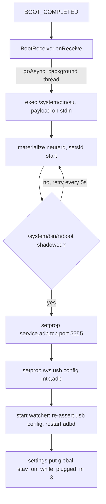
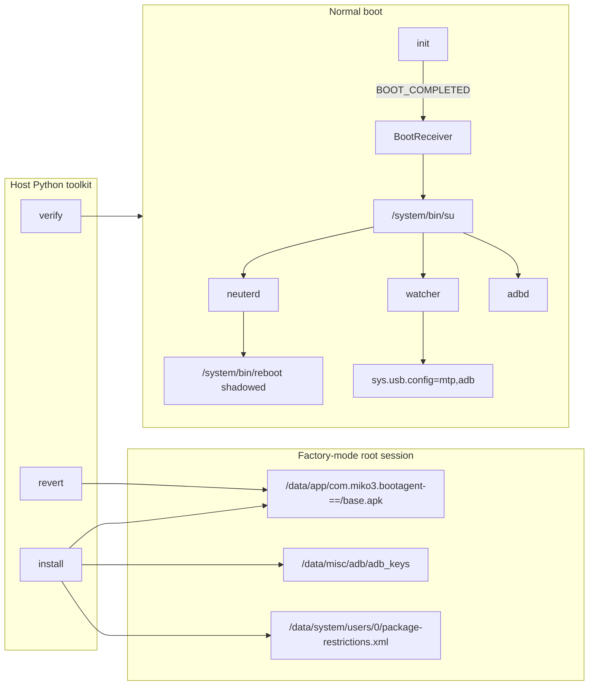
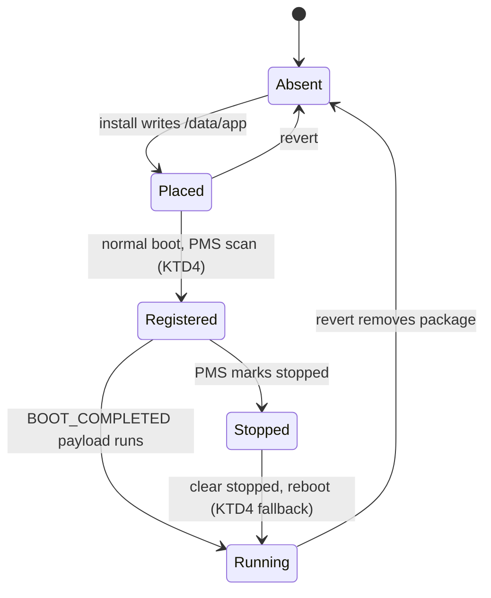

# Persistent ADB Root (USB + Wi-Fi) - Plan

## Goal Capsule

- **Objective:** A Miko 3 that boots normally — kiosk running, Wi-Fi on — exposes a root ADB shell over both USB and Wi-Fi, and keeps doing so after every reboot without re-entering factory mode.
- **Means:** An in-repo Android boot agent (a `BOOT_COMPLETED` receiver plus the reused `neuterd` daemon) installed once from a factory-mode root session by registering it under `/data/app`, driven by a small Python toolkit (KTD1).
- **Product authority:** The repo owner/operator, for the single documented unit (`MIKO3250XXM3Q0636CB`).
- **Execution profile:** `code`. `ce-work` implements the toolkit and the agent; the operator performs the one physical action the pipeline cannot — a power cycle — if factory mode persists after the install reboot.
- **Open blockers:** None.

---

## Product Contract

### Summary

A one-time setup installs a small boot agent that makes root ADB survive a normal boot on the Miko 3, reachable over both USB and Wi-Fi while the kiosk keeps running. The agent fires on `BOOT_COMPLETED`, defuses the ServiceExam watchdog in init's global mount namespace, starts adbd on TCP 5555, and exposes adb on the USB gadget. Setup runs from factory-mode root without a package manager, and a Python toolkit builds, installs, verifies, and reverts it.

### Problem Frame

The only root ADB available today is factory mode, reached by power-cycling into the MediaTek preloader and sending the META `FACTFACT` handshake (`scripts/factory-root.sh`). That state has no package manager, no Wi-Fi, and no kiosk, and it ends at the next power cycle. Normal boot has Wi-Fi and the kiosk, but the `com.example.root.serviceexam` watchdog greps for `adbd` and reboots the unit when it finds it, so adb cannot stay up. Reaching normal-boot root therefore costs a power cycle and a timing-sensitive preloader race on every attempt, and wireless access is impossible.

### Requirements

**Boot agent**

- R1. The boot agent runs automatically on every normal boot with no user interaction, triggered by `BOOT_COMPLETED`.
- R2. Before adbd starts, the agent shadows `/system/bin/reboot` with a no-op inside init's global mount namespace, so the ServiceExam watchdog's reboot call has no effect.
- R3. The agent starts adbd and makes it listen on TCP port 5555.
- R4. The agent configures the USB gadget to expose the adb function (`mtp,adb`), so adb is present on the USB interface.
- R5. The agent re-asserts R2 and R4 for the life of the boot, so a later revert by ServiceExam or another component does not drop root ADB.

**Install and arming**

- R6. The toolkit installs the agent from a factory-mode root ADB session without invoking the package manager.
- R7. Installation makes Android start the agent on the next boot without relying on `am start` to clear the post-install stopped state.
- R8. Installation leaves ServiceExam and MikoPlus installed and registered, and the kiosk boots normally afterward.
- R9. Installation backs up every system-state file it modifies before modifying it.

**Transports**

- R10. After a normal boot, a root ADB shell is reachable over USB.
- R11. After a normal boot, a root ADB shell is reachable over Wi-Fi on TCP 5555 whenever the device is on the network.
- R12. The host's ADB public key is authorized on the device, so connecting requires no on-device confirmation.

**Verification and revert**

- R13. The toolkit verifies both transports after a reboot and reports which are up.
- R14. The toolkit removes the agent and restores the device to its pre-install state.

**Build and packaging**

- R15. A signed agent APK is committed so setup needs no Android SDK.
- R16. A build path regenerates the APK from source, including the reused `neuterd` daemon, when the SDK and toolchain are present.

**Safety**

- R17. Setup and revert write only to userdata and system-state files, never to the preloader, bootloader, or any boot-chain partition, and never to `/system` or `/vendor` storage; the agent's only `/system` touch is a runtime bind mount, which is not a write and does not survive a reboot.

### Key Decisions

- **Boot-receiver APK over flashing boot or vbmeta.** (session-settled: user-directed — chosen over flashing a modified boot image or vbmeta: no partition writes and fully reversible). Governs R1, R2, R17.
- **Build our own agent in-repo, reusing openmiko's `neuterd` with attribution.** (session-settled: user-directed — chosen over a separate fork or the unmodified upstream APK: one reproducible build and no external dependency). Governs R2.
- **Manual `/data/app` + `packages.xml` install.** (session-settled: user-directed — chosen over a normal-boot `pm` window or boot-image flash: factory mode has no package manager). Governs R6, R7, R9.
- **Target normal boot with the kiosk plus root ADB on USB and Wi-Fi.** (session-settled: user-directed — chosen over factory-mode-only or factory-mode-plus-Wi-Fi: persistence across reboots was the point). Governs R10, R11.
- **Wi-Fi as a DHCP client on the existing network.** (session-settled: user-directed — chosen over a stable IP, the Miko as its own AP, or leaving networking out: matches how the unit already joins Wi-Fi). Governs R11.
- **Python toolkit of focused scripts (build / install / verify / revert).** (session-settled: user-directed — chosen over one monolithic setup script: the four jobs are separately useful). Governs R13, R14, R16.
- **Commit a signed APK and keep the reproducible SDK build.** (session-settled: user-directed — chosen over either alone: normal use needs no SDK while source stays rebuildable). Governs R15, R16.

### Key Flows

- F1. One-time setup (factory-mode root session)
  - **Trigger:** A root ADB session in factory mode.
  - **Steps:** Confirm root; back up `/data/system/packages.xml` and `/data/system/users/0/package-restrictions.xml`; stage the APK on the device; place it under `/data/app`; authorize the host's ADB key; reboot to normal boot.
  - **Outcome:** The agent is registered and armed for the next normal boot.
  - **Covers:** R6, R7, R9, R12.

- F2. Normal boot
  - **Trigger:** A normal power-on.
  - **Steps:** Android reaches `BOOT_COMPLETED`; the receiver runs the root payload through `/system/bin/su`; `neuterd` enters init's mount namespace and shadows `/system/bin/reboot`; the agent sets the USB gadget to `mtp,adb` and starts adbd on TCP 5555; the host connects over USB and Wi-Fi.
  - **Outcome:** A root ADB shell is available on both transports with the kiosk running.
  - **Covers:** R1, R2, R3, R4, R5, R10, R11.

- F3. Revert
  - **Trigger:** The operator runs the revert script.
  - **Steps:** Stop the agent and `neuterd`; remove the agent's `/data/app` directory and any inserted `packages.xml` and `package-restrictions.xml` entries; restore the backups; reboot.
  - **Outcome:** The device returns to stock normal boot with no boot agent.
  - **Covers:** R14.

### Acceptance Examples

- AE1. **Watchdog defused.** Covers R2, R3, R5. Given a normal boot with ServiceExam running, when the agent has started, then `/system/bin/reboot` stays shadowed and adbd remains up despite ServiceExam's periodic checks.
- AE2. **USB config re-asserted.** Covers R4, R5. Given the agent set `sys.usb.config=mtp,adb` and ServiceExam later sets MTP-only, then the agent restores adb on the USB interface.
- AE3. **Receiver armed without a launcher.** Covers R7. Given the agent placed and registered but never launched, when the device boots normally, then `BOOT_COMPLETED` is delivered and the payload runs.
- AE4. **Kiosk preserved.** Covers R8. Given setup completed, when the device boots normally, then ServiceExam and MikoPlus remain installed and the kiosk reaches its normal screen.
- AE5. **No on-device authorization prompt.** Covers R12. Given a host that has never connected, when it connects over USB or Wi-Fi, then adb authorizes without an on-device confirmation.

### Scope Boundaries

- **Deferred for later:** an app or command that displays the device's DHCP address; surviving a Miko OTA that changes `su`, `reboot`, or ServiceExam; support for units other than the documented one.
- **Outside this work's identity:** anything touching Miko's servers, other people's units, or accounts; disabling or replacing the kiosk; making the device headless.

### Dependencies / Assumptions

- The unit stays a `userdebug` build with a setuid, world-executable `/system/bin/su`, SELinux permissive, and `ro.debuggable=1`, so adbd runs as root on normal boot.
- The device is connected to a Wi-Fi network the host can also reach.
- Factory mode remains reachable through `scripts/factory-root.sh` for setup and recovery.
- Firmware backups under `firmware/` remain available for recovery.
- The target is the single documented unit profile in `docs/device-intel.md`.

### Sources / Research

- `recon/sources/miko3-adb-boot-agent/` — vendored research from `ne3d-4-steve/miko3-adb-boot-agent`: `neuterd.c`, `RootOps.java`, `BootReceiver.java`, `MainActivity.java`, `AndroidManifest.xml`, `install-permanent-adb.sh`.
- `docs/device-intel.md` — confirmed device posture (setuid `su`, permissive SELinux, verity enforcing, watchdog behavior).
- `docs/method-factory-root.md` — the factory-mode entry and its limits.
- `docs/kiosk-recovery-fix.md`, `docs/mishap-recovery.md` — the manual `/data/app` + `packages.xml` install, and the warning that ServiceExam is the installer of record.
- `scripts/factory-root.sh`, `scripts/brom-probe.sh` — the existing session-only neuter and the META `FACTFACT` route.
- Device-verified during this brainstorm: `/init.usb.configfs.rc` triggers for `sys.usb.config=adb` and `mtp,adb`; per-package `stopped="true"` in `/data/system/users/0/package-restrictions.xml`; `ro.adb.secure` unset with no `/data/misc/adb/adb_keys`; `/system/bin/reboot` shadowed only for the current factory-mode session.

---

## Planning Contract

**Product Contract preservation:** unchanged scope; restructured in place — the four deferred questions are resolved by KTD1–KTD5, and the boot-sequence diagram moved into High-Level Technical Design.

### Key Technical Decisions

- KTD1. **Reuse `neuterd` verbatim as the reboot-shadow mechanism.** The freestanding arm64 daemon `setns`es into init's global mount namespace and keeps a no-op bind-mounted over `/system/bin/reboot`, self-healing every 5 s. The payload starts it before adbd; an app-side mount would be invisible to ServiceExam, which is a zygote child in the global namespace. (session-settled: user-directed — chosen over a separate fork or the unmodified upstream APK: one reproducible build and no external dependency.) Governs R2, R17.
- KTD2. **Set the adb USB combo only after `neuterd` is up, and never via `persist.sys.usb.config`.** `/init.usb.rc` applies `persist.sys.usb.config` to `sys.usb.config` at boot, and the `sys.usb.config=mtp,adb` trigger starts adbd — so persisting the adb combo would start adbd before the neuter exists and let the watchdog reboot the unit. Governs R4.
- KTD3. **A root shell watcher re-asserts the USB config and adbd liveness.** The payload starts a small `setsid` loop that restores `sys.usb.config=mtp,adb` when ServiceExam changes it and restarts adbd if it stops. A shell loop avoids writing a native property client. Governs R5.
- KTD4. **Register by placement, verify, then fall back.** Install writes the signed APK to `/data/app/com.miko3.bootagent-<suffix>==/base.apk` (owner `system:system`) and lets PackageManagerService register it on the next boot; a `stopped` flag in `package-restrictions.xml` is cleared directly only when the boot log shows the agent did not run. The explicit `packages.xml` insertion from `docs/kiosk-recovery-fix.md` is the fallback when registration does not occur. Governs R6, R7.
- KTD5. **Pre-authorize the host key in `/data/misc/adb/adb_keys`.** Install writes the host's `adbkey.pub` there (owner `system`, mode `0640`), so USB and TCP authorization do not depend on `ro.adb.secure` on normal boot. Governs R12.
- KTD6. **Pipe the payload to `/system/bin/su` on stdin.** This `su` has no `-c`, so `RootOps` execs `su` and writes the script to its stdin, matching the openmiko payload shape. Governs R1.
- KTD7. **adbd over TCP is `service.adb.tcp.port=5555` plus a `ctl.restart adbd`.** Governs R3, R11.
- KTD8. **The build bootstraps its own toolchain and is skippable.** `build-bootagent.py` installs the Android command-line tools and `lld` when absent, then drives `javac` → `d8` → `aapt2` → `zipalign` → `apksigner` and compiles `neuterd`; the committed APK means normal use never runs it. Governs R15, R16.
- KTD9. **Revert removes only the agent.** It kills `neuterd` and the watcher, deletes the agent's `/data/app` directory and any inserted `packages.xml` / `package-restrictions.xml` entries, and restores the backed-up system-state files. Governs R14.

### High-Level Technical Design

The payload runs once per boot, in this order:

Component and data-flow topology:

Agent lifecycle across the toolkit's actions:

### Assumptions

- `ro.adb.secure` is unset or `0` on normal boot as it is in factory mode; KTD5 makes this non-load-bearing by pre-authorizing the key.
- Wi-Fi associates automatically on normal boot to a network the host can reach, so the TCP listener is addressable.
- A reboot from factory mode returns the unit to normal boot, as `scripts/factory-root.sh` documents for a power cycle; if it does not, a physical power cycle is required and is the one manual step.
- PackageManagerService registers an APK hand-placed under a conforming `/data/app/<pkg>-<suffix>==` directory on the next boot; KTD4 verifies this and carries the `packages.xml` fallback if it fails.

### Risks & Dependencies

- **Boot race.** If adbd ever starts before `neuterd` applies the shadow, ServiceExam reboots the unit. KTD2 exists to prevent this; the payload starts `neuterd` first and waits for the shadow before touching the USB config.
- **Registration uncertainty.** If PackageManagerService does not register the hand-placed APK, or marks it stopped, no adb comes up on the first normal boot and factory mode must be re-entered. KTD4's verification and `packages.xml` fallback are the mitigation.
- **System-state integrity.** `packages.xml` and `package-restrictions.xml` are load-bearing system databases; a malformed edit prevents boot. Mitigation: the primary path never edits `packages.xml`, and R9's backups plus the restore path in `docs/mishap-recovery.md` are the rollback.
- **Toolchain install.** KTD8 needs network access for the Android command-line tools and `lld`; without them only the committed APK is usable and R16 is unverified.
- **Hardware risk.** The unit is already modified and backed up under `firmware/`; a mis-written system-state file can prevent boot. The rollback ladder is: restore the backed-up system-state files (U6), then `scripts/restore-firmware.sh` from `firmware/`, then re-enter factory mode with `scripts/factory-root.sh`.

### System-Wide Impact

- The device's boot path gains a root-executing boot receiver; the unit's security posture is already permissive, so this widens convenience, not the trust boundary.
- ServiceExam and MikoPlus are deliberately untouched (R8); the kiosk and the OTA engine keep working.
- The agent's state is `persistent` for the unit's lifetime: it re-arms on every boot and is removed only by revert, so `packages.xml` and `/data/app` are the durable state a future OTA or factory reset would clear.
- If the agent fails to run, the failure is contained to normal boot — adbd simply stays off and factory mode remains the recovery entry, so a failure never strands the unit without a console.
- No partition is written (R17), so a firmware restore from `firmware/` remains the ultimate rollback.

---

## Implementation Units

### U1. Boot agent app source and root payload

- **Goal:** A minimal Android app whose `BOOT_COMPLETED` receiver runs the privileged payload.
- **Requirements:** R1, R2, R3, R4, R5, R17; realizes F2
- **Dependencies:** none
- **Files:** `bootagent/AndroidManifest.xml`, `bootagent/src/com/miko3/bootagent/BootReceiver.java`, `bootagent/src/com/miko3/bootagent/MainActivity.java`, `bootagent/src/com/miko3/bootagent/RootOps.java`
- **Approach:**
  1. Package `com.miko3.bootagent`; manifest declares a `RECEIVE_BOOT_COMPLETED` receiver for `BOOT_COMPLETED` and the QUICKBOOT actions, and a launcher activity kept only for parity.
  2. `BootReceiver` uses `goAsync()` and a background thread so the broadcast window is not a constraint.
  3. `RootOps` holds the payload as a string with a `@@NEUTERD_B64@@` placeholder, execs `/system/bin/su`, writes the payload to stdin, and surfaces a non-zero exit rather than swallowing it.
  4. The payload starts `neuterd` first, waits for the reboot shadow, then applies KTD6 and KTD7 and starts the KTD3 watcher.
- **Patterns to follow:** `recon/sources/miko3-adb-boot-agent/src/com/openmiko/bootagent/` (`BootReceiver`, `MainActivity`, `RootOps`).
- **Test scenarios:**
  - Manifest declares the receiver for `BOOT_COMPLETED` (assert on the built APK in U3).
  - The payload string contains, in order, the neuterd start, the adbd TCP property, the USB config set, and the watcher start.
  - `RootOps` execs `su` and writes to stdin rather than passing a `-c` argument.
- **Verification:** source compiles under U3 and the manifest dump shows the receiver.

### U2. neuterd native daemon

- **Goal:** Vendor and build the arm64 reboot-shadow daemon.
- **Requirements:** R2, R17
- **Dependencies:** none
- **Files:** `bootagent/native/neuterd.c`, `bootagent/native/build-neuterd.sh`
- **Approach:** Copy `neuterd.c` from `recon/sources/miko3-adb-boot-agent/` unchanged, with an attribution header naming `ne3d-4-steve/miko3-adb-boot-agent`; build for `aarch64` with `clang` + `ld.lld`; the committed binary is embedded into the APK by U3.
- **Patterns to follow:** `recon/sources/miko3-adb-boot-agent/neuterd.c`; the openmiko `native/build-neuterd.sh` invocation.
- **Test scenarios:**
  - The built binary is an aarch64 ELF.
  - `Test expectation: none` for the daemon's runtime behavior at unit level — its effect is proved on-device in U5.
- **Verification:** `file` reports aarch64; U5 confirms the shadow on the device.

### U3. Reproducible build and committed APK

- **Goal:** One command builds and signs the APK; a signed APK is committed.
- **Requirements:** R15, R16
- **Dependencies:** U1, U2
- **Files:** `scripts/build-bootagent.py`, `bootagent/miko3-bootagent.keystore`, `bootagent/miko3-bootagent.apk`, `bootagent/README.md`, `scripts/tests/test_build_bootagent.py`
- **Approach:**
  1. Bootstrap the Android command-line tools, `platforms;android-28`, build-tools, and `lld` when missing, with an actionable error if installation cannot proceed (KTD8).
  2. Compile `neuterd`, base64 it, and inject it into `RootOps.java`.
  3. `javac` → `d8` → `aapt2 link` → add `classes.dex` → `zipalign` → `apksigner`, generating the debug keystore on first run.
  4. Commit the resulting APK and keystore.
- **Patterns to follow:** `recon/sources/miko3-adb-boot-agent/install-permanent-adb.sh` (no-gradle build), `scripts/aoa-inject.py` (module docstring and argparse).
- **Test scenarios:**
  - Build with the toolchain present produces an APK that `apksigner verify` accepts.
  - `aapt2 dump badging` shows package `com.miko3.bootagent` and the boot receiver.
  - A missing toolchain produces a clear, actionable failure rather than a stack trace.
  - The committed APK is byte-stable across a rebuild given the same keystore.
- **Verification:** `apksigner verify` and `aapt2 dump badging` pass; the committed APK matches the built one.

### U4. Install from a factory-mode root session

- **Goal:** Register and arm the agent without a package manager.
- **Requirements:** R6, R7, R8, R9, R12; realizes F1; covers AE3, AE4, AE5
- **Dependencies:** U3
- **Files:** `scripts/install-persistent-adb.py`, `scripts/tests/test_install_persistent_adb.py`
- **Approach:**
  1. Refuse to run unless `adb shell id -u` is `0` and `ro.bootmode` is `factory`.
  2. Back up `/data/system/packages.xml` and `/data/system/users/0/package-restrictions.xml` to a timestamped directory on the host and on the device (R9).
  3. Push the committed APK and place it at `/data/app/com.miko3.bootagent-<suffix>==/base.apk`, owned `system:system`, directory `0755`, file `0644`.
  4. Write the host `adbkey.pub` to `/data/misc/adb/adb_keys`, owned `system:system`, mode `0640` (KTD5).
  5. Reboot to normal boot.
  6. When the boot log shows the agent did not run, clear a `stopped` flag for the package and, if registration still failed, insert the `packages.xml` entry from `docs/kiosk-recovery-fix.md` (KTD4).
- **Patterns to follow:** `docs/kiosk-recovery-fix.md`; `scripts/factory-root.sh` (device-root preconditions, `say`-style output).
- **Test scenarios:**
  - Aborts when the session is not root or not factory mode.
  - Creates backups before any device write.
  - Places the APK with the expected owner and mode.
  - Writes `adb_keys` as `system` `0640`.
  - Re-running install is idempotent and does not duplicate entries.
  - Never touches `com.example.root.serviceexam` or `com.miko.mikoplus` (Covers AE4).
- **Verification:** after the reboot, `pm path com.miko3.bootagent` resolves and the boot log exists.

### U5. Verify both transports

- **Goal:** Report which transports are up and whether the agent is active.
- **Requirements:** R10, R11, R13; realizes F2; covers AE1, AE2, AE5
- **Dependencies:** U4
- **Files:** `scripts/verify-persistent-adb.py`, `scripts/tests/test_verify_persistent_adb.py`
- **Approach:**
  1. Detect normal boot (`sys.boot_completed=1`, `ro.bootmode` not `factory`); report clearly when the unit is still in factory mode.
  2. Over USB, check `id -u` is `0`, `init.svc.adbd` is `running`, `sys.usb.config` contains `adb`, `/system/bin/reboot` is under 100 bytes, and the boot log is fresh.
  3. Read the `wlan0` address and `adb connect <ip>:5555`, then re-check root over TCP.
  4. Print a per-transport verdict (USB, Wi-Fi) and the neuter state.
- **Patterns to follow:** `scripts/miko-detect.sh` (plain-English verdict), `scripts/aoa-inject.sh --ifaces` (machine-readable check preferred over parsing `adb devices`).
- **Test scenarios:**
  - Reports USB up / TCP up independently, and both up.
  - Detects a non-root shell and reports it as failure.
  - Detects factory mode and says so rather than reporting a false negative.
  - Covers AE1: reports the reboot shadow present and adbd running.
- **Verification:** the verdict names each transport as up or down, with the evidence line for each.

### U6. Revert

- **Goal:** Remove the agent and restore the pre-install state.
- **Requirements:** R14; realizes F3
- **Dependencies:** U4
- **Files:** `scripts/revert-persistent-adb.py`, `scripts/tests/test_revert_persistent-adb.py`
- **Approach:**
  1. Kill the watcher and `neuterd`.
  2. Remove `/data/app/com.miko3.bootagent-*` and any `packages.xml` / `package-restrictions.xml` entries for the package.
  3. Restore the backups from U4 when present.
  4. Reboot.
- **Patterns to follow:** `scripts/restore-kiosk.sh` (targeted restore, no collateral removal).
- **Test scenarios:**
  - Removes only the agent package; ServiceExam and MikoPlus are untouched.
  - Restores the backed-up system-state files.
  - Is idempotent when the agent was never installed.
- **Verification:** after the reboot the agent is absent and normal boot has no adb, with the kiosk working.

---

## Verification Contract

The repo has no test runner; the toolkit's pure logic is covered by stdlib `unittest`, and the device behavior is proved by the verify script on the unit.

- **Unit tests:** `python3 -m unittest discover scripts/tests`.
- **Build proof:** `python3 scripts/build-bootagent.py` then `apksigner verify bootagent/miko3-bootagent.apk` and `aapt2 dump badging bootagent/miko3-bootagent.apk`.
- **Device proof (the decisive check):** `python3 scripts/verify-persistent-adb.py` after a normal boot reports USB up and Wi-Fi up, `id -u` is `0` on both, and the reboot shadow is present.
- **Revert proof:** `python3 scripts/revert-persistent-adb.py` followed by a normal boot shows the agent absent and no adb.

---

## Definition of Done

- R1–R17 are satisfied and the Verify Contract's device proof passes on the unit.
- The committed APK is present and `apksigner verify` passes on it.
- `scripts/verify-persistent-adb.py` reports both transports up after a normal boot with the kiosk running.
- The kiosk still boots and ServiceExam/MikoPlus are intact (AE4).
- `scripts/revert-persistent-adb.py` returns the unit to stock normal boot.
- Abandoned-attempt code and temporary device state are removed; no stray `neuterd` or watcher process, no leftover `/data/local/tmp` staging files.
