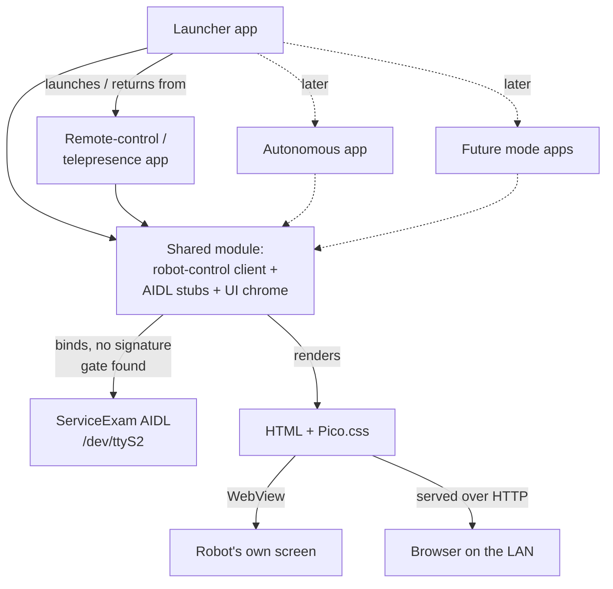
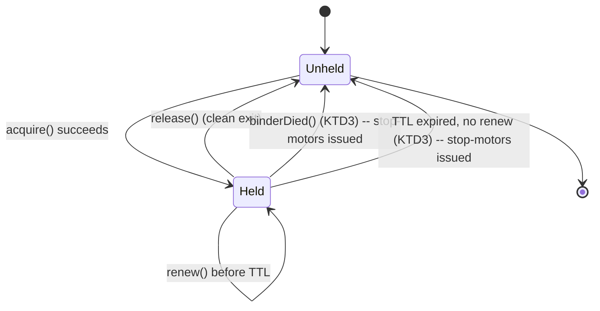

**Product Contract preservation:** changed — added R13-R17 (Safety & control arbitration group) and the Key Decision explaining them, during planning. Flow analysis found the original Requirements never specified what happens if a connection drops or a mode crashes while driving — a physical robot with no dead-man's switch is a real safety gap, not an implementation nuance, so it's recorded as explicit requirements rather than a silent assumption. Document review (round 1) additionally narrowed R6's browser-side capture toggles (see R6, R7) after finding a technical error in the original KTD7: no other Requirement, Key Decision, or Scope Boundary changed beyond those two corrections.

# Launcher Mode Architecture - Plan

## Goal Capsule

- **Objective:** someone at the robot's controls can drive it and see/hear through it from elsewhere on the same network, and adding the next mode later doesn't mean rebuilding what already works.
- **Means:** each mode ships as its own installed app backed by one shared module (robot-control client, AIDL stubs, common UI); the launcher stays the thin dispatcher operators launch modes from and return to.
- **Product authority:** repo owner — sole decision-maker, no other stakeholders.
- **Open blockers:** none. A few implementation-shape questions are deferred to planning (see Outstanding Questions).

---

## Product Contract

### Summary

This proposes a multi-mode architecture for the Miko 3 custom launcher, starting with a combined remote-control/telepresence mode that lets an operator drive the robot and see through its camera from elsewhere on the same network. Each mode ships as its own app backed by one shared module for robot control and UI, so the launcher stays a thin dispatcher and adding future modes doesn't mean rebuilding what already works.

### Problem Frame

The custom launcher currently does one thing: show basic device status and manage Wi-Fi. The next real capability — driving the robot and seeing through it remotely — is the first of several planned modes (autonomous operation among them), and the stock vendor app is a cautionary example of where an undisciplined single-app approach leads: MikoPlus is one 8,428-line `Activity` hosting 28 `Fragment`s. Deciding how modes relate to the launcher and to each other before building the first one avoids repeating that shape, or over-building infrastructure for modes that don't exist yet.

### Requirements

**App architecture & mode lifecycle**

- R1. Each robot-control mode — starting with the combined remote-control/telepresence mode — ships as a separate installed app from the launcher, launched by the launcher and returning control to the launcher on exit.
- R2. A shared module (robot-control client code, ServiceExam AIDL stub files, common UI chrome) is built into the launcher and every mode app, rather than duplicated per app.
- R3. Exactly one mode's control logic may be actively issuing motor commands at a time. A mode gives up control when the operator exits it (or the launcher stops it) — nothing at the OS level enforces this automatically.

**Remote-control/telepresence mode**

- R4. The operator sees a live view from the robot's camera whenever the mode is active, independent of any other toggle's state. Driving without a camera view is not supported.
- R5. The operator can drive the robot's motors while the mode is active.
- R6. The operator can independently toggle: the robot's microphone feed to the operator, the operator's microphone to the robot's speaker, and the operator's camera/video shown on the robot's screen. The robot's mic and camera feeds work from any client (on-device screen or a remote browser). The two toggles that capture the *operator's* mic or camera work from the on-device screen today; from a remote browser they require a secure context (see KTD7) and are not required to work remotely for this version (see R7).
- R7. The mode works over the same local Wi-Fi network as the robot. Connecting from outside that network is not required for this version. Browser-side microphone/camera capture (the two operator-facing toggles in R6) additionally requires a secure context per the W3C getUserMedia spec — plain `http://` to a LAN IP does not qualify, only `https://` or the loopback/`localhost` exception does — so those two toggles working from a *remote browser* (as opposed to the on-device WebView, which does qualify via the loopback exception) is deferred alongside R7's broader internet-access scope, not required for this version.

**Launcher / system management**

- R8. The launcher continues to own Wi-Fi and other system-level management, and its own screens — starting with Wi-Fi — render through the same UI approach as modes (R11).
- R9. The launcher's Wi-Fi screen presents saved and nearby networks sorted by signal strength, with a signal-strength icon and a lock icon for secured networks, in place of raw signal-strength numbers.
- R10. Wi-Fi is manageable both on the robot's own screen and remotely from a browser on the same network.

**UI**

- R11. Every mode's on-device screen and its network-served equivalent render the same HTML/CSS — one UI per mode, not a native UI kept in sync by hand with a separate web UI.
- R12. Pages are styled with a vendored classless CSS framework (Pico.css) rather than hand-built native theming or a heavier JS framework.

**Safety & control arbitration** (added during planning — see preservation note above)

- R13. If no drive command (or keepalive) arrives within a short window while a mode holds the drive lease, the robot is commanded to stop rather than continuing its last motion.
- R14. Releasing the drive lease — by clean exit, crash-detected release, or heartbeat-timeout — always issues a stop-motors command as part of the release, not only a software-lock release.
- R15. If a mode cannot reach the lease/heartbeat coordinator — including because the launcher process itself has died, taking the coordinator with it — the mode actively commands the robot to stop, not merely withholds further drive commands. This is the backstop for the case where the coordinator (R14's normal stop-on-release path) isn't available to issue that stop itself.
- R16. The mode's UI, on-device and networked, includes an explicit control to end the session and release the lease, reachable without physical access to the robot.
- R17. Within one mode session, drive/toggle commands are accepted from a single active client at a time; a newer connection takes precedence over an older one.

### Key Decisions

- **Combined remote-control/telepresence mode, not two separate modes.** They share the same camera/mic/drive plumbing; only the toggle defaults differ between "drive and look" and "have a conversation." (session-settled: user-directed — chosen over treating them as separate modes) Governs R4, R5, R6.
- **Separate app per mode, backed by one shared module.** Isolates a mode's crash from the launcher and from other modes, and lets modes ship independently, at the cost of a one-time build-tooling investment this repo's from-scratch build doesn't have yet. (session-settled: user-directed — chosen over one monolithic app, where everything shares one failure domain and one build, and over separate apps with duplicated code, where a ~20-mode future means maintaining the same robot-control/AIDL code N times) Governs R1, R2.
- **LAN-only for the first version.** Internet-capable access is real future work, not this version's problem. (session-settled: user-directed — chosen over building internet access now) Governs R7.
- **Remote-control/telepresence ships before autonomous mode.** The motor-command path it needs is already proven (the same mechanism the voice-direction turning feature already exercises); autonomous movement has no existing working code to build from. (session-settled: user-directed — chosen over starting with autonomous mode)
- **One UI — WebView + Pico.css — for both on-device and networked surfaces, across modes and the launcher's own screens.** Avoids maintaining a native UI and a separate web UI in parallel; Pico.css is a single vendored CSS file with no build step, fitting the existing no-Gradle toolchain, with built-in switches and cards suited to a toggle-heavy interface. (session-settled: user-approved, for extending this to the launcher's own screens specifically) Governs R8, R11, R12.
- **The launcher's Wi-Fi screen follows the tzapu WiFiManager interaction pattern** — the established reference for an embedded device offering Wi-Fi setup over a served web page: a network list sorted by signal strength, tapping a network pre-fills a connect form, and a clear saved/current distinction — combined with iOS/Android's visual convention of signal-strength bars and a lock icon in place of raw dBm numbers. Governs R9.
- **Safety/arbitration gaps flow analysis found became explicit requirements, not implementation-time assumptions.** A physical robot continuing to drive after a dropped connection or a crashed mode is a real risk this plan doesn't leave implicit. Governs R13, R14, R15, R16, R17.

### Actors

- A1. Operator — drives the robot and/or joins a call through it, from a browser on the same Wi-Fi network as the robot, or from the robot's own screen.
- A2. Remote conversational partner — the person the operator talks to and sees through the robot's telepresence side, present only when the operator turns on the relevant toggles.

### Key Flows

- F1. Launch and use a mode
  - **Trigger:** Operator selects the remote-control/telepresence mode from the launcher.
  - **Actors:** A1
  - **Steps:** Launcher starts the mode's app; the mode establishes its own connection to robot control; the operator drives and/or toggles the camera/mic/video feeds; the operator exits back to the launcher.
  - **Outcome:** The mode's control logic releases the robot; the launcher regains the home screen.
  - **Covers:** R1, R3, R4, R5, R6
- F2. Connect the robot to Wi-Fi
  - **Trigger:** The robot has no working network connection.
  - **Actors:** A1
  - **Steps:** Operator opens the launcher's Wi-Fi screen, on-device or remotely if already on some network; sees saved and nearby networks sorted by signal strength with bars and lock icons; taps a network, which pre-fills a connect form; enters a password if needed and connects.
  - **Outcome:** The robot joins the network; its modes and info page become reachable to other devices on it.
  - **Covers:** R8, R9, R10

### Architecture shape

Solid arrows are this version's scope; dashed arrows are the shape the architecture is meant to accommodate later, not built now.

### Scope Boundaries

**Deferred for later:**

- Internet-capable access — driving or watching from outside the local network.
- Operator-side mic/camera capture (the two R6 toggles that need `getUserMedia()`) from a remote browser specifically — needs a secure context (HTTPS), which is internet/rollout-shaped work bundled with the item above. Works now from the on-device screen.
- Autonomous mode itself.
- Any mode beyond the first — the architecture exists to make adding them cheap, not to design them now.

**Deferred to Follow-Up Work:**

- AIDL interface drift detection — if a future Miko OTA changes ServiceExam's actual AIDL surface, the vendored stubs (KTD1) would silently mismatch rather than fail loudly, per the precedent in `docs/solutions/integration-issues/aidl-interface-mismatch-kiosk-splash-loop.md`. A lightweight version/compatibility probe at bind time is worth adding once there's a second data point (an actual OTA) to design it against, not speculatively now.

### Dependencies / Assumptions

- ServiceExam's AIDL surface (`com.example.root.serviceexam`) is reachable to third-party apps with no signature or permission gate beyond the normal `INTERNET` permission, as currently observed — see Sources. If this changes, R2's shared robot-control client needs a different access path.
- No OS-level arbitration exists for concurrent motor-control access to the robot's serial device. Enforcing "one mode drives at a time" (R3) is this project's responsibility, not the platform's.
- The stock Mikonnect/LiveKit video-calling pipeline is not a dependency for this mode's video — it's tied to Miko's own cloud account. R4/R6 need their own video/audio path; what that path is is left to planning.
- No documented RAM figure exists for this device's SoC in this repo. The runtime resource cost of the mode-app model is assumed acceptable — since R3 keeps only one mode process active at a time — but is unconfirmed.

### Outstanding Questions

The three questions the origin document deferred to planning (R3's enforcement mechanism, R4/R6's streaming mechanism, R2's build mechanism) are resolved below in the Planning Contract (KTD1-KTD10). No product-level blocker remains. Two implementation-time unknowns remain, both handled as early verification steps within their units rather than blocking planning:

**Deferred to Implementation:**

- Whether `bindService()` to ServiceExam's AIDL surface actually succeeds from a genuine third-party app on the live device — confirmed only via static/decompiled analysis so far (see U1).
- Whether the on-device WebView supports `MediaRecorder`/`getUserMedia` for the operator-mic-to-robot-speaker and operator-video-to-robot-screen toggles (see U8).
- **Added from document review round 1 (adversarial persona):** U3's `DriveLease` is a cooperative convention, not an enforcement boundary — nothing at the AIDL layer stops a mode process that no longer holds (or never acquired) the lease from calling U2's `drive()` client directly if its own code has a bug that skips the lease check (e.g. a stuck WebView/JS callback still dispatching a queued command after the Activity has notionally released). U3's step 5 "shared channel" argument (`docs/plans/.../U3`) only shows there's no path where the robot keeps moving with *both* the coordinator *and* the drive channel unreachable — it does not show a still-running, still-connected mode process is prevented from driving without the lease. This is judged an acceptable gap for a single-operator LAN PoC (R3's threat model is "two modes launched in sequence," not "a malicious/buggy mode fighting the coordinator"), but a genuine one: closing it fully would need U2's `drive()` client itself to check lease ownership before every call (turning U3 from advisory into enforcing), which is out of scope for this plan and left as explicit future work rather than silently assumed solved.

### Sources / Research

- `launcher/AndroidManifest.xml`, `launcher/src/com/miko3/launcher/` — current launcher: one `Activity`, no manifest-declared IPC surface.
- `launcher/README.md`, `scripts/build-custom-launcher.py` — no-Gradle build pipeline; no existing cross-APK code-sharing mechanism.
- `docs/hardware/aidl-dispatch.md:23-68` — ServiceExam's `MyService` AIDL exported with no signature/caller-identity check found.
- `docs/hardware/motors-wheels.md:378-385,757-761` — no confirmed locking/arbitration for concurrent motor-control access to the serial device.
- `docs/hardware/camera-vision.md:211-267` — stock Mikonnect/LiveKit video calling; no confirmed drive-command integration over the same channel.
- `docs/hardware/feature-inventory.md:16-32` — MikoPlus's single-Activity/28-`Fragment` architecture, the cautionary precedent cited above.
- `docs/device-intel.md` — no RAM/memory specification documented for this device's SoC.
- [tzapu/WiFiManager](https://github.com/tzapu/WiFiManager) — reference interaction pattern for embedded-device Wi-Fi setup over a served web page.
- [Pico.css](https://picocss.com) — the vendored classless CSS framework chosen for R12; [Pico CSS releases](https://github.com/picocss/pico/releases) (current v2.1.1) and [maintenance discussion #713](https://github.com/picocss/pico/discussions/713) (no commits ~18 months as of this writing — low risk for a vendored static file, but worth knowing).
- `launcher/AndroidManifest.xml`, `launcher/src/com/miko3/launcher/{MainActivity,InfoHttpServer,DeviceInfo,LauncherApp}.java`, `launcher/README.md` — the only existing pattern in this repo for an HTTP-served, no-framework UI; U5/U6/U9 extend it.
- `bootagent/AndroidManifest.xml`, `bootagent/README.md`, `scripts/build-bootagent.py` — the only other installed-APK + build-script precedent; confirms no shared build infrastructure exists yet (U4) and the per-app self-signed-keystore convention (KTD10).
- `tools/serviceexam_jadx/sources/com/root/aidlFiles/*.java` — seven compiled AIDL `Stub`/`Proxy` classes confirmed present and directly vendorable, no `.aidl` IDL file exists anywhere in the repo (KTD1).
- `docs/hardware/aidl-dispatch.md:310-393` — a drafted client skeleton (Kotlin) for binding `MyService` and sending commands; the basis for U2's `RobotControlClient`.
- `docs/hardware/motors-wheels.md:551-630` — the concrete motion-expression payload and AIDL code (135) for driving the wheels; the basis for U2's `drive()` method.
- Android developer docs: [network security config](https://developer.android.com/privacy-and-security/security-config) and [Android 9 behavior changes](https://developer.android.com/about/versions/pie/android-9.0-changes-28) (cleartext-traffic default, KTD6); [package visibility](https://developer.android.com/training/package-visibility) (confirms `<queries>` is API 30+, not applicable here); [Camera2 capture sessions](https://developer.android.com/media/camera/camera2/capture-sessions-requests) (KTD4).
- Chromium issue history on `multipart/x-mixed-replace` (main-frame support dropped 2013; `` subresource usage remains supported) — [chromium bug 249132](https://bugs.chromium.org/p/chromium/issues/detail?id=249132) (KTD5).
- `docs/solutions/integration-issues/aidl-interface-mismatch-kiosk-splash-loop.md` — AIDL version-skew between two independent binaries fails silently (a hang, not an error) rather than loudly; motivates vendoring the AIDL stubs unmodified (KTD1) and treating U1 as a real spike, not a formality.
- `docs/solutions/runtime-errors/kill-9-on-watched-service-permanently-disables-restart.md` — never force-kill a service other bound clients depend on; informs U3's use of graceful lease release over any kill-based recovery path.

---

## Planning Contract

### Key Technical Decisions

- KTD1. The shared module vendors the AIDL `Stub`/`Proxy` `.java` files from `tools/serviceexam_jadx/sources/com/root/aidlFiles/` unmodified, rather than regenerating from an `.aidl` IDL — none exists anywhere in this repo, and the binder transaction-code contract is fixed by declaration order in the compiled source itself. **Correction from document review round 1:** the directory holds seven files, not six as originally stated (`AnalyticsAIDL`, `ExpressionEventAIDL`, `GameControllerAIDL`, `LoggerAIDL`, `TouchEventAIDL`, `UIDataAIDL`, `UIEventAIDL`) — `docs/hardware/aidl-dispatch.md`'s own Implementation section names only six as needed and omits `LoggerAIDL.java`, which is unused; vendor all seven anyway using the directory wildcard so the count never has to be hand-tracked. These files are the single source of truth across every APK that includes them. Governs R2.
- KTD2. Each APK compiles the shared module's source directly into its own `javac`/`d8` invocation. Android has no true cross-APK class sharing outside split-APK/Bundletool machinery, so every APK dexes its own private copy; the build script is extended to compile a shared source directory into every target, not to produce a separately-installed shared library. Governs R2.
- KTD3. The lease/heartbeat coordinator for R3/R13-R15 is an exported bound `Service` hosted in the launcher (`com.miko3.launcher`), started alongside the existing `InfoHttpServer` daemon thread in `LauncherApp.onCreate` — not inside a mode app, since a mode's own crash or exit is exactly the event the coordinator must survive — and not as a separate system-level process (rejected: this is a single-owner hobby device where a second always-on process needs the same install/build machinery as the launcher for no isolation benefit, since the launcher is already the one component every mode already talks to), and not as a plain file-based lock with a stale-lock timeout (rejected: a file lock can only detect staleness by polling, never a clean process death the instant it happens, which is strictly worse for the crash case `Binder.linkToDeath()` handles for free). `Binder.linkToDeath()` handles the clean-death case; a `Handler`-driven TTL heartbeat (recommend ~2.25s, roughly 3× R13's ~750ms drive-watchdog window) handles a hung-but-alive client. Every release path — clean, death-triggered, or TTL-expired — issues a stop-motors command through U2's client as part of releasing the lock, not only the lock itself. If the coordinator's own process (the launcher) dies, R15 is the backstop: each mode independently detects the lost connection and commands its own stop, since no coordinator remains to do it for them. Governs R3, R13, R14, R15.
- KTD3b. The `DriveLease` contract (`acquire`/`renew`/`release`) is a hand-written Binder interface — `Stub`/`Proxy` classes in the shared module, matching the pattern KTD1 already establishes for the vendored ServiceExam stubs, since this repo's build has no `.aidl` compiler step. `acquire` takes a client-owned `IBinder` death token (not a bare string ID) so the coordinator can call `linkToDeath` on it directly, per KTD3. Governs R3, R13, R14, R15.
- KTD4. Camera capture uses one `Camera2` capture session per mode instance, with `ImageReader` configured directly for `ImageFormat.JPEG` (hardware-encoded) rather than `YUV_420_888` plus software compression, which is a known CPU cost on this SoC's quad Cortex-A35 cores. Frames are pushed to an in-process broadcaster that every connected MJPEG HTTP handler reads from, so simultaneous viewers (on-device `WebView` plus a remote browser) share one capture session rather than each opening its own. Governs R4.
- KTD5. Video is delivered as MJPEG-over-HTTP (`multipart/x-mixed-replace`), consumed via an `` subresource tag rather than a top-level navigation — browsers dropped multipart support for main-frame navigation in 2013, but subresource usage remains standard and is confirmed working inside Android `WebView`. The same markup renders identically on both surfaces, satisfying R11. The hand-rolled HTTP server keeps multipart response headers minimal and RFC-conformant to avoid a documented WebView-version header-parsing rejection seen on other devices. Governs R4, R11.
- KTD6. Cleartext HTTP traffic is explicitly allowed via a `network_security_config.xml` scoped to `127.0.0.1`/localhost (and the LAN subnet if the on-device `WebView` itself addresses a non-loopback IP) — `targetSdkVersion 28` blocks cleartext by default, and without this the app's own `WebView` couldn't reach its own HTTP server. Governs R11.
- KTD7. Operator-mic-to-robot-speaker audio (R6) is a chunked-transfer-encoding POST from the browser's `MediaRecorder` output (WebM/Opus, the format `MediaRecorder` defaults to on Android's WebView/Chromium) to a dedicated endpoint, decoded via `MediaCodec` and played via `AudioTrack` — a different transport shape than video's server-to-client stream, since this direction is client-to-server and continuous. Feasibility against the actual on-device `WebView`'s `MediaRecorder` support is verified early in U8, not assumed. **Correction from document review round 1:** the original text of this decision claimed the remote-browser side of this toggle (and operator-video-to-robot-screen) was "unaffected" by the LAN-only, plain-HTTP posture — that was a factual error, not a design choice. `getUserMedia()` (what `MediaRecorder`-based capture needs) requires a secure context per the W3C spec, and a LAN IP over plain `http://` does not qualify — only `https://` or the loopback/`localhost` exception does. The on-device `WebView` reaching its own `127.0.0.1` server qualifies via that loopback exception; a remote browser reaching the robot's LAN IP does not. R6/R7 now scope these two capture-side toggles accordingly: on-device works now, remote-browser capture is deferred with internet/HTTPS work. Playback-only toggles (robot mic → operator, camera view) are unaffected — they never call `getUserMedia()`. Governs R6, R7.
- KTD8. Robot-mic-to-operator audio (R6) reuses video's one-way streaming shape: `AudioRecord` capture (raw 16-bit PCM, no container — sufficient at LAN scale and readable directly by the Web Audio API on the browser side, avoiding an encode/decode step this direction doesn't need) served over a dedicated HTTP endpoint via the same one-broadcaster/N-readers pattern as KTD4, not MJPEG-framed but structurally analogous. This direction is playback-only for the browser client, so it is not subject to KTD7's secure-context correction. Governs R6.
- KTD9. Pico.css is vendored as a single static `.css` file (current stable v2.1.1) rather than any build-resolved package, matching the existing no-npm/no-Gradle constraint exactly. Automatic dark-mode switching is not relied upon — Android `WebView` does not evaluate `prefers-color-scheme` at API 28 — so the UI fixes one Pico color scheme at build time rather than depending on the OS-reported setting. Governs R12.
- KTD10. The mode app follows the existing per-app signing convention (`bootagent`/`launcher`): its own self-signed keystore generated lazily by its build script, no shared signing identity or `sharedUserId` across apps. Package-name-based launch and bind is sufficient, matching how ServiceExam's AIDL surface is already reached. Governs R1, R2.

### Implementation Constraints

- No lambdas or method references anywhere in new Java code (shared module, mode app, launcher changes) — the build's `-bootclasspath android.jar` has no `LambdaMetafactory`; use anonymous inner classes throughout, matching the existing codebase.
- No Gradle, AndroidX, or Maven-resolved dependencies. Any third-party asset (Pico.css) is vendored as a static file with no build step.
- All new Android components target API 28 (`minSdkVersion`/`targetSdkVersion 28`), matching the device and the existing build scripts.

### Drive lease lifecycle

Every path out of `Held` back to `Unheld` issues a stop-motors command as part of the transition (R14) — there is no path that releases the lock without also stopping the robot.

### Assumptions

- RAM/CPU headroom for running the launcher's coordinator service plus one active mode process concurrently is assumed acceptable — R3/KTD3 keep only one mode process active at a time by design, and no documented RAM figure exists for this device to verify against directly.
- The device's Camera2 `INFO_SUPPORTED_HARDWARE_LEVEL` is assumed to be at least `LEGACY` (the minimum any Camera2 device supports) — likely the actual level on this SoC per external research; U6 confirms it empirically before relying on any capability beyond that.

### Risks & Dependencies

| Risk | Mitigation |
|---|---|
| AIDL bind to ServiceExam confirmed only via static analysis, never exercised by a real third-party app (governs R5, all of Phase B) | U1 is a dedicated live-device spike before any other unit depends on the result; if it fails, the plan's entire drive-control approach needs rework, not a workaround |
| On-device `WebView`'s actual Chromium/feature level is unknown — this repo's device may lack GMS and run a frozen, old `WebView` build | U5 checks the installed `WebView` version/capabilities before committing further UI work to any assumption beyond basic page rendering |
| `MediaRecorder`/`getUserMedia` support inside that same `WebView` is unconfirmed (governs R6's operator-mic and operator-video toggles) | U8 verifies this early; a native-Java fallback is scoped as a fallback path, not assumed away |
| Camera2 `INFO_SUPPORTED_HARDWARE_LEVEL` on this SoC is unconfirmed — likely `LEGACY`, which restricts concurrent-surface combinations | U6 logs the actual level before designing the multi-viewer broadcaster around an assumption |
| A crashed or hung mode leaving the robot driving unattended (physical safety, not just a software bug) | R13-R17 / KTD3 make this a first-class requirement, not an afterthought: dead-man's-switch watchdog, stop-on-every-release-path, fail-closed on coordinator loss — see the Drive lease lifecycle diagram above. Definition of Done requires this observed on-device, not just implemented |
| No documented RAM figure for this device; running the launcher's coordinator plus one mode process concurrently is unverified against real headroom | R3's single-active-mode-process design bounds the worst case; no mitigation beyond that is planned since the risk is judged low for a two-process ceiling |
| Pico.css has had no upstream commits in ~18 months | Low risk for a vendored static file with no ongoing dependency resolution — noted, no mitigation needed |

---

## Implementation Units

### Unit Index

| U-ID | Title | Files touched | Depends on |
|---|---|---|---|
| U1 | Vendor AIDL stubs + verify live bind | `shared/src/com/root/aidlFiles/*.java` | — |
| U2 | Robot-control client | `shared/src/com/miko3/shared/RobotControlClient.java` | U1 |
| U3 | Lease/heartbeat arbitration coordinator | `launcher/src/com/miko3/launcher/DriveLeaseService.java`, `shared/src/com/miko3/shared/DriveLease*.java` (Binder `Stub`/`Proxy`, KTD3b), `launcher/AndroidManifest.xml` | U2 |
| U4 | Multi-APK shared-module build tooling | `scripts/build_common.py`, `scripts/build-custom-launcher.py`, `scripts/build-mode-remote-control.py` | — |
| U5 | Mode app scaffold | `mode-remote-control/AndroidManifest.xml`, `mode-remote-control/res/xml/network_security_config.xml`, `mode-remote-control/src/.../{ModeApp,MainActivity}.java`, vendored `pico.min.css` | U4 |
| U6 | Camera capture + MJPEG streaming | `mode-remote-control/src/.../{CameraCapture,MjpegBroadcaster}.java` | U5 |
| U7 | Drive control | mode-remote-control HTTP routes + HTML/JS | U2, U3, U6 |
| U8 | Audio/video toggles | mode-remote-control HTTP routes + HTML/JS | U5, U6 |
| U9 | Launcher Wi-Fi/system screen rework | `launcher/src/com/miko3/launcher/{MainActivity,WifiHttpHandler}.java`, `launcher/res/xml/network_security_config.xml` | U4 |
| U10 | Launcher↔mode launch/exit integration | `launcher/src/com/miko3/launcher/MainActivity.java` | U3, U5, U9 |

**Phase A — Foundation & Safety** (U1-U4): the shared robot-control plumbing and build tooling every later unit depends on, plus the arbitration/safety mechanism R13-R17 require before any mode can drive safely.

### U1. Vendor AIDL stubs + verify live ServiceExam bind

- **Goal:** copy the existing AIDL `Stub`/`Proxy` classes into a new shared module source tree, and empirically confirm `bindService()`+`init()` against `com.example.root.serviceexam` works from a real installed third-party APK on the physical device — the plan's single biggest unresolved risk, since it's only ever been confirmed via static analysis.
- **Requirements:** R2, R5 (de-risks)
- **Dependencies:** none
- **Files:** `shared/src/com/root/aidlFiles/*.java` (copied verbatim from `tools/serviceexam_jadx/sources/com/root/aidlFiles/`), a minimal throwaway verification Activity (implementer's choice whether it's a temporary addition to `launcher` or a standalone spike APK)
- **Approach:**
  1. Copy all seven `.java` files unmodified (wildcard copy, not a hand-enumerated list), preserving the `com.root.aidlFiles` package (KTD1).
  2. Build a minimal Activity that sends `Intent("my.service").setPackage("com.example.root.serviceexam")` to `bindService()` and calls `UIEventAIDL.init(...)` per the skeleton in `docs/hardware/aidl-dispatch.md:310-393`.
  3. Install and run on the physical device; observe via logcat whether the bind and handshake succeed.
- **Execution note:** This is a live-device spike, not feature work — verify empirically before anything else assumes it works. If the bind fails or the handshake behaves differently than documented, stop and report rather than working around it silently.
- **Test scenarios:** Test expectation: none — spike/verification unit, not feature-bearing.
- **Verification:** `bindService()` returns a connected `UIEventAIDL` binder and `init()` completes without a `SecurityException`, confirmed on the physical device.

### U2. Robot-control client

- **Goal:** a shared-module Java class wrapping the vendored AIDL stubs with `connect()`/`drive()`/speak-style methods, translating the drafted Kotlin skeleton and motion-expression payload builder into lambda-free Java.
- **Requirements:** R2, R5
- **Dependencies:** U1
- **Files:** `shared/src/com/miko3/shared/RobotControlClient.java` (new)
- **Approach:**
  1. Wrap the `ServiceConnection`/`bindService`/`UIEventAIDL.init` handshake from `docs/hardware/aidl-dispatch.md:310-393`.
  2. Add a `drive(linear, angular)` method building the motion-expression payload from `docs/hardware/motors-wheels.md:551-630` and sending it via AIDL code 135.
  3. Use anonymous inner classes throughout, matching `launcher/src/com/miko3/launcher/MainActivity.java`'s existing style.
- **Patterns to follow:** `launcher/src/com/miko3/launcher/MainActivity.java` (anonymous-class style); `docs/hardware/aidl-dispatch.md:310-393`; `docs/hardware/motors-wheels.md:551-630`.
- **Test scenarios:**
  - Happy path: `drive(0.5, 0.0)` sends a correctly-formed motion command resulting in observed forward motion.
  - Edge case: `drive(0, 0)` sends a stop command.
  - Error path: calling `drive()` before `connect()` completes is handled without crashing.
- **Verification:** a drive command issued through this client moves the robot, observed on the physical device.

### U3. Lease/heartbeat arbitration coordinator

- **Goal:** implement R3/R13-R15's control-arbitration mechanism per KTD3/KTD3b — a hand-written Binder `DriveLease` interface exposed by an exported bound `Service` in the launcher, `linkToDeath` for crash release, TTL heartbeat for hangs, every release path issuing a stop-motors command.
- **Requirements:** R3, R13, R14, R15
- **Dependencies:** U2
- **Files:** `shared/src/com/miko3/shared/DriveLease.java` (the hand-written `Stub`/`Proxy` Binder interface, KTD3b), `launcher/src/com/miko3/launcher/DriveLeaseService.java` (new), `launcher/AndroidManifest.xml` (add exported service)
- **Approach:**
  1. Define `DriveLease` as a Binder interface (`acquire(IBinder deathToken, String clientId)` / `renew(String clientId)` / `release(String clientId)`) in the shared module, following the same hand-written `Stub`/`Proxy` shape as the vendored ServiceExam files (KTD1) — `acquire` takes the caller's own `IBinder` specifically so the coordinator has something to call `linkToDeath` on (KTD3b).
  2. Implement as a `Service` in the launcher process, started alongside `InfoHttpServer` in `LauncherApp.onCreate` (KTD3).
  3. On `acquire`, register a `DeathRecipient` via `linkToDeath` on the passed-in death token; on `binderDied`, call `release()` internally and issue a stop-motors command through U2's client.
  4. On a `Handler`-driven TTL check (~2.25s), auto-expire a lease that hasn't renewed and release the same way.
  5. A mode that can't reach the coordinator (`RemoteException` on `acquire`/`renew`) actively commands its own stop (R15) rather than merely withholding further commands — this is the backstop for a launcher-process death, where no coordinator survives to issue the stop itself. If the stop command's own channel (U2's ServiceExam client) is also unreachable at that moment, no drive commands can reach the robot through this path either, since drive and stop share the same AIDL channel (KTD1/U2) — there is no code path where the robot keeps moving with an unreachable coordinator *and* a reachable drive channel.
- **Test scenarios:**
  - Happy path: mode A acquires, drives, releases cleanly; mode B can then acquire.
  - Edge case: mode A force-killed while holding the lease — the coordinator detects death and issues a stop-motors command with no code in A running.
  - Edge case: mode A stops renewing without being killed (simulated hang) — the lease expires after TTL and a stop-motors command fires.
  - Integration: mode B's `acquire` attempt immediately after force-killing mode A either waits/retries or is cleanly rejected until release completes — no window where both hold the lease.
  - Edge case: the coordinator itself is made unreachable (e.g. the launcher process is killed) while a mode holds the lease and is actively driving — the mode's own R15 path commands a stop independent of the coordinator, observed on the physical device.
- **Verification:** the four edge/integration scenarios above observed on the physical device (or via `adb`-driven process kill), confirming the robot stops each time.

### U4. Multi-APK shared-module build tooling

- **Goal:** extend the existing build pipeline so a shared source directory compiles into multiple independent APK targets, and produce the mode app's own build script.
- **Requirements:** R2
- **Dependencies:** none
- **Files:** `scripts/build_common.py` (new, factored out of the duplicated logic already in `scripts/build-custom-launcher.py` and `scripts/build-bootagent.py`), `scripts/build-custom-launcher.py` (refactored to use it), `scripts/build-mode-remote-control.py` (new)
- **Approach:** each app's build script collects its own source directory plus the shared module's source directory into one `javac` invocation, so every APK dexes its own private copy of the shared classes (KTD2). The same shared step also copies the shared module's static assets (the vendored `pico.min.css`) into each app's `assets/` before packaging, so the CSS ships in every APK that serves it, not just whichever app's build happened to reference the file directly. Preserve the existing per-app-keystore and byte-reproducible-zip conventions.
- **Patterns to follow:** `scripts/build-custom-launcher.py`, `scripts/build-bootagent.py`.
- **Test scenarios:** Test expectation: none — build tooling, proven by the Verification step below, not unit tests.
- **Verification:** `scripts/build-custom-launcher.py` and the new mode build script both produce installable, correctly-signed APKs; the shared module's classes appear correctly in both apps' `classes.dex` with no duplicate-class or signing errors; `pico.min.css` is present and served from both the launcher and the mode app.

**Phase B — Mode App Core** (U5-U8): the installable mode app itself and its user-facing capabilities.

### U5. Mode app scaffold

- **Goal:** a new installable APK with its own manifest, `Application`/HTTP-server bootstrap, `network_security_config.xml` (KTD6), and a `WebView`-hosted Activity shell, launched from the launcher by explicit `Intent` (not HOME).
- **Requirements:** R1, R7, R11, R12
- **Dependencies:** U4
- **Files:** `mode-remote-control/AndroidManifest.xml`, `mode-remote-control/res/xml/network_security_config.xml`, `mode-remote-control/src/com/miko3/mode/remotecontrol/{ModeApp,MainActivity}.java`, vendored `pico.min.css` in the shared module's assets
- **Approach:** mirrors `launcher/src/com/miko3/launcher/{LauncherApp,InfoHttpServer}.java`'s shape — an `Application` subclass starts an HTTP server daemon thread; `MainActivity` hosts a full-screen `WebView` pointed at the server's own `127.0.0.1` URL. `MainActivity` also requests the `CAMERA` and `RECORD_AUDIO` runtime permissions (standard Android dangerous-permission request flow, matching how `launcher/src/com/miko3/launcher/MainActivity.java` already requests `ACCESS_FINE_LOCATION`) before U6/U8's capture code runs; a denial is treated the same as U6's existing camera-open-failure error path — reported, not silently retried.
- **Execution note:** Check the on-device `WebView`'s actual version/capabilities (`WebView.getCurrentWebViewPackage()` or equivalent) before proceeding past a basic page-load smoke test — U6 and U8 both depend on assumptions about what this `WebView` build actually supports.
- **Test scenarios:**
  - Happy path: launching from the launcher opens this app's Activity, which loads its served HTML page in the `WebView` with no crash.
  - Error path: the app's own cleartext HTTP request to `127.0.0.1` succeeds while requests to non-configured hosts remain blocked.
  - Integration: the launcher launches this app's Activity by explicit `Intent`, and it appears in `adb shell dumpsys activity` as a distinct process from the launcher.
- **Verification:** on-device install and launch; the `WebView` shows the served page; no crash in logcat.

### U6. Camera capture + MJPEG streaming

- **Goal:** a live camera view for the operator, per KTD4/KTD5 — hardware-JPEG Camera2 capture, one capture session fanned out to multiple MJPEG HTTP viewers, rendered via ``.
- **Requirements:** R4, R11
- **Dependencies:** U5
- **Files:** `mode-remote-control/src/com/miko3/mode/remotecontrol/{CameraCapture,MjpegBroadcaster}.java`, an HTTP server routing addition for the stream endpoint
- **Approach:**
  1. Open Camera2, log the device's `INFO_SUPPORTED_HARDWARE_LEVEL`.
  2. Configure `ImageReader` with `ImageFormat.JPEG` directly (KTD4).
  3. Push each frame to an in-process broadcaster every connected MJPEG handler reads from, rather than each viewer opening its own capture session.
  4. Serve multipart responses with minimal, RFC-conformant headers (KTD5).
  5. Embed the stream via `` in the mode's HTML page, never as a top-level navigation.
- **Patterns to follow:** `launcher/src/com/miko3/launcher/InfoHttpServer.java`'s `ServerSocket`/per-connection-thread shape, extended to a streaming (not close-after-one-response) handler.
- **Test scenarios:**
  - Happy path: a single viewer (on-device `WebView`) sees a live, updating camera image.
  - Integration: a second simultaneous viewer (remote browser) also sees the live stream from the same capture session, with no crash or camera-busy error.
  - Edge case: a viewer disconnecting mid-stream doesn't crash the server or leak the connection thread.
  - Error path: camera open fails (e.g., permission not yet granted) and the mode reports that state rather than showing a silently broken image.
- **Verification:** on-device visual confirmation of a live camera feed in both the `WebView` and a LAN browser simultaneously.

### U7. Drive control

- **Goal:** wire the mode's UI to U2's `drive()` client through U3's lease, including the drive-command watchdog (R13) and the explicit exit/release control (R16).
- **Requirements:** R5, R13, R16, R17
- **Dependencies:** U2, U3, U6
- **Files:** mode-remote-control HTTP route additions for drive commands and exit, HTML/JS drive controls in the mode's served page
- **Approach:**
  1. On mode Activity start, acquire the drive lease; on Activity finish or the page's "Exit mode" control, release it.
  2. Start a `renew()` loop on lease acquisition, on an interval comfortably under KTD3's ~2.25s TTL (e.g. every ~1s), stopped on release — without this the lease expires out from under an idle-but-still-open session even when the operator hasn't done anything wrong.
  3. Drive commands call `drive()` only while holding the lease; each command resets a local watchdog timer that sends a stop command if no new command or keepalive arrives within ~750ms (R13).
  4. HTTP drive/exit endpoints accept commands only from the most recently connected client, tracked by a simple current-client token (R17).
- **Execution note:** Treat the ~750ms watchdog window and the renew interval as starting points, not fixed constants — measure actual observed round-trip latency for a drive command on the physical device while the camera stream (U6) and any active audio toggle (U8) are also running, and widen the window if normal network jitter under that load produces false-positive stops.
- **Test scenarios:**
  - Happy path: sending a drive command through the UI moves the robot; releasing controls (or the watchdog firing) stops it.
  - Happy path: holding the lease with no drive commands sent (an idle telepresence session) for longer than the TTL does not lose the lease, because the renew loop keeps it alive.
  - Edge case: no command sent for >750ms while nominally driving results in an automatic stop.
  - Integration: tapping "Exit mode" releases the lease and returns to the launcher.
  - Integration: a second client connecting takes over control; the first client's subsequent commands are ignored (R17), and the first client's UI shows that control was taken by another connection rather than silently going unresponsive.
- **Verification:** on-device driving test confirming motion, auto-stop-on-silence, clean exit, and lease survival through an idle period all work.

### U8. Audio/video toggles

- **Goal:** the three toggleable data flows — robot-mic-to-operator, operator-mic-to-robot-speaker (KTD7), operator-video-to-robot-screen — per KTD7/KTD8.
- **Requirements:** R6, R17
- **Dependencies:** U5, U6
- **Files:** mode-remote-control HTTP route additions per direction, corresponding HTML/JS toggle controls
- **Approach:**
  1. Robot-mic-to-operator: `AudioRecord` capture, the same one-broadcaster/N-readers shape as U6's camera broadcaster, toggled on/off.
  2. Operator-mic-to-robot-speaker: chunked-transfer POST from the browser's `MediaRecorder` (WebM/Opus, decoded via `MediaCodec`) to a dedicated endpoint, played via `AudioTrack` (KTD7).
  3. Operator-video-to-robot-screen: an analogous upload-and-display flow, shown in the mode's on-device `WebView` page.
  4. Toggle endpoints apply the same current-client-token check U7 uses for drive commands (R17) — a toggle flipped by a stale client is rejected the same way a stale drive command is.
  5. If the on-device `WebView` capability check (U5) rules out in-`WebView` `MediaRecorder`/`getUserMedia`, the fallback for the two operator-capture toggles is a small native capture backend (`AudioRecord`/`Camera2` invoked from the Activity, not the `WebView`) exposed to the page's existing JS via `WebView.addJavascriptInterface`, uploading to the same HTTP endpoints — the page's own markup and R11's one-HTML-UI contract stay unchanged; only what backs the capture call changes.
- **Execution note:** Confirm `MediaRecorder`/`getUserMedia` support in the on-device `WebView` before building the operator-mic-to-robot-speaker and operator-video-to-robot-screen endpoints — the plan's second-biggest unverified assumption after U1. Per R6/R7/KTD7 (corrected in document review round 1), these two toggles are on-device-only for this version regardless — no remote-browser code path to build for them yet.
- **Test scenarios:**
  - Happy path: toggling robot-mic-to-operator on/off starts/stops audible audio at the operator end, from either the on-device screen or a remote browser.
  - Happy path: toggling operator-mic-to-robot-speaker on/off starts/stops audible audio from the robot's speaker, from the on-device screen.
  - Happy path: toggling operator-video-to-robot-screen on/off starts/stops the operator's video appearing on the robot's screen, from the on-device screen.
  - Error path: a toggle's capture fails to start (permission denied, device busy) and the mode reports that state rather than silently staying off with no explanation — matching U6's camera-error-path pattern.
  - Integration: all three toggles operate independently of each other and of drive control (U7) without interfering.
  - Integration: a stale client's toggle command is rejected the same way a stale drive command is (R17).
- **Verification:** on-device audible/visual confirmation of each toggle independently, including its error-path behavior.

**Phase C — Launcher Integration** (U9-U10): folding the mode architecture into the launcher's own UI.

### U9. Launcher Wi-Fi/system screen rework

- **Goal:** replace `MainActivity.java`'s native-Views Wi-Fi UI with an HTML/Pico.css page, following the tzapu WiFiManager pattern with signal-bar/lock icons (R9), reachable on-device and remotely (R10).
- **Requirements:** R8, R9, R10, R11, R12
- **Dependencies:** U4
- **Files:** `launcher/src/com/miko3/launcher/MainActivity.java` (rework), `launcher/src/com/miko3/launcher/WifiHttpHandler.java` (new), `launcher/res/xml/network_security_config.xml` (new)
- **Approach:** re-plumb the existing `WifiManager` logic already in `MainActivity.java` (`getConfiguredNetworks`/`getScanResults`/`addNetwork`/`enableNetwork`/`reconnect`/`removeNetwork`/`saveConfiguration` — all already present) behind HTTP endpoints instead of `View` callbacks; the launcher's on-device screen becomes a `WebView` pointed at its own served page. Signal-strength bars derive from `ScanResult.level`; the lock icon from the `capabilities` string already used today.
- **Patterns to follow:** the current `MainActivity.java` Wi-Fi logic (the data/actions to expose, not the `View`-based UI).
- **Test scenarios:**
  - Happy path: the Wi-Fi page lists saved and nearby networks sorted by signal strength with bars/lock icons.
  - Happy path: tapping a nearby network pre-fills the connect form; submitting connects the device.
  - Happy path: the same page loaded from a remote browser shows the same state and can trigger a connect.
  - Error path: a connect attempt with a wrong password or that otherwise fails to associate shows that failure on the page rather than leaving the form appearing to hang with no feedback.
  - Edge case: a remote browser's connect request that then loses connectivity as the device switches networks is handled gracefully (no server crash) — an accepted limitation, not silently broken.
- **Verification:** on-device and remote-browser Wi-Fi connect/forget/disconnect all work through the new page, matching the current native UI's capability, including visible feedback on a failed connect attempt.

### U10. Launcher↔mode launch/exit integration

- **Goal:** the launcher's home screen launches the mode app and correctly hands off/regains control on exit, including a clean handoff when the operator switches directly from one mode to another.
- **Requirements:** R1
- **Dependencies:** U3, U5, U9
- **Files:** `launcher/src/com/miko3/launcher/MainActivity.java` (mode-launch entry point), launcher HTML template additions
- **Approach:** an explicit `Intent` launch of the mode app's Activity. **Correction from document review round 1:** the original approach here proposed the launcher force-stopping the previous mode's process on a direct switch — that repeats the exact anti-pattern `docs/solutions/runtime-errors/kill-9-on-watched-service-permanently-disables-restart.md` warns against (a plan source this document itself cites for U3's design), and force-stopping another app's process isn't available to a normal, non-system-signed app like this launcher (KTD10) without a permission it doesn't hold. Instead:
  1. On launching a new mode while U3's coordinator reports an existing lease holder, the launcher does **not** kill that process. It waits for the outgoing mode to release the lease through its own normal exit path (the same "Exit mode" release U7 already implements) before proceeding.
  2. To trigger that release without the user manually tapping "Exit" on the outgoing mode first, the launcher sends the outgoing mode's Activity a `finish()`-equivalent signal (e.g. via a broadcast the mode app registers for) that runs the same clean-exit/release code path U7's "Exit mode" control does — not a process kill, a request the outgoing app satisfies itself.
  3. The launcher starts the new mode's Activity only after U3's coordinator confirms the lease is released (a bounded wait on the coordinator, not a fixed sleep) — this is the deterministic handoff: launch order is release-then-acquire, never a race between two processes both trying to hold the lease.
- **Test scenarios:**
  - Happy path: tapping the mode icon from the launcher's home screen launches the mode app.
  - Integration: exiting the mode (U7's "Exit mode" control) returns to the launcher's home screen.
  - Integration: switching directly from one active mode to another results in exactly one mode holding the lease afterward, never both, and the outgoing mode's process exits via its own release path rather than being killed.
- **Verification:** on-device mode switching observed end to end with no dual-control window and no forced process kill.

---

## Verification Contract

This repo has no automated test framework or CI configuration — verification here is on-device, matching how every existing app in this repo (`launcher`, `bootagent`) has been verified so far. There is no `npm test`/`bun test`-equivalent command to invent.

- **Build:** `python3 scripts/build-mode-remote-control.py` and `python3 scripts/build-custom-launcher.py` both complete and produce signed, installable APKs (U4, U5).
- **Install:** `adb install -r -t <apk>` for the mode app (no HOME-preference handling needed, unlike the launcher); the launcher continues to use `scripts/install-custom-launcher.py`'s existing backup-first flow.
- **Per-unit on-device verification:** each unit's Verification field above is the gate for that unit.
- **End-to-end smoke test (Definition of Done gate):** the full F1 flow from the origin brainstorm's flow analysis — launch the mode from the launcher, see the camera view, drive, toggle at least one audio/video direction, exit back to the launcher — performed at least once on the physical device.
- **Safety verification (required, not optional):** U3's three death/hang/unreachable scenarios are each independently observed to stop the robot, not just implemented.

## Definition of Done

- All ten units (U1-U10) complete and verified per their own Verification field.
- The end-to-end smoke test and safety verification above both pass on the physical device.
- Any `ce-doc-review` P0/P1 findings addressed.
- Abandoned-attempt code removed — e.g., if U8's early `WebView` capability check rules out the `MediaRecorder`-in-`WebView` approach and a native-Java fallback is built instead, the abandoned attempt's code is not left in the diff.
- `docs/hardware/aidl-dispatch.md`'s Open Question 1 (whether the AIDL bind works from a live third-party app) is resolved one way or the other by U1's result, and that result is reflected back into that doc rather than left only in this plan.
