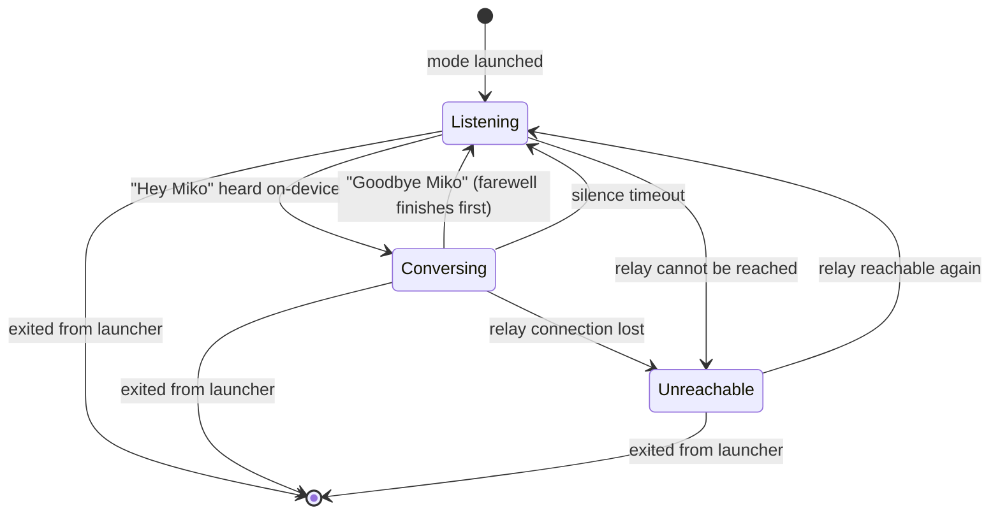
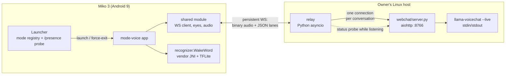
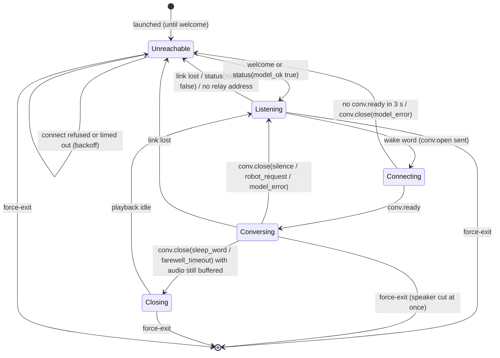

**Product Contract preservation:** changed, no scope change — R3 reworded so the silence timer matches AE4 (runs only while neither side is speaking); R12 now distinguishes the control messages this version needs (playback state, flush, open/close) from the reserved command lane, and AE8 says the robot replies "unsupported" instead of staying silent; R17 gained the exit-mid-conversation qualifier the flow analysis found missing; the Success Criteria's measurement clause names how latency is measured; Dependencies / Assumptions replaced NVIDIA's inference container with the owner's actual model server (a custom webchat server fronting a quantized build) and corrected the CPU-headroom assumption, and now names the wake-word model file the vendor's live path actually loads; Outstanding Questions that planning answered were resolved in place. No requirement's intent, actor, or success criterion changed.

# Autonomous Voice Mode - Plan

## Goal Capsule

- **Objective:** an adult in the room can say "Hey Miko" and hold a hands-free spoken conversation with the robot that feels like talking to a person, until they say "Goodbye Miko" or go quiet. This is the voice-conversation loop of the planned autonomous mode; the surrounding autonomous behaviors (actions, tool use, roaming) are not active scope.
- **Means:** a third mode app on the shared module, a Python relay in this repo between the robot and the owner's model server, and one persistent robot-to-relay link that carries audio only during a conversation (KTD1, KTD3).
- **Product authority:** repo owner, sole decision-maker.
- **Execution profile:** the robot app is verified on the device over root adb; the relay is unit-tested against a fake model server and then run against the real one. No Android unit-test harness exists in this repo.
- **Stop conditions:** stop and report if the vendor wake-word library cannot be loaded from our app after U1's spike and the openWakeWord fallback also fails on-device; stop if the model server cannot expose the person's transcript (U3), since the sleep word depends on it.
- **Open blockers:** none.

---

## Product Contract

### Summary

A third mode app for the Miko 3: say "Hey Miko" and it holds a hands-free spoken conversation with VoiceChat 11B through a relay on the owner's server, showing the same HAL-style eyes as the remote-control mode, until you say "Goodbye Miko" or go quiet. The robot spots the wake word itself, so no audio leaves it until it is woken. The relay is a small Python service that owns the conversation and speaks the owner's model server's WebSocket protocol; the robot app is an audio pipe plus eyes.

### Problem Frame

The stock firmware's conversation feature is entirely cloud-backed: speech recognition, the dialogue "brain", and speech synthesis are all calls to Miko's backend, which this project does not use (`docs/hardware/conversation-ai.md`). A jailbroken Miko therefore says nothing when spoken to. The launcher mode architecture plan (`docs/plans/2026-09-14-1035-feat-launcher-mode-architecture-plan.md`) named autonomous operation as the next mode after remote control and left its shape open.

Two things changed since that plan. The vendor's on-device wake-word model and native library were found intact in the decompile, so "Hey Miko" can be spotted locally without any cloud. And the owner now runs a full-duplex speech-to-speech model on a LAN host, which removes the separate speech-to-text and text-to-speech services the stock pipeline needed. The remaining questions were product ones: what the robot does while awake, how a session ends, and where the behavior lives.

### Requirements

**Waking and sleeping**

- R1. While the mode is active and no conversation is open, the robot listens locally for "Hey Miko" and opens a conversation when it hears it; no microphone audio leaves the robot until a conversation is open.
- R2. Saying "Goodbye Miko" during a conversation ends it; the robot lets the model's own farewell finish playing before closing, then returns to the listening state of R1.
- R3. A conversation in which neither the person nor the robot has spoken for the silence timeout ends the same way as R2, without a farewell; the timer never cuts off a reply in progress.
- R4. Ending a conversation stops all audio leaving the robot; the mode itself stays active until exited from the launcher.

**Conversation**

- R5. While a conversation is open, the person's speech streams continuously to the relay and the model's spoken replies play through the robot's speaker, with no button press and no per-turn re-wake.
- R6. The person can interrupt the robot mid-reply by speaking; the robot stops talking and listens.
- R7. A turn-taking setting disables R6 so that, while the robot is speaking, the person's audio is not treated as input; the setting can be changed without reinstalling the robot app and takes effect at the next conversation.
- R8. The conversation partner is VoiceChat 11B with a persona suited to adult small talk; the persona is defined server-side.
- R9. Each conversation starts fresh; nothing said in one conversation is remembered in the next.

**Relay**

- R10. The robot talks only to the relay on the owner's server, never to the model directly; the relay owns the model session, the sleep-word match, the silence timeout, and the persona.
- R11. The relay's address is configurable on the robot without rebuilding the app.
- R12. The robot-to-relay link carries a control lane (conversation open and close, playback state, flush) that this version uses, and a command lane from relay to robot reserved for future physical actions; in this version the relay sends no commands, and the robot answers any command it does not recognize with an "unsupported" reply rather than acting on it.
- R13. The mode works over the local network only, like the existing modes.

**Screen and feedback**

- R14. Whenever the mode is active, the robot's screen shows the same eyes as the remote-control mode's idle screen.
- R15. The eyes visibly change when a conversation opens, while the robot is speaking, and while the server is unreachable, so the person can tell it heard them without any sound cue.
- R16. When the relay is unreachable or the connection drops, the eyes show the unreachable state, the mode retries in the background without playing any sound, and the next "Hey Miko" works again once the relay is back; a drop mid-conversation ends that conversation.

**Mode lifecycle**

- R17. The mode is launched from the launcher and exited back to it like the remote-control mode; exiting mid-conversation stops audio immediately, without waiting for a farewell.
- R18. The mode never drives the motors and takes no drive lease.



Illustrates R1, R2, R3, R4, R16, R17. The Planning Contract's design refines this with the transient states the implementation needs.

### Key Decisions

- **Relay on the owner's server, not a thin client talking to the model directly.** Persona, sleep-word matching, timeouts, and later tools change server-side instead of by reinstalling on the robot, which is not a quick loop on this device. (session-settled: user-directed — chosen over a thin client that opens a WebSocket straight to the model server and executes any future tools itself: every behavior tweak and every new tool would be an APK rebuild, and web-facing tools would put API keys on the robot) Governs R10, R11, R12.
- **Talk-only for this version, with the command lane reserved now.** The person and the model converse; the robot's body does nothing. Reserving a relay-to-robot command lane costs little now and turns future actions into a server change rather than a protocol redesign. (session-settled: user-directed — chosen over turning to face the speaker via the mic array's direction-of-arrival, and over LLM-driven actions through tool calling) Governs R12, R18.
- **Interruptible by default, with a switch to strict turn-taking.** The model supports barge-in, but whether this mic array's echo cancellation keeps the robot from interrupting itself is unproven, so the fallback ships too. (session-settled: user-directed — chosen over always-interruptible with no fallback, and over strict turn-taking only) Governs R6, R7.
- **"Goodbye Miko" or silence returns the robot to listening; neither exits the mode.** A silence timeout bounds how long a forgotten or falsely woken session streams audio. (session-settled: user-approved — chosen over sleep-word-only with no timeout, and over exiting to the launcher on the sleep word) Governs R2, R3, R4.
- **Server trouble is shown by the eyes and retried silently.** The robot cannot speak an error on its own, since all speech comes from the server. (session-settled: user-approved — chosen over a bundled canned sound and over dropping back to the launcher) Governs R16.
- **Reuse the remote-control mode's eyes.** They already exist, are drawn in code rather than a shipped image, and the polish of state changes on them is cheap given the existing animation. (session-settled: user-directed — chosen over a new face) Governs R14, R15.
- **No memory across conversations.** Each "Hey Miko" starts a fresh session; persistent memory is a later product question, not a default. (session-settled: user-approved — chosen over carrying context between sessions) Governs R9.
- **Wake word on-device, sleep word server-side.** The vendor's bundled "Hey Miko" model spots the wake word locally so nothing streams until then; "Goodbye Miko" is matched by the relay in the person's transcript, since no on-device model for that phrase exists and the model hears it anyway. Streaming continuously and letting the model spot the wake word was rejected because audio would leave the robot at all times and a full-duplex model would answer everything it heard. Governs R1, R2, R10.
- **Reply speed is the success bar.** The owner's one criterion for "it worked" is that it responds fast enough to feel like a real conversation; see Success Criteria.

<!-- ce-section: work-relationships -->
### How This Work Fits Together

This plan covers only the voice-conversation loop of the autonomous mode. The breakdown below is the current understanding of what surrounds it, not a committed roadmap; a later plan may revise, split, merge, or discard any of it.

- Physical actions from speech (move, gestures, expressions) through the model's tool calling
  - Depends on this plan's command lane (R12, KTD3) and the shared robot-control client the remote-control mode already uses.
  - Shares the relay, which would hold the tool registry.
- Internet-facing tools (web search and similar)
  - Depends on the relay (R10); runs entirely server-side with no robot change.
- Turning to face the speaker using the mic array's direction-of-arrival
  - Can proceed independently of tool calling; a fixed behavior in the mode app, not a model decision.
- Idle autonomous behavior (roaming, reacting to people)
  - Still to decide whether it lives in this mode app or its own.

### Actors

- A1. Person — an adult in the same room, speaking to the robot at conversational volume; also the one who launches and exits the mode from the launcher.
- A2. Relay — a service on the owner's server on the local network that holds the model session, applies the persona, matches the sleep word, runs the silence timeout, and streams reply audio back.

### Key Flows

- F1. A conversation
  - **Trigger:** A1 says "Hey Miko" while the mode is listening.
  - **Actors:** A1, A2
  - **Steps:** The robot's on-device spotter fires; the eyes change to the conversation-open state; the robot opens a session with A2 and starts streaming mic audio; A1 talks and the model's replies play through the speaker as they arrive; A1 says "Goodbye Miko"; A2 matches it in the transcript, lets the model's farewell finish, and closes the session; the robot stops streaming and the eyes return to idle.
  - **Covered by:** R1, R2, R4, R5, R8, R14, R15
- F2. Silence ends a conversation
  - **Trigger:** A1 walks away mid-conversation without saying goodbye.
  - **Actors:** A1, A2
  - **Steps:** A2 sees neither side speak for the silence timeout; A2 closes the session without a farewell; the robot stops streaming and returns to listening.
  - **Covered by:** R3, R4
- F3. Interrupting the robot
  - **Trigger:** A1 starts talking while the robot is mid-reply.
  - **Actors:** A1, A2
  - **Steps:** In the default interruptible setting, the model stops its reply and attends to A1. In the turn-taking setting, A1's audio during the reply is not treated as input and the reply plays to the end.
  - **Covered by:** R6, R7
- F4. Relay unreachable
  - **Trigger:** The relay is down, or the connection drops mid-conversation.
  - **Actors:** A1, A2
  - **Steps:** Any open conversation ends; the eyes switch to the unreachable state; the robot retries the relay in the background with no sound; when the relay answers, the eyes return to idle and the next "Hey Miko" opens a conversation normally.
  - **Covered by:** R16

### Acceptance Examples

- AE1. **Covers R1.** Given the mode is active and listening, when someone says "Hey Miko", then a conversation opens and only from that moment does audio leave the robot.
- AE2. **Covers R1.** Given the mode is active and listening, when people talk in the room for an hour without saying "Hey Miko", then no audio leaves the robot and no conversation opens.
- AE3. **Covers R2.** Given a conversation is open, when the person says "Goodbye Miko", then the model's farewell plays to its end, the conversation closes, and the next "Hey Miko" opens a new one.
- AE4. **Covers R3.** Given a conversation is open, when nobody speaks for the silence timeout, then the conversation closes with no farewell and the robot is listening again.
- AE5. **Covers R6.** Given the interruptible setting and the robot mid-reply, when the person starts speaking, then the robot stops its reply and responds to what was said.
- AE6. **Covers R7.** Given the turn-taking setting and the robot mid-reply, when the person starts speaking, then the reply plays to its end and the person's words during it, including "Goodbye Miko", are not answered.
- AE7. **Covers R9.** Given a conversation in which the person stated their name, when they say goodbye and later open a new conversation, then the model does not know their name.
- AE8. **Covers R12.** Given a conversation is open, when the relay sends an unrecognized command on the command lane, then the robot replies "unsupported", does not act, and the conversation continues.
- AE9. **Covers R16.** Given the relay is down, when someone says "Hey Miko", then the eyes show the unreachable state, no sound plays, and once the relay is back the next "Hey Miko" works.
- AE10. **Covers R16.** Given a conversation is open, when the network connection to the relay drops, then the conversation ends, the eyes show the unreachable state, and no sound plays.
- AE11. **Covers R15.** Given the mode is active, when a conversation opens, the robot begins speaking, or the relay becomes unreachable, then each is visible as a distinct change in the eyes.
- AE12. **Covers R17.** Given a conversation is open and the robot is mid-reply, when the launcher exits the mode, then the speaker goes silent at once, the launcher home screen appears, and the relay ends the model session.

### Success Criteria

- On a typical turn over the local network, the robot's reply audio begins within about one second of the person finishing speaking. Measured as a sum of durations per KTD11: the model server's end-of-speech event to the relay's first forwarded reply chunk, plus the robot's own first-chunk-received to speaker-start duration, plus half the link round-trip; the report also states the perceived figure from the person's last word, which adds the model's own endpointing delay.
- A five-minute conversation completes without a dropout or a self-interruption in the default interruptible setting on this hardware. If self-interruption occurs, the turn-taking setting in R7 makes the same five minutes complete cleanly.
- "Hey Miko" at conversational volume from across a room opens a conversation on the first try, and false wakes during ordinary household noise are rare enough not to be annoying.

### Scope Boundaries

**Deferred for later**

- Any physical action, including turning to face the speaker, gestures, and driving, and the tool calling that would trigger them. The command lane in R12 is the only concession to this.
- Internet-facing tools such as web search.
- Memory across conversations.
- Access from outside the local network.
- Wake words other than "Hey Miko" (the vendor model also recognizes "Hello Miko"), and languages other than English.
- Any on-robot or launcher screen for editing the persona or conversation settings beyond the relay address and the turn-taking switch.

**Outside this version's identity**

- A child-safe companion. The persona and conversation are for an adult; content controls are not part of this version.
- A bundled sound or spoken message for errors; the eyes carry that state.

**Deferred to Follow-Up Work**

- Configuring the mic array's own echo cancellation through the vendor's Conexant DSP library (`docs/hardware/voice-mic.md`, mic-array section). Nothing sets it today because the vendor service is disabled; this plan relies on Android's platform echo canceller (KTD6) and the turn-taking fallback instead.
- Restarting the mode automatically after a reboot. The launcher is the home screen and no mode restarts after boot, same as the remote-control mode; do not add a boot receiver ad hoc.
- A trained openWakeWord "Hey Miko" model as a second engine, unless U1's spike forces it (KTD7).
- Cloud-style revalidation of wake-word hits (the stock firmware's second stage); this version tunes the on-device threshold only.
- Authentication on the relay's robot-facing port and its transcript endpoints; v1 matches the existing modes' open-LAN posture (System-Wide Impact).
- Optional command-lane fields (`deadline_ms`, `exclusive`, progress results); the tolerance rule in KTD3 lets them arrive later without a protocol bump.

### Dependencies / Assumptions

- The owner's model server is already running on a Linux host on the LAN: a custom webchat server (aiohttp, `webchat/server.py`, outside this repo) fronting a quantized VoiceChat 11B build via a `llama-voicechat --live` child process over stdin/stdout. It serves a WebSocket on port 8765 (TLS, self-signed) and the same app without TLS on port 8766; it binds all interfaces with no authentication; it accepts exactly one client, and a new connection takes over and closes the previous one.
- That server's protocol, as described by the owner: client sends raw 16-bit little-endian 16 kHz mono PCM as binary frames, continuously including silence, and JSON text frames `reset`, `system` (ASCII only, before any audio), `status`; the server sends raw 16-bit 22.05 kHz mono reply PCM as binary frames and JSON text frames `status`, `assistant_text_delta`, `agent_start`, `agent_end`, `user_start`, `user_end`, `flush` (drop buffered audio, the model yielded), `stats` (input backlog and speech queue), `reset`, `warning`, `error`. The robot's existing 16 kHz mono mic capture matches the input side without resampling.
- The model itself produces a running user transcription (NVIDIA model card), but `webchat/server.py` does not forward it today; U3 adds a `user_text` event. If `llama-voicechat --live` does not print the user transcription, that unit blocks and the fallback choice goes to the owner (Open Questions).
- The vendor's wake-word model and native library (`tools/serviceexam_jadx/resources/assets/miko_wakeword_model.tflite`, the three-class file the vendor's live path loads, `lib/arm64-v8a/libnative_wakeword_vad_lib.so` with its `libncnn.so` and `libtensorflowlite_gpu_delegate.so` dependencies) can be loaded from our own app when the Java wrapper keeps the vendor's `recognizer.WakeWord` class name. Verified present; loading outside the vendor's app is what U1 proves.
- Android's platform echo canceller on this device is good enough, when both capture and playback use the voice-communication audio path, that the model does not treat the robot's own speech as the person interrupting. Unverified; R7 exists for the case it is not.
- Silence timeout default: 90 seconds while neither side is speaking, tunable on the relay.
- "Goodbye Miko" is matched in the person's transcript, so the match must tolerate transcription variants of "Miko" (KTD2).
- The vendor's ServiceExam service stays disabled on this device, so the microphone is free and nothing else runs a wake-word loop.
- CPU headroom on the robot is tight, not generous: the remote-control mode's camera capture alone once took about 90 percent of the quad-core SoC until its frame rate was throttled (`mode-remote-control/src/com/miko3/mode/remotecontrol/CameraCapture.java`, the confirmed-live comment in the start path). The spotter, the eyes, and the audio threads must be measured, not assumed to fit (Risks & Dependencies).

### Sources / Research

- `docs/hardware/voice-mic.md` — the vendor's wake-word, VAD, mic-array, and expression pipeline; the wake-word replication recipe; the mic-array AEC settings the stock app configured.
- `docs/hardware/conversation-ai.md` — confirmation that stock speech recognition, dialogue, and synthesis are all cloud calls.
- `docs/plans/2026-09-14-1035-feat-launcher-mode-architecture-plan.md` — the mode architecture this app follows; KTD1-KTD3 and KTD10 there for shared module, lease, and signing conventions.
- `docs/solutions/runtime-errors/kill-9-on-watched-service-permanently-disables-restart.md` — never force-stop an app process; drives the in-process retry rule in Implementation Constraints.
- `docs/solutions/integration-issues/aidl-interface-mismatch-kiosk-splash-loop.md` — silent AIDL skew; drives the shared-module-only rule for any new Binder surface.
- `mode-remote-control/src/com/miko3/mode/remotecontrol/MicCapture.java`, `OperatorSpeakerPlayer.java`, `DeviceViewPage.java`, `ModeApp.java`, `MainActivity.java`, `CameraCapture.java` — the mic capture, speaker playback, eyes, HTTP routing, Activity shell, and the measured CPU-headroom datapoint.
- `launcher/src/com/miko3/launcher/LauncherApp.java` — mode launch and exit handoff, including the lease-holder lookup that KTD8 replaces for this mode.
- `shared/src/com/miko3/shared/WebSocketConnection.java`, `RoutingHttpServer.java`, `LauncherProtocol.java` — server-side frame parsing to reuse in the client, and the cross-app constants file.
- `shared/src/emotix/com/drivers/SensorModule.java` — the precedent for keeping a vendor JNI class's exact package name.
- `scripts/build_common.py`, `scripts/build-mode-remote-control.py`, `scripts/tests/` — the build library, per-mode build script shape, and the Python unittest convention.
- `tools/serviceexam_jadx/sources/recognizer/WakeWord.java`, `KeywordTask2.java` — the vendor's JNI contract, chunk size, thresholds, and the raised-threshold-while-speaking precedent.
- NVIDIA NemotronLabs VoiceChat 11B model card (https://huggingface.co/nvidia/NVIDIA-NemotronLabs-VoiceChat-11B) — audio rates, full-duplex behavior, user transcription output, ASCII-only system prompt constraint, the roughly 450 ms turn-taking claim.
- openWakeWord (https://github.com/dscripka/openWakeWord) — the fallback engine and its custom-model training notebook.
- Android `AcousticEchoCanceler`, `MediaRecorder.AudioSource.VOICE_COMMUNICATION`, `AudioAttributes.USAGE_VOICE_COMMUNICATION`, `AudioTrack.getPlaybackHeadPosition` and `getUnderrunCount` references — the platform AEC path KTD6 relies on, the finding that media-tagged playback bypasses it, and the playback bookkeeping KTD5 needs.

---

## Planning Contract

### Key Technical Decisions

- KTD1. **The relay is a standalone Python asyncio service in this repo (`relay/`), one process per robot, connecting to the model server's plain-HTTP port 8766 once per conversation.** The model server is single-client, so a per-conversation connection with `reset` then `system` on open gives R9 and per-conversation persona for free, and keeps `webchat/server.py` untouched apart from U3. Chosen over merging the relay into `webchat/server.py`: the relay's lifecycle, logging, and future tool registry would then live in the model server's process. Python 3.11+, stdlib plus `websockets`; no framework. Governs R8, R9, R10.
- KTD2. **The sleep word is matched by the relay on the person's transcript delivered by a new `user_text` event from `webchat/server.py`.** (session-settled: user-directed — chosen over relay-side speech recognition on the mic stream, a second model to run and tune, and over an on-device "Goodbye Miko" spotter, which would need a trained custom model) Matching: normalize the running user transcript, keep a sliding window of the last six words, and match when a farewell token (goodbye, bye, good night) sits within two words of a "Miko" variant from a seeded list (mico, meeko, meko, mikko, niko, nico, mika, mica, and similar), with a fuzzy fallback at roughly 85 percent partial similarity; match only on `user_end` or on deltas older than half a second; never match on `assistant_text_delta`; log near-misses so the variant list grows from real transcripts. Governs R2, R10.
- KTD3. **One persistent WebSocket per robot to the relay, hand-rolled RFC 6455 client in the shared module, binary frames for audio and JSON text frames for control and commands.** The shared module has only a server-side WebSocket with unmasked text sends; the client needs masked sends and binary opcodes, and its frame parser is reused. Chosen over the Java-WebSocket jar (three vendored jars including a logging binding, d8 surprises) and over chunked HTTP in each direction (two connections, no lane framing). The protocol commitments that cannot be added compatibly later are fixed now:
  - Envelope `{type, id, conv, t}` on every text frame; `t` is the sender's milliseconds since its `hello`. Unknown `type` gets `cmd.result{status: unsupported}`; unknown fields are ignored, so optional fields can arrive later without a version bump.
  - `hello` (robot: robot id, proto version 1, app version, capabilities list, mic rate, speaker rate, default turn-taking flag) answered by `welcome` (relay: proto version, relay version, model reachable flag). A second connection carrying the same robot id replaces the first. The backoff reset and the exit from the unreachable state key off `welcome` and later `status` frames, never off the TCP connect.
  - `status{model_ok}` from the relay whenever the model server's reachability changes while the robot is listening (KTD4).
  - `conv.open{turn_taking}` / `conv.ready` / `conv.close{reason}` with reasons `sleep_word`, `silence`, `farewell_timeout`, `robot_request`, `model_error`, `link_lost`. The turn-taking value on `conv.open` governs that conversation, which is what makes R7's next-conversation semantics true on a link that stays up across conversations; the `hello` value is only the link default.
  - `reply{id}` from the relay before the first audio chunk of each model reply; `audio.flush{reply}` names the reply being discarded.
  - `playback{state, buffered_ms, first_chunk_to_play_ms}` from the robot on every playing/idle transition.
  - `cmd{...}` and `cmd.result{re, status}` where `re` carries the command's `id`; commands are scoped to a `conv`, execute FIFO per conversation, and any command still in flight at `conv.close` is answered `cancelled`. In v1 the relay sends none and the robot answers `unsupported`.
  - Link liveness is RFC 6455 ping/pong every 2 seconds, three misses is link loss; there is no JSON ping family.
  - Downstream audio is 80 ms chunks of 3,528 bytes at 22.05 kHz, on ordered delivery, so anything received after `audio.flush` belongs to the next reply. Uplink binary frames carry any whole number of 16 kHz samples (default 80 ms, 2,560 bytes; a robot preference per KTD10), and the relay's zero-fill watchdog is time-based, not frame-size based.
  Governs R10, R11, R12, R16.
- KTD4. **The relay owns the conversation state machine; the robot mirrors it for the eyes.** Relay states per robot: `idle`, `connecting` (model connection opening, `reset` and `system` sent), `conversing`, `draining` (sleep word matched: uplink replaced by silence, reply audio still forwarded until `agent_end` and the robot reports playback idle, capped at 8 seconds; if no `agent_start` arrives within 1.5 seconds of the match, close anyway), `closed`. The silence timer is armed at `conv.ready` and re-armed at `user_end` or `agent_end`, whichever is later, and is cancelled by `user_start` or `agent_start` (R3), so a wake followed by nothing still closes with `silence`. Any uplink backlog the robot buffered before `conv.ready` (KTD6) is forwarded to the model as fast as it arrives. Model `error`, `warning` with a fatal code, or the model connection closing ends the conversation with `model_error` but not the robot link; while a robot is listening the relay probes the model server every few seconds by opening a connection, sending its `status` request, and requiring a `status` reply before closing, since a bare port probe would report a listening server whose model child is dead; it pushes `status{model_ok}` on change, so relay-up-but-model-down is visible before anyone speaks. On `conv.open` the relay replies `conv.ready` within 3 seconds or `conv.close{model_error}`; the robot treats no reply as unreachable and sends `conv.close{robot_request}` for that conversation, ignoring a late `conv.ready`. After any conversation that fails to open or ends with `model_error`, and after a robot `conv.close` received while `connecting`, the relay runs a probe at once and pushes `status{model_ok}` with its result even when unchanged, so the robot's exit from Unreachable (KTD3) always has a signal to key off. Because the model server is single-client and a new connection evicts the previous one, probes never overlap a conversation connection: a `conv.open` cancels any in-flight probe and discards its result, and probing resumes only after the conversation's model connection is closed. A second `conv.open` from the same robot replaces the first. On link loss the relay closes its model connection so no stale session lingers. Chosen over a robot-owned state machine: the silence and drain timers key off model events the robot never sees, and moving them into the APK puts tuning back on the reinstall loop. Governs R2, R3, R4, R16.
- KTD5. **Barge-in and strict turn-taking are relay and robot behavior, not model settings.** The model server's `flush` event is handled in two places: the relay stops forwarding the flushed reply and discards its own paced queue for it, then sends `audio.flush{reply}`; the robot pauses, flushes, and resumes its speaker track and drops any chunk that arrives before the next `reply{id}`. In strict turn-taking the relay sends zero-filled frames upstream instead of the mic stream from `agent_start` until `agent_end` has arrived and the robot then reports playback idle, plus a 300 ms cooldown; a `playback{idle}` that arrives before `agent_end` is an underrun, logged, and the gate stays closed. The model needs a continuous stream and silence is how it hears the person stop. Uplink chunks are forwarded to the model as they arrive, never re-paced: a zero-filled frame is sent only when a full 80 ms passes with no chunk, so Wi-Fi jitter cannot accumulate into permanent input lag, and strict mode substitutes zeros in place. The relay paces reply audio: it may burst up to about 500 ms of audio ahead of the robot's speaker, then forwards one chunk per 80 ms from a timer, estimating the robot's buffer as bytes sent minus playback elapsed; so a flush discards little and the robot's idle report is meaningful. Inherits the interruptible-with-switch Key Decision (Governs R6, R7).
- KTD6. **One `AudioRecord` on the voice-communication source feeds both the spotter and the uplink; one `AudioTrack` tagged voice-communication plays replies at 22.05 kHz.** The platform echo canceller only references the voice-communication output path, so media-tagged playback would leak into the mic uncancelled. The capture thread reads 80 ms chunks and hands them to a separate spotter thread through a one-deep drop-oldest slot while listening, or to the uplink while conversing; from the spotter hit until `conv.ready` they go into a bounded uplink buffer of about 3 seconds (drop-oldest) that is sent ahead of live audio when the conversation opens and discarded if it does not, so a person who says the wake word and their question in one breath is heard. Capture never blocks on inference. The spotter is paused for the conversation (the vendor raised thresholds while the robot spoke for the same reason) and resumed on every path back to listening, including `model_error` and link loss. The player thread drains a bounded queue of about one second into a streaming track created at `conv.ready`, not lazily at first write; it starts after a configurable prebuffer defaulting to one chunk; `pause`, `flush`, `play` implements KTD5's flush; idle is derived from the playback head position, not from the queue emptying. Capture and player threads run at urgent-audio priority and the WebSocket I/O on its own threads. `AcousticEchoCanceler` is created on the record session when available. The existing 16 kHz `OperatorSpeakerPlayer` is not reused because its rate is fixed and it has no flush path. Governs R1, R5, R6.
- KTD7. **The vendor's wake-word engine ships inside our APK: `recognizer.WakeWord` with its exact class name, `libnative_wakeword_vad_lib.so`, `libncnn.so`, and `libtensorflowlite_gpu_delegate.so` bundled through the build script's native-libs mechanism, and `miko_wakeword_model.tflite`, the three-class model the vendor's live path actually loads, as an asset copied to the app's files directory.** Thresholds start at the vendor's 0.65 for "Hey Miko" and 0.6 for "Hello Miko" with a three-element score array, the "Hello Miko" class is treated as no detection, the detector is reset after each hit, and the threshold is tuned on-device; the Hey-Miko-only `hey_miko_wakeword_model.tflite`, which no vendor code loads, is an optional U1 measurement once the engine is proven, keyed on the reported output-class count. This is proven by U1 before anything depends on it; if `init` fails from our process, or inference exceeds the chunk period on the CPU, the timeboxed fallback is a custom openWakeWord "Hey Miko" model with its TFLite runtime vendored the same way (Picovoice's free tier no longer exists). Governs R1.
- KTD8. **The launcher gets a mode registry and detects the running mode by asking each registered mode's presence route, instead of reading the drive lease holder.** Registry: mode id to package, activity, and port, replacing the single hard-coded mode; the launcher page shows one link per mode and which one is running. Presence is a `/presence` route on every mode that reports whether an Activity generation is active (the remote-control mode's generation counter already exists; the voice mode mirrors it). Exit-then-launch sends the force-exit intent to the mode whose presence route reports active and waits for it to report inactive. A port-closes check would not work: a mode's HTTP server starts in the Application and is never stopped, so a cleanly exited mode's cached process keeps its port bound. Chosen over registering a presence token in the lease service: the lease drags in the renew loop and fires a stop-motors command on every release, which contradicts R18. Governs R17, R18.
- KTD9. **The eyes move into a shared page builder with a state hook; the voice mode's page polls a state endpoint at 1 s while listening and 250 ms while a conversation is open.** States: `listening`, `connecting`, `conversing`, `speaking`, `closing`, `unreachable`; `speaking` is derived on the robot from the playback head position advancing, not from the relay. Polling was chosen over pushing into the WebView because the same page must render in a remote browser for U10's QA, where no in-process bridge exists; the two-rate poll keeps the idle cost low on this SoC and the speaking cue within a quarter second. Governs R14, R15.
- KTD10. **Settings live in the mode's own `SharedPreferences`, edited on a page the mode serves at the root of its own port pair (8082 HTTP, 8445 HTTPS).** The page carries the relay address, the turn-taking switch, current state, and an Exit button, in the same Pico form style as the launcher's pages; it is served at `/` because the launcher redirects the browser there after a launch. Chosen over passing settings as launch-intent extras from the launcher, which would need its own settings store and break `am start` for QA, and over LAN discovery of the relay. The turn-taking preference is read at each wake and sent on `conv.open` (KTD3), so a change applies at the next conversation (R7). Saving a changed relay address takes effect immediately: the client closes the current link (any open conversation ends with `robot_request`), resets its backoff, and connects to the new address; the POST validates the value as a host or IP plus port whose address is private or link-local (R13; a hostname is checked again on its resolved IP at connect time) and re-renders with a status line instead of saving an invalid one, following the launcher page's status-redirect pattern. The Exit button works from the LAN browser where the page is actually viewed: the page embeds a random client token minted by the GET that rendered it, and both the settings POST and the exit route require that token and check it server-side against the stored issued value, so a cross-site form from any other page cannot redirect the microphone or exit the mode. This is stricter than the remote-control mode's check, which accepts any non-empty token; do not copy that rule. The button then navigates the browser to the launcher's page. Tuning values with no user-facing meaning (prebuffer chunk count, uplink chunk size) are `SharedPreferences` keys written over root adb during U10, not form fields, because the Product Contract defers any settings screen beyond the address and the switch. Governs R7, R11, R17.
- KTD11. **The relay writes one JSONL log per conversation and serves them over HTTP.** Every model event with receive time, every lane frame's metadata (never audio bytes), every matcher decision with the triggering transcript, the model server's `stats` per turn, and per-turn latency as durations that never cross clocks: relay-measured `user_end` to first forwarded reply chunk, the robot's own `first_chunk_to_play_ms` from its `playback` frame, and half the measured ping round-trip. Writes go through a queue to one writer task flushing once per second. Chosen over stdout logging because U10's report is computed offline from per-conversation files the QA script fetches by id. Endpoints: list conversations and fetch one; conversation ids are relay-generated (timestamp plus a short random suffix, matching `^[0-9A-Za-z_-]+$`), any other id is answered 404, and the file path is resolved by joining the id to the log directory and checking the result stays inside it. Governs Success Criteria.

### High-Level Technical Design

Components and who talks to whom:



A conversation, end to end:

```mermaid
sequenceDiagram
    participant P as Person
    participant M as mode-voice
    participant R as relay
    participant C as webchat server
    M->>R: hello
    R->>M: welcome{model_ok} (link stays up while listening; no audio)
    P->>M: "Hey Miko"
    M->>R: conv.open
    R->>C: connect :8766, reset, system(persona)
    R->>M: conv.ready
    M->>R: PCM 16 kHz (binary, 80 ms)
    R->>C: PCM 16 kHz (continuous)
    C-->>R: user_start / user_end / user_text
    C-->>R: agent_start, PCM 22.05 kHz, agent_end
    R-->>M: reply{id}, paced PCM 22.05 kHz
    M-->>R: playback{playing, first_chunk_to_play_ms}
    P->>M: (interrupts) speech
    C-->>R: flush
    R-->>M: audio.flush{reply}
    P->>M: "Goodbye Miko"
    C-->>R: user_text "goodbye miko"
    R->>C: silence instead of mic (draining)
    C-->>R: agent_start, farewell audio, agent_end
    M-->>R: playback{idle}
    R->>M: conv.close{sleep_word}
    R->>C: close connection
```

Robot-side states, refining the Product Contract diagram with the transient states the implementation needs:



The mode starts unreachable and enters Listening only on the first `welcome`. Every transition into Listening resumes the spotter; every transition out of Conversing or Closing stops the uplink and, unless entering Closing, silences the speaker. Audio captured between the wake hit and `conv.ready` is buffered and sent when Conversing begins (KTD6).

Lane message families on the persistent link (owned by KTD3; listed here for orientation only):

| Family | Direction | Purpose |
|---|---|---|
| `hello` / `welcome` | robot to relay / relay to robot | link open and protocol negotiation; `hello` carries the robot id, `welcome` the model-reachable flag |
| `status` | relay to robot | model reachability changes while listening |
| `conv.open` / `conv.ready` / `conv.close` | both | conversation lifecycle; open carries the turn-taking value, close carries a reason |
| `reply` / `audio.flush` | relay to robot | marks each reply's first chunk; discards a named reply on barge-in |
| `playback` | robot to relay | speaker state, buffered milliseconds, first-chunk-to-play duration |
| `cmd` / `cmd.result` | relay to robot / robot to relay | reserved command lane; results correlate by `re`; v1 robot answers `unsupported` |

### Output Structure

```text
mode-voice/
  AndroidManifest.xml
  assets/miko_wakeword_model.tflite
  res/xml/network_security_config.xml
  src/com/miko3/mode/voice/
    ModeApp.java            # HTTP server, routes (/ settings, /device-view, /voice-state, /presence, /exit)
    MainActivity.java       # WebView shell, permission, force-exit handling (two sites)
    WakeWordSpikeActivity.java   # U1 only; deleted in U8
    VoiceEngine.java        # AudioRecord fan-out, spotter thread, uplink, player
    ConversationClient.java # lane state machine over the shared WS client
    SettingsPage.java       # served Pico form
  src/recognizer/WakeWord.java   # vendor JNI wrapper, exact class name
shared/src/com/miko3/shared/
  WebSocketConnection.java  # gains binary opcode, masking option, synchronized send
  WebSocketClient.java      # RFC 6455 client on top of it
  EyesPage.java             # extracted from DeviceViewPage, state hook
  ModeRegistry.java         # mode id -> package/activity/port (launcher and modes)
relay/
  relay/__init__.py, main.py, lane.py, model_client.py, conversation.py,
  sleepword.py, logging.py, http.py, report.py
  tests/  (unittest; fake_model_server.py, fake_robot.py, lane_echo_server.py, relay_stub.py)
  docs/model-server-protocol.md
  README.md
scripts/
  build-mode-voice.py
  install-mode-voice.py
  qa-voice-mode.py
  tests/test_build_mode_voice.py, test_eyes_page_golden.py
```

The tree is the expected shape, not a constraint; per-unit file lists are authoritative.

### System-Wide Impact

**Shared code the remote-control mode depends on.**

- `shared/src/com/miko3/shared/WebSocketConnection.java` gains a binary opcode, a masking option, fragmentation, and a synchronized writer (U2). Its one existing consumer is the drive WebSocket route in `mode-remote-control/src/com/miko3/mode/remotecontrol/ModeApp.java`, whose text-read loop and `finally` stop must behave exactly as before: unmasked server sends, pings answered, null on close. U2 and the Verification Contract carry the drive smoke test for this reason.
- `DeviceViewPage.HTML` is a constant served verbatim and loaded by the remote-control Activity on loopback. U7 composes it from the shared `EyesPage` builder; a golden test in `scripts/tests/` asserts the composed remote-control page is byte-for-byte the pre-U7 constant, so later eye tweaks cannot silently change the remote mode.
- `LauncherProtocol.java` receives the registry ids and any new extras. The force-exit extra is handled in both `onCreate` and `onNewIntent` of the remote-control Activity; the voice Activity must copy both sites or a finished-then-relaunched instance ignores exit.

**Launcher handoff.** `LauncherApp.launchModeGracefully` and the single hard-coded link in `LauncherPage` are replaced by the registry and presence probe (KTD8). Timing for the remote-control path stays identical; the drive lease remains the motor arbiter and is not touched.

**Exclusive microphone.** Two modes now use the mic. The remote-control mode's exit path releases camera and drive but not its mic capture or operator speaker; a force-exit with the mic toggled on leaves the cached process holding the microphone, and the voice mode's capture then fails with the busy error until Android reaps that process. U9 adds the one-line release to the remote-control exit path and tests the switch in both directions.

**Entry points.** Launcher `/launch-mode?mode=`; the force-exit intent (two handler sites per mode); `am start` from the install scripts; each mode's `/exit` (remote-control's is gated by its lease token; the voice mode's by the page token per KTD10); the voice mode's settings form (GET and POST on 8082/8445, which decides where microphone audio goes and is LAN-writable without authentication in v1); each mode's `/presence`; the relay's robot-facing WebSocket port and its unauthenticated transcript endpoints; the model server's port 8766.

**Failure propagation.** Wi-Fi drop: robot sees link loss and goes unreachable; relay sees link loss, closes its model connection, logs `link_lost`. Relay crash: robot backs off and re-sends `hello`; the model server sees its client vanish. Model server down or evicted by a stray browser tab: relay ends the conversation with `model_error`, keeps the robot link, and pushes `status{model_ok}` so the eyes show unreachable until the probe succeeds again. Model server slow (input backlog growing in `stats`): `user_end` arrives late and every turn's latency grows; the report flags sustained backlog as a host-capacity alarm rather than a robot problem.

**State lifecycle.** The generation-counter race the remote-control Activity documents (a stale instance tearing down a newer instance's state on rapid relaunch) applies to `VoiceEngine` verbatim; the voice Activity guards teardown the same way and releases the record and track synchronously before finishing. Invariant: every path into Listening resumes the spotter (KTD6).

**Audio privacy.** Microphone audio leaves the robot only inside a conversation (R1); the relay's JSONL holds full transcripts and is served without authentication on the LAN, matching the existing modes' posture and recorded under Deferred to Follow-Up Work; the remote-control mic leak above is closed by U9 so the "running" mode is the only one capturing.

### Implementation Constraints

- Zero AIDL. The vendor's ServiceExam service stays disabled; the mode never binds it and never re-enables it, because that would re-arm the watchdog and restart the vendor's own wake-word loop on the microphone.
- No camera. The mode never opens the camera, sidestepping the camera HAL CPU bug and keeping CPU for the spotter.
- In-process retries only. Relay reconnects and spotter restarts use backoff inside the process (2 s base, 30 s cap, reset only on `welcome` or a saved relay-address change per KTD10), never a force-stop-and-relaunch of self.
- Any new cross-app constant or Binder surface lives in the shared module only; every `onServiceConnected` and lane handler logs caught exceptions loudly.
- Build constraints from `scripts/build_common.py`: Java 8 source level, no lambdas by convention, no external Java dependencies; assets and native libraries go through the build script's existing mechanisms.
- New scripts are Python, matching `scripts/` conventions and the owner's preference.
- The relay treats the model server as trusted but unauthenticated LAN infrastructure; it binds its robot-facing port to the LAN interface only and does no auth in v1, matching the existing modes.
- The relay's event loop never blocks: audio bytes are never logged, log writes go through a queue, and each direction has its own task with a bounded queue so a stalled model send cannot stall robot receives.

### Assumptions

- `llama-voicechat --live` prints the user transcription in a form `webchat/server.py` can forward (U3). If not, the fallback in Open Questions applies.
- The model server's `user_end` is a usable end-of-speech marker for latency measurement and the silence timer.
- The persona text fits the model server's ASCII-only `system` constraint.
- The model's roughly 450 ms first-reply figure holds on the owner's quantized build; it is the largest fixed term in the latency budget and is measured, not assumed, by U10.

### Risks & Dependencies

- **Vendor JNI library refuses to load from our process** (GPU delegate init, missing dependency). Mitigation: U1 spikes it first with nothing else depending on it; fallback engine named in KTD7.
- **SoC headroom.** The camera path alone once saturated this SoC (Dependencies / Assumptions). Spotter inference exceeding the 80 ms chunk period would overrun the record ring and delay wakes; a continuously animating WebView plus a 4 Hz poll competes with the audio threads. Mitigation: the spotter runs on its own thread behind a drop-oldest slot (KTD6); U1 measures inference time per chunk and process CPU; U7 measures WebView CPU at both poll rates and polls slowly while listening (KTD9); U8 logs underrun and overrun counts per turn; player and capture threads run at urgent-audio priority.
- **Latency budget.** From the person's last audio leaving the robot to first speaker output, typical and worst cases in milliseconds. The first three rows happen before the model can emit `user_end`, so they count toward the perceived figure only; the measured success-criterion figure (KTD11) starts at `user_end` and is the remaining rows:

  | Stage | Typical | Worst | Tunable |
  |---|---|---|---|
  | Mic chunk boundary and capture HAL buffer | 60 | 120 | chunk size |
  | Robot to relay hop | 10 | 100 | no |
  | Relay tick and relay to model hop | 3 | 10 | no |
  | Model first reply after `user_end` | 450 | unknown | no (measure) |
  | Re-chunking on the relay | 40 | 80 | forward first chunk short |
  | Relay to robot hop | 10 | 100 | no |
  | Prebuffer (one chunk default) | 80 | 160 | setting |
  | Speaker start | 30 | 150 | pre-created track |
  | Sum, all rows | about 680 | about 1,100 | |
  | Sum from `user_end` (measured bar) | about 610 | about 870 | |

  The bar is met when the model's 450 holds and the robot-side tunables stay near their defaults; the perceived figure adds the model's own endpointing delay before `user_end` (typically 300 ms, up to 700), which the success criterion excludes but U10 reports. Mitigation levers, in order: pre-created track, one-chunk prebuffer, 40 ms uplink chunks (the spotter is paused while conversing, so its 1,280-sample chunk no longer constrains the uplink; this lever improves only the perceived figure), then forwarding the first reply chunk short.
- **Self-interruption despite the platform echo canceller.** Mitigation: KTD5's strict turn-taking is a runtime switch; the relay log counts flushes with no following user text so the decision is data-driven; playback idle is derived from the head position so the cooldown does not start early.
- **Sleep-word misses or false matches.** Mitigation: KTD2's variant list plus fuzzy fallback, near-miss logging, and the silence timeout as a backstop for misses.
- **Model server takeover semantics.** A stray second client (the browser page) evicts the relay mid-conversation. Mitigation: the relay treats an unexpected close as `model_error`, ends the conversation, and its probe restores `status{model_ok}` when a probe's `status` request is answered again; the README tells the owner not to keep the browser page open while the robot is in use.
- **Launcher registry change touches the working remote-control handoff.** Mitigation: U9 keeps the remote-control mode's timing identical, adds only the presence route and the mic release, and is verified with both modes in both directions.
- **Wi-Fi drop versus relay crash.** Both surface as link loss; the ping cadence in KTD3 bounds detection to a few seconds either way.
- **Memory.** Three native libraries, the TFLite model, and a WebView on a device with limited RAM. Mitigation: the player queue is bounded at about one second and drops with a log on overflow; U7 watches process memory over an hour.

### Open Questions

**Deferred to Implementation**

- Whether `llama-voicechat --live` emits the user transcription on stdout in a form U3 can forward. If it does not, stop at U3 per the Goal Capsule and put the choice to the owner: KTD2 rejected relay-side recognition of the sleep phrase (a small CPU speech recognizer on the mic stream) and an on-device spotter, so adopting either is the owner's decision, not the implementer's; U5's matcher interface accepts either input so the decision does not reshape the relay.
- Whether the model server's `flush` event arrives early enough that forwarding it alone meets the barge-in feel, or whether the relay should also flush on `user_start` during `agent_start`; decide from U10's measurements.
- Final thresholds: wake-word score, silence timeout, drain cap, turn-taking cooldown, prebuffer chunks, uplink chunk size; all are relay config or robot preference keys tuned on-device (the robot-side ones written over root adb, per KTD10), with the defaults above as starting points.
- The speaker's own output latency (the gap between the playback head advancing and sound leaving the speaker); U10's acoustic calibration decides whether to add a fixed correction to the reported latency.

---

## Implementation Units

### Unit Index

| U-ID | Title | Key files | Depends on |
|---|---|---|---|
| U1 | Wake-word spike: vendor engine in our APK | `mode-voice/src/recognizer/WakeWord.java`, `scripts/build-mode-voice.py` | — |
| U2 | Shared WebSocket client and parser upgrade | `shared/src/com/miko3/shared/WebSocketClient.java`, `WebSocketConnection.java` | — |
| U3 | `user_text` event in the model server | `webchat/server.py` (outside this repo) | — |
| U4 | Relay model adapter and fake model server | `relay/relay/model_client.py`, `relay/tests/fake_model_server.py` | — (U3 gates one test) |
| U11 | Relay lane server and scripted relay stub | `relay/relay/lane.py`, `relay/tests/relay_stub.py` | U4 |
| U5 | Relay conversation engine, matcher, logging | `relay/relay/conversation.py`, `sleepword.py`, `logging.py`, `http.py`, `main.py` | U4, U11 |
| U6 | Mode app scaffold, settings page, install script | `mode-voice/`, `scripts/install-mode-voice.py` | U1 |
| U7 | Shared eyes with state hook | `shared/src/com/miko3/shared/EyesPage.java`, `mode-voice/src/.../ModeApp.java` | U6 |
| U8 | Robot audio engine and conversation client | `mode-voice/src/.../VoiceEngine.java`, `ConversationClient.java` | U2, U6, U7, U11 (bring-up), U5 (full loop) |
| U9 | Launcher mode registry and presence probe | `launcher/src/com/miko3/launcher/LauncherApp.java`, `LauncherPage.java`, `shared/.../ModeRegistry.java` | U6; U8 for the mic-switch scenario |
| U10 | End-to-end QA script and latency report | `scripts/qa-voice-mode.py`, `relay/relay/report.py` | U5, U8, U9 |

Sequencing: U1, U2, U3, and U4 are independent and can run in parallel; U11 gives the robot side a relay to talk to before the full engine exists, so U6 through U8's bring-up proceeds while U5 is built; U9 makes exit and relaunch verifiable; U10 closes the loop against the success criteria.

### U1. Wake-word spike: vendor engine in our APK

- **Goal:** prove the vendor's wake-word engine detects "Hey Miko" from a process we build, and measure what it costs on this SoC, with nothing else depending on it yet.
- **Requirements:** R1; KTD7.
- **Dependencies:** none.
- **Files:** create `mode-voice/src/recognizer/WakeWord.java`, `mode-voice/assets/miko_wakeword_model.tflite` (copied from `tools/serviceexam_jadx/resources/assets/`, the file the vendor's `KeywordTask2` loads), `mode-voice/src/com/miko3/mode/voice/WakeWordSpikeActivity.java`, `scripts/build-mode-voice.py`, `scripts/tests/test_build_mode_voice.py`.
- **Approach:**
  1. Copy the vendor's `WakeWord.java` surface (init from path, process chunk, set thresholds, reset, last score) under the exact `recognizer` package; keep native method signatures verbatim.
  2. Build script mirrors `scripts/build-mode-remote-control.py` with three `native_libs` entries (`libnative_wakeword_vad_lib.so`, `libncnn.so`, `libtensorflowlite_gpu_delegate.so`) and the model as an asset; copy the model to the app's files directory at first run and pass a files-directory subpath as the cache directory to avoid storage permissions.
  3. The spike Activity reads 1,280-sample chunks from a 16 kHz `AudioRecord` opened on the voice-communication source with `AcousticEchoCanceler` attached when available, the same source U8 ships (KTD6), hands them to a spotter thread through a one-deep drop-oldest slot, calls the engine with the vendor's 0.65/0.6 thresholds and a three-element score array, and logs detections, scores, and per-chunk inference time. The vendor fed its engine from the voice-recognition source, so record detection and score distributions on both sources and tune the threshold on the one U8 uses.
- **Execution note:** this is a spike; the proof is a logcat line showing a detection for "Hey Miko" and none for other speech, plus the measurements below. If `init` returns false, capture logcat around the load and stop; KTD7's fallback is a separate decision, not part of this unit.
- **Patterns to follow:** `shared/src/emotix/com/drivers/SensorModule.java` (vendor JNI class name preserved, library loaded in a static initializer); `scripts/build-mode-remote-control.py` for the script shape; the vendor's `KeywordTask2.java` for byte-to-short conversion and reset-after-hit.
- **Test scenarios:**
  - Build test: the produced APK zip contains `lib/arm64-v8a/` entries for all three libraries and `assets/miko_wakeword_model.tflite`.
  - Build test: the build script fails with a clear message when a vendor library is missing from `tools/serviceexam_jadx/resources/lib/arm64-v8a/`.
  - On-device: "Hey Miko" spoken from two meters at conversational volume is detected within one second, three tries out of three.
  - On-device: five minutes of conversation and household noise without the phrase produce no detection.
  - On-device: `init` returning false, or a native crash on load, is logged with the library name and the app does not loop restarting.
  - On-device: inference time per chunk logged as p50, p95, and max per minute; dropped chunks counted.
  - On-device: "Hello Miko" (the model's second class) is logged but does not count as a detection.
  - Optional once the engine is proven: the Hey-Miko-only model file loads and its output-class count and scores are recorded for comparison.
- **Verification:** the build test passes; logcat shows detections for the phrase and none for control audio; inference p95 is recorded against a 40 ms headroom target (KTD7's fallback is due only if inference exceeds the 80 ms chunk period); process CPU share and memory from `top` and `dumpsys meminfo` are recorded with the eyes page open and closed for U7 and KTD9.

### U2. Shared WebSocket client and parser upgrade

- **Goal:** an outbound RFC 6455 client in the shared module that any mode can use, built on the existing connection class upgraded for binary frames, masking, fragmentation, and safe concurrent sends, without changing the drive WebSocket's behavior.
- **Requirements:** R10, R12, R16; KTD3; System-Wide Impact.
- **Dependencies:** none.
- **Files:** modify `shared/src/com/miko3/shared/WebSocketConnection.java` (binary opcode, masking option, fragment reassembly, 64-bit lengths, synchronized send); create `shared/src/com/miko3/shared/WebSocketClient.java`; create `relay/tests/lane_echo_server.py` as the conformance target.
- **Approach:**
  1. Extend the connection class: read binary and text, reassemble fragments, honor 8-byte lengths, answer pings, mask sends when constructed as a client and leave server sends unmasked; make the writer synchronized.
  2. Client: `Socket` connect with a timeout, HTTP Upgrade handshake reusing the accept-key computation already in `RoutingHttpServer`, a reader thread delivering text and binary messages to a listener.
  3. Ping every 2 seconds regardless of other traffic (KTD3), since a steady uplink hides a dead peer until the TCP retransmission timeout; three missed pongs raise a link-lost callback; server close frames are answered.
  4. All I/O off the main thread; errors surface through the listener, never through a thrown exception on the caller's thread.
- **Patterns to follow:** frame parsing in `WebSocketConnection.readText`; threading and error callbacks in `MicCapture` (dedicated named thread, listener interface).
- **Test scenarios:**
  - Against the Python echo server: a 3,528-byte binary frame round-trips unchanged; a text frame round-trips unchanged; frames larger than 65,535 bytes use the 8-byte length form.
  - Client frames are masked: the echo server rejects an unmasked frame, and the client never triggers that rejection.
  - Fragmented messages from the server are reassembled before delivery.
  - Server closes the socket abruptly: the listener receives link-lost within three ping intervals.
  - Connect to a closed port: the listener receives a connect failure within the timeout and no thread is left running.
  - Concurrent sends from two threads produce two intact frames, never interleaved bytes.
  - Regression: the remote-control drive WebSocket still drives, answers pings unmasked, and stops motors on close after the parser change.
- **Verification:** the echo-server scenarios pass from the device against the host; a soak of ten minutes of 80 ms binary frames in both directions shows no drift in delivered frame count; the remote-control drive smoke passes.

### U3. `user_text` event in the model server

- **Goal:** `webchat/server.py` forwards the model's running user transcription as `user_text` JSON events so the relay can match the sleep word.
- **Requirements:** R2, R10; KTD2 (session-settled decision).
- **Dependencies:** none. **Target:** `webchat/server.py` on the owner's Linux host, outside this repo. This unit is a decision gate for U5's matcher, not a blocker on U4.
- **Files:** modify `webchat/server.py`; add `relay/docs/model-server-protocol.md` in this repo recording the server's message families, including the new event.
- **Approach:**
  1. Confirm `llama-voicechat --live` prints the user transcription on stdout and how it is delimited from assistant text.
  2. Parse it in the server's stdout reader and emit `{"type":"user_text_delta","text":...}` as it streams and `{"type":"user_text","text":...}` on `user_end`, mirroring the existing `assistant_text_delta` shape.
  3. Document the full protocol in this repo so the relay's adapter has an in-repo source of truth.
- **Execution note:** if the binary does not print the user transcription, stop at step 1 and record it in the plan's Open Questions; the fallback is the owner's decision per Open Questions.
- **Patterns to follow:** the server's existing `assistant_text_delta` emission.
- **Test scenarios:**
  - Speaking "what is the weather" to the browser page produces `user_text_delta` events whose concatenation matches the phrase, followed by one `user_text` at `user_end`.
  - Assistant speech never produces `user_text` events.
  - The browser page keeps working unchanged with the new events present.
- **Verification:** a raw dump of the port-8766 session shows the new events in the expected order relative to `user_start` and `user_end`.

### U4. Relay model adapter and fake model server

- **Goal:** a Python client for the model server's protocol, plus a fake server that replays scripted conversations for tests.
- **Requirements:** R5, R8, R9; KTD1.
- **Dependencies:** none; the `user_text` parsing test waits on U3.
- **Files:** create `relay/relay/model_client.py`, `relay/tests/fake_model_server.py`, `relay/tests/test_model_client.py`, `relay/pyproject.toml`, `relay/README.md`.
- **Approach:**
  1. `ModelClient`: connect to port 8766, send `reset` then `system` with the persona, then forward each 80 ms PCM chunk to the server as soon as it arrives; a watchdog sends one zero-filled frame only when a full 80 ms passes with no chunk, so the stream never stalls and never lags behind the robot (KTD5). A backlog handed over at open (the pre-`conv.ready` buffer) is forwarded as fast as it arrives.
  2. Surface server events as a typed stream: audio chunks, `user_start`, `user_end`, `user_text_delta`, `user_text`, `agent_start`, `agent_end`, `flush`, `stats`, `warning`, `error`, close.
  3. The fake server accepts the same protocol and plays a scripted timeline (user_end at t, agent audio from t+0.4 s for n seconds, flush on incoming speech energy above a threshold, `stats` with a configurable backlog) so U5's tests are deterministic.
- **Patterns to follow:** the owner's browser page behavior as described in Dependencies (send continuously including silence; 80 ms chunks).
- **Test scenarios:**
  - Connecting sends `reset` then `system` before any binary frame.
  - With no mic input arriving, the client sends one zero frame every 80 ms.
  - A burst of five chunks delivered at once is forwarded within one event-loop tick, not over 400 ms.
  - Audio, `agent_start`, and `agent_end` from the fake server arrive in order on the event stream with the audio bytes intact.
  - `user_text_delta` events are concatenated into a running transcript and `user_text` finalizes it (after U3).
  - Server `error` closes the event stream with the error code attached.
  - Server closing the socket (takeover by another client) surfaces as a close event, not an exception.
  - Persona text containing non-ASCII characters is rejected before connecting, with a clear message.
- **Verification:** unit tests pass against the fake server; a manual run against the real server logs a full turn with the expected event order.

### U11. Relay lane server and scripted relay stub

- **Goal:** the robot-facing side of the relay, usable on its own: the WebSocket server, the KTD3 envelope and message families, `hello`/`welcome`, RFC ping liveness, the audio pacing sender, and a scripted stub that answers `conv.open` with canned replies so the robot can be brought up before the conversation engine exists.
- **Requirements:** R10, R12, R16; AE8; KTD3, KTD5 (pacing).
- **Dependencies:** U4 (shares the audio chunking helpers).
- **Files:** create `relay/relay/lane.py`, `relay/tests/relay_stub.py`, `relay/tests/test_lane.py`, `relay/tests/fake_robot.py`.
- **Approach:**
  1. `lane.py`: accept one robot connection per robot id; parse the envelope; dispatch text frames by `type` with the tolerance rule; route binary frames to a per-conversation uplink callback only while a conversation is open; expose a sender with the KTD5 pacing (burst up to 500 ms then one chunk per 80 ms) and `reply{id}` marking; encode `cmd` and handle `cmd.result` with `re` correlation; answer `hello` with `welcome`.
  2. `relay_stub.py`: on `conv.open` replies `conv.ready` and logs the conversation's turn-taking value, plays a WAV file as a paced reply after the first `playback` or after a delay, forwards a scripted `audio.flush` on request, closes with a chosen reason; enough for U8's bring-up and U10's lane scenarios.
  3. `fake_robot.py`: a Python client speaking the lane protocol for U5's tests and for injecting `cmd` frames.
- **Patterns to follow:** the drive-ws handler's `finally` stop in the remote-control `ModeApp` for cancel-on-close discipline.
- **Test scenarios:**
  - `hello` with proto 1 gets `welcome` with the model-reachable flag; a `hello` with an unknown proto gets a close with a reason.
  - A text frame with an unknown `type` gets `cmd.result{unsupported}` with `re` set; a frame with an extra unknown field is processed normally.
  - Binary frames received while no conversation is open are dropped and counted, never forwarded.
  - Pacing: a 3-second reply delivered instantly by the source reaches the fake robot as a 500 ms burst followed by one chunk every 80 ms.
  - `audio.flush{reply}` stops the paced sender for that reply and later chunks for it are not sent; the next `reply{id}` resumes.
  - Covers AE8. A `cmd` sent to the fake robot receives `cmd.result{re, unsupported}`; a `cmd` still unanswered at `conv.close` is reported `cancelled`.
  - Three missed pongs mark the link lost and the uplink callback is closed.
- **Verification:** unit tests pass; the robot (U8 bring-up) completes `hello`, `conv.open`, `conv.ready`, and hears the stub's WAV.

### U5. Relay conversation engine, matcher, logging

- **Goal:** the relay proper on top of U11: conversation state machine, sleep-word matcher, silence timer, farewell drain, flush handling, turn-taking gating, model health probe, per-conversation JSONL logs, and the conversation-listing HTTP endpoints.
- **Requirements:** R2, R3, R4, R6, R7, R9, R10, R16; AE3, AE4, AE6, AE7, AE10; KTD2, KTD4, KTD5, KTD11.
- **Dependencies:** U4, U11.
- **Files:** create `relay/relay/conversation.py`, `sleepword.py`, `logging.py`, `http.py`, `main.py`; tests `relay/tests/test_sleepword.py`, `test_conversation.py`, `test_logging.py`.
- **Approach:**
  1. `conversation.py`: the KTD4 state machine driving one `ModelClient` per conversation; timers for silence (armed at `conv.ready`), `conv.ready`, and drain cap; close reasons per KTD3; a second `conv.open` replaces the current conversation; on `flush`, discard the paced queue for the reply and send `audio.flush{reply}`; the model health probe while idle (connect, `status` request, `status` reply) pushing `status{model_ok}`.
  2. `sleepword.py`: the KTD2 matcher as a pure function over the running transcript, returning match, near-miss score, or none; its input interface accepts either `user_text` events or, if U3 fails, a future recognizer's output.
  3. Turn-taking per KTD5: when the conversation's `conv.open` says strict, gate the uplink to zero frames from `agent_start` until `agent_end` and then `playback{idle}` plus cooldown; an idle report before `agent_end` is logged as an underrun and does not open the gate.
  4. `logging.py`: JSONL per conversation with the KTD11 fields through a queue and single writer task; `http.py`: list and fetch endpoints with the KTD11 id rule; `main.py`: config (listen address, model server address, persona file, timeouts) from a small YAML or environment.
- **Execution note:** implement the matcher and the state machine test-first against the fake model server and fake robot; they are the parts most likely to regress during tuning.
- **Patterns to follow:** U11's lane; retry backoff shape from the drive-lease reacquire loop in `mode-remote-control/src/com/miko3/mode/remotecontrol/DriveController.java`.
- **Test scenarios:**
  - Covers AE3. Transcript "goodbye miko" at `user_text` enters draining; agent audio after it is forwarded; the conversation closes with `sleep_word` after `agent_end` and robot `playback{idle}`.
  - Covers AE3. Sleep word matched but no `agent_start` within 1.5 s: close with `sleep_word` immediately.
  - Draining exceeds 8 s of agent audio: close with `farewell_timeout`.
  - Matcher: "goodbye mico", "bye meeko", "good night miko" match; "I said goodbye to my mother", "my friend Nico called", and "goodbye" alone do not; "goodbye" and "miko" split across two deltas match only after the second delta ages half a second or `user_text` arrives.
  - Matcher never matches on `assistant_text_delta` containing "goodbye miko".
  - Near-miss (score 70 to 85) is logged with the transcript and does not close the conversation.
  - Covers AE4. No `user_start` or `agent_start` for 90 s after the last `user_end`/`agent_end`: close with `silence`; a 120 s agent monologue does not trigger it.
  - Covers AE4. `conv.open` followed by no `user_start` or `agent_start` at all for 90 s closes with `silence`.
  - Covers AE6. Strict turn-taking: mic frames received between `agent_start` and `agent_end` followed by `playback{idle}` plus cooldown are replaced by zero frames upstream; a "goodbye miko" spoken then is not matched.
  - Strict turn-taking: a `playback{idle}` that arrives before `agent_end` is logged as an underrun and the gate stays closed until the real end.
  - Two consecutive `conv.open` frames on one link with different turn-taking values gate the uplink differently.
  - Interruptible: the fake server's `flush` produces `audio.flush{reply}` on the lane within one event-loop tick and no further chunks of that reply.
  - Covers AE7. Each `conv.open` produces a fresh model connection with `reset` sent; nothing from the previous transcript is retained.
  - Covers AE10. Robot link lost mid-conversation: the model connection is closed, the conversation logged as `link_lost`.
  - Model server drops mid-conversation: `conv.close{model_error}` is sent to the robot; the robot link stays up; the probe later pushes `status{model_ok: true}`.
  - Model port closed while idle: `status{model_ok: false}` is pushed within one probe interval; reopened: `true`.
  - A conversation that fails to open (the fake server delays its reply past 3 s, or the robot sends `conv.close` while `connecting`) is followed by a fresh `status{model_ok: true}` from an immediate probe even though reachability never changed; a probe in flight when `conv.open` arrives is cancelled and never evicts the conversation's model connection.
  - A second `conv.open` from the same robot replaces the first; the first model connection is closed.
  - Latency fields: for a scripted turn, the log holds `user_end` to first-forwarded-chunk, the robot's `first_chunk_to_play_ms`, the ping round-trip, and the `stats` backlog.
  - Logging never blocks the loop: a slow disk (simulated writer delay) does not delay frame forwarding.
  - HTTP: listing shows the conversation with its close reason; fetching returns the JSONL.
  - HTTP: a fetch whose id contains `..` or a path separator returns 404 and touches no file.
- **Verification:** unit tests pass; a real conversation through the real model server produces a JSONL log in which every turn has the latency durations and the drain sequence appears on "Goodbye Miko".

### U6. Mode app scaffold, settings page, install script

- **Goal:** the `mode-voice` app builds, installs, launches from an explicit intent, shows a page, persists settings, reports presence, handles force-exit, and can be installed hands-off.
- **Requirements:** R11, R13, R17; KTD8 (presence route), KTD10; Implementation Constraints.
- **Dependencies:** U1 (the build script and vendor bundling already exist).
- **Files:** create `mode-voice/AndroidManifest.xml`, `mode-voice/res/xml/network_security_config.xml`, `mode-voice/src/com/miko3/mode/voice/ModeApp.java`, `MainActivity.java`, `SettingsPage.java`; `scripts/install-mode-voice.py`; extend `scripts/tests/test_build_mode_voice.py`.
- **Approach:**
  1. Manifest: INTERNET and RECORD_AUDIO only; `ModeApp` as the Application; single `MainActivity`, exported, singleTop, MAIN/DEFAULT without LAUNCHER, matching the remote-control manifest.
  2. `ModeApp` starts the shared HTTP server on 8082/8445 with routes: settings form at `/` (GET/POST), device view (U7), state (U7), presence (active generation yes/no), exit (page-token gated per KTD10); a generation counter as the remote-control mode has.
  3. Settings: relay address and turn-taking flag in `SharedPreferences` (the prebuffer chunk count is a key with a one-chunk default, not a form field); the form page in the launcher's Pico style; the POST validates the address as host or IP plus port on a private or link-local address, requires the page-issued token (KTD10), and re-renders with a status line on a bad value; a saved address change closes the link so the client reconnects at once (KTD10); unset address shows the unreachable state (U8) and a log line.
  4. `MainActivity`: WebView shell with the loopback SSL override, force-exit handling in both `onCreate` and `onNewIntent`, `exitMode()` guarded by the generation counter, releasing the engine synchronously then finishing.
  5. Install script: `adb install -r -t`, `pm grant` RECORD_AUDIO, `am start` of the activity, in Python like the launcher installer.
- **Execution note:** mostly packaging and shell; verify by install and launch, not by unit tests beyond the build test.
- **Patterns to follow:** `mode-remote-control/AndroidManifest.xml`, `ModeApp.java` (server construction, routes, exit runnable, generation counter), `MainActivity.java` (WebView, permission, force-exit at both sites, generation guard), `scripts/install-custom-launcher.py`.
- **Test scenarios:**
  - Build test: the APK contains the manifest with RECORD_AUDIO and without CAMERA, the network security config, and the vendor libraries and model.
  - On-device: the install script leaves the app installed with RECORD_AUDIO granted, no permission dialog on first launch.
  - On-device: the settings form saves a relay address that survives an app restart.
  - On-device: the presence route reports active while the Activity is resumed and inactive after exit, even though the process and port persist.
  - On-device: the force-exit intent from the launcher finishes the activity and the launcher home screen appears, both on a fresh instance and on a relaunched one.
  - On-device: the Exit button on the settings page, viewed from a LAN browser, finishes the Activity and lands the browser on the launcher page; the exit route without the page token is refused.
  - On-device: submitting a relay address without a port is refused with a message and the stored value is unchanged.
  - On-device: a settings POST without the token issued by the rendering GET is refused and the stored address does not change; a public IP address is refused with a message.
  - On-device: saving a corrected relay address while the eyes are unreachable brings them to listening within one connect attempt, without an app restart.
- **Verification:** the app launches from the launcher (after U9) or from `am start`, its settings page answers at the root of 8082, presence flips with the Activity, settings persist across restart, and both force-exit and the page's Exit button return to the launcher.

### U7. Shared eyes with state hook

- **Goal:** the remote-control mode's eyes become a shared page builder with a state slot, and the voice mode's device view shows the KTD9 states at the two poll rates.
- **Requirements:** R14, R15; AE11; KTD9; System-Wide Impact.
- **Dependencies:** U6.
- **Files:** create `shared/src/com/miko3/shared/EyesPage.java`; modify `mode-remote-control/src/com/miko3/mode/remotecontrol/DeviceViewPage.java` to compose from it without visual change; modify `mode-voice/src/com/miko3/mode/voice/ModeApp.java` to serve the device view and a plain-text state endpoint; create `scripts/tests/test_eyes_page_golden.py` with the pre-U7 remote-control page captured as the golden.
- **Approach:**
  1. Capture the current remote-control device-view HTML as a golden file first.
  2. Extract the lens CSS, markup, and blink/gaze JS into a builder that takes extra CSS, extra markup, and a state-poll snippet; the remote-control page passes its video slot and its 1 s operator-video poll, and the golden test asserts byte equality.
  3. The voice page polls the state endpoint at 1 s while `listening` or `unreachable` and 250 ms otherwise, switching rate on the transition it observes; each state maps to a CSS-variable set: listening (current idle look), connecting and conversing (steadier gaze, warmer glow), speaking (pulsing glow), closing (same as speaking), unreachable (dim, cold glow, slow blink).
  4. The state route is a lock-free read that never waits on the settings or audio locks. State is computed in the engine (U8) and exposed by `ModeApp`; until U8 lands, a stub cycles states for visual check.
- **Patterns to follow:** `DeviceViewPage.java` (separate glow and glow-core elements for the blink animation).
- **Test scenarios:**
  - Golden test: the composed remote-control page equals the captured pre-U7 HTML byte-for-byte.
  - Covers AE11. Stub cycling through the six states shows a visibly distinct look for listening, conversing, speaking, and unreachable on the robot's screen.
  - Remote-control mode's device view behaves as before: idle eyes, video swap-in on operator video, swap-back on stop.
  - Poll rate switches from 1 s to 250 ms within one slow poll of entering a conversation and back after it ends.
  - The state endpoint answers within one poll interval under load from the spotter (measured CPU from U1).
  - WebView process CPU is measured at both poll rates and the difference recorded; the WebView survives an hour of polling without memory growth (`dumpsys meminfo` before and after).
- **Verification:** both modes' pages render on the device; the golden test passes; the remote-control mode's video toggle still works; the voice page changes look within 250 ms of a state change during a conversation.

### U8. Robot audio engine and conversation client

- **Goal:** the robot side of the conversation: one mic capture fanned to spotter and uplink, the persistent relay link with `hello`/`welcome`, the lane state machine, reply playback with per-reply flush, playback reporting with the local first-chunk-to-play duration, unreachable retry, and state for the eyes.
- **Requirements:** R1, R2, R4, R5, R6, R7, R12, R16, R17; AE1, AE2, AE5, AE8, AE9, AE10, AE12; KTD3, KTD4, KTD5, KTD6, KTD7.
- **Dependencies:** U2, U6, U7, U11 for bring-up; U5 for the full loop.
- **Files:** create `mode-voice/src/com/miko3/mode/voice/VoiceEngine.java`, `ConversationClient.java`; modify `ModeApp.java` (wire engine, state, settings), `MainActivity.java` (release on exit); reuse `recognizer/WakeWord.java` from U1 and delete `WakeWordSpikeActivity.java`.
- **Approach:**
  1. `VoiceEngine`: one `AudioRecord` on the voice-communication source at 16 kHz, `AcousticEchoCanceler` attached when available, a named urgent-priority capture thread reading 80 ms chunks; while listening, chunks go to the spotter thread through the drop-oldest slot; while conversing, to the client's uplink; the spotter is reset and paused for the conversation and resumed on every path back to listening.
  2. Player: `AudioTrack` tagged voice communication, speech content, 22.05 kHz, streaming mode, created at `conv.ready` and released at close; fed by an urgent-priority player thread from a queue bounded at about one second; starts after the configured prebuffer; `audio.flush{reply}` does pause, flush, play and drops chunks until the next `reply{id}`; playing and idle are derived from the playback head position; `playback{state, buffered_ms, first_chunk_to_play_ms}` is sent on transitions; underrun count and dropped-chunk count are logged per turn.
  3. `ConversationClient`: starts in the unreachable state and connects to the configured relay with the U2 client, sends `hello` (robot id, proto 1, app version, empty capabilities, 16000 up, 22050 down, default turn-taking flag), enters listening only on `welcome` (a refused or timed-out connect stays unreachable and backs off), keeps the link up while listening, closes and reconnects when the saved relay address changes, maps `status{model_ok}` and lane messages to the KTD4 states, answers `cmd` with `unsupported` correlated by `re`, and retries with the Implementation Constraints backoff on link loss or when no relay address is set.
  4. Wake: spotter hit reads the turn-taking preference and sends `conv.open{turn_taking}`, state `connecting`, and capture starts filling the KTD6 pre-ready buffer; `conv.ready` within 3 s moves to `conversing`, sends the buffer ahead of live audio, and continues the uplink; otherwise the robot sends `conv.close{robot_request}`, discards the buffer, ignores any late `conv.ready` for that conversation, and the state is `unreachable` until the next `status{model_ok: true}` or `welcome`; the relay always follows a failed open with a fresh `status` (KTD4), so a healthy model returns the robot to listening within one probe.
  5. Exit: force-exit or the exit route stops the player at once, sends `conv.close{robot_request}` best-effort, releases the record and track synchronously under the generation guard, closes the link.
- **Execution note:** bring up against U11's stub first, in this order, each observable in logcat: link, `hello`, `welcome`; wake to `conv.ready`; the stub's WAV audible; flush; then switch to the full relay for uplink, reply, and sleep word. Do not tune thresholds until the whole loop runs.
- **Patterns to follow:** `MicCapture.java` (thread, error counting, busy-mic error), `OperatorSpeakerPlayer.java` (track lifecycle) with the rate, pre-creation, and flush changes in KTD6, the drive-lease reacquire loop in `mode-remote-control/src/com/miko3/mode/remotecontrol/DriveController.java` for reconnect backoff, the remote-control Activity's generation guard, vendor `KeywordTask2.java` for chunk conversion and reset-after-hit.
- **Test scenarios:**
  - Covers AE1. Say "Hey Miko": the relay log shows `conv.open` and the first audio frame after it; no binary frames appear on the link before it.
  - "Hey Miko, what time is it" spoken without a pause is answered; the relay log shows the buffered chunks arriving ahead of live audio after `conv.ready`.
  - Covers AE2. An hour of household audio with the mode listening: the relay log shows only protocol pings, no `conv.open`.
  - Covers AE5. With the interruptible setting, talking over a long reply silences the speaker within about 300 ms of the relay's `audio.flush` and the model answers the interruption.
  - Self-interruption check: a long reply at normal volume with nobody speaking completes without a flush event in the relay log; if flushes appear, the strict setting makes the same reply complete.
  - Covers AE8. A `cmd` injected by the fake robot harness on the relay side gets `cmd.result{re, unsupported}` from the robot.
  - Covers AE9. Relay stopped: the eyes go unreachable within three ping intervals; "Hey Miko" does nothing audible; relay restarted: `welcome` returns the eyes to listening and the next "Hey Miko" works.
  - Covers AE9. Relay down at launch: the eyes show unreachable from the first frame and turn to listening on the first `welcome` once the relay is up.
  - The stub delays `conv.ready` past 3 s with the model healthy: the robot sends `conv.close{robot_request}`, ignores the late `conv.ready`, and the next "Hey Miko" opens a conversation without a relay or app restart.
  - Covers AE6. Flipping the turn-taking switch between two conversations, without restarting the app, makes the relay log show the new mode on the second conversation.
  - Relay up, model server stopped: eyes go unreachable within one probe interval from `status`; model restarted: eyes return to listening without a robot restart.
  - Covers AE10. Wi-Fi turned off mid-conversation: speaker stops, eyes go unreachable, the relay logs `link_lost`.
  - Covers AE12. Force-exit mid-reply: speaker silent immediately, launcher home appears, relay logs `robot_request` or `link_lost`.
  - Relay address unset: eyes unreachable, one log line, no crash loop.
  - Mic busy at start (simulate by holding the mic from another app): the error path logs "microphone busy" and retries with backoff rather than crashing.
  - Playback state: `playback{playing}` is sent when the head position first advances and `playback{idle}` when it stops, with `first_chunk_to_play_ms` present and buffered milliseconds within one chunk of the real value; the per-turn underrun count is zero at the default prebuffer.
  - Spotter resumes after every close reason, including `model_error` and link loss: "Hey Miko" works after each.
  - Rapid relaunch: a stale Activity instance's exit does not tear down the newer instance's engine.
- **Verification:** a full conversation works end to end with the eyes tracking each state; the relay's JSONL shows the robot's playback durations; the sleep word closes cleanly with the farewell audible; underrun and dropped-chunk counts are zero over a five-minute conversation.

### U9. Launcher mode registry and presence probe

- **Goal:** the launcher can launch either mode, see which one is running, and exit it before launching the other, using each mode's presence route rather than the drive lease or a port check, and switching leaves no mode holding the microphone.
- **Requirements:** R17, R18; KTD8; System-Wide Impact.
- **Dependencies:** U6; U8 for the mic-switch scenario.
- **Files:** create `shared/src/com/miko3/shared/ModeRegistry.java`; modify `launcher/src/com/miko3/launcher/LauncherApp.java` (replace hard-coded mode constants, presence by route probe, force-exit to the running registry entry), `LauncherPage.java` (one link per mode, running indicator), `shared/src/com/miko3/shared/LauncherProtocol.java` (registry ids, any new extras); modify `mode-remote-control/src/com/miko3/mode/remotecontrol/ModeApp.java` (presence route) and `MainActivity.java` (exit path also stops mic capture and the operator speaker); extend `scripts/tests/` if the launcher build test asserts page content.
- **Approach:**
  1. Registry entries for remote-control (8081) and voice (8082) with package, activity, and port; the launch route takes a mode id.
  2. Presence: ask each registered mode's presence route on loopback over plain HTTP; the one reporting active is running. `RoutingHttpServer` redirects every plain-listener request to HTTPS once a mode's HTTPS listener is up, and `HttpURLConnection` does not follow that redirect, so the shared server gains a per-route opt-out that serves `/presence` directly on the plain listener; a U9 test asserts a 200 with an active/inactive body while the HTTPS listener is up. Exit-then-launch sends the force-exit intent to that package and waits for its presence to report inactive (bounded, then the existing 400 ms grace), replacing the lease-holder poll for presence; the lease remains the motor arbiter and is untouched.
  3. Remote-control mode: add the presence route; make the exit path stop mic capture and the operator speaker as it already stops camera and drive.
  4. The page lists both modes and shows "running: X".
- **Patterns to follow:** the existing `launchModeGracefully` and `waitForModePortReady` in `LauncherApp.java`; keep the remote-control path's timing identical.
- **Test scenarios:**
  - Remote-control running, launch voice: remote-control receives force-exit, its presence goes inactive, voice launches, its page answers on 8082.
  - Remote-control running with its mic toggled on, launch voice: the voice mode's capture opens without a busy error.
  - Voice running mid-conversation, launch remote-control: the voice mode's speaker and mic are released before remote-control's mic capture starts.
  - Neither running: launch proceeds without waiting.
  - A mode whose process died: the presence probe fails to connect, and the launcher proceeds after the bound.
  - A cleanly exited mode whose process is cached with its port still bound: presence reports inactive and the launcher proceeds at once.
  - Remote-control's own regression: drive, camera, and toggles behave as before the change.
- **Verification:** switching modes in both directions works from the launcher page three times in a row without a stuck state or a busy microphone; the remote-control mode's smoke flow from its plan still passes.

### U10. End-to-end QA script and latency report

- **Goal:** a repeatable, adb-driven check of the success criteria that reads the relay's logs and reports turn latency, both from the model's end-of-speech event and as perceived, plus self-interruptions and model-host backlog.
- **Requirements:** Success Criteria; AE1 through AE12 as a scripted checklist; KTD11.
- **Dependencies:** U5, U8, U9.
- **Files:** create `scripts/qa-voice-mode.py`; `relay/relay/report.py` for the latency summary; `relay/tests/test_report.py`.
- **Approach:**
  1. The script installs (optional), launches the mode via the launcher, then prompts the operator through the acceptance scenarios, capturing logcat and fetching the relay's JSONL for each conversation.
  2. The report computes per-turn latency as the KTD11 sum of durations (relay `user_end` to first forwarded chunk, robot `first_chunk_to_play_ms`, half the ping round-trip) as p50, p95, and max; counts flushes with no following user text within one second as self-interruptions; flags sustained input backlog above about five frames as a model-host capacity alarm; and prints whether the one-second bar and the five-minute run passed.
  3. A calibration step: for a handful of turns, a phone records both voices in the room and the operator measures the gap between the person's last word and the robot's first sound in an audio editor; the report prints the software figure beside it and the speaker output latency correction is decided from the difference (Open Questions).
  4. Output is a Markdown summary the operator can paste into the plan's follow-up notes.
- **Patterns to follow:** `scripts/bypass-drive-test.py` for adb-driven flow; `scripts/tests/` unittest style for the report.
- **Test scenarios:**
  - Report: a synthetic JSONL with known durations yields the expected p50 and p95.
  - Report: a flush with no `user_text` within one second counts as a self-interruption; one with text does not.
  - Report: a turn whose `stats` backlog exceeds five frames for three consecutive turns raises the capacity alarm.
  - Report: a conversation missing the robot's playback frame is reported as unmeasured, not as zero latency.
  - Script: a missing relay address or unreachable relay is reported as a setup failure before any scenario runs.
  - On-device: the full scenario list runs through once with the operator, producing a report with both latency figures.
- **Verification:** the report from a real session states pass or fail for each success criterion, lists the per-turn latencies, and records the acoustic calibration gap.

---

## Verification Contract

| Gate | Command or check | Applies to | Done signal |
|---|---|---|---|
| Build scripts | `python3 -m unittest discover -s scripts/tests` | U1, U6, U7, U9 | passes; APK content assertions and the eyes golden test green |
| Relay unit tests | `python3 -m unittest discover -s relay/tests` | U4, U11, U5, U10 | passes, including matcher, lane, pacing, and state-machine scenarios |
| Build APKs | `python3 scripts/build-mode-voice.py`, `python3 scripts/build-custom-launcher.py` (existing), the remote-control build (existing) | U1, U2, U6, U7, U8, U9 | APKs produced without warnings about missing vendor libraries |
| Install | `python3 scripts/install-mode-voice.py` over root adb | U6 onward | app installed, RECORD_AUDIO granted, launches with no dialog |
| Lane conformance | shared client against `relay/tests/lane_echo_server.py` and `relay_stub.py` from the device | U2, U8 bring-up | all U2 scenarios pass; stub WAV audible |
| Remote-control regression | drive smoke and toggles after U2, U7, U9 | U2, U7, U9 | unchanged behavior; golden page test green |
| Relay against real model server | run relay with the persona file; one manual conversation | U5 | JSONL shows drain on sleep word and latency durations per turn |
| End-to-end smoke | `python3 scripts/qa-voice-mode.py` | U10 | report: wake, converse, interrupt, sleep, timeout, unreachable, model-down, exit all pass |
| Success criteria | same report | U10 | p50 turn latency about one second or better from `user_end`; five-minute run clean in one of the two settings; underruns zero |
| Safety | `pm list packages -d` shows ServiceExam still disabled; no motor motion during any scenario | every unit | unchanged |

Concrete commands are the repo's existing shapes; the relay uses `unittest` to match `scripts/tests/` rather than introducing pytest.

---

## Definition of Done

**Global**

- All eleven units verified per the Verification Contract, with the QA report attached to the follow-up notes.
- R1 through R18 hold on the device; AE1 through AE12 pass in the scripted run.
- The remote-control mode's launch, exit, drive, camera, and toggles behave as before U2, U7, and U9, and its exit now releases the microphone.
- ServiceExam remains disabled; no unit added AIDL, a boot receiver, camera use, or a force-stop of any process.
- Dead-end code removed: the U1 spike Activity, any stub state cycler from U7, and any abandoned fallback engine scaffolding are gone from the tree.
- `CONCEPTS.md` entries for Conversation, Relay, and Command lane still match the shipped behavior.

**Per unit**

- U1: detection proven on-device with inference timing recorded and build test green, or the fallback decision recorded.
- U2: conformance scenarios pass from the device; drive smoke unchanged.
- U3: `user_text` events observed on the port-8766 session and the protocol documented in-repo.
- U4, U11, U5: unit tests green; one real conversation logged with drain and latency durations.
- U6: installs hands-off, presence flips with the Activity, settings persist, force-exit returns to the launcher.
- U7: golden test green; both modes' device views correct; state changes visible within 250 ms during a conversation.
- U8: full conversation loop works with eyes tracking; sleep word, model-down, and unreachable paths verified; zero underruns over five minutes.
- U9: mode switching both directions three times without a stuck state or a busy microphone.
- U10: report produced with pass/fail per success criterion and the calibration gap.
