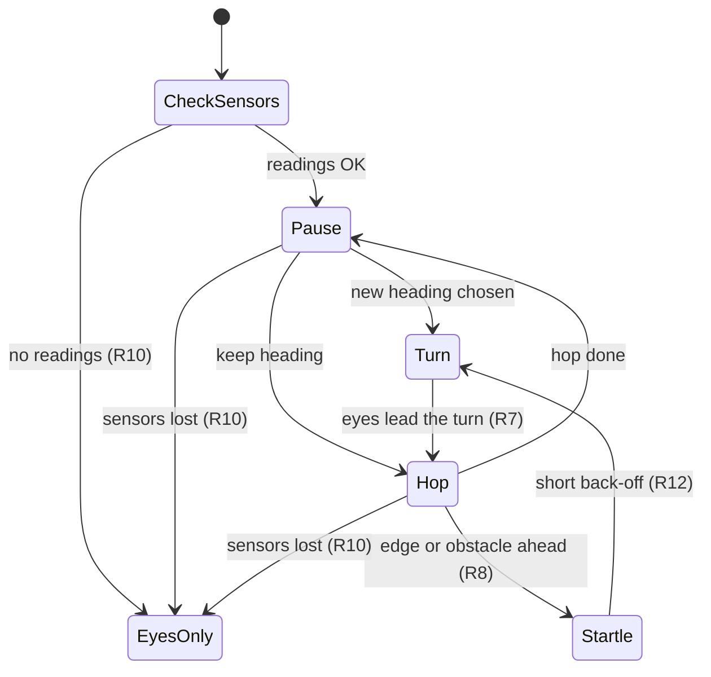
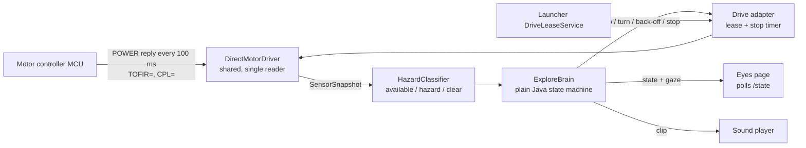

# Explore Mode - Plan

## Goal Capsule

- **Objective:** the owner can start a mode in which the robot slowly wanders the desk on its own, looking curious, without ever going over the edge or ploughing into things. This is the wander, eyes, and startle part of the explore mode; camera-driven curiosity reactions are not active scope.
- **Means:** a new `mode-explore` app on the shared module. It has a plain-Java wander brain (KTD4) and reads sensors from the controller's replies to the keepalive poll the motor driver already sends (KTD1).
- **Product authority:** repo owner, sole decision-maker. The Product Contract below governs; the Planning Contract serves it.
- **Execution profile:** host-side logic is proven with the repo's plain-Java harnesses under `scripts/tests/`. There is no Android unit-test harness. Device work runs as root over Wi-Fi adb (default serial `192.168.19.74:5555`). Steps that need a person's hands, such as holding the robot over an edge, are done by the owner through the U8 QA script.
- **Stop conditions:**
  - If U1's unattended captures (the passive baseline, plus a retry after sending `TOFEN`) show no usable ToF/edge fields in the keepalive replies, stop before U2. Report the captured replies. Do not build driving on a guess. Owner-assisted captures that show values changing may be left pending for U8.
  - If the brain cannot be proven to stop on a hazard in the host harness, do not wire it to the motors.
- **Open blockers:** none. Until thresholds are calibrated on the robot (U8), the mode runs eyes-only per R10 (KTD9).

---

## Product Contract

**Product Contract preservation:** Product Contract unchanged. Problem Frame added; the planning research below confirmed the Dependencies / Assumptions.

### Summary

A new explore mode, launched like the other modes, in which the robot wanders the desk in slow stop-and-go hops, pausing to look around between them. His eyes are the shared eyes every mode uses and they lead every turn. When the edge or an obstacle is close he gives a small startled reaction, backs off a very short distance, and turns away.

### Problem Frame

The robot has a remote-control mode and a voice mode, but nothing it does on its own with its body. Left alone on the desk, it just sits there. None of this project's code reads its edge and front sensors yet, so no mode can safely move without a person steering.

### Key Decisions

- **Wander, eyes, and startle ship first; camera curiosity comes later.** The owner picked this as the smallest version worth having. (session-settled: user-directed — chosen over building the camera reactions in the same plan: the wander loop alone is enough to enjoy watching him)
- **Stop-and-go hops with look-around pauses.** The pauses are what reads as "investigating", and they are where camera curiosity will attach later. Governs R1, R2, R3. (session-settled: user-directed — chosen over replaying the vendor's curved Explore choreography, which makes direction-of-travel gaze hard, and over driving until the controller refuses: less organic motion in exchange for eyes that can always lead the heading)
- **Two safety layers.** The mode watches the sensors itself, and the motor controller's own forward refusal stays as an independent backstop. Governs R8, R9. (session-settled: user-directed — chosen over trusting the controller alone: a desk fall is the one failure that cannot be undone)
- **Reversing is blind, so it is minimal.** Only a front-facing sensor is documented. Governs R4, R12. (session-settled: user-directed — chosen over a normal back-up distance: nothing watches behind him)
- **No sensor path, no driving.** Governs R10. (session-settled: user-approved — chosen over wandering with only the controller's refusal as protection: that is a single untested layer)
- **Startle, then back off.** Hazards stay in character. Governs R11, R12. (session-settled: user-directed — chosen over a silent back-off and over treating obstacles as things to investigate)

### Requirements

**Wandering**

- R1. The robot moves in short forward hops separated by pauses, so his overall pace reads as slow and deliberate. At this robot's fixed forward speed, slowness comes from hop length and pause length, not from motor speed.
- R2. During a pause the robot looks around: his eyes glance about, and he sometimes turns a little in place before choosing the next heading.
- R3. New headings are reached by turning in place, never by reversing into them.
- R4. Reversing happens only as part of a hazard reaction (R12), and only for a short, fixed distance.
- R5. The mode runs until the owner exits it through the launcher, then leaves the robot stopped. It drives only while it holds the drive lease, and it stops moving whenever the lease is lost.

**Eyes**

- R6. The mode uses the same eyes as the other modes, with the same idle glancing during pauses.
- R7. Whenever the robot changes heading, his eyes look toward the direction he is about to move before and during the turn, then return to idle glancing once he is under way.

**Safety**

- R8. The mode reads the edge and front obstacle sensors itself and stops forward motion before the robot reaches an edge or obstacle, without relying on the motor controller to refuse the command.
- R9. The motor controller's own refusal to drive forward into an edge or obstacle is never disabled or worked around. It remains a backstop beneath R8.
- R10. When the mode cannot get live readings from the sensors, whether at start or partway through a run, the robot does not drive. The eyes keep running and visibly show that he is not moving, rather than looking as though he has frozen.

**Reactions**

- R11. On detecting an edge or obstacle ahead, the robot stops immediately, plays a short startled sound, and his eyes flinch.
- R12. After the startle, the robot backs off the short fixed distance of R4, his eyes look toward the new heading, and he turns in place away from the hazard before resuming the wander.
- R13. Reaction sounds are clips bundled with the mode. The vendor's AutoMode files carry motion only, so they are not a sound source.

### Key Flows

- F1. Wander cycle
  - **Trigger:** the mode starts with live sensor readings.
  - **Steps:** pause and look around; choose to keep the heading or turn in place (eyes leading the turn); make one short hop; repeat.
  - **Covers R1, R2, R3, R6, R7.**
- F2. Hazard reaction
  - **Trigger:** the sensors report an edge or obstacle ahead during a hop.
  - **Steps:** stop; startled sound and eye flinch; short fixed back-off; eyes look toward the new heading; turn in place away; resume F1 with a pause.
  - **Covers R4, R8, R11, R12.**
- F3. No sensors
  - **Trigger:** no live sensor readings at start, or readings stop arriving mid-run.
  - **Steps:** stop driving or stay stopped; eyes keep running and show he is not moving; keep checking for readings, and enter F1 if they return.
  - **Covers R10.**

### Acceptance Examples

- AE1. **Covers R8, R11, R12.** While hopping toward the desk edge, the edge sensor fires: he stops before the edge, gives a "whoa" with an eye flinch, backs off briefly, looks to one side, turns in place, and pauses.
- AE2. **Covers R3, R7.** Mid-wander he decides to go left: his eyes move left first, he turns in place to the left, and his eyes return to idle glancing once the next hop starts.
- AE3. **Covers R10.** The mode starts but the sensor readings never arrive: the robot never moves, and the eyes show he is not moving.
- AE4. **Covers R10.** Readings stop partway through a hop: he stops, and does not drive again until readings return.
- AE5. **Covers R5.** The launcher takes back the drive lease while he is hopping: he stops, and the eyes keep running.
- AE6. **Covers R9.** The mode's own check misses an edge and the motor controller refuses the forward command: the robot stays put. The refusal is never overridden to push on.

### Success Criteria

- Watching him for several minutes on the owner's desk, he never goes over an edge and never pushes against an obstacle.
- He reads as a curious little creature poking around, not a vacuum robot on patrol: slow, with frequent pauses and eyes that clearly anticipate each turn.

### Scope Boundaries

- Camera use of any kind, including noticing, identifying, and curiosity, excitement, disappointment, or puzzlement reactions. These are the next area (see How This Work Fits Together).
- Replaying the vendor's AutoMode Explore choreography as motion. This could come back later as variety if the straight hops look too robotic.
- Rear or side hazard sensing. None is documented, which is why reversing is kept minimal (R4).
- Mapping, remembering where he has been, or covering the desk systematically.

<!-- ce-section: work-relationships -->
### How This Work Fits Together

This plan covers the wander, eyes, and startle base of the explore mode. The breakdown below is the current understanding, not a committed roadmap.

- Camera curiosity. **Depends on** this plan's look-around pauses (R2), which are where noticing attaches. Decisions already settled in dialogue, for that later brainstorm to start from:
  - Noticing is triggered during the periodic look-around, when an object is prominent in view, not by continuous watching or only by the front sensor.
  - Identification runs on the robot for now, using a bundled detector that knows common desk objects. It must be able to switch to the relay later when one is configured.
  - "New" means not yet seen during this session. Memory resets each time the mode starts, so a second object of the same kind counts as already seen.
  - The reaction runs curious, then identify, then react: excited for a new object, disappointed for one already seen, puzzled when it cannot be identified. The eyes look at the object throughout.
  - **Still to decide:** which on-device detector to use, and what "prominent in view" means.

### Dependencies / Assumptions

- **Sensor access requires reverse engineering.** No project code reads the edge or front sensor. ServiceExam's telemetry parser extracts `tof`, `ir1`, and `ir2` from the motor controller's status lines. `DirectMotorDriver` does not parse sensor fields, but it already reads one reply after each command write to detect UART errors. Its class comment still calls it write-only. A second, independent reader on that serial link would race those reads and steal bytes ServiceExam needs, so the serial line must keep a single owner. The documented vendor route, AIDL 171 to start ToF and 136 returning event 125, may be dead: in the decompiled source `TofValue` is never assigned. The owner expects to reverse engineer direct hardware access if neither route works.
- **One front-facing edge/obstacle sensor is assumed.** The docs describe a single forward-facing ToF/edge sensor. What `ir1` and `ir2` physically are is unconfirmed, and so is whether the sensor can tell an edge from an obstacle. R11 treats both the same, so the answer does not change behavior.
- **Forward speed is fixed.** Forward and back commands carry only a sign at a fixed speed and must be resent every tick. Turns run at fixed speeds.
- **The controller backstop covers forward motion only.** Its refusal (ack `CPL=2`) applies to forward commands. Nothing protects reversing or turning, which is why R3 and R4 constrain them.
- **The sensor needed a hardware repair before.** It only gave real readings after a bent connector pin was fixed. A regression there shows up as R10 behavior, not as a software bug.

### Outstanding Questions

**Deferred to Planning**

- Which sensor read path works. Candidates are the replies `DirectMotorDriver` already reads (do they carry live `TOFIR` data?), the vendor AIDL route, sharing ServiceExam's telemetry, or direct hardware access found by reverse engineering. This needs a spike before any driving work, and whichever path wins must keep a single reader on the serial line.
- Hop length, pause length, turn angles, and back-off distance. These need tuning on the desk so that pace reads as slow and the back-off stays safely short.
- How far ahead the sensor sees, and so how early R8 must stop the robot, given hop length and stopping distance.
- How the eyes show "not moving" for R10, for example sleepy or worried styling, within the shared eyes' existing restyle mechanism.
- Where the startle sound clips come from.

### Sources / Research

- `docs/hardware/motors-wheels.md`: vendor AutoMode Explore/Edge/Obstacle files (motion only), the `CPL=2` forward refusal, the forward-facing sensor, and the bent-pin repair.
- `docs/hardware/aidl-dispatch.md`: AIDL 136 / 171 ToF codes and 175 auto-mode.
- `docs/hardware/camera-vision.md` and `docs/hardware/person-tracking.md`: no on-device general object classifier; face models only (relevant to the later camera area).
- `shared/src/com/miko3/shared/EyesPage.java`: shared eyes and the wrappable `gazeTo`. `mode-voice` shows a mode wrapping it per state.
- `shared/src/com/miko3/shared/DirectMotorDriver.java`: write-only design and continuous-drive resend requirement.
- `shared/src/com/miko3/shared/DriveLease.java`: drive-lease contract.
- `mode-remote-control/` `SongPlayer`: bundled-asset sound playback precedent.
- `tools/serviceexam_jadx/` `sensor/tofIR.java`: ServiceExam's telemetry parser for `tof`, `ir1`, `ir2`.

---

## Planning Contract

### Key Technical Decisions

- KTD1. **Sensor data comes from the controller's replies to the keepalive poll.** `DirectMotorDriver` already sends a POWER poll every 100 ms and reads the reply in `sendFrame`. That reply is a fixed-width text record padded with `X`, carrying the `TOFIR=` fields and the `CPL` motion-ack field. Today the reply is only checked for `ERROR_UART`. Parsing it keeps a single reader on `/dev/ttyS2` and adds no serial traffic. The parser finds fields by their tokens, never by fixed offsets, because the decompiled sources disagree on offsets (150, 170 and 236). The driver publishes an immutable, timestamped snapshot the mode can read. Rejected: vendor AIDL 136, whose `TofValue` is never assigned; ServiceExam's telemetry, which would put a second owner on the line; any second reader of the device node. Serves R8, R10.
- KTD2. **Find the reply format on the robot before building on it (U1).** Research could not settle three things: the record layout on this firmware, the units of `tof`, `ir1` and `ir2`, and which values mean "edge" versus "obstacle". It also could not tell whether ToF starts enabled when ServiceExam is disabled. A leftover `TOFDS` could leave plausible values that never change. U1 captures raw replies over adb and writes up what it finds. U2's parser tests use the captured records as fixtures.
- KTD3. **Hazard and availability rules are conservative and live in one plain-Java classifier.**
  - **Unavailable:** no fresh snapshot within 300 ms (three missed polls), `tof` stuck at `16383`, an `ERROR_UART` reply, or a dead keepalive. A frozen `tof` also counts, which is the leftover-`TOFDS` symptom. The rule applies to `tof` only, never to `ir1` or `ir2`, and its window length comes from the jitter U1's passive baseline measures. If U1 shows `tof` is legitimately constant while the robot stands still, the frozen rule is dropped. U2 then sends `TOFEN` once on connect, which rules out a leftover `TOFDS`. `docs/hardware/tof-sensor.md` records which case applies.
  - **Hazard:** a calibrated edge or obstacle threshold crossed, or `CPL=2` in the latest reply.
  - **Recovery:** returning from unavailable to available needs several fresh readings in a row, so flapping sensors do not bounce the robot in and out of driving.
  - **CPL=2** gets the same startle as a sensed hazard (R11). The cornered cap (KTD8) stops a stuck `CPL=2` from looping.
  - Serves R8, R9, R10.
- KTD4. **The wander brain is a plain-Java state machine with everything injected.** It has no `android.*` imports and gets the clock, motor, sensor, eyes and sound as injected dependencies, which makes it testable on the host (pattern: `mode-voice/src/com/miko3/mode/voice/UplinkGate.java` with `scripts/tests/fixtures/voice_uplink_harness`). The brain decides on every new snapshot, not on a slower tick, so the time from detection to stop is bounded by the 100 ms poll. Every motion state is sensor-gated: hops, turns, and the small turns during look-around pauses. Each motion starts only after a fresh, clear, available reading. The blind back-off is bounded by time only (R4).
- KTD5. **Motion primitives come from the existing driver, timed by the brain.**
  - **Forward hop:** `driveContinuous(+2,0)` resent every 250 ms for N ticks, then `stop()`. Forward speed is fixed, so R1's slowness comes from N and the pause length.
  - **Turn in place:** `driveTurnSustained` for a timed duration, then `stop()`. There is no angle-bounded turn and no heading feedback.
  - **Back-off:** a fixed, small number of reverse ticks, then `stop()`.
  - All durations are tunable constants that start conservative (hop of 2 to 3 ticks, back-off of 1 tick) and are tuned in U8.
  - Rejected: the vendor's type-25 Explore frames, which wore down under repeated use (per the learnings research).
- KTD6. **A brain-fed stop timer, plus reconnecting the keepalive.** Only the brain's own ticks keep the motors alive. If the brain stops ticking for about 600 ms, the drive adapter sends `stop()`, even while lease renewals and the keepalive thread carry on. When the keepalive thread dies on an IO error, the driver reconnects it rather than leaving `isConnected()` true with no data. While it is dead, readings count as unavailable (R10), and they come back after the reconnect (AE4). Mirrors `DriveController`'s 1200 ms watchdog, tightened because nobody is steering.
- KTD7. **Holding the lease uses an adapted copy of remote-control's `DriveController`.** `mode-remote-control/src/com/miko3/mode/remotecontrol/DriveController.java` is package-private. Its lease retry with backoff was hard-won (see memory note "drive lease no-retry"). The explore mode gets its own lease holder, adapted from that pattern, rather than a refactor that risks remote-control's behavior. Deduplicating the two is deferred (see Deferred to Follow-Up Work). On exit, the brain thread is joined before `stop()` and the lease release.
- KTD8. **Cornered cap.** After 3 hazard reactions within 20 s with no successful hop in between, the brain stops, shows the resting eyes for a cool-down (30 s), then retries with a larger turn. This bounds the total blind reversing (R4) and prevents an endless startle loop. The cool-down is not an R10 unavailability, so the eyes signal "resting" rather than "no sensors".
- KTD9. **No driving without calibration.** The edge and obstacle thresholds are a small on-device calibration file, written by the U8 QA script from live readings (pattern: `VoiceSettings`). With no calibration present, the mode treats the sensors as unavailable (R10). A fresh install can therefore never drive on thresholds guessed from decompiled code. U1's findings seed the QA script's suggested values.
- KTD10. **The eyes lead the turn through state publishing plus a delay.** The eyes page polls the mode's state over local HTTP (pattern: `mode-voice/src/com/miko3/mode/voice/VoiceState.java`, which sets a CSS class on `#rig` and wraps `gazeTo`). The brain publishes a "look" state with the new heading's direction, then waits about 500 ms before turning, which covers one poll interval plus the gaze animation (R7). The page polls quickly (about 150 ms) while the mode is active. The shared `EyesPage` strings stay untouched: `scripts/tests/test_eyes_page_golden.py` pins them byte for byte, and all customization goes in the mode's own after-eyes script and CSS.
- KTD11. **Startle sounds are synthesized clips committed as assets.** A Python generator (`scripts/gen-explore-sounds.py`) renders a few short chirp WAVs into `mode-explore/assets/`. A one-shot player plays them (pattern: `mode-remote-control` `SongPlayer`). This avoids licensing questions, and the sounds can be regenerated if their character needs tuning. Serves R13.
- KTD12. **Register the mode like voice was registered.** Add `MODE_EXPLORE` to `LauncherProtocol` and an entry to `ModeRegistry.ALL`, on the next free port pair after voice's. Update `scripts/tests/fixtures/mode_registry_harness`, which pins the mode count. The launcher APK is rebuilt and reinstalled.

### High-Level Technical Design

Brain states, which extend the Product Contract's Key Flows diagram (directional): `CheckSensors`, `Pause`, `Look` (eyes lead, ~500 ms), `Turn`, `Hop`, `Startle`, `BackOff`, `Cornered` (cool-down), `EyesOnly`. Every motion state goes to `EyesOnly` when readings become unavailable. `Hop` and `Turn` go to `Startle` on a hazard. `Pause` enters a motion state only after a fresh, clear reading.

### Assumptions

- `readUART` returns one whole POWER record per read. U1 verifies this. If it does not, U2 reassembles records by the `POWER=` prefix and the `X` padding.
- The POWER poll's 100 ms cadence is fast enough for the ToF fields, so the `VEL1` and `MTSTP` replies are not needed for them. U1 records whether those replies carry sensor data, as a possible latency improvement. `CPL=2` is a forward-command ack, so it may appear only in `VEL1` replies. If U1 finds that, U2 also parses `CPL` from `VEL1` replies. That still keeps a single reader, because `sendFrame` already reads them.
- The cornered-cap numbers (3 reactions, 20 s, 30 s), the stop-timer window (about 600 ms), and the frozen-`tof` window (from U1's jitter) are initial values, tuned in U8.
- AE5 ("the launcher takes back the drive lease") happens on the robot only through lease TTL expiry or binder death. The launcher has no revoke call. It is proven on the host, and on the device by forcing TTL expiry through a debug hook.

### Sequencing

U1 comes first and gates everything that trusts sensor data. U2 depends on U1. U3 can be written in parallel with U2 against a fake sensor feed. U4 through U7 build the app around U2 and U3. U8 comes last and is where the owner calibrates, tunes, and confirms the Acceptance Examples on the desk.

---

## Implementation Units

### U1. Capture and document the controller's sensor replies

**Goal:** establish from real captures what the POWER reply contains, so the parser and thresholds rest on evidence (KTD2).

**Requirements:** R8, R10.

**Dependencies:** none.

**Files:**
- `shared/src/com/miko3/shared/DirectMotorDriver.java` (debug-only raw-reply logging, off by default)
- `scripts/qa-explore-sensors.py` (new)
- `docs/hardware/tof-sensor.md` (new)
- `scripts/tests/fixtures/explore_sensor_records/` (new: captured sample records)
- `scripts/tests/test_qa_explore_sensors.py` (new)

**Approach:**
1. Add a system-property or file-flag switch that logs each raw `sendFrame` reply (POWER, VEL1, MTSTP) to logcat under a distinct tag.
2. Write `scripts/qa-explore-sensors.py`. It connects over adb, enables the flag, and drives the robot through a capture sequence. `--non-interactive` records a passive baseline. The interactive steps prompt the owner to cover the sensor and hold the robot over an edge.
3. Check whether the ToF values change. If they don't, send `TOFEN` once and capture again. Measure the passive baseline's `tof` jitter, which sets KTD3's frozen-value window.
4. With the owner present, send one forward frame with the sensor covered and record which reply carries `CPL=2`: POWER, `VEL1`, or `MTSTP`.
5. Save representative records as fixtures. Write `docs/hardware/tof-sensor.md`: record layout, field meanings and units, the edge versus obstacle signature, the `16383` fault value, whether `TOFEN` is needed, and the poll-to-reply latency.
6. If a person is available, measure the stopping distance: time a hop toward a hand and note how far the robot travels after `stop()`.

**Execution note:** this is a device spike. The passive baseline and `TOFEN` checks can run unattended over adb. The edge and cover captures need the owner, so if no one is available, record them as pending in the doc and in U8, and continue. The Goal Capsule's stop condition applies only when even the passive captures show no usable data.

**Patterns to follow:** `scripts/qa-voice-mode.py` (adb serial default, `--non-interactive`, `--only` steps), `scripts/bypass-drive-test.py`.

**Test scenarios:**
- Log extraction from sample logcat text picks out only lines with the debug tag and keeps each record whole.
- The capture summary flags "values never changed" when every `tof` value in the window is identical.

**Verification:** `docs/hardware/tof-sensor.md` exists with a captured record layout and at least a passive baseline. The fixture records are committed.

### U2. Parse sensor replies into snapshots, and reconnect the keepalive

**Goal:** the shared driver publishes a timestamped sensor snapshot from every POWER reply and recovers from keepalive death (KTD1, KTD6).

**Requirements:** R8, R9, R10.

**Dependencies:** U1.

**Files:**
- `shared/src/com/miko3/shared/DirectMotorDriver.java`
- `shared/src/com/miko3/shared/SensorReply.java` (new: token-based record parser, plain Java)
- `shared/src/com/miko3/shared/SensorSnapshot.java` (new: immutable value with timestamp, `tof`, `ir1`, `ir2`, `cpl`, and a fault flag)
- `scripts/tests/fixtures/sensor_reply_harness/src/...` (new)
- `scripts/tests/test_sensor_reply.py` (new)

**Approach:**
1. `SensorReply` finds `TOFIR=` and `CPL=` by token. It tolerates the `X` padding, missing fields, and garbage, and never throws on malformed input. A malformed record yields "no snapshot", not zeros.
2. `sendFrame` passes each POWER reply to the parser and stores the latest snapshot in a volatile field, with an optional listener. `ERROR_UART` handling is unchanged.
3. The keepalive thread restarts itself after an IO error (reconnect with backoff), and while it is down the driver reports itself as not delivering data.
4. Replace the stale "WRITE-ONLY BY DESIGN" class comment with the single-reader rule.

**Patterns to follow:** the existing `ERROR_UART` check in `sendFrame`. The host harness style in `scripts/tests/fixtures/voice_uplink_harness` with `scripts/tests/jvm_harness.py`.

**Test scenarios:**
- A record captured in U1 parses to the expected `tof`, `ir1`, `ir2` and `cpl` values.
- The decompiled sample string, where TOFIR sits at a different offset, still parses by token.
- A record with no `TOFIR=` field yields no snapshot.
- A truncated record, cut off mid-field, yields no snapshot rather than a partial value.
- `tof=16383` parses and is flagged as a fault value.
- `CPL=2` is exposed. A missing `CPL` field is reported as unknown, not as 0.
- A captured `VEL1` refusal reply yields its `CPL` value, if U1 found `CPL=2` there.
- The `ERROR_UART` reply is neither parsed as sensor data nor affected by the change.

**Verification:** the parser tests pass on the host. On the robot, the U1 capture script shows parsed snapshots updating about 10 times a second.

### U3. Wander brain and hazard classifier

**Goal:** all of the mode's behavior as a host-testable state machine (KTD3, KTD4, KTD5, KTD8).

**Requirements:** R1–R5, R7, R8, R10–R12. F1, F2, F3. AE1–AE6.

**Dependencies:** none for the code, which can use fake snapshots. U2 is needed for real data.

**Files:**
- `mode-explore/src/com/miko3/mode/explore/HazardClassifier.java` (new)
- `mode-explore/src/com/miko3/mode/explore/ExploreBrain.java` (new)
- `mode-explore/src/com/miko3/mode/explore/ExploreTuning.java` (new: hop, pause, turn, back-off and cap constants, plus calibration thresholds)
- `scripts/tests/fixtures/explore_brain_harness/src/...` (new)
- `scripts/tests/test_explore_brain.py` (new)

**Approach:**
1. Build the classifier as KTD3 describes: staleness, fault values, frozen values, thresholds, `CPL=2`, and recovery hysteresis. With no calibration it always reports unavailable (KTD9).
2. The brain reacts to snapshot and tick events. It drives an injected motor interface (hop tick, turn, back, stop), eyes interface (state, gaze direction), and sound interface (clip). The turn direction for a new heading is random but steers away from the last hazard.
3. Motion only starts on a fresh, clear reading. Hazards abort hops and turns immediately. Back-off is time-bounded. The cornered cap follows KTD8.

**Execution note:** write this test-first. The brain is the safety-critical core, and every AE is expressible as a scripted snapshot sequence.

**Patterns to follow:** `mode-voice/src/com/miko3/mode/voice/UplinkGate.java` (plain Java with injected clock), `scripts/tests/test_voice_uplink_gate.py`.

**Test scenarios:**
- Covers AE1. Clear readings, then an edge snapshot mid-hop: the brain calls stop within the same event, plays the startle clip, sets flinch eyes, backs off exactly the configured ticks, publishes look toward the new heading, turns, then pauses.
- Covers AE2. A heading change publishes the look state with the direction before any turn command, and the turn starts no sooner than the lead delay.
- Covers AE3. No snapshots from the start: the brain never issues a motion command and publishes the eyes-only state.
- Covers AE4. Snapshots stop mid-hop: the brain stops within 300 ms of mock time. It resumes at Pause only after the recovery streak.
- Covers AE5. Lease loss mid-back-off: the brain stops and publishes eyes-only. When the lease comes back, it restarts at Pause with a fresh check, never mid-motion.
- Covers AE6. `CPL=2` with the mode's own thresholds not crossed: treated as a hazard, with no retry of forward motion.
- A hazard during a turn stops the turn, which is the gap the spec-flow analysis found.
- A hazard present at the moment a hop would start: no hop. The brain turns away instead.
- Three hazards within 20 s with no successful hop enter the cornered cool-down, and no motion happens during it.
- Flapping readings (available, stale, available) do not re-enter driving until the recovery streak completes.
- No calibration present: classified unavailable even with perfect readings.
- A `tof` value frozen across the configured window is classified unavailable. Constant `ir1` and `ir2` values are not.

**Verification:** every scenario passes in `scripts/tests/test_explore_brain.py`.

### U4. Mode app scaffold and launcher registration

**Goal:** an installable `mode-explore` app the launcher can start and exit, showing the shared eyes.

**Requirements:** R5, R6.

**Dependencies:** none for the code. U3 is needed for behavior.

**Files:**
- `mode-explore/AndroidManifest.xml`
- `mode-explore/src/com/miko3/mode/explore/ModeApp.java`
- `mode-explore/src/com/miko3/mode/explore/MainActivity.java`
- `mode-explore/src/com/miko3/mode/explore/ExploreState.java` (new: eyes page and `/state` route)
- `mode-explore/res/xml/network_security_config.xml`
- `scripts/build-mode-explore.py`
- `scripts/install-mode-explore.py`
- `shared/src/com/miko3/shared/LauncherProtocol.java`
- `shared/src/com/miko3/shared/ModeRegistry.java`
- `scripts/tests/fixtures/mode_registry_harness/src/...`
- `scripts/tests/test_mode_registry.py`
- `scripts/tests/test_build_mode_explore.py` (new)
- `scripts/tests/test_install_mode_explore.py` (new)

**Approach:** mirror `mode-voice`: `ModeApp` with a `/presence` route, a singleTop `MainActivity`, `EXTRA_FORCE_EXIT` handling, and `exitMode()` teardown. The build script bundles `libmiko_drivers.so` and fails loudly if it is missing, which is needed for `SensorModule`. Register the mode per KTD12.

**Patterns to follow:** `mode-voice/` wholesale, `scripts/build-mode-voice.py`, `scripts/install-mode-voice.py`, `scripts/tests/test_build_mode_voice.py`.

**Test scenarios:**
- The registry lists three modes, and the explore entry has the expected package, activity and ports.
- The build script fails with a clear error when `libmiko_drivers.so` is absent.
- The install script's default serial and package name are correct.

**Verification:** the APK builds. The launcher shows and starts Explore, and exiting returns to the launcher with the robot stopped.

### U5. Drive adapter: lease, stop timer, and motion

**Goal:** the brain's motion commands reach the motors only under the lease, with the stop timer and a clean exit (KTD5, KTD6, KTD7).

**Requirements:** R1, R3, R4, R5, R9.

**Dependencies:** U2, U3, U4.

**Files:**
- `mode-explore/src/com/miko3/mode/explore/ExploreDrive.java` (new)
- `mode-explore/src/com/miko3/mode/explore/ExploreLoop.java` (new: brain thread wiring snapshots and ticks)
- `mode-explore/src/com/miko3/mode/explore/MainActivity.java`
- `scripts/tests/fixtures/explore_brain_harness/src/...` (stop-timer scenarios)
- `scripts/tests/test_explore_brain.py`

**Approach:**
1. Adapt `DriveController`'s bind, acquire, renew, retry-with-backoff and release logic into `ExploreDrive`, and cite the source in a comment.
2. Expose hop-tick, turn, back and stop.
3. The stop timer (KTD6) lives in plain Java, so it can be tested with the brain harness.
4. On exit, stop the brain loop, join it, send `stop()`, release the lease, then disconnect.
5. Add a debug hook to force lease-TTL expiry (AE5) and one to age snapshots (AE3, AE4). Both are off by default.

**Patterns to follow:** `mode-remote-control/src/com/miko3/mode/remotecontrol/DriveController.java`, `shared/src/com/miko3/shared/DriveLease.java`.

**Test scenarios:**
- The stop timer: no brain tick for about 600 ms of mock time produces exactly one stop.
- A brain that keeps ticking never triggers the stop timer.
- Motion commands issued without the lease are dropped, and the brain is told the lease is lost.
- The exit sequence orders its calls as: stop brain, `stop()`, lease release, disconnect.

**Verification:** on the robot the mode acquires the lease and hops. Killing the brain thread through a debug hook stops the motors within about a second.

### U6. Explore eyes

**Goal:** the shared eyes with idle glancing, lead-the-turn gaze, flinch, and the "not moving" and "resting" looks (KTD10).

**Requirements:** R6, R7, R10, R11.

**Dependencies:** U4.

**Files:**
- `mode-explore/src/com/miko3/mode/explore/ExploreState.java`
- `scripts/tests/test_explore_state_page.py` (new)

**Approach:**
1. Add an after-eyes script that polls `/state` at about 150 ms and sets a `#rig` class per state: `idle`, `look`, `flinch`, `eyes-only`, `resting`.
2. In `look`, the wrapped `gazeTo` holds the gaze toward the published direction.
3. `eyes-only` uses a distinct, visibly not-moving look, such as half-closed lids, and does not freeze.
4. Leave the shared `EyesPage` untouched.

**Patterns to follow:** `mode-voice/src/com/miko3/mode/voice/VoiceState.java`.

**Test scenarios:**
- The rendered page includes the unchanged shared eyes markup, and `scripts/tests/test_eyes_page_golden.py` still passes.
- The `/state` JSON for each brain state maps to the expected `#rig` class and gaze fields.

**Verification:** on the robot, a turn visibly starts with the eyes looking toward it, and unplugging the sensor data (debug hook) shows the not-moving look.

### U7. Startle sounds

**Goal:** a short startle chirp and a playback path (KTD11).

**Requirements:** R11, R13.

**Dependencies:** U4.

**Files:**
- `scripts/gen-explore-sounds.py` (new)
- `mode-explore/assets/startle-*.wav` (new, generated)
- `mode-explore/src/com/miko3/mode/explore/ClipPlayer.java` (new)
- `scripts/tests/test_gen_explore_sounds.py` (new)

**Approach:** generate 2 or 3 short, rising-then-falling "whoa" chirp variants under half a second each, with deterministic output. `ClipPlayer` plays one at random as a one-shot and releases it on completion. The build stages the assets uncompressed so `openFd` works.

**Patterns to follow:** `mode-remote-control` `SongPlayer`, and `stage_assets()` in `scripts/build_common.py`.

**Test scenarios:**
- The generator writes valid WAV files with the expected sample rate, a length under 0.5 s, and a non-silent peak.
- Two runs of the generator produce identical files.

**Verification:** a startle on the robot is audible and doesn't delay the stop.

### U8. Calibration and on-desk QA

**Goal:** the owner can calibrate thresholds, tune pacing, and confirm the Acceptance Examples on the real desk (KTD9).

**Requirements:** R1, R2, R4, R8–R12. AE1–AE6. Success Criteria.

**Dependencies:** U1–U7.

**Files:**
- `mode-explore/src/com/miko3/mode/explore/ExploreCalibration.java` (new: on-device calibration file read and write)
- `scripts/qa-explore-mode.py` (new)
- `scripts/tests/test_qa_explore_mode.py` (new)
- `docs/hardware/tof-sensor.md` (calibrated values recorded)

**Approach:**
1. The QA script streams live snapshots and walks the owner through clear, hand-in-front and over-the-edge readings. It suggests thresholds with a safety margin, taken from U1's findings, and writes the calibration file over adb.
2. It then runs guided checks for each AE, using the debug hooks where a condition cannot be staged by hand (AE3, AE4, AE5).
3. It reports pass or fail per step, following `scripts/qa-voice-mode.py`.
4. Pacing constants are tuned by hand during the session and committed back to `ExploreTuning`.

**Execution note:** this unit needs the owner at the desk. When no one is available, build and unit-test the script, and leave the calibration and AE run as the owner's final step. The DONE report must say so.

**Test scenarios:**
- Threshold suggestion from sample clear, hand and edge captures puts the threshold between the clusters, with the margin on the safe side.
- The calibration file round-trips (write, then read), and a corrupt file reads as "not calibrated".
- `--only` selects the named AE steps.

**Verification:** the calibration file is present on the robot. The QA report shows AE1–AE6 passing, and the owner watches several minutes of wandering with no edge falls (Success Criteria).

---

## Verification Contract

- **Host tests:** `python3 -m unittest discover -s scripts/tests -p 'test_*.py'`. All tests must pass, including the new `test_sensor_reply.py`, `test_explore_brain.py`, `test_explore_state_page.py`, `test_gen_explore_sounds.py`, the `test_*_explore_*` build, install and QA tests, and the updated `test_mode_registry.py`. `test_eyes_page_golden.py` must pass unchanged.
- **Builds:** `scripts/build-mode-explore.py` and `scripts/build-custom-launcher.py` succeed, and `scripts/build-mode-remote-control.py` and `scripts/build-mode-voice.py` still succeed after the shared changes.
- **Device (adb over Wi-Fi):**
  - U1 capture recorded.
  - Launcher and explore APKs installed.
  - Explore starts from the launcher, parsed snapshots update, and exit leaves the motors stopped.
  - Remote-control mode still drives forward after the `DirectMotorDriver` change (regression check for the forward-drive and UART fixes in memory).
- **Owner QA:** `scripts/qa-explore-mode.py` passes AE1–AE6 after calibration.

## Definition of Done

- U1–U7 are implemented, their host tests pass, and all builds succeed.
- The shared driver change does not regress remote-control driving, verified on the robot.
- With no calibration file, the installed mode runs eyes-only and never drives.
- U8's script is built and tested. The calibration and AE run is either done or explicitly handed to the owner in the final report.
- Code from abandoned approaches, such as a parser tried and dropped, is removed. The debug hooks stay but are off by default.
- `docs/hardware/tof-sensor.md` documents the reply format and calibration.

### Deferred to Follow-Up Work

- Deduplicating `ExploreDrive` and remote-control's `DriveController` into a shared lease holder.
- Using the `VEL1` and `MTSTP` replies for lower hazard latency, if U1 shows they carry sensor data.
- Camera curiosity (see How This Work Fits Together).
