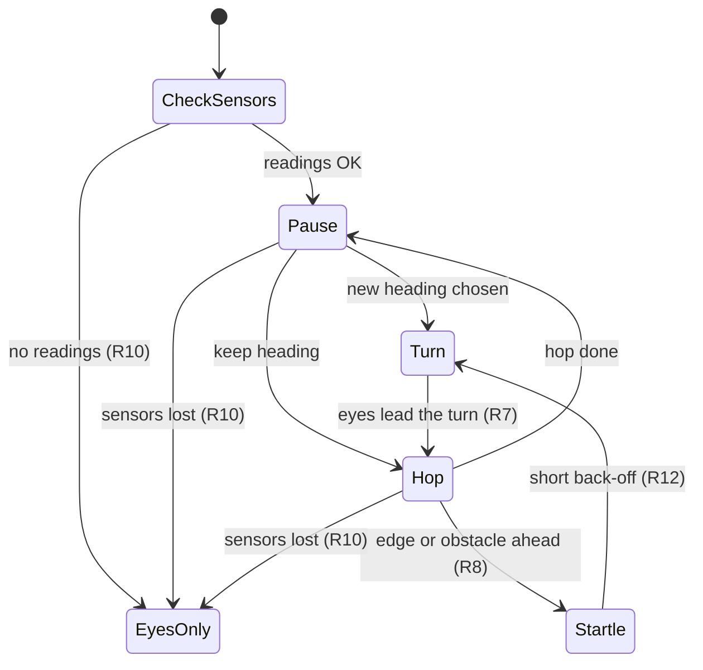

# Explore Mode - Plan

## Goal Capsule

- **Objective:** the owner can start a mode in which the robot slowly wanders the desk on its own, looking curious, without ever going over the edge or ploughing into things. This is the wander, eyes, and startle part of the explore mode; camera-driven curiosity reactions are not active scope.
- **Product authority:** repo owner, sole decision-maker.
- **Open blockers:** none. Driving depends on a sensor read path that does not exist yet (R8, Dependencies / Assumptions); without it the mode ships as eyes-only per R10.

---

## Product Contract

### Summary

A new explore mode, launched like the other modes, in which the robot wanders the desk in slow stop-and-go hops, pausing to look around between them. His eyes are the shared eyes every mode uses and they lead every turn. When the edge or an obstacle is close he gives a small startled reaction, backs off a very short distance, and turns away.

### Key Decisions

- **Wander, eyes, and startle ship first; camera curiosity comes later.** The owner picked this as the smallest version worth having. (session-settled: user-directed — chosen over building the camera reactions in the same plan: the wander loop alone is enough to enjoy watching him)
- **Stop-and-go hops with look-around pauses.** The pauses are what reads as "investigating", and they are where camera curiosity will attach later. Governs R1, R2, R3. (session-settled: user-directed — chosen over replaying the vendor's curved Explore choreography, which makes direction-of-travel gaze hard, and over driving until the controller refuses: less organic motion in exchange for eyes that can always lead the heading)
- **Two safety layers.** The mode watches the sensors itself, and the motor controller's own forward refusal stays as an independent backstop. Governs R8, R9. (session-settled: user-directed — chosen over trusting the controller alone: a desk fall is the one failure that cannot be undone)
- **Reversing is blind, so it is minimal.** Only a front-facing sensor is documented. Governs R4, R12. (session-settled: user-directed — chosen over a normal back-up distance: nothing watches behind him)
- **No sensor path, no driving.** Governs R10. (session-settled: user-approved — chosen over wandering with only the controller's refusal as protection: that is a single untested layer)
- **Startle, then back off.** Hazards stay in character. Governs R11, R12. (session-settled: user-directed — chosen over a silent back-off and over treating obstacles as things to investigate)

### Requirements

**Wandering**

- R1. The robot moves in short forward hops separated by pauses, so his overall pace reads as slow and deliberate. At this robot's fixed forward speed, slowness comes from hop length and pause length, not from motor speed.
- R2. During a pause the robot looks around: his eyes glance about, and he sometimes turns a little in place before choosing the next heading.
- R3. New headings are reached by turning in place, never by reversing into them.
- R4. Reversing happens only as part of a hazard reaction (R12), and only for a short, fixed distance.
- R5. The mode runs until the owner exits it through the launcher, then leaves the robot stopped. It drives only while it holds the drive lease, and it stops moving whenever the lease is lost.

**Eyes**

- R6. The mode uses the same eyes as the other modes, with the same idle glancing during pauses.
- R7. Whenever the robot changes heading, his eyes look toward the direction he is about to move before and during the turn, then return to idle glancing once he is under way.

**Safety**

- R8. The mode reads the edge and front obstacle sensors itself and stops forward motion before the robot reaches an edge or obstacle, without relying on the motor controller to refuse the command.
- R9. The motor controller's own refusal to drive forward into an edge or obstacle is never disabled or worked around. It remains a backstop beneath R8.
- R10. When the mode cannot get live readings from the sensors, whether at start or partway through a run, the robot does not drive. The eyes keep running and visibly show that he is not moving, rather than looking as though he has frozen.

**Reactions**

- R11. On detecting an edge or obstacle ahead, the robot stops immediately, plays a short startled sound, and his eyes flinch.
- R12. After the startle, the robot backs off the short fixed distance of R4, his eyes look toward the new heading, and he turns in place away from the hazard before resuming the wander.
- R13. Reaction sounds are clips bundled with the mode. The vendor's AutoMode files carry motion only, so they are not a sound source.

### Key Flows

- F1. Wander cycle
  - **Trigger:** the mode starts with live sensor readings.
  - **Steps:** pause and look around; choose to keep the heading or turn in place (eyes leading the turn); make one short hop; repeat.
  - **Covers R1, R2, R3, R6, R7.**
- F2. Hazard reaction
  - **Trigger:** the sensors report an edge or obstacle ahead during a hop.
  - **Steps:** stop; startled sound and eye flinch; short fixed back-off; eyes look toward the new heading; turn in place away; resume F1 with a pause.
  - **Covers R4, R8, R11, R12.**
- F3. No sensors
  - **Trigger:** no live sensor readings at start, or readings stop arriving mid-run.
  - **Steps:** stop driving or stay stopped; eyes keep running and show he is not moving; keep checking for readings, and enter F1 if they return.
  - **Covers R10.**

### Acceptance Examples

- AE1. **Covers R8, R11, R12.** While hopping toward the desk edge, the edge sensor fires: he stops before the edge, gives a "whoa" with an eye flinch, backs off briefly, looks to one side, turns in place, and pauses.
- AE2. **Covers R3, R7.** Mid-wander he decides to go left: his eyes move left first, he turns in place to the left, and his eyes return to idle glancing once the next hop starts.
- AE3. **Covers R10.** The mode starts but the sensor readings never arrive: the robot never moves, and the eyes show he is not moving.
- AE4. **Covers R10.** Readings stop partway through a hop: he stops, and does not drive again until readings return.
- AE5. **Covers R5.** The launcher takes back the drive lease while he is hopping: he stops, and the eyes keep running.
- AE6. **Covers R9.** The mode's own check misses an edge and the motor controller refuses the forward command: the robot stays put. The refusal is never overridden to push on.

### Success Criteria

- Watching him for several minutes on the owner's desk, he never goes over an edge and never pushes against an obstacle.
- He reads as a curious little creature poking around, not a vacuum robot on patrol: slow, with frequent pauses and eyes that clearly anticipate each turn.

### Scope Boundaries

- Camera use of any kind, including noticing, identifying, and curiosity, excitement, disappointment, or puzzlement reactions. These are the next area (see How This Work Fits Together).
- Replaying the vendor's AutoMode Explore choreography as motion. This could come back later as variety if the straight hops look too robotic.
- Rear or side hazard sensing. None is documented, which is why reversing is kept minimal (R4).
- Mapping, remembering where he has been, or covering the desk systematically.

<!-- ce-section: work-relationships -->
### How This Work Fits Together

This plan covers the wander, eyes, and startle base of the explore mode. The breakdown below is the current understanding, not a committed roadmap.

- Camera curiosity. **Depends on** this plan's look-around pauses (R2), which are where noticing attaches. Decisions already settled in dialogue, for that later brainstorm to start from:
  - Noticing is triggered during the periodic look-around, when an object is prominent in view, not by continuous watching or only by the front sensor.
  - Identification runs on the robot for now, using a bundled detector that knows common desk objects. It must be able to switch to the relay later when one is configured.
  - "New" means not yet seen during this session. Memory resets each time the mode starts, so a second object of the same kind counts as already seen.
  - The reaction runs curious, then identify, then react: excited for a new object, disappointed for one already seen, puzzled when it cannot be identified. The eyes look at the object throughout.
  - **Still to decide:** which on-device detector to use, and what "prominent in view" means.

### Dependencies / Assumptions

- **Sensor access requires reverse engineering.** No project code reads the edge or front sensor. ServiceExam's telemetry parser extracts `tof`, `ir1`, and `ir2` from the motor controller's status lines. `DirectMotorDriver` does not parse sensor fields, but it already reads one reply after each command write to detect UART errors. Its class comment still calls it write-only. A second, independent reader on that serial link would race those reads and steal bytes ServiceExam needs, so the serial line must keep a single owner. The documented vendor route, AIDL 171 to start ToF and 136 returning event 125, may be dead: in the decompiled source `TofValue` is never assigned. The owner expects to reverse engineer direct hardware access if neither route works.
- **One front-facing edge/obstacle sensor is assumed.** The docs describe a single forward-facing ToF/edge sensor. What `ir1` and `ir2` physically are is unconfirmed, and so is whether the sensor can tell an edge from an obstacle. R11 treats both the same, so the answer does not change behavior.
- **Forward speed is fixed.** Forward and back commands carry only a sign at a fixed speed and must be resent every tick. Turns run at fixed speeds.
- **The controller backstop covers forward motion only.** Its refusal (ack `CPL=2`) applies to forward commands. Nothing protects reversing or turning, which is why R3 and R4 constrain them.
- **The sensor needed a hardware repair before.** It only gave real readings after a bent connector pin was fixed. A regression there shows up as R10 behavior, not as a software bug.

### Outstanding Questions

**Deferred to Planning**

- Which sensor read path works. Candidates are the replies `DirectMotorDriver` already reads (do they carry live `TOFIR` data?), the vendor AIDL route, sharing ServiceExam's telemetry, or direct hardware access found by reverse engineering. This needs a spike before any driving work, and whichever path wins must keep a single reader on the serial line.
- Hop length, pause length, turn angles, and back-off distance. These need tuning on the desk so that pace reads as slow and the back-off stays safely short.
- How far ahead the sensor sees, and so how early R8 must stop the robot, given hop length and stopping distance.
- How the eyes show "not moving" for R10, for example sleepy or worried styling, within the shared eyes' existing restyle mechanism.
- Where the startle sound clips come from.

### Sources / Research

- `docs/hardware/motors-wheels.md`: vendor AutoMode Explore/Edge/Obstacle files (motion only), the `CPL=2` forward refusal, the forward-facing sensor, and the bent-pin repair.
- `docs/hardware/aidl-dispatch.md`: AIDL 136 / 171 ToF codes and 175 auto-mode.
- `docs/hardware/camera-vision.md` and `docs/hardware/person-tracking.md`: no on-device general object classifier; face models only (relevant to the later camera area).
- `shared/src/com/miko3/shared/EyesPage.java`: shared eyes and the wrappable `gazeTo`. `mode-voice` shows a mode wrapping it per state.
- `shared/src/com/miko3/shared/DirectMotorDriver.java`: write-only design and continuous-drive resend requirement.
- `shared/src/com/miko3/shared/DriveLease.java`: drive-lease contract.
- `mode-remote-control/` `SongPlayer`: bundled-asset sound playback precedent.
- `tools/serviceexam_jadx/` `sensor/tofIR.java`: ServiceExam's telemetry parser for `tof`, `ir1`, `ir2`.
