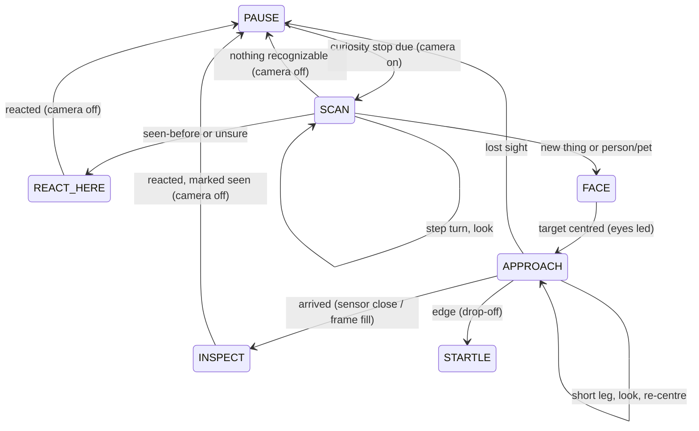

# Explore Camera Curiosity - Plan

## Goal Capsule

- **Objective:** while wandering, the robot notices things with its camera, rolls up to investigate them, and reacts like a curious little creature: excited and naming new things, disappointed by things it has already seen, and delighted to try to talk to people and pets. This is the camera-curiosity part of explore mode; the wander, eyes, and startle base (`docs/plans/2026-09-22-1438-feat-explore-mode-plan.md`) already shipped.
- **Means:** an open-vocabulary on-device object detector (YOLOE with explore's own few-hundred-name vocabulary, on ONNX Runtime) behind a recognizer boundary (KTD1, KTD2), a camera opened only for curiosity stops and approaches (KTD3), new curiosity states in the plain-Java brain (KTD5), and pre-rendered WALL-E-style voice clips (KTD7).
- **Product authority:** repo owner, sole decision-maker. The Product Contract governs; the Planning Contract serves it.
- **Execution profile:** brain, classifier and recognition post-processing are proven with the repo's host-JVM harnesses under `scripts/tests/`; camera, detector and sound are verified on the robot over Wi-Fi adb (default `192.168.19.74:5555`). Aiming and sound tuning need the owner watching.
- **Stop conditions:**
  - If U1 shows the detector cannot load in explore's process (with its full native bundle, KTD2), or takes longer than about 2 s per frame on the robot, stop after U1, before U2's on-device recognizer and U3, and report; the plain-Java boundary of KTD1 may still be written, and it is where an alternative recognizer would go.
  - If U1's floor test frame shows the camera cannot see floor-level objects at all, stop and report before building approach behavior.
- **Open blockers:** none. Desk use stays off until the separate blind-turn edge fix lands (see How This Work Fits Together); the floor is the working surface until then.

---

## Product Contract

**Product Contract preservation:** no scope change: F1's step wording aligned with R4 (pick the most prominent thing, which is new), per document review.

### Summary

Every so often, explore mode stops and scans with short turns in place. When the camera spots something, he turns to face it with his eyes leading, rolls up as close as he can, and inspects it. New objects get an "ooh…", a little self-talk babble, and the object's name in a WALL-E-style voice ("ooh, wow, a plant"). Things he has already inspected this session get a disappointed "oh, that again" from where he is. People and pets always delight him: he rolls up and tries to talk to them.

### Problem Frame

Explore mode wanders and avoids edges, but nothing he does is about what is around him. Watching him, he reads as a cautious roomba with eyes, not the curious investigator the mode was meant to be. The camera is the missing sense: with it he can find things worth going to and have something to react to.

### Key Decisions

- **Noticing happens at occasional curiosity stops, not continuously.** Governs R1, R2. (session-settled: user-directed — chosen over an always-on camera while wandering: the camera driver costs most of a CPU core while open, and the stop-and-scan reads as investigating)
- **Recognition runs on the robot, built so it can switch to the relay later.** Governs R3, R17. (session-settled: user-directed — chosen over relay-only recognition: it must work without the relay; the relay's model server does not accept images yet)
- **"New" means not yet inspected this session.** Governs R9, R10. (session-settled: user-directed — chosen over memory across sessions or memory that decays)
- **He explores both the floor and the desk, so he recognizes common things from either.** Governs R3. (session-settled: user-directed — chosen over a floor-only or desk-only object set)
- **People and pets are special: always delighted.** Governs R11, R12. (session-settled: user-directed — chosen over treating them like objects, or ignoring them)
- **He drives up to what he notices and inspects it, talking to himself about objects and to people and pets.** Governs R5, R6, R8, R11. (session-settled: user-directed — chosen over reacting in place and carrying on, or staring from where he is)
- **Approach new things and people/pets; seen-before things get a reaction from where he is.** Governs R4, R10. (session-settled: user-directed — chosen over approaching everything, or only new things)
- **Arrival is decided by the front sensor or by the camera, whichever first.** Governs R6. (session-settled: user-directed — the owner added the camera "fills the frame" rule so tall things the downward sensor misses still end the approach)
- **A greeted person or pet is ignored for a while afterwards.** Governs R12. (session-settled: user-approved — proposed so he doesn't shuttle back and forth to someone who stays in view)

### Requirements

**Noticing**

- R1. Every so often during a wander he makes a curiosity stop: he stops, and scans by turning in place in short steps, looking with the camera at each step, with his eyes glancing around as if looking.
- R2. The camera is on only during a curiosity stop and an approach; it is off while he simply wanders.
- R3. At each look he recognizes common things in view from a fixed vocabulary covering both floor and desk objects, including people and pets. Things outside that vocabulary are not noticed.
- R4. If something recognizable is in view, he picks the most prominent one. He investigates it by approach when it is new this session or is a person or pet; otherwise he reacts from where he is (R10). If nothing recognizable is in view after the scan, he goes back to wandering.

**Approaching**

- R5. To approach, he first turns to face the thing, his eyes leading toward it, then rolls toward it, re-checking with the camera as he goes and correcting his heading to keep it ahead.
- R6. He arrives, and stops, when either the front sensor signals something close in front of him, or the thing fills most of the camera frame, whichever comes first. Arriving is not a hazard: no startle and no back-off.
- R7. A drop-off (edge) during an approach is still an edge: he stops and reacts to it exactly as he does while wandering, and abandons the approach. If he loses sight of the thing during an approach, he gives up and goes back to wandering.

**Reacting**

- R8. On arriving at a new object he goes "ooh…", babbles to himself as if thinking about it, and says the object's name in a WALL-E-style voice (e.g. "ooh, wow, a plant"). His eyes stay on the thing throughout.
- R9. After inspecting it, the thing counts as seen for the rest of the session, and he goes back to wandering.
- R10. When the most prominent thing is one he has already inspected this session, he looks at it and gives a disappointed "oh, that again" from where he is, then carries on.
- R11. On arriving at a person or pet he is delighted and tries to talk to it: an excited, sociable babble aimed at them, with his eyes on them.
- R12. After greeting a person or pet he ignores people and pets for a cool-down period, so he does not keep going back to someone who stays in view.
- R13. When recognition is unsure what a thing is, he reacts puzzled from where he is and does not approach.
- R14. All new sounds (curious "ooh", thinking babble, the spoken names, disappointed, delighted and puzzled reactions) are original, in the same WALL-E-style voice as his idle songs, deeper register; no lines or music from the film.

**Behavior around the rest of the mode**

- R15. Every existing safety rule still applies during a curiosity stop and an approach: no motion without fresh sensor readings and the drive lease, the stop timer, and the controller's forward refusal as a backstop.
- R16. If the camera cannot be opened or stops producing frames, he skips curiosity stops and keeps wandering as he does today; a camera failure never stops the mode.
- R17. Recognition sits behind a boundary that a relay-backed recognizer can later replace or supplement without changing R1–R16.

### Key Flows

- F1. Curiosity stop to new object
  - **Trigger:** a curiosity stop comes due while wandering.
  - **Steps:** stop; scan with short turns, looking at each; pick the most prominent thing, which is new this session; turn to face it (eyes lead); roll toward it, re-checking with the camera; arrive (front sensor or frame fill); "ooh…", thinking babble, say its name; mark it seen; wander.
  - **Covers R1–R6, R8, R9.**
- F2. Seen-before thing
  - **Trigger:** the most prominent thing at a curiosity stop was inspected earlier this session.
  - **Steps:** look at it; disappointed "oh, that again"; wander.
  - **Covers R4, R10.**
- F3. Person or pet
  - **Trigger:** a person or pet is the most prominent thing, and the cool-down is not running.
  - **Steps:** turn and approach as F1; on arrival, delighted sociable babble at them; start the cool-down; wander.
  - **Covers R4–R6, R11, R12.**

### Acceptance Examples

- AE1. **Covers R4–R6, R8, R9.** A potted plant he has not seen this session is in view at a curiosity stop: he turns to it, rolls up until the front sensor fires or the plant fills the frame, goes "ooh…", babbles, says "a plant", and wanders off. At the next stop that sees the plant, he gives a disappointed "oh, that again" without moving toward it.
- AE2. **Covers R6.** He approaches a chair leg that the downward front sensor never registers: he stops when the leg fills most of the frame, with no startle.
- AE3. **Covers R7.** During an approach on the desk, the sensor reports a drop-off before he arrives: he stops, startles, and backs off as at any edge, and does not resume the approach.
- AE4. **Covers R11, R12.** The owner sits on the floor in view: he rolls up and babbles excitedly at them. For the cool-down after that, curiosity stops that see the owner do not trigger another approach.
- AE5. **Covers R16.** The camera fails to open: he wanders, sings and startles as today, and never makes a curiosity stop.
- AE6. **Covers R2.** While he simply wanders between curiosity stops, the camera is closed.

### Success Criteria

- Watching him for several minutes on the floor with a few objects and a person around, he visibly goes to things, reacts, and names at least some of them correctly.
- He reads as curious and social, not as a patrol robot: he investigates new things, gets bored of old ones, and is happy to see people.

### Scope Boundaries

- Recognition through the relay or a vision language model (the model server does not accept images yet).
- Remembering what he has seen across sessions.
- Recognizing things outside the fixed on-device vocabulary, or identifying specific people or pets by name.
- Fixing blind turns and the back-off at desk edges (separate work; see below).
- Pan or tilt of the camera (the robot has none; aiming means turning his body).

<!-- ce-section: work-relationships -->
### How This Work Fits Together

This plan covers camera curiosity. The broader breakdown below is the current understanding, not a committed roadmap.

- Explore mode base (wander, eyes, startle, continuous driving, idle songs): **Depends on** it; shipped in PRs #4–#6 (`docs/plans/2026-09-22-1438-feat-explore-mode-plan.md`).
- Desk-edge safety for blind turns and back-off: **Can proceed independently of** this plan, but desk use of camera curiosity **depends on** it, since approaching things will also lead him toward edges.
- Relay-backed recognition: **Enabled by** R17's boundary; **still to decide** once the relay's model server can take images.

### Dependencies / Assumptions

- **On-device detector.** The vendor firmware bundles an 80-category COCO detector it never calls (`docs/hardware/person-tracking.md`). U1 measured it on the robot: fast, but it named the potted plants "vase" and missed the plants, and 80 labels cannot name most floor and desk things. At the owner's direction ("isn't there something better that can recognize more than 80 things that'll run on this device?") it is replaced by YOLOE-26n exported with a ~340-name vocabulary and run on ONNX Runtime; measured ~1.1 s per frame on the robot (`docs/hardware/camera-vision.md` §10).
- **Camera.** One camera, opened as the first id; where it points and how wide it sees are undocumented, so what he can see from the floor is unknown. Known driver constraints: a fixed frame rate only, a fragile first open after a cold boot, and most of a CPU core used while open (`CameraCapture.java` in mode-remote-control; memory note on the camera HAL bug). Explore mode has no camera permission today.
- **Speech.** No mode speaks today; the spoken names are new sounds.

### Outstanding Questions

**Deferred to Planning**

- Where the camera points and how wide it sees, from a test frame on the floor; this sets whether floor objects are in view at all.
- How often curiosity stops happen, and the scan pattern (step size, number of looks).
- What "most prominent" and "fills most of the frame" mean as detector outputs, and the confidence below which he is "unsure" (R13).
- How the WALL-E-style spoken names are produced (for example, pre-rendered clips per vocabulary word), and which vocabulary words get a spoken name.
- The person/pet cool-down length.
- Detector speed on the robot, and whether the camera and detector fit the CPU alongside the rest of the mode.

### Sources / Research

- `docs/plans/2026-09-22-1438-feat-explore-mode-plan.md`: the explore base and the camera-curiosity decisions first recorded there.
- `docs/hardware/person-tracking.md`, `docs/hardware/camera-vision.md`: the unused detector and its reuse recipe; camera findings.
- `mode-remote-control/src/com/miko3/mode/remotecontrol/CameraCapture.java`: the working capture path and its HAL workarounds.
- `relay/docs/model-server-protocol.md`: the model server takes audio and three text commands only.
- `docs/solutions/best-practices/miko3-tof-is-a-downward-cliff-sensor-inside-mcu-safe-band.md`: why the front sensor misses tall things (R6's camera rule).

---

## Planning Contract

### Key Technical Decisions

- KTD1. **Recognition behind a `Recognizer` boundary returning plain detections.** A detection is a label, a score and a box as fractions of the frame. The brain and all post-processing see only this shape, so a relay-backed recognizer can replace or supplement the on-device one later (R17). Post-processing (most prominent, frame fill, unsure, person/pet) is plain Java and host-tested.
- KTD2. **The on-device recognizer is YOLOE-26n exported with explore's own vocabulary, run on ONNX Runtime.** (user-directed change during U1, 2026-09-23: the owner chose "YOLOE, ~300-500 names" after U1 showed the vendor's 80-class Yolo-Fastest misnamed the plants; research in the run's `detector-research.md`.) `mode-explore/assets/vocabulary.txt` lists the names in model order (people and pets first, then plants, furniture, room, clothes, toys, desk, kitchen, bathroom, tools, vehicles); `scripts/export-explore-detector.py` (in its own Ultralytics environment, `tools/detector-export/`, gitignored) bakes their text embeddings into the head and exports `mode-explore/assets/detector.onnx` at 480x640. Output0 is [4 + names + 32, anchors]: box centre/size in pixels, already-sigmoided scores, and mask coefficients that are ignored; the model is not NMS-free with this head, so `YoloeDecoder` does per-name NMS in plain Java. `OnnxRecognizer` runs it on 2 intra-op threads (4 measured slower). ONNX Runtime Android 1.30.0 comes from Maven Central, pinned by SHA-256, cached in the gitignored `tools/third_party/`, and its classes.jar is compiled and dexed in through a new `jars` input of `scripts/build_common.py` (no NDK is installed, so a custom ncnn JNI build was not an option). The person/pet set is the vocabulary's first section (person, baby, cat, dog, puppy, kitten, bird, parrot, hamster, rabbit, guinea pig, fish, turtle, lizard) (R11); everything else, "teddy bear" and "stuffed animal" included, is an object. YOLOE is AGPL-3.0: fine for this personal build; publish the source if the APK is ever distributed.
- KTD3. **Camera on demand, adapted from remote-control's `CameraCapture`.** A copy in mode-explore (not a shared refactor, for the same reason KTD7 of the base plan copied the lease code) that keeps its fixed frame-rate selection, backoff and "up only after a real frame" rules, delivers 640x480 JPEG, and is opened only when the brain enters a curiosity stop or approach and closed when it leaves (R2). Frames are decoded and run through the detector on a camera-side worker thread; the brain polls the newest result with its frame timestamp, as it polls sensor readings, so the brain thread never blocks on the camera. Explore gains the CAMERA permission, granted by the install script as voice grants its microphone.
- KTD4. **During an approach, the direction of the ToF excursion separates "arrived" from "edge".** The controller's `ir2` flag and its `CPL=2` refusal fire both for something close (tof falls below its safe band, about 170) and for a drop-off (tof rises above it, about 280, well before reaching 16383) (`docs/solutions/best-practices/miko3-tof-is-a-downward-cliff-sensor-inside-mcu-safe-band.md`). While approaching: tof below the calibrated `obstacleTofBelow`, or a flag/refusal with tof below the band's lower bound, is CLOSE (arrival, R6); a flag/refusal with tof above the band's upper bound, above a calibrated `edgeTofAbove`, or at 16383 is EDGE (R7); a flag/refusal inside the band is treated as EDGE, the safe reading. The band bounds are tuning values (default 170 and 280). For the first ~500 ms of each forward leg, when the nose bob can fake it, `ir2`/low-tof arrival is ignored; a `CPL=2` in that window still stops the leg at once and returns to a look, counting as neither arrival nor edge, so forward is never resent against a refusal (R15). Outside approaches the classifier is unchanged.
- KTD5. **New brain states for curiosity, still one state machine on one thread.** SCAN (step turns, one look per step; the first look that sees something recognizable ends the scan and decides), REACT_HERE (seen-before or unsure reaction from where he is), FACE (eyes lead, turn to center the target), APPROACH (short forward legs with a look between legs to re-center; arrive on KTD4 or frame fill), INSPECT (react, speak), plus a curiosity-stop timer in PAUSE. Every motion stays sensor-gated and lease-gated; the stop timer and startle logic are untouched (R15). A session "seen" set of labels (R9, R10) and a person/pet cool-down live in the brain.
- KTD6. **"Most prominent", "fills the frame" and "unsure" are box-geometry and score thresholds in `ExploreTuning`.** Prominent = the largest box above the confidence floor, ties to the most centred. Arrival by frame fill = box height at least ~70% of the frame or area at least ~40%. Unsure = best box scores between the unsure floor and the confidence floor (R13). During the person/pet cool-down, person/pet detections are dropped before choosing the most prominent. All initial values are tuned on the robot in U8.
- KTD7. **Spoken names and reaction voices are pre-rendered clips committed as assets.** A new `scripts/gen-explore-voice.py` renders each vocabulary word with macOS `say`, then pitch-shifts, adds warble and a light ring-modulated buzz with `ffmpeg` so it matches the songs' WALL-E-style voice, deeper register (R8, R14). Reactions (curious "ooh", thinking babble, disappointed, delighted, puzzled) extend `scripts/gen-explore-sounds.py`'s syllable synth. `ClipPlayer` gains named clip playback on its existing `MediaPlayer` path. Voice clips are checked for presence and format, not byte equality, since `say` output can differ between machines.
- KTD8. **Camera failure is a quiet feature fallback.** If the camera cannot open or stops producing frames, the brain disables curiosity stops for a back-off period and keeps wandering (R16); it never enters EYES_ONLY for a camera fault.

### High-Level Technical Design

Loss of fresh readings or the lease from any state goes to EYES_ONLY, as today.

### Assumptions

- The detector runs in under 2 s per 640x480 frame on the MT8168 (U1 measured ~1.1 s steady for YOLOE on 2 threads).
- The single camera faces forward at a height that sees floor objects ahead (U1 checks with a test frame).
- The person/pet cool-down defaults to 2 minutes; curiosity stops come every 20-40 s of wandering; both tunable.

### Risks

- **Camera wedged after a cold power-up.** The first camera open after a real power cycle can wedge the camera HAL, and only restarting `cameraserver`/`camerahalserver` (root) clears it; the app cannot. KTD8's fallback keeps him wandering, but curiosity would stay off until the HAL is recovered over adb, and the wedged HAL still uses CPU. Follow-up: have the root boot agent perform that restart once at boot.

### Sequencing

U1 first (it gates U2 and U3). U2 and U4 can be written in parallel. U3 and U5 follow. U6 in parallel with U5. U7 wires everything; U8 tunes on the robot with the owner.

---

## Implementation Units

### U1. Camera aim and detector speed on the robot

**Goal:** know what the camera sees from the floor and how fast the detector runs, before building on either.

**Requirements:** R3, R6.

**Dependencies:** none.

**Files:**
- `docs/hardware/camera-vision.md` (append findings)

**Approach:** using the same native bundle as KTD2 (so a load failure is real, not a packaging gap), push a throwaway debug HTTP route in explore (removed before commit) that runs the detector on a frame pushed into the app's files dir and times a few runs. Record camera aim, useful range for floor objects, and ms per frame. (As run: the frame came from remote-control's stream, and no QA script was kept, since the route it would call is removed; U8's floor QA covers the live camera path.)

**Execution note:** device spike; the debug route is removed before commit.

**Test expectation:** none -- device spike; its output is the recorded findings.

**Verification:** `docs/hardware/camera-vision.md` records a floor frame description, detections on it, and detector ms per frame.

### U2. Recognizer boundary and on-device detector

**Goal:** a plain-Java recognition boundary and the YOLOE detector behind it (KTD1, KTD2, KTD6).

**Requirements:** R3, R4, R6, R13, R17.

**Dependencies:** U1.

**Files:**
- `mode-explore/src/com/miko3/mode/explore/Detection.java` (new, plain Java)
- `mode-explore/src/com/miko3/mode/explore/Sighting.java` (new, plain Java: post-processing -- prominent, frame fill, unsure, person/pet)
- `mode-explore/src/com/miko3/mode/explore/Recognizer.java` (new interface)
- `mode-explore/src/com/miko3/mode/explore/YoloeDecoder.java` (new, plain Java: output tensor → detections, per-name NMS)
- `mode-explore/src/com/miko3/mode/explore/OnnxRecognizer.java` (new, Android: ONNX Runtime session, bitmap → CHW floats)
- `mode-explore/assets/vocabulary.txt`, `mode-explore/assets/detector.onnx` (new; the model is generated by `scripts/export-explore-detector.py`, new)
- `scripts/build-mode-explore.py` (fetch and verify the pinned ONNX Runtime AAR, bundle its arm64 libraries, pass its jar), `scripts/build_common.py` (optional `jars` for javac and d8)
- `scripts/tests/fixtures/explore_detector_harness/...`, `scripts/tests/test_explore_detector.py` (new), `scripts/tests/fixtures/explore_sighting_harness/...`, `scripts/tests/test_explore_sighting.py` (new), `scripts/tests/test_build_mode_explore.py`

**Approach:** `YoloeDecoder` converts the model's pixel boxes to frame fractions and class indices to vocabulary names; `OnnxRecognizer` implements `Recognizer`. `Sighting` picks the most prominent detection above the confidence floor, reports unsure when only low-scoring boxes exist, and says whether a box fills the frame.

**Patterns to follow:** plain-Java-with-harness style of `HazardClassifier` and `scripts/tests/test_explore_brain.py`; native lib bundling in `scripts/build-mode-explore.py` (`libmiko_drivers.so`).

**Test scenarios:**
- Largest box above the confidence floor wins; a tie goes to the more centred box.
- Only low-scoring boxes: reported unsure; no boxes: nothing.
- A box 75% of frame height counts as filling the frame; a small central box does not.
- The vocabulary's people-and-pets names are people/pets; "teddy bear", "stuffed animal" and "plant" are not.
- Decoder: best name per anchor, score floor, same-name overlaps merged and different names kept, highest first with a cap, mask rows never read as scores, short output rejected.
- Vocabulary: no duplicates, "person" first; the exporter, the voice generator and the app parse it alike.
- Build test: the APK carries the ONNX Runtime libraries, its classes, `detector.onnx` and `vocabulary.txt`; a missing runtime package without fetching, or a checksum mismatch, fails the build with a message naming it.

**Verification:** host tests pass; on the robot `OnnxRecognizer` returns labelled detections for a live frame.

### U3. On-demand camera for explore

**Goal:** a camera the brain can open and close, with the newest detections available to poll (KTD3, KTD8).

**Requirements:** R2, R16.

**Dependencies:** U1, U2.

**Files:**
- `mode-explore/src/com/miko3/mode/explore/ExploreCamera.java` (new, adapted from `mode-remote-control/src/com/miko3/mode/remotecontrol/CameraCapture.java`)
- `mode-explore/AndroidManifest.xml` (CAMERA permission)
- `scripts/install-mode-explore.py` (grant CAMERA)
- `scripts/tests/test_install_mode_explore.py`, `scripts/tests/test_build_mode_explore.py`

**Approach:** keep `CameraCapture`'s fixed-FPS selection, retry backoff and first-frame readiness; decode each JPEG to a Bitmap on a worker thread and run the recognizer; publish the newest result with its frame time. `open()`/`close()` are idempotent; failures report "camera unavailable" to the brain.

**Patterns to follow:** `CameraCapture`; `ExploreDrive.latest()` polling style.

**Test scenarios:**
- Install test: the explore install grants `android.permission.CAMERA`.
- Build test: the manifest declares CAMERA.

**Verification:** on the robot, opening the camera yields detections within a few seconds and closing it drops the camera HAL's CPU use.

### U4. Arrival versus edge during an approach

**Goal:** the classifier distinguishes "arrived at the thing" from "edge" while approaching (KTD4).

**Requirements:** R6, R7.

**Dependencies:** none.

**Files:**
- `mode-explore/src/com/miko3/mode/explore/HazardClassifier.java`
- `scripts/tests/fixtures/explore_brain_harness/...`, `scripts/tests/test_explore_brain.py`

**Approach:** an approach-mode verdict per KTD4: CLOSE for low tof, or a flag/refusal below the band; EDGE for a flag/refusal above the band or `edgeTofAbove`, at 16383, or inside the band. Wandering classification is unchanged.

**Test scenarios:**
- Approach mode, tof 45 with `ir2=1` (a hand): CLOSE, not a hazard.
- Approach mode, tof 16383 with `ir2=1`: EDGE.
- Approach mode, `CPL=2` at tof 166: CLOSE.
- Approach mode, `CPL=2` with `ir2=1` at tof 289 (rolling toward a drop-off): EDGE.
- Approach mode, `ir2=1` at tof 230 (inside the band): EDGE.
- Wander mode, tof 45 with `ir2=1`: still a hazard, as today.

**Verification:** harness passes.

### U5. Curiosity in the brain

**Goal:** the curiosity states, seen set and cool-down (KTD5, KTD6, KTD8).

**Requirements:** R1, R2, R4-R13, R15, R16.

**Dependencies:** U2, U4.

**Files:**
- `mode-explore/src/com/miko3/mode/explore/ExploreBrain.java`
- `mode-explore/src/com/miko3/mode/explore/ExploreTuning.java`
- `scripts/tests/fixtures/explore_brain_harness/...`, `scripts/tests/test_explore_brain.py`

**Approach:** the brain gains injected `Camera` (open, close, newest sighting, available) and extended `Sound` (curious, name, disappointed, delighted, puzzled, thinking) interfaces. Target heading correction steers by the box's horizontal centre; the eyes' gaze follows it (lookX from box centre). Sensor arrival is ignored for the first ~500 ms of each leg (KTD4).

**Execution note:** test-first; every AE is a scripted sighting and sensor sequence in the harness.

**Test scenarios:**
- Covers AE1. A new "potted plant" at a stop: FACE, APPROACH, arrive, curious, then thinking, then name "potted plant", marked seen; the next stop that sees it: disappointed, no motion toward it.
- Covers AE2. Approach where the sensor never flags but the box grows past the fill threshold: arrives, no startle.
- Covers AE3. An edge reading during APPROACH: stop, startle, back off, no resumed approach.
- Covers AE4. A person: approach, delighted; within the cool-down a person in view is ignored, and a new object also in view is still chosen.
- Covers AE5. Camera unavailable: no curiosity stops; wandering, songs and startles unchanged.
- Covers AE6. The camera is closed outside SCAN, FACE, APPROACH, INSPECT and REACT_HERE.
- Target lost for several looks during APPROACH: back to wandering.
- Unsure sighting: puzzled, no approach.
- `ir2`/low-tof arrival inside the first 500 ms of a leg is ignored.
- `CPL=2` inside the first 500 ms of a leg stops the leg with no further forward tick, and returns to a look.
- Lease loss mid-approach: stop, EYES_ONLY, camera closed.

**Verification:** harness passes, including all existing scenarios.

### U6. Reaction sounds and spoken names

**Goal:** the new WALL-E-style clips (KTD7).

**Requirements:** R8, R10, R11, R13, R14.

**Dependencies:** none.

**Files:**
- `scripts/gen-explore-sounds.py` (curious, thinking, disappointed, delighted, puzzled)
- `scripts/gen-explore-voice.py` (new: spoken names)
- `mode-explore/assets/react-*.wav`, `mode-explore/assets/name-*.webm` (generated)
- `mode-explore/src/com/miko3/mode/explore/ClipPlayer.java`
- `scripts/tests/test_gen_explore_sounds.py`, `scripts/tests/test_gen_explore_voice.py` (new)

**Approach:** names are the vocabulary file's (KTD2), each rendered as a short phrase with the right article ("ooh, a plant", "ooh, socks", "ooh, a TV"), encoded as Opus in WebM (~4 KB each; a few hundred WAVs would add ~17 MB, and the robot's MediaPlayer plays WebM Opus). The clip slug rule is shared by `Detection.nameClip` and the generator. ClipPlayer plays a named clip or a random clip from a group, on its existing thread.

**Test scenarios:**
- Every vocabulary name has a WebM Opus name clip under 2.5 s and not silent; no stray clips; the app and the generator agree on every clip's file name.
- Each reaction group has at least two variants, deterministic, in the deeper register (dominant frequency below the startle chirps').

**Verification:** tests pass; the owner hears the names clearly on the robot (U8).

### U7. Wiring on the device

**Goal:** the brain, camera, recognizer and sounds working together in the app.

**Requirements:** R2, R15, R16.

**Dependencies:** U3, U5, U6.

**Files:**
- `mode-explore/src/com/miko3/mode/explore/ModeApp.java`
- `mode-explore/src/com/miko3/mode/explore/ExploreLoop.java`

**Approach:** ModeApp builds the recognizer and `ExploreCamera`, passes them to the loop and brain, and maps the brain's gaze-at-target to `ExploreState.look`. Camera and recognizer are released on exit before the lease.

**Test expectation:** covered by U5's harness and U8's device checks.

**Verification:** on the robot, a full curiosity stop runs end to end.

### U8. On-floor tuning and QA

**Goal:** tune thresholds and pacing with the owner, and confirm AE1–AE6.

**Requirements:** all; Success Criteria.

**Dependencies:** U7.

**Files:**
- `scripts/qa-explore-mode.py` (curiosity steps)
- `mode-explore/src/com/miko3/mode/explore/ExploreTuning.java` (tuned values)

**Approach:** QA steps that trigger a curiosity stop on demand (debug hook) and report what he saw and chose; owner-attended AE walk.

**Execution note:** needs the owner at the robot; without them, build and test the script and hand the run over.

**Verification:** AE1, AE2 and AE4–AE6 observed on the floor; AE3 is proven by U5's harness, and its device check waits for the desk-edge fix; tuned values committed.

---

## Verification Contract

- Host: `python3 -m unittest discover -s scripts/tests -p 'test_*.py'` passes, including the new sighting, voice and brain scenarios.
- Builds: `scripts/build-mode-explore.py` succeeds and bundles the detector libs and models.
- Device (Wi-Fi adb): U1 findings recorded; a curiosity stop runs end to end on the floor; the camera closes between stops.
- Owner QA: AE1, AE2 and AE4–AE6 on the floor via `scripts/qa-explore-mode.py`; AE3 on the device waits for the desk-edge fix (its harness scenario covers it now).

## Definition of Done

- U1–U7 implemented, host tests pass, APK builds.
- On the robot he makes curiosity stops, approaches, arrives without startling, reacts and speaks names; edges still stop him; a camera failure leaves wandering intact.
- U8 script built and tested; the tuning run done or handed to the owner in the final report.
- Debug routes and abandoned code removed; debug hooks off by default.

