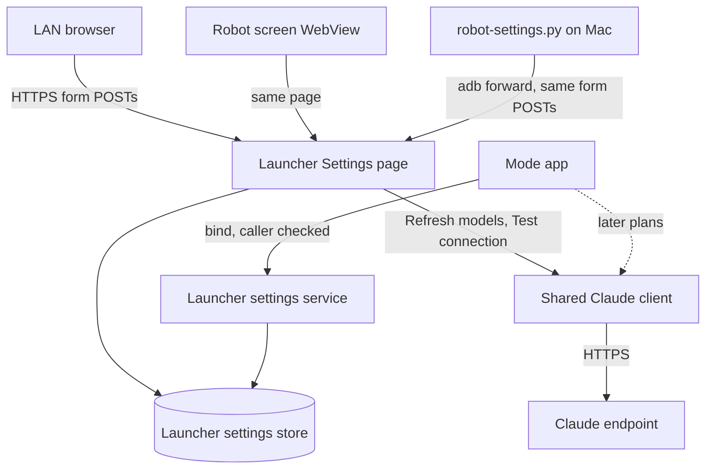

# Robot Settings Page with Claude API Access - Plan

## Goal Capsule

- **Objective:** The owner can set, change, check, and remove the robot's Claude API access (base URL, API key, model) from one robot-wide settings page or from the Mac's command line. Every mode can then read those values, with no rebuild and no Linux host running.
- **Means:** A Settings page and a caller-checked bound service in the launcher, a shared HTTPS client for the Claude API, and an adb push script (KTD1, KTD3, KTD8).
- **Product authority:** The Product Contract below. It covers only the shared settings area. Moving voice or explore mode onto Claude are separate follow-on plans (see How This Work Fits Together) and are not active scope.
- **Stop conditions:** Stop and report if the robot cannot complete a TLS handshake with the endpoint (U7's on-device check), or if the caller check in KTD1 cannot identify our own apps on the device. Either would invalidate the approach rather than just need a fix.
- **Execution profile:** Host-JVM tests for plain-Java logic, source-wiring tests for the Android glue, and one on-robot smoke run against the real endpoint.
- **Open blockers:** None.

---

## Product Contract

Product Contract preservation: changed: R6, R7, R10, R11, AE4 — planning found that a fresh robot could never save its first key (R7 required a model that only R8 could supply, and R8 needs a saved key), that the launcher cannot tell the script apart from any other caller (so R11's exemption from R6 was unenforceable), and that R10 was missing several failure reasons. Added R16 (Forget key), AE6, and AE7 at the owner's request. All changes were confirmed by the owner before writing.

### Summary

The launcher gets a Settings page that is the robot's single home for settings. Its first section is Claude API access: base URL, API key, a model picked from a list the endpoint reports, and buttons to refresh the models, test the connection, and forget the key. The same page opens from a LAN browser and from a Settings entry on the robot's own screen. A Python script pushes the same values over adb, and modes read the current values from the launcher.

### Problem Frame

The robot is too weak to run a language model, and today its only model is VoiceChat 11B, which voice mode reaches through the relay on the owner's Linux host. The owner wants every mode to reach Claude through a custom Anthropic-compatible endpoint (`https://teamclaude.rentaladvantage.rent`) instead. That needs somewhere on the robot to keep the endpoint and key, a way to change them without rebuilding an APK, and a way to see whether they work. Settings are currently scattered: only voice mode has a settings page, and it is private to that app, while its tuning values are changed by writing its preferences file over root adb.

### Key Decisions

- **The API key lives on the robot, and modes call the endpoint directly.** (session-settled: user-directed — chosen over keeping the key on the relay host and routing every call through it: modes must work without the Linux host running.) This reverses the voice plan's reason for choosing the relay (keeping keys off the robot) for Claude access only; the relay itself is unchanged. Governs R4, R13, R14.
- **The launcher owns the settings, and modes ask it for them.** (session-settled: user-directed — chosen over a fixed-path config file every app reads, and over a launcher proxy that adds the key to each call: lowest carrying cost, and it reuses the launcher's existing page and storage pattern.) Governs R1, R11, R13.
- **Changing the base URL on the page requires re-entering the key in the same save.** (session-settled: user-directed — chosen over an admin PIN and over no guard: anyone on the LAN can edit the page, and this stops them from redirecting the stored key to their own server.) Governs R6.
- **The page is the robot's primary settings home, not a Claude-only page.** The owner set this at scope confirmation: every robot setting is meant to end up here, and Claude access is its first section. Governs R1, R2.
- **The model list comes from the endpoint, not from a list built into the app.** The custom endpoint may not serve every public Claude model, so the page shows what it actually offers. Governs R8, R9.
- **The owner can remove a stored key from the page.** (session-settled: user-directed — chosen over having no removal path: a leaked key must be removable without adb.) Governs R16.

### Requirements

**Settings page**

- R1. The launcher serves one Settings page that is the robot's home for settings. It is organized into sections, so later settings (such as voice mode's relay address) can move in without redesigning it. In v1 it contains only the Claude API section.
- R2. The page opens from a LAN browser and from a Settings entry on the launcher's home screen on the robot's own display. It uses the same page and the same form in both places, in the launcher's existing Pico form style.
- R3. The Claude section holds three values: base URL, API key, and model. The base URL starts pre-filled with `https://teamclaude.rentaladvantage.rent`.
- R4. The page never shows the stored API key back. It shows only whether a key is set, its last four characters, and when it was saved.
- R5. Leaving the key field empty on save keeps the stored key. A blank submission never erases it.
- R6. A save that changes the base URL is rejected unless it also carries a new key. URLs are compared after dropping a trailing `/` or `/v1`, so those alone are not a change. The stored key is never sent to a base URL other than the one it was saved with.
- R7. A base URL that is not `https://` is never stored, and the page reports why, as the launcher's existing forms do. The model may be empty until the owner first picks one; Test connection and the modes treat an empty model as "not set up yet".
- R16. A Forget key button removes the stored key. After that, the page shows that no key is set, and modes get no key.

**Models**

- R8. A Refresh models button asks the configured endpoint which models it serves, using the saved base URL and key. It fills the model choice with that list.
- R9. When the endpoint cannot be reached, rejects the key, or does not list models, the page shows the reason and keeps the current model. The owner can still type a model name by hand.

**Checking the settings**

- R10. A Test connection button sends one minimal request with the saved base URL, key, and model. It shows success or a plain reason: no key or model set, bad key, no permission, billing or spend limit, unknown model, rate limited, endpoint overloaded or erroring, endpoint unreachable (DNS or connection), or TLS failure (including a wrong robot clock).

**Command line**

- R11. A Python script on the Mac sets the base URL, key, and model on a connected robot over adb. It reads the key and base URL from the Mac's `ANTHROPIC_API_KEY` and `ANTHROPIC_BASE_URL` environment variables, or prompts for the key; the key is never a command-line argument. It sends the key with every push, so R6 is satisfied without an exemption. The model comes from a flag or `ANTHROPIC_MODEL`; with neither, it keeps the stored model, and if none is stored it saves the rest and prints the endpoint's model list.
- R12. The script can also run the same connection test as R10 and report the result, so a push can be checked without opening the page.

**Modes**

- R13. Any mode can get the current base URL, key, and model from the launcher when it needs them. A change takes effect on the mode's next request, with no app restart.
- R14. The API key never appears in logcat, in a URL, in the page's HTML, in the script's output or argv, or in the repo.
- R15. The settings survive reboots and an in-place reinstall of the launcher.

### Acceptance Examples

- AE1. **Covers R6.** Given a key is stored for the teamclaude URL, when someone on the LAN changes only the base URL and saves, then the save is rejected with a message saying a new key is required, and both the stored URL and key are unchanged.
- AE2. **Covers R5, R6.** Given a key is stored, when the owner changes only the model and saves with the key field empty, then the model updates and the key is kept. Changing the URL from `https://host` to `https://host/v1/` with an empty key field is also accepted as no change.
- AE3. **Covers R8, R9.** Given the stored key is wrong, when the owner presses Refresh models, then the page says the endpoint rejected the key, and the current model stays selected.
- AE4. **Covers R11, R12.** Given `ANTHROPIC_API_KEY`, `ANTHROPIC_BASE_URL`, and `ANTHROPIC_MODEL` are set in the Mac's shell, when the owner runs the script with no flags against a connected robot, then the values are stored, the test reports success, and the page shows the key's last four characters.
- AE5. **Covers R13.** Given a mode is running, when the owner saves a new model on the page, then the mode's next Claude request uses the new model.
- AE6. **Covers R7, R8.** Given a fresh robot, when the owner saves only a key, then presses Refresh models, picks a model, and saves, then each step succeeds and Test connection then passes.
- AE7. **Covers R16, R13.** Given a key is stored, when the owner presses Forget key, then the page shows no key set, and a mode asking the launcher gets "not set up yet".

### Scope Boundaries

- Moving voice mode onto Claude, including choosing speech-to-text and text-to-speech. Claude takes text and images, not audio.
- Moving explore mode onto Claude, for example reacting to camera frames.
- Moving voice mode's existing relay address and turn-taking settings onto this page. The page is built to take them (R1), but moving them belongs with the voice follow-on.
- A launcher proxy that holds the key and forwards calls, usage limits, and moving the key to the relay host.
- A login or PIN for the page.

### Deferred to Follow-Up Work

- The launcher's Wi-Fi password travels in a GET query, and `RoutingHttpServer` logs every request line, so it already reaches logcat. This is a separate existing leak; the fix (POST, or redacting queries in the log line) goes to `docs/TODO.md`.

<!-- ce-section: work-relationships -->
### How This Work Fits Together

This plan covers only the shared settings area. The breakdown below is the current understanding, not a committed roadmap.

- Voice mode on Claude. Depends on this plan (R13). Still to decide: speech-to-text and text-to-speech providers, and whether the relay stays in the loop. Its relay and turn-taking settings would move onto this page then.
- Explore mode on Claude. Depends on this plan (R13). Can proceed independently of the voice work. The camera curiosity plan currently lists vision-model recognition as out of scope.

### Dependencies / Assumptions

- The endpoint is an Anthropic-style proxy. An unauthenticated `GET /v1/models` returned 401 with `{"type":"error","error":{"type":"authentication_error","message":"Invalid proxy API key"}}`. Which auth header it reads is untested, so the client sends the key in both standard headers (KTD3).
- The endpoint serves an ECDSA leaf from Let's Encrypt YE2 under ISRG Root YE, cross-signed through ISRG Root X2 to ISRG Root X1. Android 9 trusts X1 but not X2 or YE, so its handshake depends on building the path through both cross-signs. This is untested and is the first thing U7 checks. If it fails, it is a stop condition to report, not something to work around by trusting extra roots. R10 names TLS failures so this is visible.
- The robot has not made direct internet calls before (voice traffic goes to a LAN relay). U7 checks DNS, TLS, and the clock on the device before anything else depends on them.
- An on-screen keyboard works in the launcher's WebView. The Wi-Fi password field suggests this, but it has not been confirmed. Typing a roughly 100-character key on the robot's screen is expected to be rare; the key usually arrives through R11 or a LAN browser.

### Sources / Research

- `docs/plans/2026-09-17-1617-feat-autonomous-voice-mode-plan.md` — KTD1 chose the relay partly to keep API keys off the robot; KTD10 covers voice settings storage and the settings page pattern.
- `mode-voice/src/com/miko3/mode/voice/SettingsPage.java`, `PageToken.java`, `VoiceSettings.java`, `LaneJson.java` — the settings form, forged-post token, SharedPreferences store, and host-testable JSON reader this plan reuses.
- `launcher/src/com/miko3/launcher/DriveLeaseService.java` and `shared/src/com/miko3/shared/DriveLease.java` — the existing mode-to-launcher Binder channel (with no caller check).
- `launcher/src/com/miko3/launcher/LauncherApp.java`, `LauncherPage.java`, `MainActivity.java` — routes, home tiles, and the WebView that reloads on every Wi-Fi broadcast.
- `shared/src/com/miko3/shared/RoutingHttpServer.java` — thread per connection; logs every request line; the plain port 302-redirects to HTTPS, which turns a POST into a GET.
- `docs/solutions/` — the neuterd learning (the `settings` command is intercepted; restart apps with force-stop, never `kill -9`) and the eye-CSS learning (verify served pages through a real browser, not only host tests).
- Anthropic API docs — Models API (`GET /v1/models`, `limit` up to 1000, `after_id` paging, `has_more`), Messages API, error types, and `anthropic-version: 2023-06-01`.

---

## Planning Contract

### Key Technical Decisions

- KTD1. **Modes get the settings through a bound service in the launcher that checks who is calling.** It follows the `DriveLeaseService` pattern: a hand-written Binder interface in `shared/`, bound by action with `setPackage`. Unlike that service, each call looks up the caller's packages from its uid and answers only when one of them is a Miko 3 app whose signing certificate matches a pinned SHA-256. Chosen over a signature permission, which fails because every APK has its own signing key, and over re-signing all apps with one key, which would force a one-time uninstall per mode and wipe voice mode's saved relay address. A loopback HTTP route was also rejected: no HTTP route ever returns the key. The threat this check stops is other apps already on the robot, such as the vendor's apps. It does not stop a sideloaded impostor, because the committed keystores and their passwords are public, but sideloading already needs root adb, which can read the key anyway. Implements R13, R14.
- KTD2. **The launcher stores the settings in its own private SharedPreferences, behind a small store interface, with no encryption at rest.** This copies voice mode's `VoiceSettings`/`Store` pattern: writes use `commit()`, and the plain-Java logic stays host-testable. Encryption was not chosen because root adb can already read everything on this device, and the Android Keystore would add code without protecting against any real threat. The stored model list from Refresh lives in the same store. Implements R4, R5, R15.
- KTD3. **One shared plain-Java Claude client, used by the launcher now and by modes later.** It lives in `shared/`, uses `HttpsURLConnection` behind a transport interface so host tests can fake it, and trusts the system CAs (the default network security config at target SDK 28 needs no change). Base URLs are normalized by dropping a trailing `/` or `/v1` (R6), with `/v1/...` appended per call. Each request carries `x-api-key`, `Authorization: Bearer`, and `anthropic-version: 2023-06-01`. It follows no redirects, and it sets connect and read timeouts, because Android's default timeouts are infinite. Failures map by HTTP status first and then by the error `type`, into the fixed reasons listed in R10. Reason text is built from fixed strings and never contains the key or the raw response body. Implements R8, R10, R14.
- KTD4. **Test connection sends a Messages request with `max_tokens: 1`.** Chosen over the free `count_tokens` call, which a proxy doesn't have to implement. One output token costs almost nothing and checks the whole path. Implements R10.
- KTD5. **Refresh reads every page of `GET /v1/models` and stores the model ids.** The page offers them in a text field with a suggestion list, so the same field lets the owner pick from the list or type a model by hand (R9). A 404 means "this endpoint doesn't list models; type one in". A saved model that is missing from a fresh list stays saved and is marked "not listed by endpoint". Implements R8, R9.
- KTD6. **Every Settings action is a POST that carries a page token, and the key travels only in the POST body.** `PageToken` moves to `shared/` and gains a capacity, so it accepts a few recent tokens: the launcher uses 4, voice keeps 1. That way the robot's WebView sitting on the page does not invalidate a LAN browser's form. Status redirects are built from fixed messages and model ids, never from what was typed. Implements R4, R14.
- KTD7. **Voice mode's hand-written JSON reader moves to `shared/`,** because the launcher and the shared client must parse JSON in host tests, where `org.json` is unavailable. Voice mode switches to the shared copy, and its existing tests keep passing. Implements R8, R10.
- KTD8. **The script reaches the robot through an adb port forward to the launcher's HTTPS port.** It fetches the page to get a token, POSTs the same form the browser does, and removes the forward when it finishes. That works over USB or Wi-Fi adb and needs no new robot endpoint. The key comes from the environment or a hidden prompt, and goes only in the POST body. Implements R11, R12, R14.
- KTD9. **The launcher's WebView reloads on Wi-Fi changes only while it shows the home page.** Otherwise a Wi-Fi scan would wipe a half-typed key and issue a fresh token. Implements R2.

### High-Level Technical Design



The save rules for the Claude section, applied in order to each save (directional guidance, not a specification):

```
url = normalize(form.url)                  # https only, drop trailing / and /v1  (R6, R7)
key = form.key if nonblank else stored.key # blank keeps the key  (R5)
if url != stored.url and form.key is blank -> reject "new key required"  (R6)
store(url, key, form.model)                # empty model allowed  (R7)
```

### Sequencing

U1 comes first. U3 follows, because U2 calls its URL normalization. Then U2, then U4 joins them on the page, U5 serves modes, U6 adds the script, and U7 checks everything on the robot.

---

## Implementation Units

### U1. Move the page token and JSON reader into shared code

- **Goal:** The launcher and the shared client can reuse voice mode's form token and JSON reader.
- **Requirements:** R14 (via KTD6, KTD7)
- **Dependencies:** None
- **Files:**
  - Move: `mode-voice/src/com/miko3/mode/voice/PageToken.java` to `shared/src/com/miko3/shared/PageToken.java`, adding a capacity setting
  - Move: `mode-voice/src/com/miko3/mode/voice/LaneJson.java` to `shared/src/com/miko3/shared/` (a name that is not lane-specific)
  - Modify: the voice classes that use them (`SettingsPage.java`, `ModeApp.java`, `ConversationClient.java` and any other callers)
  - Modify: the voice harness fixtures under `scripts/tests/fixtures/` whose sourcepath must now include `shared/src`
  - Test: `scripts/tests/test_build_mode_voice.py`, `scripts/tests/test_voice_conversation_client.py`, plus a new `scripts/tests/test_shared_page_token.py`
- **Approach:** Make both classes public and keep their behavior. Voice creates its token with capacity 1, so its latest-only behavior is unchanged.
- **Patterns to follow:** The existing `shared/` classes, which are compiled into every APK by `scripts/build_common.py`.
- **Test scenarios:**
  - With capacity 1, only the most recently issued token is accepted (existing voice behavior).
  - With capacity 4, each of the last four tokens is accepted and the fifth-oldest is rejected.
  - An empty token, a wrong token, and a token of a different length are all rejected.
  - The existing voice settings and JSON tests still pass unchanged against the shared classes.
- **Verification:** The voice mode test suite passes, and `build-mode-voice.py` builds.

### U2. Launcher settings store and save rules

- **Goal:** A plain-Java settings model in the launcher that applies the save rules and persists the values.
- **Requirements:** R3, R4, R5, R6, R7, R15, R16
- **Dependencies:** U1, U3 (URL normalization)
- **Files:**
  - Create: `launcher/src/com/miko3/launcher/ClaudeSettings.java` (values, defaults, save and forget rules, the store interface, key suffix and saved-at time, stored model list)
  - Modify: `launcher/src/com/miko3/launcher/LauncherApp.java` (the SharedPreferences-backed store)
  - Test: `scripts/tests/test_launcher_settings.py` with a harness under `scripts/tests/fixtures/launcher_settings_harness/`
- **Approach:** Follow `VoiceSettings`: named keys and defaults, a synchronized save, durable writes, and an invalid-value exception whose message is shown verbatim. URL normalization lives in shared code (U3) so that the script (U6) and the client agree on it. This unit calls that normalization and does not duplicate it. The default base URL is the teamclaude URL (R3).
- **Execution note:** Implement the save rules test-first; they are the security boundary for R6.
- **Patterns to follow:** `mode-voice/src/com/miko3/mode/voice/VoiceSettings.java`, `RelayAddress.java`.
- **Test scenarios:**
  - Covers AE6. On a fresh store, saving only a key succeeds, and the model stays empty.
  - Covers AE2. Saving a new model with a blank key keeps the stored key.
  - Covers AE1. Changing the base URL with a blank key is rejected, and neither the URL nor the key changes.
  - Changing the base URL together with a new key succeeds.
  - Covers AE2. `https://host`, `https://host/`, and `https://host/v1/` all count as the same URL.
  - An `http://` URL, a URL with no host, and a URL with spaces are rejected with a readable reason, and nothing is stored.
  - Covers AE7. Forget key clears the key, and the status then reports that no key is set.
  - The status view exposes only the key's last four characters and the saved-at time, never the full key.
- **Verification:** The harness passes, and no public accessor used by page rendering returns the full key.

### U3. Shared Claude client

- **Goal:** One plain-Java client that lists models and runs a connection test against the configured endpoint, returning fixed failure reasons.
- **Requirements:** R6 (URL normalization), R8, R9, R10, R14
- **Dependencies:** U1
- **Files:**
  - Create: `shared/src/com/miko3/shared/ClaudeApi.java` (URL normalization, listing models with paging, the one-token test, error mapping, a transport interface)
  - Create: an `HttpsURLConnection` transport in `shared/`
  - Test: `scripts/tests/test_claude_api.py` with a harness that fakes the transport
- **Approach:** Per KTD3 and KTD4. The result types carry either data or one reason from a fixed set. DNS failures, refused connections, and timeouts map to "unreachable". SSL handshake failures map to "TLS failed; check the robot's clock and the endpoint's certificate". A body that is not JSON falls back to the HTTP status alone. A 3xx response, and any status with no specific mapping, returns the "endpoint overloaded or erroring" reason.
- **Patterns to follow:** The plain-Java-behind-an-interface style of `mode-voice` classes that are host-tested; `LineReader` and `HttpUtil` in `shared/`.
- **Test scenarios:**
  - Listing: a single page returns all ids, and two pages linked by `has_more`/`last_id` are both fetched with `after_id`.
  - Listing: a 404 maps to "endpoint doesn't list models".
  - Test: a 200 response maps to success.
  - Each failure maps to its reason: 401 bad key, 403 no permission, 402 billing, a 400 carrying a spend-limit message, 404 `not_found_error` unknown model, 429 rate limited, 529 overloaded, and 500/504 endpoint error.
  - A 3xx response is reported as an error and is never followed.
  - Every request sends both auth headers and the version header, and the paths are `/v1/models` and `/v1/messages` whatever form the base URL arrived in.
  - A missing key or an empty model returns "not set up yet" without making any request.
  - With a fake response body that contains the key, no reason string contains the key.
  - Connect and read timeouts are set on every connection (checked by a source-wiring assertion).
- **Verification:** The harness passes, and the client builds into every APK through `shared/`.

### U4. Settings page and home-screen entry

- **Goal:** The launcher serves the Settings page with its Claude section, and the robot's home screen links to it.
- **Requirements:** R1, R2, R3, R4, R5, R6, R7, R8, R9, R10, R14, R16
- **Dependencies:** U2, U3
- **Files:**
  - Create: `launcher/src/com/miko3/launcher/SettingsPage.java` (rendering, form reading, and a handler for each action, in plain Java)
  - Modify: `launcher/src/com/miko3/launcher/LauncherApp.java` (register the routes and hold the page token)
  - Modify: `launcher/src/com/miko3/launcher/LauncherPage.java` (Settings entry)
  - Modify: `launcher/src/com/miko3/launcher/MainActivity.java` (KTD9)
  - Modify: `shared/src/com/miko3/shared/LauncherProtocol.java` (path constants)
  - Test: `scripts/tests/test_launcher_settings.py` (page harness) and `scripts/tests/test_mode_registry.py`-style source-wiring checks
- **Approach:**
  1. `GET /settings` renders a Home link to `/` and then the sections. Only the Claude section exists in v1. Its Save form carries the base URL, the key (an empty password input), and the model field with suggestions from the stored list. Below the key status, Refresh models, Test connection, and Forget key are separate forms that carry only the page token, under a line reading "These use the saved settings — save changes first."
  2. Each button POSTs to its own path with the page token (KTD6), then redirects to `/settings?status=<fixed message>`.
  3. Refresh and Test call the shared client (U3) synchronously with its timeouts; the server already runs one thread per connection.
  4. The home page gets a Settings button next to the mode tiles, but it is not added to `ModeRegistry`.
- **Patterns to follow:** `mode-voice/src/com/miko3/mode/voice/SettingsPage.java` (status redirect, the `MAX_FORM_BYTES` cap, token in the body only); the Pico markup in `LauncherPage.java`.
- **Test scenarios:**
  - The rendered HTML never contains the stored key, even inside the value attribute of an input.
  - A POST with a missing or stale token is rejected, and nothing changes.
  - A status redirect for a rejected save does not echo the submitted URL or key.
  - Refresh with a faked client stores the ids, and the next GET shows them as suggestions. A saved model missing from the list is marked "not listed by endpoint".
  - Refresh and Test show the client's reason text in the status line (covers AE3).
  - Forget key, followed by a GET, shows no key set.
  - Source wiring: the launcher registers the settings routes; no settings path handles GET with a key parameter; no `Log.` call in the new launcher classes references the key; `MainActivity` reloads only when the current URL is the home page.
  - Integration: the home page contains a link to `/settings`, and the Settings page contains a link back to `/`.
  - The Refresh models, Test connection, and Forget key forms contain no URL, key, or model field.
- **Verification:** The harness passes. On the robot, the page loads in a LAN browser at `https://<robot>:8443/settings` and from the home-screen button.

### U5. Settings service for modes

- **Goal:** A mode can fetch the current base URL, key, and model from the launcher, and only our own apps get an answer.
- **Requirements:** R13, R14, R16
- **Dependencies:** U2
- **Files:**
  - Create: `shared/src/com/miko3/shared/RobotSettings.java` (hand-written Binder interface: stub, proxy, descriptor), plus a small client helper that binds, fetches, and unbinds
  - Create: `launcher/src/com/miko3/launcher/RobotSettingsService.java`
  - Create: `launcher/src/com/miko3/launcher/CallerCheck.java` (plain-Java decision: packages and certificate digests in, allow or deny out)
  - Modify: `launcher/AndroidManifest.xml` (exported service with a new action) and `shared/src/com/miko3/shared/LauncherProtocol.java` (the action constant)
  - Test: `scripts/tests/test_robot_settings_service.py` (caller-check harness plus source-wiring checks)
- **Approach:** Per KTD1. The pinned digests are the SHA-256 of each committed keystore's signing certificate, recorded as constants in the launcher; the build does not compute them at runtime. The service reads the store on every call, so a change applies on the mode's next request (R13). After Forget key, or before setup, it returns "not set up yet" rather than empty strings.
- **Patterns to follow:** `launcher/src/com/miko3/launcher/DriveLeaseService.java`, `shared/src/com/miko3/shared/DriveLease.java`.
- **Test scenarios:**
  - A caller whose uid maps to a Miko 3 package with a matching digest is allowed.
  - A caller whose package name matches a Miko 3 app but whose signing certificate digest does not match the pin is denied.
  - An unknown package is denied, and so is a uid that maps to no packages.
  - Covers AE7. After Forget key, an allowed caller gets "not set up yet".
  - Source wiring: every service method runs the caller check before it reads the store; the manifest declares the new action.
- **Verification:** The harness passes. On the robot, a mode build that calls the helper (exercised in U7) gets the values. A temporary call from an app whose certificate is not pinned, such as a throwaway build of `spike-drive-test`, is denied. The shell uid cannot drive a hand-written Binder interface, so this check needs an app.

### U6. Push script

- **Goal:** The owner can push, test, and list models from the Mac over adb.
- **Requirements:** R11, R12, R14
- **Dependencies:** U4
- **Files:**
  - Create: `scripts/robot-settings.py` (commands: push (default), test, models)
  - Test: `scripts/tests/test_robot_settings.py`
- **Approach:** Per KTD8. The script:
  1. Resolves the serial the way `install-mode-voice.py` does.
  2. Opens an adb forward to 8443 and fetches `/settings` to scrape the token and the stored model.
  3. POSTs the save form over an unverified SSL context (the certificate is self-signed), then runs Test and prints the result.
  4. Removes the forward on every exit path.

  The key comes from `ANTHROPIC_API_KEY`, or from a hidden prompt when that is unset. Because every push sends a key, it also needs an explicit base URL from `ANTHROPIC_BASE_URL` or a flag. With neither, it exits before any adb call rather than pairing the key with the robot's stored URL; a key meant for another endpoint must never be sent to this one. Base URLs are validated before any adb call. Status and errors are printed with the key redacted. With no model available (R11), it saves the rest, runs `models`, and prints the list.
- **Patterns to follow:** `scripts/install-mode-voice.py` (serial handling, `AdbError` with a what-to-do message) and `scripts/qa-voice-mode.py` (token scraping, the `http.client` helper). Per user preference, the script is Python.
- **Test scenarios:**
  - Covers AE4. With all three environment variables set, `push` posts URL, key, and model in the body, then runs the test, and the output shows success and the key's last four characters only.
  - With no key in the environment, it prompts through `getpass`, and the key never appears in any subprocess argv.
  - An `http://` base URL fails before any adb command runs.
  - With a key in the environment but no base URL in the environment or flags, it exits with a readable error before any adb command runs.
  - With no model in the flags or environment and a model already stored, `push` resends the stored model, and it is unchanged afterward.
  - With no model in the flags, the environment, or the stored settings, it saves and then prints the model list.
  - The adb forward is removed after success, after an HTTP error, and after Ctrl-C.
  - A device error (adb missing, or no device) produces a readable message and a nonzero exit.
- **Verification:** The unit tests pass, and one real run against the robot is part of U7.

### U7. On-robot verification

- **Goal:** Prove the whole path on the real robot, starting with the risky first outbound HTTPS call.
- **Requirements:** R2, R8, R10, R11, R12, R13, R14, R15
- **Dependencies:** U4, U5, U6
- **Files:**
  - Modify: `docs/TODO.md` (the Wi-Fi password logcat item from Deferred to Follow-Up Work)
  - Test expectation: none — a manual device run whose results are recorded in the PR description.
- **Approach:**
  1. Install the launcher and push the settings with the script. Run Test first: a TLS or unreachable result is a stop condition, not something to work around.
  2. Check that Refresh lists models, AE6 on a cleared store, AE1 from a LAN browser, and the page from the home-screen button, including typing into the key field.
  3. Confirm that a mode can fetch the values and an unpinned app cannot (U5); temporary calls during the run are enough, and nothing is left behind.
  4. Grep logcat for the key while running the actions, reboot, and confirm the settings survived.
- **Execution note:** Mostly runtime verification. Follow the eye-CSS learning and check the page in a real browser, not only through host tests. Restart the launcher with force-stop, never `kill -9`.
- **Verification:** Every step passes, and logcat contains no occurrence of the key.

---

## Verification Contract

| Gate | Command or check | Proves |
|---|---|---|
| Host tests | `python3 -m unittest discover scripts/tests` | U1–U6 logic, save rules, client mapping, caller check, script |
| Builds | `python3 scripts/build-custom-launcher.py`, `build-mode-voice.py`, `build-mode-explore.py`, `build-mode-remote-control.py` | Shared code still compiles into every APK |
| Device | U7 run on the robot | TLS, DNS, clock, page, service, script, persistence, no key in logcat |

## Definition of Done

- Every unit's verification holds, and the host test suite and all four builds pass.
- The U7 device run passed, and its results are in the PR description.
- No occurrence of the key in logcat, the repo, the page HTML, or the script output.
- `docs/TODO.md` records the Wi-Fi password logcat leak.
- No abandoned experimental code, temporary mode calls from U7, or leftover adb forwards remain in the diff.
