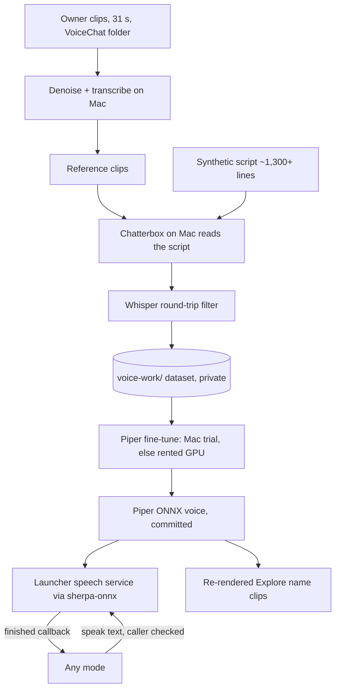

# Robot Voice with On-Robot Speech - Plan

## Goal Capsule

- **Objective:** The robot can speak any sentence a mode gives it, in the voice of the person from the owner's clips, starting within 2 seconds, with no cloud or host call at speaking time.
- **Product authority:** This Product Contract. It covers only the robot's voice. Explore mode on Claude (what he notices and says) is the next separate plan and will use this voice; see How This Work Fits Together.
- **Means:** Chatterbox on the Mac clones the voice into a synthetic training set; a small Piper voice is fine-tuned on it; the launcher runs it with sherpa-onnx as a speech service every mode can call (KTD1, KTD3, KTD4).
- **Stop conditions:** U1 finds no Piper tier under 2 seconds to first sound on the robot; or the owner rejects the voice at either listening gate (U3, U4) twice with no remedy left in scope.
- **Owner pause points:** U3 and U4 each end with the owner listening and approving (R6); U4 may also need the owner's go-ahead to rent a GPU (R7). Everything else runs without the owner.
- **Open blockers:** None.

---

## Product Contract

### Summary

A small text-to-speech voice runs on the robot, and any mode can hand it a sentence to speak. The voice is made on the owner's Mac: a large voice-cloning model copies the voice from the owner's clips and reads about 1–2 hours of varied text, and that synthetic audio trains a small Piper voice, which the robot runs with ONNX Runtime. The work starts by checking that the robot's chip is fast enough, and ends with every clip in which the robot speaks re-voiced with the new voice.

### Problem Frame

The robot has no text-to-speech at all: no engine is installed, the vendor's own speech is cloud-only, and every word Explore says is one of 341 pre-recorded name clips rendered with the macOS `say` voice. The next step, Explore mode on Claude, will produce free-form lines that can't be pre-recorded, so the robot needs to speak arbitrary text. The owner wants low latency, so a cloud or host round trip at speaking time is unwanted. The owner has a few minutes of slightly noisy, untranscribed clips of one person, who has agreed to their voice being used.

### Key Decisions

- **Distill a large voice cloner into a small on-robot voice.** (session-settled: user-directed — chosen over fine-tuning directly on the few minutes of noisy clips, streaming a large cloner from the Linux host, and first recording 20–30 minutes of new audio: better sound from the clips that exist, while keeping speech on the robot.) Governs R4, R5, R6.
- **The voice runs on the robot at speaking time.** (session-settled: user-directed — chosen over streaming audio from a host over Wi-Fi: keeps latency down and lets him speak with the host off.) Governs R1, R8, R9.
- **Training happens on the owner's Mac; a rented GPU only if a step is too slow there.** (session-settled: user-directed — chosen over the Linux host's GPU, which is not available.) Governs R7.
- **The finished voice model may be public; everything used to make it stays private.** (session-settled: user-directed — the owner decided this at scope confirmation.) Governs R12, R13.
- **Every clip in which the robot speaks gets the new voice; his non-speech sounds stay.** (session-settled: user-directed — decided by the owner at scope confirmation.) Governs R14, R15.
- **"Fast enough" means first sound within 2 seconds for a one-sentence line.** (session-settled: user-directed — chosen over under 1 second and under 3 seconds.) Governs R1, R9.

### Requirements

**Speed check first**

- R1. Before any voice is trained, a stock Piper voice is run on the robot and must produce the first sound of a one-sentence line within 2 seconds. If no Piper quality tier meets that, the work stops and the owner is told, with the measured times, instead of training.
- R2. The speed check reports, for each tier tried, the time to first sound and how much faster or slower than real time the synthesis runs, so the tier for training can be chosen from data.

**Making the voice**

- R3. The owner's clips are cleaned (noise reduced, silence trimmed, levels evened) and transcribed automatically; clips too noisy or too short to help are set aside rather than used.
- R4. A large voice-cloning model, run on the Mac, uses the cleaned clips as its reference and reads about 1–2 hours of varied text (sentences, questions, names, numbers, short exclamations) in the person's voice.
- R5. A small Piper voice at the tier R1 chose is trained on that synthetic speech, starting from an existing Piper voice rather than from scratch.
- R6. The owner listens to samples at two points, after the cloner's output and after the small voice is trained, and each stage continues only when the owner says it sounds like the person.
- R7. Training runs on the owner's Mac. If the small-voice training would take more than about a day there, the plan says so and that one step moves to a rented GPU, with the owner's go-ahead for the cost.

**Speaking on the robot**

- R8. Any mode can ask the robot to speak a sentence and is told when it has finished, so it can wait for the line or carry on.
- R9. A one-sentence line starts playing within 2 seconds of being handed over, measured on the robot with the trained voice.
- R10. A longer line starts speaking before the whole line has been synthesized, so the 2-second target holds for multi-sentence lines too.
- R11. Asking to speak while the robot is already speaking has one defined behavior (queue, or interrupt and replace), the same for every mode.

**Privacy**

- R12. The owner's clips, their transcripts, the cloner's reference audio, and the synthetic training set never enter the git repository, which is public.
- R13. The finished small voice model, and the text and settings needed to reproduce it, may be committed.

**Re-voicing what he already says**

- R14. The 341 spoken name clips Explore plays today are regenerated in the new voice, so no speech in the old `say` voice remains.
- R15. Non-speech sounds (Explore's reaction sounds, idle songs, the drive-warning sound) are unchanged.

### Acceptance Examples

- AE1. **Covers R1.** Given the stock Piper voices, when the speed check runs on the robot, then each tier's time to first sound for "Hi there, I don't think we've met!" is reported, and training starts only if one tier is under 2 seconds.
- AE2. **Covers R8, R9.** Given the trained voice is installed, when Explore hands over "Hi there, I don't think we've met!", then sound starts within 2 seconds and Explore is told when the line has finished.
- AE3. **Covers R11.** Given a line is playing, when another mode asks to speak, then the agreed queue-or-replace behavior happens.
- AE4. **Covers R12.** Given training is finished, when the repository is searched, then no clip, transcript, or synthetic training audio is present, and the voice model file is.

### Success Criteria

- The owner, listening to the robot, says it sounds like the person.
- A line is understandable through the robot's small speaker at normal volume.

### Scope Boundaries

- Explore mode on Claude: choosing what he notices (people, animals, technology), what he says to or about it, and reacting more to new things and new people. That is the next plan.
- Voice mode's spoken replies, which come from the model server through the relay.
- Recording new audio from the person.
- A robot-style audio effect on the new voice. It speaks as the person by default; an effect can be added later.

<!-- ce-section: work-relationships -->
### How This Work Fits Together

This plan covers only the robot's voice. The breakdown below is the current understanding, not a committed roadmap.

- Explore mode on Claude. Depends on this plan (R8, R9). Claude looks at the camera frame at curiosity stops, picks what is interesting (people and animals first, then technology), and talks to or about it, with more interest for things and people it hasn't seen ("I don't think we've met"), then returns to its routine. Still to decide: how he remembers people, and within what span.
- Voice mode on the new voice. Can proceed independently of Explore. Still to decide: whether replies stay on the model server or move to Claude plus this voice.
- Builds on the Claude settings plan, `docs/plans/2026-09-24-1019-feat-robot-settings-claude-api-plan.md`.

### Dependencies / Assumptions

- The robot is a MediaTek MT8167 (four small ARM cores, 2 GB RAM) and already runs ONNX Runtime for Explore's detector; Piper voices export to ONNX. Whether Piper can meet 2 seconds on this chip is unknown until R1.
- The owner's Mac is an Apple M5 Pro with 64 GB of memory and a 20-core GPU. The large cloner has Apple-Silicon builds. Piper's training code is built around NVIDIA GPUs, so R7's fallback may be needed. The Mac had about 57 GB of free disk at planning time, and the work needs roughly 10–20 GB.
- The person in the clips has agreed to their voice being used for the robot.
- The owner's clips are 10 MP3 files, 31 seconds in total (1.1–6.0 s each, 44.1 kHz mono), one speaker, slight background noise, at `~/Documents/NVIDIA-NemotronLabs-VoiceChat-11B/voice/` on the owner's Mac, outside this repository. Their file names are close to transcripts. 31 seconds suits a zero-shot cloner's reference but is far too little to train Piper directly, which is why the voice is distilled (see Key Decisions).

### Sources / Research

- `docs/device-intel.md` — MT8167 SoC; `/proc/cpuinfo` and `meminfo` read over adb (4 cores, 2 GB).
- `docs/hardware/conversation-ai.md` — the vendor's speech is cloud-only; no on-robot TTS.
- `mode-explore/assets/` — 341 `name-*.webm` spoken clips and the non-speech `react-*`/`song-*` sounds; `scripts/gen-explore-voice.py` renders the names with macOS `say`.
- `mode-explore/` detector code — ONNX Runtime already on the robot.
- rhasspy/piper was archived in October 2025; training lives in OHF-Voice/piper1-gpl. Fine-tuning guidance and tiers: https://github.com/OHF-Voice/piper1-gpl and https://huggingface.co/datasets/rhasspy/piper-checkpoints
- Chatterbox (MIT code and weights, about 10 s of reference, no transcript needed, Apple-Silicon builds): https://github.com/resemble-ai/chatterbox
- sherpa-onnx (Apache-2.0, Java API with a per-sentence callback, prebuilt arm64 libraries, bundled espeak-ng data, API 21+): https://github.com/k2-fsa/sherpa-onnx

Product Contract preservation: Product Contract unchanged; the owner's clip details were recorded in Dependencies / Assumptions after the brainstorm.

---

## Planning Contract

### Key Technical Decisions

- KTD1. **Chatterbox clones the voice on the Mac.** Code and weights are MIT-licensed, it copies a voice from about 10 seconds of reference audio without a transcript, and it runs on Apple Silicon. F5-TTS on MLX is the fallback if Chatterbox's clone of the noisy reference sounds wrong; it is non-commercial (fine for this robot) and needs exact reference transcripts. XTTS-v2 was ruled out: it hangs on Apple's GPU. Listening gate 1 passed on 2026-09-24: the owner confirmed Chatterbox sounds like the person and preferred it to F5-TTS, and picked the "excited" delivery (exaggeration 0.9, cfg_weight 0.3) over neutral (0.5/0.5), lively (0.7/0.4) and very excited (1.2/0.3). The whole dataset is rendered at that setting. Implements R4. (session-settled: user-directed — the distillation approach itself; the choice of cloner is this plan's.)
- KTD2. **Piper is fine-tuned from an existing checkpoint with piper1-gpl, at the tier U1 picks.** The training set is about 1,300 or more synthetic phrases, roughly 1–2 hours. Each synthetic clip is transcribed again with mlx-whisper, and a clip is dropped when its transcript doesn't match its prompt, which catches cloner mistakes. Before anything else, the chosen checkpoint is loaded in piper1-gpl on the Mac. If it hits the known checkpoint-format errors, training uses the archived rhasspy/piper on its pinned stack (torch ~2.1, pytorch-lightning 1.8.6) instead; both export ONNX that sherpa-onnx accepts. Training first tries the Mac's GPU for one timed epoch. No working Piper run on Apple's GPU is documented, so a rented NVIDIA GPU is the expected path, taken only after the owner's go-ahead (R7). Implements R5, R7.
- KTD8. **Train the medium tier (lessac medium checkpoint, 22050 Hz), and make the speech service cope with Explore's load.** U1 measured medium at 1.10 s to first sound idle, but 4.89 s (RTF 2.96) with Explore's camera and detector busy. (session-settled: user-directed — chosen over training the faster low tier: the owner wants medium's quality and to make it work.) The speech service therefore times its thread count under load. Callers that also run heavy work, like Explore, speak only after that work pauses (Explore after a look finishes, when the detector is idle). Governs R9, R10.
- KTD9. **Listening gate 2 passed on 2026-09-25: the owner approved epoch 2599.** The owner heard it on the robot (first audio 1.08 s idle) and chose it over epoch 2549. The fine-tune ran 435 epochs past the lessac-medium base on 1,386 synthetic lines (1.22 h) on the Mac's GPU, about 77 s per epoch. The first run crashed on piper1-gpl's `val_mos` checkpoint, which `train-piper.py` now removes, and resumed from the last checkpoint. Governs R6, R13.
- KTD3. **The robot speaks through sherpa-onnx.** It has a plain Java API whose callback fires once per sentence, which gives R10's streaming. It bundles the espeak-ng phonemizer data, ships prebuilt arm64 libraries, and supports Android 9. Piper's own C++ binary plus piper-phonemize was rejected as harder to embed. Implements R8, R9, R10.
- KTD4. **Speech runs in the launcher as a speech service, not inside each mode.** sherpa-onnx must ship its own matching ONNX Runtime library. Explore already bundles ONNX Runtime 1.30.0, and an APK can hold only one copy per ABI, so putting speech in Explore would force both onto one version. The launcher has no ONNX Runtime and is always running, so the clash disappears. Modes call it through a caller-checked Binder service built the same way as `RobotSettingsService`. Implements R8, R11.
- KTD5. **Speaking while already speaking queues the new line.** A caller can also cancel everything it queued. Queueing never cuts a sentence off mid-word. A mode that needs to interrupt its own speech calls cancel, then speaks. Cancel never affects other callers' lines. Resolves R11.
- KTD6. **The voice model is committed with the launcher; all training material lives in a gitignored `voice-work/` directory.** The owner's clips are read in place from the VoiceChat folder and never copied into the repository. The model, its tokens file, and the espeak-ng data are committed at their real size (tens of MB), the way `detector.onnx` already is; no git LFS. Implements R12, R13. (session-settled: user-directed — model public, training material private.)
- KTD7. **The Explore name clips are re-rendered from the trained voice on the Mac, with no robot effect.** `gen-explore-voice.py` swaps macOS `say` plus the ffmpeg robot effect for the Piper voice, keeping the Opus/WebM format and the time limits Explore already assumes. Implements R14. (session-settled: user-directed — spoken clips get the new voice.)

### High-Level Technical Design

### Sequencing

U1 runs first and can stop the plan. U2, U3, and U4 build the voice in order. U5 can start once U1 has picked the tier, using a stock voice of that tier, so the speech service does not wait on training. U6 needs U4's model. U7 checks everything on the robot.

---

## Implementation Units

### U1. Speed check on the robot

- **Goal:** Measure time to first sound for stock Piper voices on the robot, and pick the tier to train.
- **Requirements:** R1, R2; AE1
- **Dependencies:** None
- **Files:**
  - Create: `scripts/voice/speed-check.py`
  - Create: `scripts/tests/test_voice_speed_check.py`
  - Modify: `docs/TODO.md` (record the measured times)
- **Approach:**
  1. Push sherpa-onnx's arm64 command-line TTS binary and stock English Piper voices to the robot's temporary storage. Test only voices whose training checkpoint exists in rhasspy/piper-checkpoints at the same tier, covering x_low, low, and medium where they exist.
  2. Run the AE1 sentence and a representative long sentence (about 20 words) on each voice several times with 1, 2, and 4 threads. Record the time to first audio and the real-time factor, and work out the longest chunk each tier can synthesize in under 2 seconds.
  3. Repeat the best configuration while Explore is running, since the camera and detector share the CPU.
  4. Print a table and a recommendation. Each row names the tier's training checkpoint path and sample rate, so U2 and U3 resample to the rate U4 trains at. Pick the highest-quality tier whose chunk limit covers a comma-length clause. Remove everything the check pushed to the robot.
- **Execution note:** This is runtime measurement. Unit tests cover only output parsing and cleanup.
- **Patterns to follow:** `scripts/install-mode-voice.py` (serial handling, adb helpers, errors that say what to do).
- **Test scenarios:**
  - Timing lines from the CLI are parsed into time-to-first-audio and real-time-factor values.
  - With no tier under 2 seconds, the script prints the stop message and exits non-zero.
  - Files pushed to the robot are removed after success, after a failure, and after Ctrl-C.
- **Verification:** The table is recorded. If no tier passes, the run stops here and the owner gets the numbers (Stop conditions).

### U2. Prepare the clips (private workspace)

- **Goal:** Turn the 31 seconds of clips into clean, transcribed reference audio in a gitignored workspace.
- **Requirements:** R3, R12
- **Dependencies:** None
- **Files:**
  - Create: `scripts/voice/prepare-clips.py`
  - Create: `scripts/tests/test_voice_prepare_clips.py`
  - Modify: `.gitignore` (add `voice-work/`)
- **Approach:**
  1. Read the MP3s from the VoiceChat folder. Denoise with DeepFilterNet3, not a generative enhancer, which can change the timbre. Trim silence, even out the levels, and resample.
  2. Transcribe with mlx-whisper large-v3-turbo, using each file name as a hint. Flag clips whose transcript disagrees with the file name.
  3. Rank the clips by signal-to-noise and length, and pick 10–15 seconds of the best as Chatterbox's reference.
  4. Write everything under `voice-work/` only.
- **Test scenarios:**
  - A file name like `i-ll-scan-my-database-...` becomes the hint text "I'll scan my database ...".
  - The output path is refused if it is not inside the gitignored `voice-work/` directory.
  - Clips below the length or signal-to-noise floor are listed as set aside, with the reason.
- **Verification:** `voice-work/clips/` holds the cleaned clips with transcripts, and `git status` shows nothing from `voice-work/`.

### U3. Build the synthetic training set (owner listening gate 1)

- **Goal:** About 1–2 hours of clean synthetic speech in the voice, which the owner approves.
- **Requirements:** R4, R6, R12
- **Dependencies:** U2
- **Files:**
  - Create: `scripts/voice/synthesize-dataset.py`
  - Create: `scripts/voice/script-lines.txt` (committed; contains no voice data)
  - Create: `scripts/tests/test_voice_synthesize_dataset.py`
- **Approach:**
  1. Assemble at least 1,300 script lines: varied sentences, questions, exclamations, and numbers, plus every Explore vocabulary name and the kinds of lines Explore on Claude will say.
  2. Chatterbox reads every line using the U2 reference, then mlx-whisper transcribes each output again. Lines whose transcript drifts from the prompt are dropped.
  3. Write an LJSpeech-style `wav|text` dataset into `voice-work/dataset/`.
  4. **Pause:** render about 10 sample lines and ask the owner whether it sounds like the person. If not, try F5-TTS (KTD1) or a different reference set, then ask again.
- **Test scenarios:**
  - Script lines are de-duplicated, and every vocabulary name appears at least once.
  - A synthetic clip whose transcript differs from its prompt beyond the threshold is dropped and counted.
  - The dataset CSV rows point only at files that exist, with no pipe characters inside the text.
- **Verification:** The dataset holds about 1–2 hours of clips that pass the round-trip filter, and the owner has approved the samples.

### U4. Train the small voice (owner listening gate 2)

- **Goal:** A Piper ONNX voice at the chosen tier that the owner approves, committed to the repository.
- **Requirements:** R5, R6, R7, R13
- **Dependencies:** U1, U3
- **Files:**
  - Create: `scripts/voice/train-piper.py` (dataset preprocessing, the Mac timing trial, and the command lines for a rented GPU)
  - Create: `launcher/assets/voice/` (the model `.onnx`, `tokens.txt`, the `espeak-ng-data/` directory, and a README noting how it was made, with no training data)
  - Create: `scripts/tests/test_voice_train_piper.py`
- **Approach:**
  1. Fetch the checkpoint U1 named and load it in piper1-gpl before anything else. If it fails with the known format errors, switch to the archived rhasspy/piper stack (KTD2). Then preprocess the dataset.
  2. Time one epoch on the Mac. If the projected total is more than about a day, stop and ask the owner to approve renting a GPU (R7). Then run training there, copying only the synthetic dataset, never the owner's clips.
  3. Export to ONNX and convert to sherpa-onnx's layout.
  4. **Pause:** render samples on the Mac, including through a phone-speaker-like filter, and ask the owner to approve.
- **Test scenarios:**
  - The Mac timing trial's projected hours are computed correctly from the epoch time, and the rent prompt fires above the threshold.
  - The rented-GPU upload manifest never includes paths outside `voice-work/dataset/`.
  - The exported model directory has the files sherpa-onnx needs (model, tokens, espeak-ng data).
- **Verification:** The owner has approved, and the model files are in `launcher/assets/voice/`.

### U5. Speech service in the launcher

- **Goal:** Any mode can hand the launcher a sentence and hear it spoken, and is told when it has finished.
- **Requirements:** R8, R9, R10, R11; AE2, AE3
- **Dependencies:** U1 (the tier; build with a stock voice of it until U4 lands)
- **Files:**
  - Modify: `scripts/build-custom-launcher.py` (download and pin the sherpa-onnx Android jar and arm64 libraries, including its ONNX Runtime, into `tools/third_party/`, as `build-mode-explore.py` does)
  - Create: `launcher/src/com/miko3/launcher/SpeechService.java` (Binder service, caller check, playback thread)
  - Create: `launcher/src/com/miko3/launcher/SpeechQueue.java` (plain Java: queue, cancel, sentence splitting, finished events)
  - Create: `shared/src/com/miko3/shared/RobotSpeech.java` (hand-written Binder interface, including a finished-callback binder) and `RobotSpeechClient.java`
  - Modify: `launcher/AndroidManifest.xml`, `shared/src/com/miko3/shared/LauncherProtocol.java`
  - Test: `scripts/tests/test_speech_service.py` with a harness under `scripts/tests/fixtures/`
- **Approach:**
  1. Add `launcher/assets` to the launcher build's asset sources. On first load, copy `assets/voice/` (model, tokens, espeak-ng data) into the launcher's files directory, keyed by a version stamp so an updated voice is copied again, then point sherpa-onnx at those files. Load the voice once at launcher start, off the main thread.
  2. Per KTD8, pick the thread count (2 or 4) by timing medium under Explore's load on the robot, and give modes a way to speak only once their heavy work has paused. `speak(text, callback)` queues the line (KTD5). SpeechQueue owns sentence splitting: it hands sherpa-onnx one sentence per generate call, and splits any sentence longer than U1's chunk limit at commas. The synthesis and playback thread runs at `THREAD_PRIORITY_URGENT_AUDIO`, as VoicePlayer's thread does, and feeds each chunk into one AudioTrack on the music stream, and fires the callback when the last sentence's audio has actually played, judged by the playback head as `VoicePlayer` does.
  3. `cancel()` drops the caller's queued lines and, if the playing line is the caller's, stops it at the next sentence boundary. Other callers' lines are never affected. The service calls `linkToDeath` on each line's callback binder, so a caller that dies has its lines cancelled the same way. `RobotSpeechClient` keeps its binding from `speak()` until the finished or cancelled callback, so the launcher isn't at background priority while it speaks.
  4. Reuse `CallerCheck` so only pinned Miko 3 apps can speak (KTD4).
- **Patterns to follow:** `RobotSettingsService`/`CallerCheck`/`RobotSettings` for the Binder and caller check; `build-mode-explore.py` for pinned native-library downloads; `mode-voice/.../VoicePlayer.java` for AudioTrack and knowing when playback has finished.
- **Test scenarios:**
  - Covers AE3. A second line queues behind the first and plays after it; the first's callback fires before the second starts.
  - Cancel drops only the caller's queued lines and fires their callbacks as cancelled; another caller's playing line continues.
  - A caller that dies with lines queued has them dropped.
  - A 30-word sentence with commas is split into chunks within the configured limit.
  - Sentence splitting handles "Dr.", numbers like "2.5", and a line with no punctuation.
  - An unpinned caller is refused before anything is queued (reuses the CallerCheck scenarios).
  - An empty or overly long line is refused with a fixed reason.
  - Source wiring: the service checks the caller before queueing, and the launcher APK bundles sherpa-onnx's own ONNX Runtime library.
- **Verification:** The harness passes, the launcher builds, and on the robot a test call speaks a line (full timing is checked in U7).

### U6. Re-voice the Explore name clips

- **Goal:** All 341 spoken name clips use the new voice.
- **Requirements:** R14, R15
- **Dependencies:** U4
- **Files:**
  - Modify: `scripts/gen-explore-voice.py` (Piper voice instead of `say` plus the robot effect)
  - Modify: `scripts/tests/test_gen_explore_voice.py`
  - Regenerate: `mode-explore/assets/name-*.webm`
- **Approach:** Render each phrase with the committed voice on the Mac, using the sherpa-onnx Python package or the piper CLI. Encode Opus/WebM at the existing settings, keep each clip within the name time Explore allows, and leave `react-*`, `song-*`, and the drive sound untouched.
- **Test scenarios:**
  - Every vocabulary label still has a clip.
  - Every clip fits Explore's name time and is loud but not clipped (the existing checks keep passing).
  - The script no longer calls `say` or applies the ring-modulation effect.
- **Verification:** The tests pass, and the owner hears the new voice in Explore on the robot.

### U7. On-robot verification

- **Goal:** Prove the speed, behavior, and privacy on the robot with the trained voice.
- **Requirements:** R9, R10, R11, R12; AE2, AE3, AE4
- **Dependencies:** U5, U6
- **Files:** Test expectation: none. This is a manual device run, with results recorded in the PR description.
- **Approach:**
  1. Install the launcher.
  2. Time AE2's line to first sound, both idle and with Explore running.
  3. Speak a three-sentence line and confirm the first sentence starts within 2 seconds.
  4. Queue two lines from two modes (AE3).
  5. Run Explore and hear the new name clips.
  6. Check that `git ls-files` shows no clip, transcript, or dataset audio (AE4).
- **Execution note:** Restart the launcher with `am force-stop` then `am start`, and confirm the new APK is the one running before timing anything.
- **Verification:** Every step passes and the times are recorded.

---

## Verification Contract

| Gate | Command or check | Proves |
|---|---|---|
| Host tests | `python3 -m unittest discover scripts/tests` | Script logic, speech queue, caller check, clip checks |
| Builds | `python3 scripts/build-custom-launcher.py` and `build-mode-explore.py` | sherpa-onnx packaged in the launcher; Explore unchanged apart from its assets |
| Speed | U1 table; U7 timings | R1, R9, R10 on the real chip |
| Owner gates | U3 and U4 approvals | R6 |
| Privacy | `git ls-files` and `git status` show nothing from `voice-work/` or the VoiceChat folder | R12 |

## Definition of Done

- Every unit's verification holds, including both owner approvals and the U7 timings.
- The host suite and both builds pass.
- No training material is tracked, and the voice model is committed.
- Temporary files pushed to the robot are removed, and no experimental code remains in the diff.
