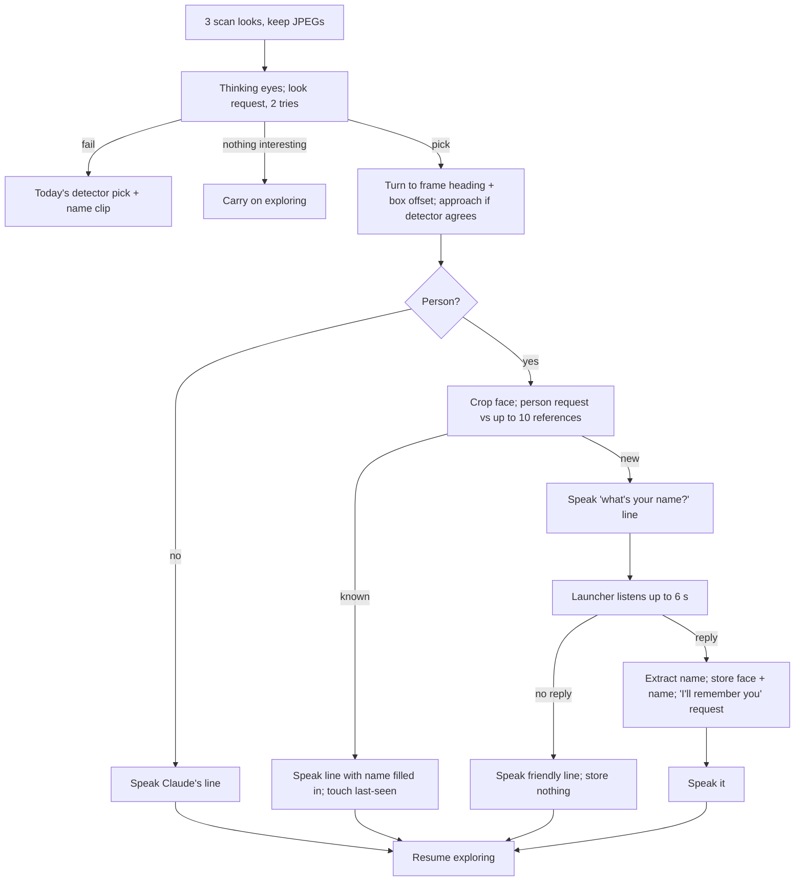

# Explore Mode on Claude - Plan

## Goal Capsule

- **Objective:** At each curiosity stop, the robot notices what is genuinely interesting to him (people first, then animals, then technology), says something personal and lively about it in words Claude wrote, remembers the people he meets across days by face and by name, and then returns to exploring.
- **Product authority:** This Product Contract. It covers Explore's curiosity stops, people memory, and the People section of the Settings page. The robot's voice is a separate plan and is used as-is; Voice mode on Claude is not in scope.
- **Open blockers:** None.

---

## Product Contract

### Summary

Claude becomes the robot's curiosity. At each stop, his scan frames go to Claude in one call; Claude picks the most interesting thing and writes what he says, and he turns toward it and speaks through the launcher's speech service. He remembers faces on the robot indefinitely: a new person is asked their name, which he hears with on-robot speech recognition, and a second Claude call writes a personal "nice to meet you, I'll remember you" line. Known people are greeted by name. The Settings page lists the people he knows, each with Forget and Rename.

### Problem Frame

Explore's curiosity stops today recognize only 341 fixed object names with an on-robot detector, pick the biggest box, and say one pre-recorded clip ("ooh, a plant"). He treats a person, a pet, and a chair the same way, repeats himself, and forgets everyone. The owner wants him to talk more about what he sees, care most about living things and technology, speak to people and about animals with compliments and jokes, get more excited about anything new and most of all new people, and know people again later. The robot can now reach Claude (the Claude settings plan) and speak any sentence (the robot voice plan, placeholder voice for now).

### Key Decisions

- **Claude picks the target and writes the words; the on-robot detector only steers.** (session-settled: user-directed — chosen over the detector picking the target with Claude only commenting, and over Claude steering every correction: Claude should do the choosing, and steering must stay fast.) Governs R1, R2, R3, R4.
- **Every line he says is written by Claude; nothing he says in a curiosity reaction is canned.** (session-settled: user-directed — decided by the owner at scope confirmation.) Governs R5, R6, R11.
- **A slow or failed Claude call is retried before falling back.** (session-settled: user-directed — the owner asked that he prompt Claude again rather than give up; the retry limit is this plan's choice.) Governs R7, R8.
- **People are remembered across days by face, kept until the owner forgets them, and only once they reply.** (session-settled: user-directed — chosen over session-only text memory, no people memory, and automatic expiry; and over storing faces of people who don't answer.) Governs R9, R10, R12, R13, R14.
- **A new person is asked their name, heard with on-robot speech recognition.** (session-settled: user-directed — chosen over sending the reply to the Linux host and over asking without listening.) Governs R11, R12.
- **Explore goes on Claude before Voice mode.** (session-settled: user-directed — chosen over Voice first.)

### Requirements

**Choosing and reacting**

- R1. At each curiosity stop, the frames from his scan turns go to Claude in one request, which returns the most interesting thing (or nothing worth reacting to), which frame it is in and roughly where, what it is, and the line he says.
- R2. Claude's choice follows the owner's priorities: people first, then animals, then technology, then anything else; things and people he has not seen before are more interesting than familiar ones.
- R3. He turns toward the chosen thing. When the on-robot detector recognizes it, the detector guides the approach as today; when it does not, he faces the reported direction without driving up to it.
- R4. When Claude reports nothing worth reacting to, he carries on exploring without speaking.
- R5. What he says to a person is addressed to them (a greeting, compliment, or joke); what he says about an animal or thing is about it. Lines are short enough to speak in a few seconds and sound excited, especially for anything new.
- R6. He speaks after the scan's looks are finished, not while the camera and detector are busy, so speech stays fast (robot voice plan KTD8).

**When Claude is slow or unreachable**

- R7. While waiting for Claude he shows his thinking eyes. A request that times out or fails is retried; after 2 attempts of about 10 seconds each, he gives up for this stop.
- R8. Giving up means today's behavior: the detector's pick and its pre-recorded name clip, or nothing if the detector found nothing. He never freezes or goes silent for longer than the retry limit.

**People**

- R9. When the chosen thing is a person, he compares their face with the people he has already met and learns whether this is someone known, and their name if one is stored.
- R10. A known person is greeted by name in a Claude-written line that shows he remembers them; an unnamed known person is greeted as someone he has seen before.
- R11. A new person is asked their name in a Claude-written line. After he finishes speaking he listens for a few seconds, hears the reply with on-robot speech recognition, and stores the name. A second Claude request, given the name and the person's photo, writes a personal line about them that tells them he will remember them.
- R12. A face is stored only once the person answers (a name or any reply he can hear): talking to the robot is the consent to be remembered. If he hears no reply, he says a friendly Claude-written line and does not keep their face. If he hears a reply but no clear name, he keeps the face as an unnamed person, whom the owner can name on the Settings page.
- R13. Face images stay on the robot and are kept until the owner forgets that person. They leave the robot only inside requests to the configured Claude endpoint.
- R14. Each face comparison includes at most a fixed number of stored faces, most recently seen first, so requests stay bounded as he meets more people.

**People on the Settings page**

- R15. The Settings page has a People section listing everyone he remembers, with their face, name (or "unnamed"), and when he last saw them.
- R16. Each person has a Forget button, which deletes their face and name for good, and a Rename field, which changes the name he uses next time.

### Acceptance Examples

- AE1. **Covers R1, R2, R3.** Given the scan frames show a chair on the left and a cat on the right, when Claude answers, then he turns right toward the cat and speaks a line about the cat, even if the detector did not recognize the cat.
- AE2. **Covers R9, R11.** Given a person he has never seen, when he reacts, then he asks their name, listens after he finishes speaking, stores "Sarah" with her face, and says a Claude-written line using "Sarah" that tells her he'll remember her.
- AE3. **Covers R10.** Given Sarah was stored yesterday, when he sees her today, then he greets her by name.
- AE4. **Covers R7, R8.** Given the Claude endpoint is unreachable, when a curiosity stop happens, then he shows his thinking eyes, tries twice, and then reacts with the detector's pick and its name clip, all within about 20 seconds.
- AE5. **Covers R12.** Given a new person who doesn't answer, when he listens, then he says something friendly and stores nothing; given a person who answers with something that isn't a clear name, he stores them as unnamed for the owner to name later.
- AE6. **Covers R16.** Given Sarah is stored, when the owner presses Forget, then her face and name are deleted, and next time he treats her as someone new.

### Scope Boundaries

- Voice mode on Claude, and any conversation beyond asking a name.
- The robot's trained voice (separate plan); this plan uses whatever voice is loaded.
- Recognizing people without a network connection. Face matching needs Claude.
- Automatic expiry of remembered people.

<!-- ce-section: work-relationships -->
### How This Work Fits Together

This plan covers Explore's curiosity stops and people memory. The breakdown below is the current understanding, not a committed roadmap.

- Robot voice (`docs/plans/2026-09-24-1406-feat-robot-voice-on-device-tts-plan.md`). This plan depends on its speech service and needs no change when the trained voice lands.
- Claude settings (`docs/plans/2026-09-24-1019-feat-robot-settings-claude-api-plan.md`). This plan reads the endpoint, key, and model through it.
- Voice mode on Claude. Could reuse this plan's speech recognition and people memory. Still to decide.

### Dependencies / Assumptions

- Claude reads several images in one request and can report roughly where something is in a frame.
- The robot's microphone works in Explore's process; voice mode verified the audio path. The microphone is ducked while the robot speaks, so he listens only after he finishes speaking.
- sherpa-onnx, already in the launcher, also runs small English speech-recognition models. Unusual names may be misheard; Rename (R16) is the correction path.
- Consent basis (owner's statement): people who talk to the robot have consented to having their face remembered. Faces are stored only after a reply (R12).
- Owner-accepted: the Settings page is reachable by anyone on the Wi-Fi without a login, so the People section is too.
- A curiosity stop happens every 20–40 seconds, so the Claude cost is one or two image requests per stop.

### Sources / Research

- Grounding for curiosity stops, timing, frames, and speech: `mode-explore/src/com/miko3/mode/explore/` (ExploreBrain, ExploreCamera, ExploreTuning, the detector) and `docs/plans/2026-09-23-1037-feat-explore-camera-curiosity-plan.md`.
- `shared/src/com/miko3/shared/ClaudeApi.java`: listModels and testConnection only; no image Messages call yet.
- `shared/src/com/miko3/shared/RobotSpeechClient.java` and the robot voice plan KTD8 (speak after heavy work pauses).
- `docs/hardware/voice-mic.md`: microphone path and ducking.
- Planning research: Anthropic vision (image tokens `ceil(w/28)*ceil(h/28)`, 640x480 is about 414 tokens; up to 600 images per request; approximate pixel boxes), structured outputs via `output_config.format`, Claude's refusal to name people in images and the usage policy on consent-based biometrics; sherpa-onnx streaming zipformer-en-20M (41 MB int8, built-in endpointing); `android.media.FaceDetector` (API 1, offline).

Product Contract preservation: changed: R12 — after the brainstorm, the owner decided a face is stored only once the person replies (consent); recorded before planning.

---

## Planning Contract

### Key Technical Decisions

- KTD1. **Listening and the people store live in the launcher, next to speaking.** sherpa-onnx is already in the launcher, and adding it to Explore would clash with Explore's ONNX Runtime 1.30.0, the same reason the voice plan put speech there. The Settings page, also in the launcher, renders the People section from that store. Explore reaches both through caller-checked Binder services, built like `RobotSettingsService` and `SpeechService`. The launcher gains the RECORD_AUDIO permission. Implements R11, R13, R15, R16.
- KTD2. **One "look" request per stop with structured output, and one extra request only for a person.** The look request sends the three 640x480 JPEG scan frames and asks for JSON: `{interesting: bool, frame, box:[x1,y1,x2,y2], kind: person|animal|technology|other, label, line}`. The format is enforced with `output_config.format`, falling back to prompt-only JSON if the proxy strips that field. The person request (KTD3) happens only when the look request picks a person. Implements R1, R2, R5, R9.
- KTD3. **Face matching never sends names.** The person request sends the new face crop plus up to 10 stored faces (224 px JPEGs, most recently seen first), labelled "Reference 1..N", and states that they are consented photos from the household's own robot. It asks for `{match: N | "none" | "unsure", line}`. A known person's line uses a `{name}` placeholder, which the robot fills in on its side. "none", "unsure", or a refusal all count as a new person. Implements R9, R10, R14.
- KTD4. **Names are heard with a streaming zipformer model and extracted on the robot first.** sherpa-onnx's streaming zipformer-en-20M (int8) runs in the launcher, with built-in endpointing (about 0.8 s of trailing silence) and a 6 s cap. The name is pulled out with patterns ("I'm X", "my name is X", "call me X", a lone word). If none match, a small text-only Claude request is the fallback. A second Claude request, given the name and the face, writes the "nice to meet you, I'll remember you" line. Implements R11, R12.
- KTD5. **Faces are cropped with Android's built-in FaceDetector inside the chosen person box.** The hit is expanded 1.6x and saved as a 224x224 JPEG. When no face is found, the top 25% of the person box is used. No new model is added. Implements R9, R13.
- KTD6. **Claude waits in a new brain state, polled like a look, with two tries of about 10 seconds.** The brain stays single-threaded and free of shared imports: a port starts the request and the brain polls it each tick. The HTTPS transport gets a per-call read timeout, because its fixed 30 s would break the 10 s tries. A new "thinking" eye state covers the wait. Implements R7, R8.
- KTD7. **Direction comes from the scan turn plus the box's horizontal offset.** He turns to the chosen frame's scan heading, then by the box centre's offset from the frame centre. The detector's approach is used when one of its detections in that frame overlaps Claude's box with the same broad kind. Otherwise he faces the thing and doesn't drive. Implements R3.
- KTD8. **Speaking waits for the finished callback, and listening starts only after it.** The launcher's microphone is ducked while it plays, so it listens only once the speech queue is idle. Explore speaks through `RobotSpeechClient` and polls a finished flag, with a timeout as a backstop. Implements R6, R11.

### High-Level Technical Design

### Sequencing

U1, U2, and U3 are independent building blocks. U4 needs U1. U5 needs U2, U3, and U4. U6 wires everything together, and U7 verifies it on the robot.

---

## Implementation Units

### U1. Claude vision requests

- **Goal:** The shared Claude client can send images and text, and return parsed JSON within a per-call timeout.
- **Requirements:** R1, R5, R7; KTD2, KTD3, KTD6
- **Dependencies:** None
- **Files:**
  - Modify: `shared/src/com/miko3/shared/ClaudeApi.java`, `ClaudeHttpsTransport.java`
  - Test: `scripts/tests/test_claude_api.py` with its harness
- **Approach:**
  1. Add a `messages(settings, system, content blocks, schema, timeoutMs)` call. Image blocks are base64 JPEG.
  2. Send `output_config.format` when a schema is given. If the endpoint answers 400 with a message naming that field, retry once without it, with the schema in the prompt, and remember that for the session.
  3. Return the parsed JSON object or the existing fixed `Reason`. Never log the response text, the images, or the key.
- **Patterns to follow:** `testConnection`, its fake transport, and error mapping.
- **Test scenarios:**
  - Happy path: three image blocks plus text serialize in order, and the JSON reply parses.
  - The 400 fallback: a rejected `output_config` leads to exactly one retry without it, and later calls skip it.
  - The per-call timeout reaches the transport. A timeout maps to `UNREACHABLE`.
  - A reply that isn't valid JSON maps to a fixed reason, not a crash.
  - A refusal (a text reply with no JSON) is reported distinctly, so KTD3 can treat it as "no match".
- **Verification:** The harness passes and the four APKs build.

### U2. People store and People section

- **Goal:** The launcher remembers people (face, name, last seen), serves them to Explore, and lets the owner rename or forget them.
- **Requirements:** R13, R14, R15, R16; AE6
- **Dependencies:** None
- **Files:**
  - Create: `launcher/src/com/miko3/launcher/PeopleStore.java` (plain Java: ids, name, last-seen, face file paths, "recent N")
  - Create: `launcher/src/com/miko3/launcher/PeopleService.java`
  - Create: `shared/src/com/miko3/shared/RobotPeople.java` (hand-written Binder: `recent(n)` returning ids and 224 px JPEGs, `add(faceJpeg, nameOrNull)`, `touch(id)`, `nameOf(id)`)
  - Create: `shared/src/com/miko3/shared/RobotPeopleClient.java`
  - Modify: `launcher/src/com/miko3/launcher/SettingsPage.java` (People section, rename and forget POSTs, and a TLS-only GET for a face image by id), `LauncherApp.java`, `launcher/AndroidManifest.xml`, `shared/src/com/miko3/shared/LauncherProtocol.java`
  - Test: `scripts/tests/test_people_store.py` plus the page harness
- **Approach:** Store faces as JPEG files in launcher-private storage, with an index file written durably. Forget deletes the file and the entry. A name is trimmed and length-capped, and the page escapes it. The Binder reply stays well under the 1 MB transaction limit (10 x about 15 KB). The caller check reuses `CallerGate`.
- **Test scenarios:**
  - add, then recent: newest first, capped at N.
  - touch moves a person to the front.
  - rename changes the name used next time; an empty name makes the person unnamed.
  - Covers AE6. forget deletes the file and the entry, and a later match can't find the person.
  - The page lists faces with names or "unnamed" and last seen.
  - The face image GET refuses unknown ids and plain HTTP.
  - A stale token is refused for rename and forget, and the status never echoes the name.
  - An unpinned caller is refused by the service.
- **Verification:** The harness passes, the launcher builds, and the People section renders on the robot.

### U3. Listening in the launcher

- **Goal:** Explore can ask the launcher to listen for one short reply and get the transcript back.
- **Requirements:** R11, R12; KTD4, KTD8
- **Dependencies:** None
- **Files:**
  - Create: `launcher/src/com/miko3/launcher/ListenService.java` and `ListenSession.java` (plain Java: timing, endpoint and cap decisions)
  - Create: `shared/src/com/miko3/shared/RobotListen.java` and `RobotListenClient.java`
  - Create: `shared/src/com/miko3/shared/NameExtractor.java` (plain Java patterns)
  - Modify: `scripts/build-custom-launcher.py` (download and pin the zipformer-en-20M int8 model into `tools/third_party/` and stage it into the APK), `launcher/AndroidManifest.xml` (RECORD_AUDIO), `scripts/install-custom-launcher.py` or a documented `pm grant` step
  - Test: `scripts/tests/test_listen_service.py`, `scripts/tests/test_name_extractor.py`
- **Approach:**
  1. `listen(maxMs, callback)` waits until the speech queue is idle.
  2. It records 16 kHz mono and feeds sherpa-onnx's OnlineRecognizer.
  3. It stops at the endpoint or the cap, and returns the transcript, or empty for no speech.
  4. One listen at a time. A second caller is refused.
- **Test scenarios:**
  - `NameExtractor` handles "my name is Sarah", "I'm Sarah", "call me Sarah", "Sarah", "it's Sarah thanks", and "i am sarah jones" (becomes Sarah Jones). It returns null for "what?", "no", and "I don't know".
  - `ListenSession` stops at the endpoint, stops at the cap, and reports "no speech" on silence.
  - Listen waits while the speech queue is busy, then starts.
  - A second concurrent listen is refused. An unpinned caller is refused.
- **Verification:** The harness passes. On the robot, a spoken "my name is Sarah" comes back as the transcript (U7).

### U4. Claude picks and speaks at curiosity stops

- **Goal:** Curiosity stops use Claude's pick and line, and fall back to today's behavior.
- **Requirements:** R1–R8; AE1, AE4
- **Dependencies:** U1
- **Files:**
  - Modify: `mode-explore/src/com/miko3/mode/explore/ExploreBrain.java` (a new ASK and SPEAK flow, keeping all three scan looks), `ExploreCamera.java` (keep the JPEG bytes on `Look`), `ExploreTuning.java`, `ExploreState.java` (the thinking eye state)
  - Create: `mode-explore/src/com/miko3/mode/explore/CuriosityPort.java` (the brain-facing interface for "ask" and "speak", with no shared imports)
  - Test: `scripts/tests/test_explore_brain.py` with a scripted Claude fake shaped like `Vision`
- **Approach:**
  1. The scan runs all three looks and keeps each look's JPEG and detections.
  2. The ASK state shows the thinking eyes, starts the request through the port, and polls it, with two tries per KTD6.
  3. Turning and approaching follow KTD7.
  4. SPEAK hands the line to the port and waits for finished, with a backstop timeout.
  5. On failure it drops to today's Sighting path. On "not interesting" it resumes exploring. A person pick hands off to U5's flow.
- **Execution note:** Add the brain scenarios test-first, since the brain is heavily harnessed.
- **Test scenarios:**
  - Covers AE1. The chair is on the left in frame 1 and the cat is on the right in frame 3. Claude picks frame 3's cat, he turns to frame 3's heading plus the right offset, speaks the cat line, and doesn't drive if the detector has no cat box.
  - Claude picks a box that overlaps a detector box of the same kind, so the existing approach runs before speaking.
  - Claude says nothing is interesting: no speech, and exploring resumes.
  - Covers AE4. Both tries time out: thinking eyes, then the detector's pick and its name clip, all within the retry budget.
  - A speech-finished callback that never arrives ends at the backstop timeout.
  - The scan keeps all three looks even when the first one sees something.
  - The brain still imports nothing from `com.miko3.shared` (the existing guard).
- **Verification:** The Explore harness passes, including the existing scenarios.

### U5. Meeting and remembering people

- **Goal:** Person picks run the match, ask-name, and remember flow.
- **Requirements:** R9–R14; AE2, AE3, AE5
- **Dependencies:** U2, U3, U4
- **Files:**
  - Modify: `ExploreBrain.java` (the person sub-flow: MATCH, GREET, ASK_NAME, LISTEN, REMEMBER), `CuriosityPort.java` (match, listen, remember)
  - Create: `mode-explore/src/com/miko3/mode/explore/FaceCropper.java` (the Android `FaceDetector` crop per KTD5, behind an interface)
  - Test: `scripts/tests/test_explore_brain.py`
- **Approach:**
  1. Crop the face and send the person request (KTD3).
  2. Known: fill in `{name}`, speak, and `touch`.
  3. New: speak the ask line, then listen (U3).
     - No reply: speak a friendly line and store nothing (R12).
     - A reply: extract the name, falling back to Claude, then `add` the face and name (null if unclear), request the "I'll remember you" line with the name and face, and speak it.
- **Test scenarios:**
  - Covers AE3. The match returns reference 2, which is "Sarah", so the spoken line has "Sarah" in place of `{name}` and `touch` is called.
  - Covers AE2. A new person replies "my name is Sarah", so `add(face, "Sarah")` is stored and the remember line is spoken.
  - Covers AE5. A new person gives no reply: nothing is stored and a friendly line is spoken.
  - Covers AE5. The reply "hmm what?" has no name, so the person is stored unnamed.
  - The match says "unsure" or refuses, so the new-person flow runs.
  - A match reference number beyond the gallery counts as no match.
  - The listen or remember call fails: still no hang, and exploring resumes within the budget.
  - No names are ever included in the match request (checked on the fake port's captured request).
- **Verification:** The harness passes.

### U6. Wire Explore to the launcher and Claude

- **Goal:** Explore's real adapters connect the ports to `ClaudeApi`, `RobotSettingsClient`, `RobotSpeechClient`, `RobotPeopleClient`, and `RobotListenClient`.
- **Requirements:** R1–R16
- **Dependencies:** U1–U5
- **Files:**
  - Modify: `mode-explore/src/com/miko3/mode/explore/ModeApp.java` and the adapter classes, plus the prompt text constants (system prompt: the owner's priorities, excitement for new things, short lines, never guess identities)
  - Test: source-wiring checks in `scripts/tests/test_explore_brain.py` or a new test file
- **Approach:**
  1. Fetch settings per stop. When they're not set up, go straight to the fallback.
  2. Run requests on a worker thread and hand results to the brain's polled port.
  3. The prompts live in one place, with the schemas from KTD2 and KTD3.
- **Test scenarios:**
  - Source wiring: ModeApp builds the real port with the five clients.
  - The look prompt contains the priority order.
  - The match prompt contains the consented-reference framing and no names.
  - No `Log` call touches images, the key, or response text.
- **Verification:** All four APKs build.

### U7. On-robot verification

- **Goal:** Prove the experience on the robot.
- **Requirements:** R1–R16; AE1–AE6
- **Dependencies:** U6
- **Files:** Test expectation: none. This is a manual device run, with results in the PR description.
- **Approach:**
  1. Install the launcher and Explore, and grant the launcher RECORD_AUDIO.
  2. With the owner present, run curiosity stops at a person, a pet or stuffed-animal stand-in, and a laptop.
  3. Check the new person's name exchange (AE2), a re-greet by name after restarting Explore (AE3), and no reply (AE5).
  4. Unplug Wi-Fi for a stop (AE4).
  5. Forget and rename on the Settings page (AE6).
  6. Measure the look request's latency through the proxy and check the match request isn't refused.
- **Execution note:** Restart the launcher with `am force-stop` then `am start`, and confirm the new APKs are running before timing anything.
- **Verification:** Each AE is observed and the timings are recorded.

---

## Verification Contract

| Gate | Command or check | Proves |
|---|---|---|
| Host tests | `python3 -m unittest discover scripts/tests` | Client, store, listen logic, name extraction, brain flows |
| Builds | all four `scripts/build-*.py` | Shared changes compile everywhere; the launcher bundles the ASR model |
| Device | U7 run with the owner | AE1–AE6, latency, match not refused |

## Definition of Done

- Every unit's verification holds, and U7's results are recorded.
- The host suite and all four builds pass.
- No face images or names are committed or logged.
- No temporary hooks remain.
