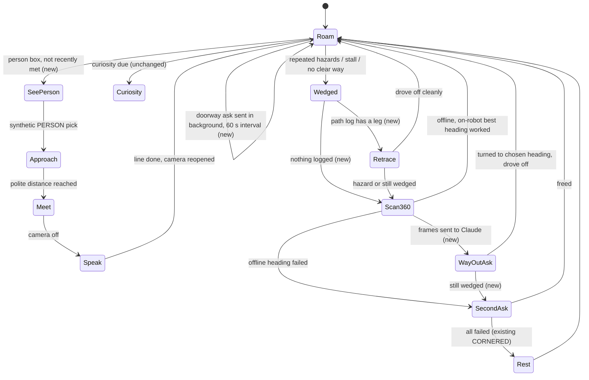

# Explore Camera Navigation - Plan

## Goal Capsule

- **Objective:** In Explore mode the robot gets himself out of corners and tight spots within about 30 seconds without help, roams toward open floor and open doorways instead of into walls (wandering from room to room), and drives up to people he sees to meet them.
- **Means:** The camera stays on while he roams and is judged with the front floor sensor on the robot (KTD2, KTD3); the gyroscope gives measured turns and a path log (KTD1); Claude makes the calls the robot's hardware cannot: open doorways, the way out of a wedge, and whether a person was just met (KTD4).
- **Product authority:** This Product Contract. It covers Explore's roaming, escapes, and seeking people. What Claude picks and says at curiosity stops, and the meeting itself, stay as `docs/plans/2026-09-24-1545-feat-explore-on-claude-plan.md` defines them.
- **Stop conditions:** Stop and report if the gyroscope capture (U1) shows no usable yaw signal; the navigation then has no measured turns, and R4, R11 and R12 need a different means.
- **Execution profile:** Plain-Java brain logic tested on the host through the Explore brain harness; device adapters verified on the robot at 192.168.19.74 with the owner.
- **Open blockers:** None.

---

## Product Contract

Product Contract preservation: added R17 — the owner's request (2026-09-25, after the U3 camera check found frames too dim) that the robot adjust its own camera brightness; changed: R12, R13 — the escape scan's pictures are judged by Claude when it is reachable, with on-robot scoring as the offline fallback, and R13 becomes the second Claude ask; added R16 — the owner's direction (2026-09-25) that Claude takes over wherever the robot's hardware falls short.

### Summary

Explore gets real navigation. The camera stays on while he roams, and with the floor sensor he steers away from walls toward open floor, open doorways, and people, wandering between rooms and driving over to meet people he spots. When wedged he backs out the way he came, then turns a measured full circle and lets Claude pick the way out from what he saw; Claude also points out open doorways now and then and tells him whether a person is someone he just met.

### Problem Frame

He gets stuck in corners often. Wedged between a wall and a potted plant, he turned side to side, never found a way out, gave up and rested for a minute, then did the same again. His only forward sensor looks down at the floor about 20 cm ahead, so each turn checks one spot at a time, and he never learns which way was open. Turns are timed rather than measured, the back-off is blind, and his heading between hazards is random or simply the opposite side. Outside corners the same blindness drives him into walls and furniture, and he has no way to notice an open doorway or a person across the room: the camera is on only at curiosity stops.

### Requirements

**Sensing**

- R1. The camera is on whenever he is roaming or escaping, and what it sees is used to choose where he drives.
- R2. The front floor sensor and the camera are judged together: the floor sensor decides about the ground right in front of him (edges, stairs, near obstacles), which the camera cannot see, and the camera decides about the room from about 3–4 ft out.
- R3. Whenever he speaks, he stops driving and the camera is switched off; he resumes roaming once he has finished speaking and the camera has safely reopened.
- R4. His turns go to measured angles from the gyroscope, so he can turn to face a specific direction he saw and know which directions he has already tried.
- R17. The robot adjusts its own camera brightness to the light it has: brighter when the picture is too dark, darker when it is too bright, so he can see in dim and bright rooms alike.
- R5. If the camera fails or will not open, he keeps roaming on the floor sensor and wheel-stall sensing as today and retries the camera now and then; a camera failure never stops Explore.

**Roaming**

- R6. He prefers open floor and steers away from walls and furniture he can see ahead, before he reaches them.
- R7. He is drawn to open doorways and goes through them into other rooms; he treats a closed door as a wall.
- R8. While roaming he asks Claude where the open doorways are at most about once a minute, and never while he is approaching or meeting a person.

**People**

- R9. When he sees a person while roaming, he drives toward them, stops at a polite distance, and runs the meeting (greeting a known person by name, asking a new person's name).
- R10. After meeting someone he leaves that person alone for 10 minutes: he does not drive toward them again in that time.

**Escaping**

- R11. When he is wedged, he first backs out along the path he drove in on, which is known to be open.
- R12. If that does not free him, he turns a measured full circle taking pictures, Claude picks the most open direction from them (open floor, an open doorway, or a person), and he turns to face it and drives out; without Claude he picks the direction on the robot.
- R13. If that still does not free him, he asks Claude once more, with what the camera sees now, which way is out, and follows the answer.
- R14. Only when all three fail does he rest, as today, before trying again.

**Claude**

- R16. Wherever the robot's own hardware falls short, Claude makes the call: telling open doorways from closed doors, choosing the way out of a wedge, and recognizing whether a person is someone he just met. Steering while he is moving stays on the robot.

**Privacy**

- R15. Camera frames used for navigation stay on the robot and are never stored or logged; pictures leave the robot only for the Claude requests in R8, R10, R12 and R13 and the existing curiosity-stop requests.

### Key Decisions

- **Camera on while roaming.** Continuous steering is tried first; stopping to look before each leg is the fallback if it does not work. Governs R1. (session-settled: user-directed — chosen over looking only at each leg and over the camera only when stuck: smoother, more purposeful roaming; look-then-go stays the fallback.) This supersedes R2 of `docs/plans/2026-09-23-1037-feat-explore-camera-curiosity-plan.md`, which kept the camera off while wandering.
- **Stop and switch the camera off to speak.** Keeps speech fast (it slows about 4x with the camera and detector busy) and frees the processor. Governs R3. (session-settled: user-directed — chosen over speaking while the camera runs: speech under camera load is too slow.)
- **One plan for escaping, open-space steering, and seeking people.** Governs R6–R14. (session-settled: user-directed — chosen over planning corner escape alone or escape plus open-space steering first: the owner wants all three together.)
- **Floor sensor and camera together.** Governs R2. (session-settled: user-directed — chosen over judging clear space from the camera alone: the camera cannot see the ground near his nose.)
- **On-robot steering, retrace-then-scan escapes, Claude for doorways and as the escape backstop.** Governs R8, R11–R13. (session-settled: user-directed — chosen over on-robot only, over Claude navigating every leg, and over Claude only as the escape backstop: on-robot steering keeps him quick and working offline, while Claude spots open doorways the on-robot detector may miss.)
- **Offload to Claude where the hardware falls short.** Governs R10, R12, R16. (session-settled: user-directed — chosen over on-robot-only judgment with a later on-robot depth model: the owner's standing direction is that Claude takes over wherever the robot's hardware is lacking.)
- **Drive over and meet.** Governs R9. (session-settled: user-approved — chosen over a short remark only and over drifting toward people without a meeting: meetings are how he learns names.)
- **Open doorways lead to other rooms.** Governs R7. (session-settled: user-directed — chosen over staying in one room and over a per-session setting, and only open doorways, never closed doors.)
- **A leave-alone window after meetings, a cap on doorway asks, and camera-free roaming on failure.** Governs R5, R8, R10. (session-settled: user-approved — proposed with the trade-offs shown and confirmed: avoids hovering over one person, keeps room pictures sent to Claude infrequent, and keeps Explore running on a wedged camera.)
- **Real turn angles are required.** Turning toward what he saw and retracing a path both depend on knowing his heading, so the gyroscope readings the robot already sends must be put to use. Governs R4, R11, R12.

### Acceptance Examples

- AE1. **Covers R11, R12, R14.** Given he has driven between a wall and a potted plant and is wedged, when he escapes, he backs out the way he came in and is roaming freely again within about 30 seconds; he rests only if retracing, the full-circle scan, and Claude all fail.
- AE2. **Covers R7.** Given an open doorway and a closed door are both in view, he heads for the open doorway and passes through it; he steers away from the closed door as he would from a wall.
- AE3. **Covers R2, R7.** Given an open doorway leads to a step down, when he reaches the step, the floor sensor stops him even though the camera saw an open doorway.
- AE4. **Covers R9, R10.** Given he spots the owner across the room, he drives over, stops at a polite distance, and greets them by name; seeing the owner again 5 minutes later, he keeps roaming instead of driving over.
- AE5. **Covers R3.** Given he is about to speak while roaming, he stops, the camera switches off, he speaks, and he resumes roaming once the camera has reopened.
- AE6. **Covers R5.** Given the camera fails to open after a cold boot, he roams using the floor sensor and wheel-stall sensing, and later retries the camera.
- AE7. **Covers R8, R12, R13.** Given the robot has no internet, doorway asks and the Claude escape steps fail quietly, and he keeps roaming and escaping on the robot alone.

### Success Criteria

- He frees himself from any corner or tight spot within about 30 seconds, without help.
- Camera-while-roaming counts as not working, and the plan falls back to stopping to look before each leg, if it makes him run hot, drains the battery noticeably faster than today, makes the camera driver fail repeatedly, or makes him visibly lag in reacting. These triggers are assumptions: the owner named only the 30-second target.

### Scope Boundaries

- Remembering the layout of the house between sessions, or mapping rooms.
- Following a person around after a meeting.
- The desk-edge fix (blind turns and back-offs at desk edges, `docs/TODO.md`).
- What Claude picks and says at curiosity stops, including the ceiling-light picks and top-3 picks with a "seen" expiry (`docs/TODO.md`).
- Rear or side obstacle sensing beyond what the robot already has.

#### Deferred to Follow-Up Work

- An on-robot monocular depth model. Research put the candidates at 1–5 s a frame on this CPU, and the owner's direction sends what the hardware cannot do to Claude instead.
- Splitting the curiosity half out of `ExploreBrain` (`docs/TODO.md`); this plan adds its navigation as separate classes instead of growing the brain further.

### Dependencies / Assumptions

- The gyroscope readings in the robot's sensor record are usable for heading; they are sent today but nothing reads them, so their axis, scale and accuracy are unverified until U1's capture.
- The camera stays stable when kept open for long periods; it has a known driver bug with variable frame rates, a fragile first open after a cold boot, and hangs if reopened too soon after closing.
- The on-robot detector's vocabulary includes "door" and "person", but it cannot tell an open door from a closed one, and it treats doors as background; the Claude doorway asks (R8) cover that.
- Curiosity stops continue as the Explore on Claude plan defines them.

### Outstanding Questions

**Deferred to Planning**

- None remain; the three brainstorm questions are answered by KTD3 (open floor), KTD5 (retrace distance and polite distance, as tuning), and KTD7 (the look-then-go switch).

### Sources / Research

- Current roaming and escape: `mode-explore/src/com/miko3/mode/explore/ExploreBrain.java` (escape sweep, stall detection, blind back-off, `syncCamera`), `mode-explore/src/com/miko3/mode/explore/ExploreTuning.java` (timed turns, "6 s of turning is assumed to be about a full circle").
- Sensors: `docs/hardware/tof-sensor.md`; `shared/src/com/miko3/shared/SensorReply.java` and `SensorSnapshot.java` (no IMU parsing; `number()` reads only unsigned digits); stationary gyro records in `scripts/tests/fixtures/explore_sensor_records/baseline.txt` (`IMUGY=0000000062,-000000757,0000000093`).
- Camera limits: `docs/hardware/camera-vision.md` (forward and slightly up, floor only in the bottom rows, reopen gap, ~0.6 s per look, too slow to track while driving).
- Speech under camera load: `docs/TODO.md` (Robot voice section).
- People meeting: `docs/plans/2026-09-24-1545-feat-explore-on-claude-plan.md`; no person-following code exists (`docs/hardware/person-tracking.md`).
- Detector vocabulary: `mode-explore/assets/vocabulary.txt`; doors, windows and stairs are background in `mode-explore/src/com/miko3/mode/explore/Sighting.java`.
- Cheap free-space methods: floor-colour appearance model on the bottom rows (Ulrich & Nourbakhsh, AAAI 2000), a horizon-crossing test for an up-tilted camera (de Croon), detector box bottoms as obstacle proxies; gyro bias re-estimated at every stop (Analog Devices RAQ 139); UMBmark for odometry errors (Borenstein).

---

## Planning Contract

### Key Technical Decisions

- KTD1. **Heading from the gyroscope, distance from the encoders.** A new plain-Java heading tracker integrates the yaw rate from each sensor reading's timestamp, re-estimates the gyro bias whenever the wheels are still and no motion is commanded, and keeps a short log of legs (heading, encoder distance) since he last drove off cleanly. Turn speed cannot be set (`DirectMotorDriver.driveTurnSustained` uses only the sign), so a measured turn starts the sustained turn and stops when the tracked heading is within a tolerance of the target, less a learned overshoot. Axis, scale and sign come from an owner-guided capture (U1) stored in the existing `ExploreCalibration` file, not hard-coded.
- KTD2. **The camera is wanted by rule, not by state list.** `ExploreBrain.syncCamera()` stays the one place the camera opens and closes; its predicate becomes "camera wanted": any roaming, escaping or curiosity state, except the meeting and talking states (MEET, SPEAK, ASK_NAME, LISTEN, NAME, REMEMBER, NAME_CLIP), the rest state, lease or sensor loss, and a camera backoff. Governs R1, R3, R5. The harness invariant at `ExploreBrainHarness.java:288` (camera open only in curious states) is rewritten to check the same rule. (session-settled: user-directed — chosen over look-then-go per leg and camera only when stuck: continuous steering tried first.)
- KTD3. **Open floor is judged on the robot from three cheap signals, never a depth model.** Each look carries a per-column "openness" profile built on the detect thread from:
  1. the bottom edges of the detector's boxes (a box reaching low in the frame is near);
  2. a floor-colour model of the bottom rows, learned only while the floor sensor reads floor and the wheels are turning freely;
  3. a horizon test (anything crossing the horizon line in the lower frame is an obstacle).

  The brain never sees pixels; it sees the profile. The floor sensor and stall sensing always win over the camera near his nose. Governs R2, R6. (session-settled: user-directed — chosen over judging clear space from the camera alone: the camera cannot see the ground near his nose.)
- KTD4. **Three new Claude requests, all through `CuriosityPort` and `ClaudeCuriosity`, each with its own schema in `ExplorePrompts` and validation in `ClaudeReplies`.**
  - A doorway ask with one roaming frame: is there an open doorway, and where.
  - A way-out ask: which frame and where. It serves both the scan's ask (the scan's frames) and the second ask (the current frame), with one schema.
  - A recently-met check, a new port method modelled on the existing `match`/`matchAnswer` request. It sends the roaming face crop together with the stored faces of everyone met in the last 10 minutes and asks whether it is one of them. It never calls the `MikoExploreFaceDebug` dump, so no roaming frame or crop is written to disk (R15).

  Answers in frame coordinates become gyro headings the moment they arrive, so a slow answer still points the right way. Governs R8, R10, R12, R13, R16. (session-settled: user-directed — chosen over on-robot-only judgment: the owner directs that Claude takes over where the hardware falls short.)
- KTD5. **Navigation logic lives in new plain-Java classes; the brain only wires them.** The heading tracker, the openness scorer, the escape planner (retrace → scan → Claude → rest) and the roaming steer are separate classes, each with no `android.*` and no `com.miko3.shared` imports, listed in `test_explore_brain.py`'s `PLAIN_JAVA`. `ExploreBrain` is already 2055 lines. Retrace distance, polite distance, scan step, openness thresholds, the doorway-ask interval (60 s) and the leave-alone window (600 s) are `ExploreTuning` fields with owner-evidence comments.
- KTD6. **Retrace drives forward, not backward.** Backing up is blind. The retrace walks the leg log backwards: for each leg, newest first, it turns to face the reverse of that leg and drives its distance forward, stopping once the total reaches the retrace distance, so the floor sensor and camera guard every step. A hazard during the retrace ends it and moves on to the scan. When turns are blocked, he first reverses straight along the most recent forward leg, capped at its logged distance — ground he just drove over — then turns. (Added after live QA 2026-09-25: wedged under a desk, measured turns physically could not rotate.) When no logged leg qualifies, any blocked measured turn (roaming, the escape's turns, the first move after a rest) first backs up blind a few ticks (`blockedTurnBackTicks`, stopped early by a stall, not logged as a leg) and retries that turn once; a second block proceeds as before. (Added after live QA 2026-09-25: pinned after a CPL stop, all he needed was to back up a little and then spin.)
- KTD7. **Look-then-go is a tuning mode behind a debug switch.** `ExploreTuning` gains a navigation mode (continuous by default, look-then-go as the fallback), selected on the robot by a `log.tag.MikoExploreLookThenGo` prop the same way the existing `MikoExplore*` hooks work. In look-then-go the camera opens at each leg decision and closes before driving. Governs the Success Criteria fallback.
- KTD8. **A roaming person becomes a PERSON pick for the existing meet flow.** A detector "person" box seen while roaming becomes a synthetic PERSON pick. That pick enters APPROACH to the polite distance and then MEET, so greeting and naming stay exactly as the Explore on Claude plan built them. The leave-alone is per person:
  - The brain keeps a list of everyone met in the last 10 minutes, each with the time their meeting ended.
  - While that list is non-empty, every PERSON pick first needs Claude's recently-met check (KTD4) to answer "none of them" before he approaches. That covers picks made while roaming and picks made at a curiosity stop.
  - A pending, failed or unsure check counts as "just met". A curiosity pick then ends as a remark without approaching.
  - At most one check goes out per 60 s. Between checks, any person seen while the list is non-empty counts as "just met".

  This replaces the global 2-minute `peopleCooldownMs` for approaches only; the curiosity prompt's cooling-down wording is untouched. Governs R9, R10.
- KTD10. **Self-adjusting exposure by hand, not the fps-range trick.** A plain-Java brightness controller reads each frame's mean brightness (already computed for openness) and steers manual exposure time and sensitivity (`CONTROL_AE_MODE_OFF`, the path remote-control proved safe on this camera) toward a target, with hysteresis and small steps. Exposure is capped shorter while he is driving (motion blur) and may run longer while he stands still. The frame-rate range stays fixed, since a variable range triggers the driver bug. A camera that does not list `AE_MODE_OFF` keeps today's auto exposure with maximum compensation. Governs R17. (session-settled: user-directed — the owner asked for adjustable, self-improving brightness after the dim gate frames, over leaving auto exposure at its ceiling.)
- KTD9. **He slows down for what the camera sees; he never stops for it alone.** Detector looks take about 0.6 s, too slow to track while moving. The roaming steer therefore bends the next leg toward the most open columns and shortens a leg when the columns ahead read blocked. Only the floor sensor, stall sensing and the controller's own refusal (CPL=2, never retried) stop him. Governs R2, R6.

### High-Level Technical Design

The roaming and escape flow, as states the brain moves through (existing states in plain names, new ones marked new):

### Assumptions

- The gyroscope's yaw is one of the three `IMUGY` fields; the stationary fixture suggests a small drifting bias. If U1 finds no usable yaw, the plan stops (Goal Capsule stop condition).
- The robot's drive speed and the detector's ~0.6 s look leave enough time to bend a leg before a wall 3–4 ft away; U8 measures this on the floor.
- A reduced-scale decode of each 640x480 frame, with the floor band at higher resolution, is cheap enough on the detect thread next to the detector; U3 measures it.
- The recently-met check can use the roaming frame's face crop; a far-away face may be too small, which is why an unsure answer counts as "just met" (KTD8).

### System-Wide Impact

- **Remote-control mode** shares `SensorReply`, `SensorSnapshot` and `DirectMotorDriver`; U1 adds fields and an overload only, and remote-control must build and behave unchanged.
- **`CuriosityPort`** gains three requests (doorway, way-out, recently-met, per KTD4); every implementation must follow: `ClaudeCuriosity`, `CuriosityPort.NONE`, and the harness `Rig`. The Camera port gains a setter for the floor-teach flag (U3).
- **The calibration file** on the robot (`explore-calibration.properties`) gains gyro keys next to the floor-sensor thresholds; both QA scripts must preserve each other's keys (U1).
- **The launcher's services** (speech, listen, people, settings) are used as today; the only change there is load: speech now always runs with the camera closed.
- **The Claude endpoint** sees more requests: up to one doorway ask a minute while roaming, plus rare escape and recently-met asks, on top of curiosity stops.

### Risks & Dependencies

| Risk | Mitigation |
|---|---|
| The camera held open for many minutes surfaces a new driver fault (it has a fixed-fps bug, a cold-boot wedge and a reopen hang) | Keep the fixed fps range and the 3 s reopen gap; a missing look triggers the existing backoff and sensor-only roaming (R5); U8 runs a 10-minute roam and counts camera failures |
| Detector, openness decode, camera driver and brain compete for 4 weak cores, slowing looks and heating the robot | Detector stays at 2 threads; the openness decode runs at reduced scale; U3 and U8 measure time per look and CPU temperature; look-then-go (KTD7) is the prepared fallback |
| Gyro drift or scale error makes measured turns and retrace wrong | Bias re-estimated at every stop, scale from the owner capture, learned overshoot; timed turns remain when uncalibrated |
| The floor-colour model mistakes rugs or white walls | Several floor patches, the horizon test as a backstop, low confidence defers to detector boxes, and the floor sensor always wins near the nose |
| Claude doorway or way-out answers are wrong or slow | Answers become headings at capture time; stale answers are dropped by generation; the floor sensor still guards every step; offline behaviour is on-robot only (AE7) |
| More room pictures leave the robot | Capped by R8's interval, one recently-met check per 60 s (KTD8), and the rare escape asks; nothing stored or logged, including under the face debug switch (R15); only consenting people are around the robot (owner, 2026-09-24) |
| The harness camera invariant is rewritten and could hide a real regression | The new invariant is stricter where it matters: it still fails on the camera open during talking states or lease loss |

### Sequencing

U1 (gyro in the sensor path) comes first. It unblocks U2 (heading tracker), and U2 unblocks every measured turn. U3 (openness) and U4 (camera while roaming) can proceed in parallel with U2. U9 (self-adjusting brightness) follows U3, and U3's check on real frames, re-run with U9, gates U4. U5 (escapes) needs U2, U3 and U4. U6 (doorways) and U7 (people) need U2, U3 and U4. U8 (robot QA and docs) comes last.

---

## Implementation Units

### U1. Gyroscope readings in the sensor path, plus a calibration capture

- **Goal:** Every sensor reading Explore sees carries the raw gyro values, and an owner-guided capture yields the yaw axis, sign and scale.
- **Requirements:** R4; KTD1.
- **Dependencies:** None.
- **Files:**
  - `shared/src/com/miko3/shared/SensorReply.java`
  - `shared/src/com/miko3/shared/SensorSnapshot.java`
  - `mode-explore/src/com/miko3/mode/explore/SensorReading.java`
  - `mode-explore/src/com/miko3/mode/explore/ExploreDrive.java`
  - `mode-explore/src/com/miko3/mode/explore/ExploreCalibration.java`
  - `scripts/qa-explore-sensors.py`
  - `scripts/qa-explore-mode.py` (calibration merge)
  - `scripts/tests/test_qa_explore_mode.py`
  - `scripts/tests/test_sensor_reply.py`
  - `scripts/tests/test_qa_explore_sensors.py`
  - `scripts/tests/test_explore_drive.py`
- **Approach:**
  1. Parse `IMUGY=` as three signed integers with a new parser beside `number()`, which reads only unsigned 5-digit fields. An absent or all-X field stays `ABSENT`.
  2. Add the gyro to `SensorSnapshot` with a new constructor overload, following the wheel-field pattern. Remote-control mode shares the class and must keep compiling unchanged.
  3. Copy the gyro into `SensorReading` in `ExploreDrive.latest()`.
  4. Add a guided `--gyro-circle` step to `qa-explore-sensors.py`:
     - A new `MikoExploreSpin` debug hook makes Explore turn in place in one direction, then the other.
     - The owner presses Enter at each full turn.
     - The script treats `IMUGY` as a rate. It subtracts the stationary bias and integrates each axis over the reading timestamps. It picks the axis whose integral changes sign with the turn direction, and sets the scale as integrated counts per 360° between Enter presses.
     - It also logs a short straight drive, to check the gyro is not saturated or noisy while the wheels run.
  5. Both QA scripts read-modify-write the robot's calibration file: pull `explore-calibration.properties`, merge in their own keys, and push it back. `ExploreCalibration` reads the gyro keys as optional, so a file with only floor-sensor keys still loads.
- **Patterns to follow:** `SensorReply.count()` for the wheel fields; `qa-explore-sensors.py --save-fixtures` for guided captures.
- **Test scenarios:**
  - The baseline fixture parses to `IMUGY` (62, -757, 93) on its first record.
  - A record with a negative middle field and leading zeros parses its sign and value.
  - An all-X `IMUGY` field and a missing `IMUGY` section both give `ABSENT`, and the rest of the record still parses.
  - `every_captured_record_parses` still passes over every fixture.
  - The circle-capture math, given a synthetic log with a constant-rate plateau on one axis during each turn (plus bias and noise on all three), picks that axis, gets the sign per direction, and reports counts per 360° within 1%.
  - Calibration round-trip: the written gyro axis, sign and scale read back unchanged, and a file without them reads as "uncalibrated".
  - Merging gyro keys into a file keeps its floor-sensor keys, and pushing floor-sensor keys keeps the gyro keys.
- **Verification:** On the robot, `--gyro-circle` reports one axis that changes sign with the turn direction, and a scale that repeats within a few percent over two captures.

### U2. Heading tracker, measured turns, and the path log

- **Goal:** The brain knows his heading in degrees, turns to a target angle, and can replay the legs he drove in on.
- **Requirements:** R4, R11; KTD1, KTD5, KTD6.
- **Dependencies:** U1.
- **Files:**
  - `mode-explore/src/com/miko3/mode/explore/Heading.java` (new, plain Java; name final at implementation)
  - `mode-explore/src/com/miko3/mode/explore/ExploreBrain.java`
  - `mode-explore/src/com/miko3/mode/explore/ExploreTuning.java`
  - `scripts/tests/fixtures/explore_brain_harness/` (Rig gains a yaw model)
  - `scripts/tests/test_explore_brain.py`
  - `scripts/tests/test_explore_heading.py` (new)
- **Approach:**
  1. Integrate the yaw rate using reading timestamps, scaled by the calibration. Re-estimate the bias from readings taken while the wheels are still and no motion is commanded for at least a short settle window.
  2. A measured turn picks the shorter direction, starts the sustained turn, and stops when the heading is within tolerance, less a learned overshoot that is updated after each turn.
  3. Legs are logged as (heading, encoder distance), with distance discounted to zero while the wheels are stalled. The log is cleared where the brain already resets its escape state after a clean drive-off.
  4. Before U1's capture has been run on a robot, turns fall back to today's timed durations, so an uncalibrated robot still roams. This is not a way around the Goal Capsule's stop condition: if the capture finds no usable yaw, the work stops and is reported.
  5. The harness Rig integrates a simulated yaw rate while it is turning and feeds it into readings, with an injectable bias and overshoot.
- **Patterns to follow:** `SensorReading` and the existing wheel-stall tracking (`trackWheels`, `wheelsStalled`) in `ExploreBrain`.
- **Test scenarios:**
  - A 90° measured turn with no bias ends within tolerance.
  - A 180° target picks the shorter way, and the heading wraps across 0/360.
  - A constant bias of 0.1°/s over a minute of stops and legs keeps the heading error small, because the bias is re-estimated at each stop.
  - Motion during what looked like a stop (wheels moving) does not corrupt the bias estimate.
  - A turn that overshoots by 15° once is closer on the next turn (learned overshoot).
  - A stall during a leg logs no distance for the stalled time.
  - A clean drive-off clears the leg log.
  - No calibration: turns use timed durations and the harness's existing turn scenarios still pass.
- **Verification:** Harness scenarios pass. On the robot, four 90° turns bring him back within 15° of the starting heading, and a full 360° scan ends within 20°. A larger error sends the work to the Goal Capsule's stop condition.

### U3. Openness profile from each look

- **Goal:** Every look carries a per-column openness profile the brain can steer by, built on the robot from the detector boxes, the floor colour and the horizon test.
- **Requirements:** R2, R6; KTD3, KTD9.
- **Dependencies:** None; U4 consumes it.
- **Files:**
  - `mode-explore/src/com/miko3/mode/explore/Openness.java` (new, plain Java: scores a small RGB array plus detections)
  - `mode-explore/src/com/miko3/mode/explore/ExploreCamera.java` (downscaled decode on the detect thread and attaching the profile to the `Look`)
  - `mode-explore/src/com/miko3/mode/explore/ExploreBrain.java` (`Look` gains the profile)
  - `scripts/tests/test_explore_openness.py` (new, with a harness under `scripts/tests/fixtures/`)
- **Approach:**
  1. Decode each kept JPEG a second time at reduced scale and pass the pixel array and that look's detections to `Openness`. The floor band (the rows below the horizon) is decoded at a higher resolution than the rest of the frame, because the floor fills only the bottom few rows.
  2. `Openness` returns a fixed number of column bins (about 16), each scored 0–1, plus an overall confidence.
  3. Teaching the floor-colour model:
     - The Camera port gains a setter the brain calls on every reading with a "floor clear and wheels free" flag. `ExploreCamera` records the flag with each captured frame.
     - A frame's bottom-row sample is kept pending. It is taught as floor only after the encoders show he drove at least the distance to that patch with no hazard or stall, and is dropped otherwise.
     - The model keeps a few floor patches so rugs don't read as walls.
  4. Low light or no taught floor gives low confidence, and the brain then relies on the detector boxes and the floor sensor.
  5. No pixels, crops or profiles are logged (R15).
- **Patterns to follow:** `Detection` (fractions 0..1, plain Java); `YuNetDecoder`'s plain-Java decode tested on the host.
- **Test scenarios:**
  - A synthetic frame with uniform floor colour in the bottom rows and a wall block on the left scores the left bins low and the right bins high.
  - A detector box reaching the bottom 10% of the frame (the nearer half of the ground) marks its columns blocked even when their colour is floor-like.
  - A box high in the frame (far away) lowers its columns only slightly.
  - A rug patch taught as floor stays open, while a colour never taught reads unsure rather than blocked.
  - An all-dark frame returns low confidence.
  - Empty detections plus no taught floor return low confidence, and the scoring never throws.
  - A frame that is all floor scores every bin open.
  - A frame captured while the floor-teach flag was false never teaches the floor model.
  - A pending sample is dropped when a hazard or stall comes before he has driven to its patch, and is taught once he has driven over it cleanly.
- **Verification:** Host tests pass. On the robot, the per-look scoring time is logged (duration only), and the median is well under the detector's ~0.6 s. **Gate for U4:** in frames captured on the floor facing a wall and facing open floor, the wall bins score clearly lower than the open bins. If they do not, look-then-go (KTD7) becomes the starting mode and the owner is told before U4 is built on continuous steering.

### U4. Camera while roaming, steering by openness, and the look-then-go fallback

- **Goal:** The camera runs whenever he roams or escapes, closes whenever he talks, bends his legs toward open columns, and falls back to sensor-only roaming when it fails.
- **Requirements:** R1, R2, R3, R5, R6; KTD2, KTD7, KTD9; AE5, AE6.
- **Dependencies:** U3 (profile). U2 is optional for this unit: steering bends legs through turn durations until U2 lands.
- **Files:**
  - `mode-explore/src/com/miko3/mode/explore/ExploreBrain.java` (`syncCamera` predicate; leg choice in the decision step and during a leg)
  - `mode-explore/src/com/miko3/mode/explore/RoamSteer.java` (new, plain Java: chooses the next leg's bend and length from the profile)
  - `mode-explore/src/com/miko3/mode/explore/ExploreTuning.java`
  - `mode-explore/src/com/miko3/mode/explore/ExploreDrive.java` (the `MikoExploreLookThenGo` hook)
  - `scripts/tests/fixtures/explore_brain_harness/` (invariant rewrite; openness scripted per heading)
  - `scripts/tests/test_explore_brain.py`
- **Approach:**
  1. Replace the `cameraOpen == state.curious()` rule with the "camera wanted" predicate (KTD2), both in the brain and in the harness invariant.
  2. Keep the reopen gap and the "a real frame arrived" health check.
  3. A missing look by the deadline sets the existing camera backoff, and roaming continues exactly as today (R5).
  4. Before each leg, the steer picks a bend toward the best column band and a length shortened by blocked columns ahead. During a leg, a fresh look that reads blocked ahead ends the leg early at the next tick.
  5. Motion still starts only on a fresh reading, any floor hazard aborts, and CPL=2 is never retried (safety rules at `ExploreBrain.java:95-110`).
  6. In look-then-go mode (KTD7), the camera opens at the leg decision, the brain waits for one fresh look, and the camera closes before the leg.
- **Patterns to follow:** The existing `syncCamera` choke point and `waitForLook` reopen-gap handling; the `MikoExploreCurious`/`Freeze` hooks in `ExploreDrive`.
- **Test scenarios:**
  - While roaming with a healthy camera, the camera is open in every roaming state.
  - Entering SPEAK stops motion and closes the camera. After the line, the brain waits for `onClosed` plus the reopen gap before reopening, and roaming resumes.
  - The camera stays closed through MEET, ASK_NAME, LISTEN, NAME, REMEMBER and NAME_CLIP.
  - Openness with a blocked left and open right bends the next leg right.
  - All columns blocked ahead gives a short leg or a turn, never a full leg.
  - A floor hazard mid-leg aborts, even when the camera reads open (AE3's floor-sensor-wins rule).
  - No looks arrive: the camera backs off for `cameraBackoffMs`, roaming continues on the floor sensor, and the camera is retried afterwards (AE6).
  - Look-then-go mode opens the camera only at leg decisions and never while driving.
  - Lease loss while roaming closes the camera and goes to EYES_ONLY, as today.
  - The rewritten invariant still flags a camera open during SPEAK.
- **Verification:** The full harness scenario set passes with the rewritten invariant. On the robot he visibly bends away from a wall seen ahead, and speech first-audio stays near the idle figure (~1.1 s).

### U5. Wedged escapes: retrace, measured scan, Claude way-out, rest

- **Goal:** When wedged, he retraces the way in, then scans a measured full circle and lets Claude choose the way out, then asks Claude once more, and rests only if all fail.
- **Requirements:** R11, R12, R13, R14, R16; KTD4, KTD5, KTD6; AE1, AE7.
- **Dependencies:** U2, U3, U4.
- **Files:**
  - `mode-explore/src/com/miko3/mode/explore/EscapePlanner.java` (new, plain Java)
  - `mode-explore/src/com/miko3/mode/explore/ExploreBrain.java`
  - `mode-explore/src/com/miko3/mode/explore/CuriosityPort.java`
  - `mode-explore/src/com/miko3/mode/explore/ClaudeCuriosity.java`
  - `mode-explore/src/com/miko3/mode/explore/ExplorePrompts.java`
  - `mode-explore/src/com/miko3/mode/explore/ClaudeReplies.java`
  - `mode-explore/src/com/miko3/mode/explore/ExploreTuning.java`
  - `scripts/tests/test_explore_brain.py`
  - `scripts/tests/test_explore_claude_wiring.py`
- **Approach:**
  1. "Wedged" reuses today's triggers: repeated hazards within the escape window, repeated stalls, or a failed escape turn.
  2. Retrace (KTD6) uses the leg log. When turns are blocked, he first reverses straight along the most recent forward leg, capped at its logged distance — ground he just drove over — then turns. A measured turn the gyro says is not turning (under ~5° of progress in ~1.5 s) is blocked: it stops at once instead of waiting out the 15 s backstop, and outside an escape it counts as wedged.
  3. The scan turns a measured full circle in 6 steps of 60°. At each step it stops, re-estimates the gyro bias, and keeps one fresh stationary frame with its openness profile and heading. The camera stays open through the scan (U4), so a fresh look needs no reopen.
  4. With Claude reachable, the frames go in one way-out request. The answer (frame index plus position) becomes a heading.
  5. Offline or on timeout, the best on-robot openness heading is used instead. Headings already tried this escape are penalised.
  6. The second ask sends the current frame.
  7. A hazard at any point moves to the next step instead of restarting.
  8. Each step has a time budget in `ExploreTuning`, adding up to the ~30 s target. When a step's budget runs out, it counts as failed and the next step starts. A Claude answer that misses its budget is dropped, and the on-robot heading is used.

     | Step | Budget |
     |---|---|
     | Retrace (turn round, drive up to the retrace distance) | 6 s |
     | Scan: 6 stops of turn, settle and fresh look | 12 s |
     | Way-out ask (frames already captured) | 6 s |
     | Turn to the chosen heading and drive off | 3 s |
     | Second ask plus drive-off | 3 s, plus the second ask's own 6 s outside the target |

     The second ask runs only after the ~30 s target has already been missed. It is the last try before resting, so its time is not counted in the target.
- **Patterns to follow:** The `ask`/`answer` poll pattern and `Slot` generations in `ClaudeCuriosity`; `ExplorePrompts.LOOK_SCHEMA` and `ClaudeReplies.look()` validation; `orient()` for frame-to-direction conversion (now to degrees).
- **Test scenarios:**
  - Wall-and-plant wedge (AE1): hazards repeat, the retrace turns to the reverse heading and drives the logged leg, and he is roaming again well inside 30 s of simulated time.
  - A retrace with a hazard partway through moves on to the scan.
  - A wedge reached through three short legs retraces them newest first, up to the retrace distance.
  - The scan with Claude answering "frame 5, centre" turns to that frame's heading and drives off.
  - With Claude unreachable (AE7), the scan uses the most open on-robot heading.
  - A Claude answer that arrives after the step's budget is ignored (stale generation), and the on-robot heading is used.
  - A malformed or out-of-range answer (frame 7 of 6) is rejected and treated as no answer.
  - With every step using its full budget, the time from wedged to driving off after the first way-out answer is at most 30 s of simulated time.
  - Scan, then still wedged: the second ask is sent once, never twice in the same escape.
  - All steps fail: CORNERED rest as today, then roaming resumes.
  - A lease loss during the scan goes to EYES_ONLY with the motors stopped.
  - The way-out request carries only the scan's frames, and the trace notes carry counts only (R15).
- **Verification:** Harness scenarios pass. On the robot, the wall-and-plant setup frees him within about 30 s in most tries (U8).

### U6. Open doorways through Claude

- **Goal:** About once a minute while roaming he asks Claude whether an open doorway is in view, remembers its heading, steers for it, and goes through.
- **Requirements:** R7, R8, R16; KTD4; AE2, AE3, AE7.
- **Dependencies:** U2, U4.
- **Files:**
  - `mode-explore/src/com/miko3/mode/explore/ExploreBrain.java`
  - `mode-explore/src/com/miko3/mode/explore/RoamSteer.java`
  - `mode-explore/src/com/miko3/mode/explore/CuriosityPort.java`
  - `mode-explore/src/com/miko3/mode/explore/ClaudeCuriosity.java`
  - `mode-explore/src/com/miko3/mode/explore/ExplorePrompts.java`
  - `mode-explore/src/com/miko3/mode/explore/ClaudeReplies.java`
  - `mode-explore/src/com/miko3/mode/explore/ExploreTuning.java`
  - `scripts/tests/test_explore_brain.py`
  - `scripts/tests/test_explore_claude_wiring.py`
- **Approach:**
  1. The ask runs in the background while he roams. It is never sent during SeePerson, APPROACH or MEET, and the interval restarts after each answer or failure.
  2. The prompt asks only for open doorways (a passable opening into another space) and says a closed door is not one. The schema returns none, or a horizontal position in the frame.
  3. The position plus the frame's capture heading gives a remembered doorway heading.
  4. The steer weights legs toward that heading until he has passed through (openness high and the heading reached, then a leg driven) or it expires. It expires after a set time or a set driven distance, both in tuning. When he faces the remembered heading, a current look must read open there, or the heading is dropped.
  5. Floor hazards at a threshold behave as today (AE3).
- **Patterns to follow:** Same Claude request pattern as U5.
- **Test scenarios:**
  - An answer of "open doorway at right third" sets a heading about 20° right of the capture heading, and later legs bend that way.
  - An answer of "none" leaves the steering unchanged.
  - A second ask is not sent before the 60 s interval.
  - No ask is sent while approaching or meeting a person.
  - Offline: the ask fails quietly and roaming continues (AE7).
  - A floor edge at the doorway (AE3) stops and escapes as today, even with a remembered heading.
  - The doorway heading expires, and the steering returns to openness alone.
  - Facing the remembered heading, the current look reads blocked (the door was closed since), and the heading is dropped.
  - The prompt text says closed doors do not count (wiring test on `ExplorePrompts`).
- **Verification:** Harness scenarios pass. On the robot, with one open doorway and one closed door in view, he heads for the open one (U8).

### U7. People while roaming, with a per-person leave-alone

- **Goal:** A person seen while roaming, who is not someone he just met, gets approached to a polite distance and met; someone met in the last 10 minutes is left alone.
- **Requirements:** R9, R10, R16; KTD4, KTD8; AE4.
- **Dependencies:** U2, U4.
- **Files:**
  - `mode-explore/src/com/miko3/mode/explore/ExploreBrain.java`
  - `mode-explore/src/com/miko3/mode/explore/CuriosityPort.java`
  - `mode-explore/src/com/miko3/mode/explore/ClaudeCuriosity.java`
  - `mode-explore/src/com/miko3/mode/explore/ExplorePrompts.java`
  - `mode-explore/src/com/miko3/mode/explore/ClaudeReplies.java`
  - `mode-explore/src/com/miko3/mode/explore/ExploreTuning.java`
  - `scripts/tests/test_explore_brain.py`
  - `scripts/tests/test_explore_claude_wiring.py`
- **Approach:**
  1. A detector "person" box above the confidence floor becomes a synthetic PERSON pick, and he enters APPROACH with the existing re-centring legs. The polite distance is a box-height fraction in tuning. MEET, SPEAK, ASK_NAME, LISTEN and REMEMBER then run unchanged.
  2. The recently-met list, check and 60 s check cap follow KTD8. The gate sits before APPROACH for every PERSON pick, from roaming or from a curiosity stop. The crop comes from the roaming frame via `FaceCropper`.
  3. A pending, failed or unsure check counts as "just met": he keeps roaming, or a curiosity pick ends as a remark (KTD8).
  4. Each person's 10 minutes start when their meeting ends.
- **Patterns to follow:** `speakPick()` → `enterMeetLook()`; modelled on the existing `match`/`matchAnswer` request; `FaceCropper` for crops.
- **Test scenarios:**
  - A person box while roaming (no recent meeting): approach, stop at the polite distance, MEET runs, and the known person is greeted by name.
  - The same person 5 minutes later (AE4): the check answers "same", and he keeps roaming.
  - A different person 5 minutes later: the check answers "different", and he approaches.
  - The check times out or is offline: no approach.
  - After 10 minutes: no check is needed, and he approaches.
  - He meets A, then B, then A is seen again within 10 minutes: the check covers both, answers "A", and he does not approach.
  - A curiosity stop 5 minutes after meeting the owner picks the owner: the check answers "same", he makes the remark and does not approach.
  - The owner stays in view for 3 minutes after a meeting: at most 3 checks are sent.
  - With the face debug switch on, the recently-met check writes no files.
  - A hazard during the approach drops the meeting, as today.
  - The camera is closed during the talking states of the meeting (ties to U4).
  - Trace notes never contain a name (the existing privacy tests extend to the new path).
- **Verification:** Harness scenarios pass. On the robot, he drives to the owner and greets them, then ignores them for the next 10 minutes (U8).

### U9. Self-adjusting camera brightness

- **Goal:** Explore's camera holds a usable picture brightness in dim and bright rooms by adjusting its own exposure and sensitivity.
- **Requirements:** R17; KTD10.
- **Dependencies:** U3 (the per-frame brightness it already measures).
- **Files:**
  - `mode-explore/src/com/miko3/mode/explore/Brightness.java` (new, plain Java: the controller)
  - `mode-explore/src/com/miko3/mode/explore/ExploreCamera.java` (manual exposure requests driven by the controller)
  - `mode-explore/src/com/miko3/mode/explore/ExploreBrain.java` (Camera port: a default no-op "moving" setter the brain calls; U4 wires it)
  - `scripts/tests/test_explore_brightness.py` (new, with a harness under `scripts/tests/fixtures/`)
  - `scripts/tests/test_explore_brain.py` (`PLAIN_JAVA`)
- **Approach:**
  1. After each frame, the controller takes its mean brightness and returns the next exposure time and sensitivity. It raises exposure first (up to the current cap), then sensitivity; it lowers sensitivity first, then exposure. It uses small multiplicative steps and a dead band around the target, so the picture doesn't flicker.
  2. The exposure cap is shorter while moving and longer while still. The frame duration follows the exposure, and the frame-rate range is never widened.
  3. `ExploreCamera` switches to manual exposure only when the camera lists `AE_MODE_OFF`; otherwise it keeps auto exposure with maximum compensation. It re-issues the repeating request only when the settings change. It starts from the last settings that worked this session.
  4. Only the settings are logged (exposure in ms and sensitivity), never pixels.
- **Patterns to follow:** `mode-remote-control/src/com/miko3/mode/remotecontrol/CameraCapture.java` (manual exposure, clamping to the camera's ranges, frame duration).
- **Test scenarios:**
  - A dark frame series raises exposure step by step to the cap, then raises sensitivity.
  - A bright series lowers sensitivity first, then exposure.
  - Brightness inside the dead band changes nothing.
  - Switching to "moving" pulls a long exposure down to the moving cap at once.
  - Settings stay within the camera's reported ranges, and a missing range uses safe defaults.
  - An all-black frame with the lens covered stops at the limits and never oscillates.
  - `ExploreCamera` source check: no variable frame-rate range is ever requested, and the log carries only numbers.
- **Verification:** Host tests pass. On the robot, the wall and open-floor frames from the U3 gate come out visibly brighter in the same room light, and the camera log shows no driver errors over a 10-minute run.

### U8. On-robot QA, measurements, and docs

- **Goal:** The owner can run each new behavior on the floor, the success target and fallback triggers are measured, and the docs match the new camera rule.
- **Requirements:** Success Criteria; AE1–AE7.
- **Dependencies:** U1–U7, U9.
- **Files:**
  - `scripts/qa-explore-mode.py` (a `nav` step)
  - `scripts/tests/test_qa_explore_mode.py`
  - `docs/hardware/camera-vision.md`
  - `CONCEPTS.md` ("Curiosity stop" no longer owns the camera; add "Wedged" and "Retrace" if absent)
  - `docs/TODO.md`
- **Approach:**
  1. The `nav` step checks the `MikoExplore*` props first, then guides the owner through:
     - the gyro circle (U1);
     - a wall-and-plant wedge, run 5 times, each timed against 30 s;
     - an open-versus-closed doorway;
     - a person approach and the 10-minute leave-alone;
     - a spoken line, measuring first audio.
  2. It samples CPU temperature from the thermal zones and the battery level at the start and end of a 10-minute roam, for the fallback triggers.
  3. It prints counts and timings only.
- **Patterns to follow:** The existing `qa-explore-mode.py` steps, the `robot.hook()` helper and `curiosity_summary()` log parsing.
- **Test scenarios:**
  - `--only nav` is accepted and runs its sub-steps in order.
  - The log summary counts escapes, retraces, scans and Claude way-out answers from sample logcat lines.
  - A leftover `MikoExploreCurious=DEBUG` prop is reset to INFO before the run.
- **Verification:** The owner runs `--only nav` once, and the results go into the PR. The camera-vision doc and CONCEPTS entry describe the camera as on while roaming.

---

## Verification Contract

| Gate | Command or check | Applies to |
|---|---|---|
| Host test suite | `python3 -m unittest discover -s scripts/tests -p 'test_*.py'`. Only the 2 known `test_build_mode_voice` errors are allowed. | All units |
| Plain-Java rule | `test_explore_brain.py` checks that each new class is in `PLAIN_JAVA` with no `android.*` or `com.miko3.shared` imports | U2, U3, U4, U5 |
| Builds | `python3 scripts/build-mode-explore.py` and `python3 scripts/build-mode-remote-control.py` both build (the shared sensor classes changed) | U1, all |
| Log privacy | Existing tests plus new U5–U7 scenarios: no names, lines, images, or profiles in logs or trace notes | U3, U5, U6, U7 |
| On the robot | `python3 scripts/qa-explore-mode.py --only nav` with the owner, after `adb install -r -t` of the Explore APK | U8 |

## Definition of Done

- Every unit's test scenarios exist and pass in the host suite, and both APKs build.
- On the robot he frees himself from the wall-and-plant wedge within about 30 s in at least 4 of 5 tries, heads for an open doorway over a closed door, meets a person he spots and leaves them alone for 10 minutes, and speaks with first audio near the idle figure.
- The CPU temperature and battery drain over a 10-minute roam are recorded in the PR, with a call on whether the look-then-go fallback is needed.
- No debug props are left set on the robot; no images, names or spoken text appear in logs.
- Code from abandoned attempts is removed from the diff.
