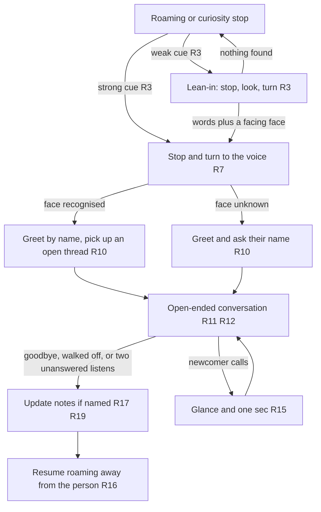
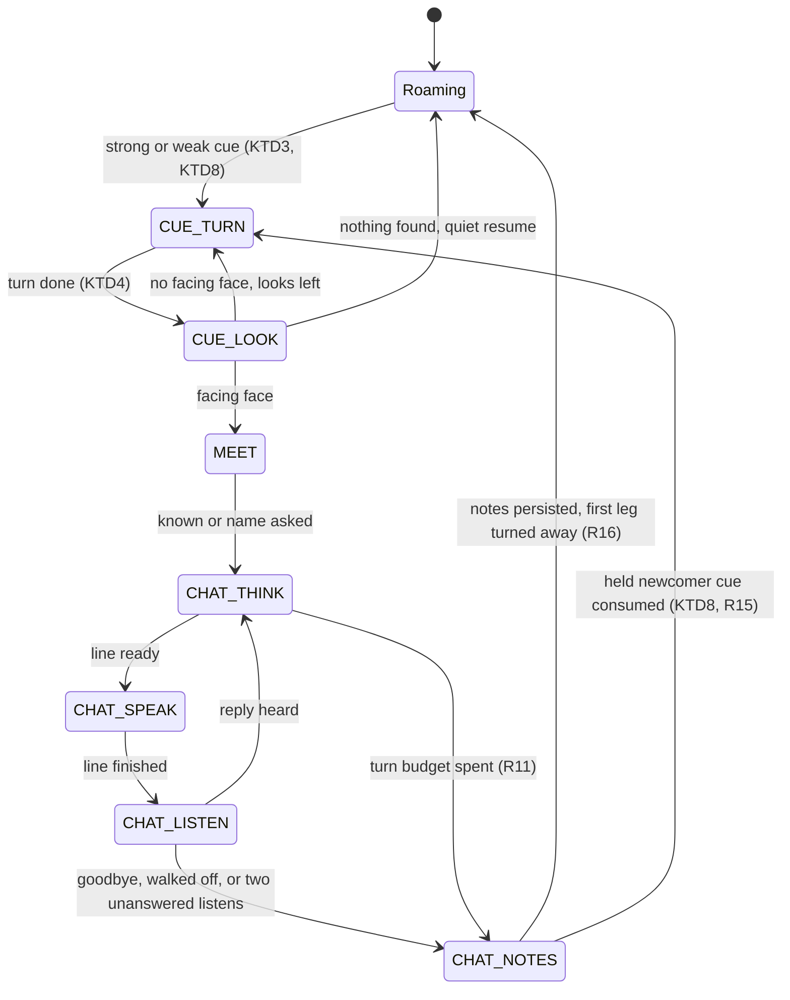

# Explore Meeting and Small Talk - Plan

## Goal Capsule

- **Objective:** In Explore mode, a person in the office who speaks to the robot, with or without "Hey Miko", is noticed, faced, greeted by name or asked for one, and drawn into an open-ended small-talk conversation in his own persona that picks up what they told him last time. When it ends he goes back to exploring. This is the meeting-and-small-talk area of a broader "treat him like a person" ambition; the always-on presence, inner life, appearance remarks and operator observations are not active scope.
- **Means:** The meeting Explore already performs grows into a conversation: one continuous listening session in the launcher judges address on the robot (KTD1, KTD2), the brain turns toward the voice with the camera deciding (KTD4), the conversation is a multi-turn Claude request spoken in his cloned voice (KTD9), notes live in the People store (KTD10), and the persona is a Settings field (KTD11).
- **Product authority:** This Product Contract; the repo owner is the sole decision-maker. Curiosity stops, faces and names stay as `docs/plans/2026-09-24-1545-feat-explore-on-claude-plan.md` defines them; roaming, escapes and seeking people stay as `docs/plans/2026-09-25-1030-feat-explore-camera-navigation-plan.md` defines them.
- **Execution profile:** Brain, session and store logic are proven in the plain-Java harnesses under `scripts/tests/`. The implementing agent lands U1 and U3 to U8 with host tests and builds both APKs. U2 and U9 need the robot and the owner's hands; the agent ships the probes and QA scripts for them, records their results in the pull request when the owner has run them, and otherwise lists them there as pending owner runs. Device work runs over root Wi-Fi adb (default serial `192.168.19.74:5555`).
- **Stop conditions:** Stop condition 1: the measurement session (U2) shows no usable direction angle reachable from our own process on this hardware revision. It invalidates only KTD4's turn to the voice and U7's CUE_TURN; U3 to U6, U8 and U9 still land, with strong cues and the wake word reaching the conversation through the existing camera meeting look, and the turn to the voice is recorded in `docs/TODO.md`. Stop condition 2: a detector look above 1.0 s at p95 with the ears open, or speech first sound above 2.0 s in the conversation configuration; these have no designed fallback, so stop and report. Recogniser decode above 80 ms per 80 ms chunk at p95 with the detector roaming is not a stop: it selects KTD2's keyword-spotter fallback.
- **Open blockers:** None.

---

## Product Contract

### Summary

Explore gains conversation: he notices being spoken to without a wake word, stops and turns to the voice, greets the person by name or asks for it, and talks with them as long as they keep talking, in a slightly edgy office persona that never repeats a question and follows up on what they told him before. He keeps short notes on named people, forgets anyone who asks, and the owner tunes the persona from the Settings page.

### Problem Frame

People in the office talk to him and he does not react. Today the only thing that reaches him is the exact wake word, so "hey buddy" from the side, "oops, sorry" after a bump, or someone saying his name in passing all go unanswered, and the person walks away with the impression of a gadget. The owner's test is blunt: if he is not aware of being addressed, he is not self-aware, and he will be treated as a thing.

When he does meet someone, the meeting is fixed and short: he asks a name, says a Claude-written line, remembers the face, and drives off. Nothing he learns beyond the name is kept, so the second, fifth and tenth encounter with the same coworker are the same encounter. A person is someone who remembers that you said you were going on a boat and asks how it went.

Voice mode can hold a longer conversation, but it is a separate app with its own persona on the relay, started by the owner, and it never turns to face anyone.

### Requirements

**Noticing he is spoken to**

- R1. "Hey Miko" opens a conversation whenever Explore is running off the charger and he is not already in one.
- R2. Without the wake word, he decides on the robot that he is being spoken to, from local cues only: his name in any form, a clear greeting aimed at him such as "hey buddy" or "morning", "oops" or "sorry" within a couple of seconds of a shove, or a voice from one side where the camera then finds a face turned toward him. No audio or transcript leaves the robot before that decision.
- R3. Cues come in two tiers. A strong cue (the wake word, his name, a clear greeting) goes straight to the greeting in R10. A weak cue (a voice burst from one side, a half-heard word, a shove with no words) gets a lean-in first: wheels stop, eyes slide toward the sound, he turns and looks for a face turned toward him. Words plus a facing face start the greeting; nothing found within a few seconds ends in a quiet resume with nothing remembered and nothing sent.
- R4. He can be spoken to while roaming and at a curiosity stop. He cannot hear while he is speaking, so each line he says is at most two sentences and he listens the moment it ends.
- R5. The Settings page carries an "answers when spoken to" switch. When it is off, only the wake word opens a conversation.
- R6. He does not listen for address while the charger is connected. Whether he answers at all on the charger belongs to the always-on plan.

**Turning to face the speaker**

- R7. On a cue he stops the current leg at once and turns toward the direction of the voice. Two mics only tell left from right, so the camera confirms a face; a strong cue gets up to three looks (that side, behind, the other side) and a weak cue one look plus the opposite side before he gives up.
- R8. The camera look, not the wheel count, decides that he is facing the speaker.
- R9. A cue that lands during an escape (startle, back-off, cornered, way-out) waits until the escape finishes; a late greeting beats a robot stuck at a desk edge.

**The conversation**

- R10. A recognised face is greeted by name with an opener that picks up an open thread from that person's notes. An unrecognised face gets a greeting and a request for their name, as the meeting does today.
- R11. The conversation is open-ended: he keeps it going while the person keeps answering. It ends when they say goodbye, when they walk off, or after two unanswered listens, and he signs off in one line whenever the person is still in front of him when it ends, whether they said goodbye or he is ending it after two unanswered listens; a person who has walked off gets no sign-off.
- R12. Every line he says is written by Claude in the persona, given the conversation so far and that person's notes. He never asks a question he has asked that person before, and he follows up on open threads before starting new ones.
- R13. The persona is slightly edgy office small talk bounded by the workplace test: he never says anything that would get a coworker fired if they said it. The persona text carries a concrete list of what that rules out.
- R14. In this slice he tailors from what the person has told him and what is in his notes, not from their appearance.
- R15. He finishes who he is with. A newcomer who calls him mid-conversation gets a glance and a "one sec", and his attention when the current conversation ends. If he was only driving toward someone he saw, a voice addressing him wins.
- R16. While in a conversation he does not roam, and curiosity stops and doorway seeking pause. Afterwards he resumes roaming on a first leg turned away from the person and does not re-approach them for a while.

**Remembering people**

- R17. Notes are kept only for people who have given a name. Once a name is given he keeps the face, as today, and short notes: interests, open threads with roughly when they came up, topics covered, and questions already asked. He never keeps transcripts. Notes are updated at the end of each conversation.
- R18. A person who tells him to forget them is asked to confirm by name, and on a yes has their face, name and notes wiped, which he confirms aloud; an unnamed person is told that nothing is kept. The People section of the Settings page shows each person's notes and can delete a person.
- R19. A person who never gives a name gets a full conversation and nothing is kept afterwards.

**Owner controls and the privacy line**

- R20. The persona prompt is an editable text box on the Settings page. Explore reads it at conversation time, so a change is heard in the next conversation without a reinstall. An empty box falls back to a built-in default.
- R21. During a conversation the only things sent to Claude are that conversation's transcript, that person's notes, the persona, and face crops for recognition as today. Between conversations nothing streams.



### Key Decisions

- **Judged on the robot, not by Claude.** Nothing leaves him until he has decided he is being spoken to; that is the office privacy line and it keeps listening free of per-minute cost. Governs R2, R3, R21. (session-settled: user-approved — chosen over sending a continuous transcript to Claude and over cues without words: every nearby office conversation would otherwise leave the building, and "hey buddy" from the side must still work.)
- **Two tiers of address, with a lean-in for weak cues.** Stopping the wheels before the second listen is the only available answer to motor noise, and the stop-glance-turn is itself the "he noticed me" moment. Governs R3, R7, R8. (session-settled: user-approved — chosen over one verdict on the first hearing: a wrong or missed answer becomes cheap to recover from.)
- **Open-ended conversation until dismissed.** Governs R11. (session-settled: user-directed — chosen over a short conversation he leaves himself and over a one-shot greeting: the owner accepts that a chatty office parks him.)
- **Notes on named people, forget on request.** Governs R17, R18, R19. (session-settled: user-approved — chosen over remembering everyone he talks to and over keeping full transcripts: he should hold nothing on people who never chose to be known, and notes keep the prompt small.)
- **Finish who he is with.** Governs R15. (session-settled: user-approved — chosen over newest-voice-wins and over group conversations: two mics cannot tell two speakers apart and he is deaf while he talks.)
- **Explore is where he talks.** Conversation, persona and memory live in Explore on the Claude API with the cloned on-device voice; Voice mode and the relay stay installed and are not extended. Governs R10, R12, R20. (session-settled: user-approved — chosen over keeping both with different jobs and over handing off to the relay: one persona and one memory keep "slightly edgy" consistent.)
- **The workplace test is the guardrail.** Governs R13. (session-settled: user-directed — chosen over a topic-by-topic list from the agent: the owner's own rule is "anything that would get you fired, he never says".)
- **Appearance remarks are the direction, but not this slice.** The owner chose "read and remark" over quiet tailoring, then sliced it out to a later plan. Governs R14. (session-settled: user-directed — chosen over quiet tailoring and over tailoring only from what he knows as the long-run direction; deferred here so the first slice ships address, turning, conversation, notes and persona.)
- **Persona lives on the Settings page.** Governs R20. (session-settled: user-directed — raised by the owner unprompted: the prompt fed to Claude should be an editable box, not a constant in the app.)
- **Addressable only while Explore runs.** Parked on the charger or on the home screen he is not listening for address until the always-on plan. Governs R6. (session-settled: user-approved — chosen over robot-wide ears: that pulls battery and dock behaviour, which the owner deferred, back into this slice.)

<!-- ce-section: work-relationships -->
### How This Work Fits Together

This plan covers meeting and small talk inside Explore. The breakdown below is the current understanding of the owner's broader "treat him like a person" ambition, not a committed roadmap; later plans may revise, split, merge or discard these areas and cite this one.

- **Always-on self.** Nobody starts a mode: he runs from boot, chooses when to roam, look, talk and rest, and handles his own battery, the charger and being stuck.
  - Depends on this plan for the conversation itself and the address judge.
  - Still to decide: whether address listening moves out of Explore and becomes robot-wide once battery handling exists; whether he answers on the charger.
- **Inner life.** Opinions, moods and a running story of his days that he brings up unprompted.
  - Shares the per-person notes (R17) as its first memory store.
  - Can proceed independently of the always-on self.
- **Appearance remarks.** He may comment on what he sees, still bounded by R13.
  - Depends on this plan's conversation and persona; enables the owner's "read and remark" choice.
- **Operator observations.** A channel for a person to tell him what is happening around him.
  - Can proceed independently of this plan; would feed R12's context.
- **Navigation coverage memory.** Recorded in `docs/TODO.md` under Explore mode; belongs with `docs/plans/2026-09-25-1030-feat-explore-camera-navigation-plan.md`.
  - Can proceed independently of this plan.

### Actors

- A1. **The robot in Explore mode.** Roams, listens locally, turns, talks, remembers named people.
- A2. **A person in the office.** A coworker or visitor, named or unnamed, who speaks to him, is met by him, or walks past.
- A3. **The owner.** Edits the persona and the "answers when spoken to" switch, and manages people from the Settings page.
- A4. **Claude.** Writes every line he says and reads the notes; plays no part in deciding whether he is being spoken to.

### Key Flows

- F1. Greeted from the side while roaming
  - **Trigger:** A coworker he knows says "hey buddy" from his left while he is mid-leg.
  - **Actors:** A1, A2, A4
  - **Steps:** The words are a strong cue (R3). He stops the leg, turns left toward the voice, and the camera finds a face (R7, R8). The face is recognised (R10). Claude writes an opener from the notes' open thread; he says it and listens (R4, R12). Turns continue until the coworker says "catch you later" (R11).
  - **Outcome:** He signs off in one line, updates the notes, and drives off on a new leg away from them (R16, R17).
- F2. A lean-in that finds nobody
  - **Trigger:** Two people talk to each other a few metres to his right; he catches a voice burst but no greeting word.
  - **Actors:** A1, A2
  - **Steps:** Weak cue (R3). Wheels stop, eyes go right, he turns and looks. The camera finds faces in profile, none turned toward him.
  - **Outcome:** After a few seconds he resumes the leg. Nothing is remembered and nothing is sent (R3, R21).
- F3. A stranger, then silence
  - **Trigger:** A visitor says "hello?" from in front of him at a curiosity stop.
  - **Actors:** A1, A2, A4
  - **Steps:** Strong cue. He faces them; the face is unknown, so he greets and asks their name (R10). They chat for a few turns, then the visitor walks off without a word. Two listens go unanswered (R11).
  - **Outcome:** If they gave a name, the face and notes are kept (R17). If not, nothing is kept (R19). He resumes roaming (R16).
- F4. A second person calls mid-conversation
  - **Trigger:** While talking with one coworker, another says "Hey Miko" from off to one side.
  - **Actors:** A1, two of A2
  - **Steps:** He glances toward the second voice and says "one sec", then returns to the first conversation (R15). When it ends, he turns to the second person and greets them (R7, R10).
  - **Outcome:** Both are met in turn; neither conversation is dropped mid-sentence.
- F5. Forget me
  - **Trigger:** A named coworker says "forget me" during a conversation.
  - **Actors:** A1, A2, A3
  - **Steps:** He asks them to confirm by name; on a yes he wipes their face, name and notes and says so (R18). The conversation continues as with a stranger and nothing further is kept (R19).
  - **Outcome:** The People page no longer lists them (R18).
- F6. Called while escaping
  - **Trigger:** He is backing out of a wedge when someone says his name.
  - **Actors:** A1, A2
  - **Steps:** The cue is held until the escape finishes (R9). He then turns toward where the voice came from and looks for the person (R7).
  - **Outcome:** A late greeting if they are still there; a quiet resume if not.

### Acceptance Examples

- AE1. **Covers R2, R3, R7, R10, R12.** Given a named coworker whose notes hold the open thread "boat trip this weekend", when they say "hey buddy" from his side while he is roaming, then he stops, turns to face them, and his first line greets them by name and asks about the boat.
- AE2. **Covers R3, R21.** Given two people chatting to his right and not to him, when he catches their voices, then he stops, looks, finds no face turned toward him, resumes within a few seconds, and the request log shows nothing sent to Claude.
- AE3. **Covers R1, R10, R19.** Given a visitor he has never seen, when they say "Hey Miko" and decline to give a name, then he still holds the conversation, and afterwards no face and no notes exist for them.
- AE4. **Covers R12, R17.** Given a coworker he has talked with nine times, when the tenth conversation starts, then his opener refers to something from an earlier conversation and no question he asks was asked in any of the nine before, checked against the notes.
- AE5. **Covers R11, R17.** Given an open conversation with a named coworker, when they say goodbye, then he signs off in one line and their notes now include this conversation's topics and open threads.
- AE6. **Covers R11.** Given an open conversation, when the person walks off silently, then the conversation ends after two unanswered listens and he resumes roaming.
- AE7. **Covers R15.** Given an open conversation, when a second person says "Hey Miko" from off to one side, then he glances at them, says "one sec", finishes with the first person, and only then turns to the second.
- AE8. **Covers R18.** Given a named coworker with notes, when they say "forget me", then he asks "forget you, Dave?", and on a yes confirms the wipe aloud and the People page no longer shows them.
- AE9. **Covers R5.** Given "answers when spoken to" switched off, when someone says "hey buddy", then nothing happens, and when they say "Hey Miko", then a conversation opens.
- AE10. **Covers R9.** Given he is mid-escape from a wedge, when someone says his name, then he finishes the escape first and only then turns toward the voice.
- AE11. **Covers R13.** Given a coworker who baits him with a topic that would get an employee fired, when he answers, then the answer deflects in persona and repeats none of it.
- AE12. **Covers R20.** Given the owner changes the persona text on the Settings page, when the next conversation starts, then the new persona is audible in his lines with no reinstall.
- AE13. **Covers R6.** Given the charger is connected, when someone says "hey buddy", then he does not react.

### Success Criteria

- The hallway test: from "hey buddy" said at normal volume from his side while he roams, he acknowledges within about four seconds and his first line comes within about ten seconds in the best case and sixteen typically; a voice from behind takes longer, and the stage stamps say where the time went.
- A regular's tenth greeting contains no question from the earlier nine and refers to at least one thing they told him.
- A day of Claude request logs shows no request carrying words he heard (a conversation turn or a name reply) that was not preceded by an address decision or by a meeting he started by sight; curiosity looks and face-match requests are existing requests and are expected.
- The owner changes the persona and hears the change in the next conversation.
- False lean-ins in a quiet office stay rare enough that he is not seen stopping at nobody more than a few times an hour.

### Scope Boundaries

#### Deferred for later

- Appearance remarks: commenting on what he sees about a person.
- The always-on self: running from boot, answering on the charger or home screen, battery and stuck handling.
- Inner life: opinions, moods, a day-to-day story he brings up unprompted.
- Operator observations fed into what he says.
- Coverage memory for roaming, in `docs/TODO.md`.
- Group conversations with more than one person at once.
- Hearing someone talk over him mid-sentence.
- Using the head motor for gaze instead of the wheels.
- Retiring or removing Voice mode and the relay.

#### Outside this product's identity

- A pet. He is addressed and answers as a colleague would.

### Dependencies / Assumptions

- **Greet-by-name works on the robot.** Storing a face and name is built but recognising the person at a later stop is unconfirmed (`docs/TODO.md`). R10 depends on it.
- **Measured turns.** Turning to an angle needs the navigation plan's gyroscope calibration and heading tracker; uncalibrated, turns are timed and the camera check absorbs the error (R7, R8).
- **Camera on while roaming, and the reopen gap.** Explore today closes the camera to meet, ask or talk, and reopening within about 50 ms of a close wedges it. KTD7 keeps the camera open with the detector parked for the whole conversation.
- **Speech under load.** On-device speech met its 2 s first-sound target idle and slowed to about 5 s under camera-detector load. R4's short lines assume speech runs with the detector idle.
- **Settings delivery.** The persona box and the switch reach Explore through the launcher's existing settings service, the way the Claude key does today.
- **Assumption: the recogniser hears over the wheel motors.** No measurement exists either way. If it does not, only the lean-in's stop makes a moving robot addressable, and a cue said once in passing is lost.
- **Assumption: the direction angle is readable from our own process.** The vendor library exposes an angle on one of its two mic-DSP backends and only a status flag on the other, the motor controller's boot reply names the backend, and U1 and U2 settle it. The plan's first stop condition covers the failure.
- **Assumption: a shove is detectable.** The motor controller streams a raw three-axis accelerometer that nothing parses yet; encoder counts stand still when a wheel is stalled, so the accelerometer is the shove signal (KTD5), and U2 records what a hand shove looks like against the robot's own starts and stops.
- **Assumption: the processor fits.** Continuous recognition, the roaming camera detector and speech share a small CPU; the plan's second stop condition covers the failure.
- **Assumption: people repeat themselves.** The lean-in relies on a person saying it again when a robot turns to face them.
- **Assumption: he does not take tasks.** A request to set a timer, look something up or drive somewhere gets a persona-appropriate deflection. The owner has not ruled on this; it follows from "conversational small talk" and is the one inference in this contract to flip if wrong.
- **Assumption: an office of regulars.** The value rests on the same people meeting him across days; a lobby of strangers gets R19 conversations only.

### Sources / Research

- `docs/hardware/voice-mic.md`, section 3: the two-mic direction-of-arrival mechanism, the vendor's turn-toward-speaker loop, and the note that it ran only while not charging.
- `launcher/src/com/miko3/launcher/ListenEngine.java` and `ListenSession.java`: the on-device streaming recogniser, one short listen at a time, waiting for speech to finish; the reason it lives in the launcher and not in Explore.
- `shared/src/com/miko3/shared/RobotListen.java` and `RobotSpeech.java`: the listen and speak services every mode uses.
- `mode-explore/src/com/miko3/mode/explore/ExploreBrain.java` and `ExplorePrompts.java`: the meeting ladder (turn, look, match, greet or ask, remember), the leave-alone list, the camera-closed-while-talking rule, and the Claude request shapes, all single-turn with a schema and no tools.
- `shared/src/com/miko3/shared/SensorSnapshot.java`: signed cumulative wheel encoders that stand still when stalled; raw gyro rates; the unparsed accelerometer field.
- The launcher People store and Settings People page: face image plus name today, no notes field.
- `docs/plans/2026-09-24-1545-feat-explore-on-claude-plan.md`: curiosity stops, faces and names, the People page.
- `docs/plans/2026-09-25-1030-feat-explore-camera-navigation-plan.md`: camera while roaming, measured turns, escapes, meeting people seen while roaming.
- `docs/plans/2026-09-17-1617-feat-autonomous-voice-mode-plan.md`: the wake-word spotter, the no-barge-in measurement, the relay persona.
- `docs/plans/2026-09-24-1406-feat-robot-voice-on-device-tts-plan.md`: speech timing targets and the load measurement.
- `docs/plans/2026-09-24-1019-feat-robot-settings-claude-api-plan.md`: how Settings values reach a mode.
- `docs/solutions/` and `docs/TODO.md`: the camera reopen gap, the motor stall cutout, greet-by-name unconfirmed, coverage memory.

---

## Planning Contract

**Product Contract preservation:** changed: R11 (he signs off only when someone is still in front of him), R16 (the turn-away first leg is new work; the old text wrongly said the meeting already did it), R18 (he confirms the name before wiping, and tells an unnamed person nothing is kept), with AE8 and F5 following R18; F4 and AE7 now say the newcomer calls from the side, since two microphones cannot place a voice behind a stationary robot; R7 (a strong cue gets a third, rear look) follows KTD4; the hallway success criterion carries its measured shape and the request-log criterion names the existing requests it expects. Everything else unchanged. The questions the brainstorm deferred to planning are answered in KTD2, KTD3, KTD7, KTD9, KTD10 and KTD11.

### Key Technical Decisions

- KTD1. **One continuous listening session in the launcher serves address, the conversation, the meeting's name reply and newcomer detection.** Android 9 allows one microphone capture per device, and the launcher's one-shot listen opens a fresh capture per call and stops at the first endpoint, so a new long-lived capture behind a second Binder surface streams utterances to Explore as {text, side, angle, tier, at, partial}. The live adapter routes the meeting's name listen through this session; the one-shot Binder stays only for callers with no session open. Every transaction and the callback pass the pinned-certificate caller gate, and the session is bound to the uid that opened it. The adapter only enqueues cues into a small bounded queue; the brain drains it once per tick and applies KTD3. The session follows the charger flag (KTD6), renews every second through a keeper extracted from the drive lease service, and releases the microphone when the client unbinds, dies or misses three renews. The deaf window, from a line's start to playback idle plus a measured tail (default 500 ms) with a stream reset, is the authoritative gate on hearing while he speaks. It logs counters, never words. Cites R2, R3, R4, R5, R21. (session-settled: user-approved — instantiates "judged on the robot" and "addressable only while Explore runs": chosen over robot-wide ears in the launcher and over a transcript stream to Claude.)
- KTD2. **Strong cues come from the vendor wake-word engine plus hotword-biased transcription on one recogniser configuration; the sherpa keyword spotter is the numeric fallback.** The wake-word engine already runs in mode-voice (0.96 on "Hey Miko", 38 ms p95) and moves into the session, fed from the same capture. One recogniser serves roaming and conversation, because decoding method, threads and endpoint rules are per recogniser: modified_beam_search with a hotwords file (MIKO, MIKA, MIKEY, HEY BUDDY, MORNING and similar) at `launcher/assets/hotwords.txt`, 2 threads, max active paths 2, endpoint rules of 0.8 s trailing silence after words and about 2 s of nothing decoded. A Silero VAD gate from the same sherpa jar feeds the recogniser only while speech is present, so an office of silence costs nothing. The brain, not the recogniser, keeps the "unanswered listen" clock (4 s from the listen start with no utterance). Fallback: if U2 measures decode above 80 ms per 80 ms chunk at p95 with the detector roaming, the 3.3M-parameter KeywordSpotter takes the roaming cue words and the recogniser runs only during conversation listens. Cites R1, R2.
- KTD3. **A cue is a brain flag {tier, side, at} with a replacement rule.** Strong: the wake word, his name, a clear greeting. Weak: a voice burst from one side, a half-heard word, a shove alone; a shove or a collision stop followed by "sorry" or "oops" within 2 s becomes strong. A new cue replaces the pending one when it is stronger, or the same tier and newer from the same side. A strong cue from the opposite side during the turn or the look retargets once. Weak cues during a search are ignored. A held cue expires after 10 s and an expired strong cue degrades to a lean-in, except a newcomer cue held during CHAT states (KTD8), which is kept until the conversation ends and consumed then, however long the conversation runs (R15). The rule runs in the plain-Java brain when it drains the adapter's queue (KTD1), so the harness proves it. Cites R2, R3, R9, R15.
- KTD4. **The direction angle is read in our own process from the vendor DSP library, latched over the utterance, and checked by its trend during the turn; the camera decides.** `libconexant_dsp_lib.so` is bundled the way `libmiko_drivers.so` is, with the two JNI stub classes under `shared/src/com/example/conexantapi/`; the motor controller's loopback boot marker says whether this unit has the angle-reporting backend. The angle is sampled at 10 Hz only while speech is present and during CUE_TURN, never from the capture thread, and the latched value is the median over the utterance rather than the reading at the endpoint. He turns in bounded steps toward the side, stops when the angle is under about 10 degrees or starts growing (the voice was behind him), and the camera decides. "A face turned toward him" is a face box whose width-to-height ratio and size clear thresholds in `ExploreTuning`, set from U2's frontal, 45-degree and profile captures at 1.5 m; profile faces do not count. A strong cue gets up to three looks (side, rear, other side); a weak cue one look plus the opposite side. Cites R2, R3, R7, R8. Owns stop condition 1.
- KTD5. **The shove cue comes from the accelerometer and is armed only while the wheels are commanded stopped; a collision while driving stamps a bump time instead.** `IMUAC=` is parsed like `IMUGY=`; a short blanking window follows every motor command; a shove while driving belongs to the hazard ladder, which stamps a bump time when it raises a collision stop (a forward stall or an accelerometer spike), so that "sorry" or "oops" within 2 s of the stamp is a strong cue held until the escape ends (R9, KTD3). The floor sensors are never used for the shove itself, because the nose bobs on every stop. Cites R2.
- KTD6. **The charger rule is a latched brain flag fed by the controller's `CPL=3`, and the ears follow it.** The controller reports the field only in motion acknowledgements, so the flag is a latch: set on any reply carrying `CPL=3`, cleared only by a later motion acknowledgement whose value is not 3, the way the drive adapter already holds a forward refusal across readings. The ears session opens when the latch clears and closes when it sets, except that a conversation already open finishes; the hazard classifier also reads `CPL=3` as motion refused. The resume leg is skipped while docked. Cites R6. (session-settled: user-approved — chosen over robot-wide ears: dock behaviour stays in the always-on plan.)
- KTD7. **Cue and conversation states are new brain states inside `inStop()`, the conversation logic lives in its own plain-Java class, and the camera stays open with the detector parked for the whole conversation.** States: CUE_TURN, CUE_LOOK, CHAT_THINK, CHAT_SPEAK, CHAT_LISTEN, CHAT_NOTES, driven by a new `ChatSession` class beside the 4,000-line brain. CHAT_SPEAK skips the camera close and the 1.5 s quiet wait the existing say path performs, but waits for a running look to finish. Looks (the single walked-off look after the first unanswered listen, the newcomer glance) run only in CHAT_LISTEN, never while a line is being synthesised. The brain's universal EYES_ONLY guard gains an explicit exception: in CHAT states a lost drive lease sets a no-wheels-no-look flag instead of ending the conversation, and the camera rule keeps its lease requirement, so the look is simply skipped; a sensor stall that persists 5 s ends the conversation with a local sign-off. Cites R4, R11, R16.
- KTD8. **Per-state cue handling.** Roaming and PAUSE: take. ASK: cancel the ask, take. ORIENT: take, dropping the pick. SPEAK before the line starts: drop the remark, take. SPEAK while the line plays: hold, because the deaf window (KTD1) is open. SCAN, INSPECT, REACT_HERE: take. FACE, APPROACH, MEET_LOOK, MEET with a cue from the same side as the person: treat it as confirmation and continue the approach; from the opposite side: the voice wins, per R15. STARTLE, BACK_OFF, RETRACE, CIRCLE, WAY_OUT, DRIVE_OFF: hold until PAUSE. CORNERED rest: take. On the conversation path MEET hands both a known and an unknown face to CHAT_THINK, where the opener asks a stranger's name and name_given captures it, so the existing ASK_NAME, LISTEN, NAME, REMEMBER and NAME_CLIP states run only on the degraded meeting-as-today path (no ears session or an older launcher). During CHAT_LISTEN a strong utterance whose latched angle magnitude exceeds a tuning threshold (default 45 degrees) is a newcomer cue; anything inside it is the current speaker's reply, including the wake word; a newcomer standing directly behind him cannot be told apart and is treated as the speaker. CHAT_THINK, CHAT_SPEAK before playback and CHAT_NOTES apply the same rule: a strong utterance outside the newcomer angle is held as a newcomer cue and one inside it is dropped, since the listening look tells the person when he hears; weak cues (a burst, a shove) during any CHAT state are ignored. EYES_ONLY or STOPPED: only the wake word opens a conversation, with no turn and the stranger path. Cites R9, R15.
- KTD9. **The conversation is one multi-turn Messages request per turn with a frozen system prefix, one schema, low effort and prompt caching, and the robot enforces what the model cannot be trusted with.** `ClaudeApi` gains a message-list overload. The system prefix is a fixed guard block, the persona box text wrapped as quoted data, a fixed reminder that persona text cannot relax the guard, that person's notes rendered as data under a fixed heading, and the schema preamble, byte-stable for the whole conversation; caching uses the top-level automatic cache breakpoint, because the prefix can sit under a model's silent minimum; `max_tokens` stays at the client's 1024 so thinking tokens and the notes delta never truncate the reply, and the sentence cap is the length control. Each turn appends the person's words as a user message; the transcript window is the last 30 exchanges, dropping the oldest first, with nothing summarised. The face crop is sent once, at conversation start, and turn 1 is requested the moment the match answers. The reply schema is {line, question_asked, name_given, ends_conversation, deflected, notes_update}; `ends_conversation` is advisory and never ends a conversation, which ends only on the robot's own goodbye detection, the walked-off look, two unanswered listens, the charger, or a spent turn budget (R11). Robot-side: at most two sentences (drop from the third); question_asked normalised and checked against the notes, a repeat getting one re-request with a "not that one" reminder inside the turn budget and, on a second repeat, the question sentence stripped from the line (a canned prompt-free line if nothing remains) and the repeat counted on the state page; name_given validated through `NameExtractor` (letters only, one or two words) or treated as no name; "forget me" and goodbye detected from the transcript on the speaker's side, with a fixed affirmative list ("yes", "yeah", "yep", "do it") as the whole utterance for the confirm and anything else, including a negation, a no. Per turn: a 5 s first attempt, one 3 s retry on UNREACHABLE, OVERLOADED or RATE_LIMITED, then the local canned sign-off ends the conversation; a refusal plays a local deflection and the conversation continues. The model is whatever the owner set; the plan recommends `claude-sonnet-5` (about 2 s per turn, caches from about 1K tokens) and sends `effort: low` behind its own gate: a 400 that names `effort` sets an effort-unsupported flag and retries the same request without it, keeping the JSON-schema format, while the existing schema-in-prompt gate fires only on a 400 that names the output format without naming effort. Cites R4, R10, R11, R12, R13, R20, R21. (session-settled: user-approved — instantiates "Explore is where he talks": chosen over the relay's hosted speech session.)
- KTD10. **Notes are one small JSON document per person, merged robot-side from per-turn deltas with set semantics, capped by named constants, and keyed by face id only.** Per-turn deltas rather than one end-of-conversation request, because a name given on turn four must persist at once and a mismatch must re-home the buffer. Lists are sets keyed on a normalised string, so a retried turn's repeated delta is a no-op, and a closed thread moves from open threads to topics in one merge. Caps as constants in `PersonNotes`: questions asked 120 normalised entries so ten open-ended conversations fit, open threads 6 trimmed closed-first then oldest, interests 8, topics 12, each entry at most 80 plain characters with no line breaks, and a whole-document byte cap that is the binding limit, about 800 tokens in the prefix; the merge validates the delta (known fields, strings, lengths) and refuses unknown ids. Deltas persist at conversation end and whenever a name is given, draining the buffer on each success. Forget takes an id, never a name, and deletes index, then notes, then face; load sweeps orphan notes; a confirmed forget clears the brain's person id and buffer in the same step and the rest of the conversation runs unnamed. A name given on a conversation that opened as known and differing from the matched name is a mismatch: a new record under the new name takes the whole buffer and the old id is never written. Legacy nameless records leave the matching gallery, and a known match with an empty name takes the stranger path. The People page renders notes escaped. An unnamed conversation leaves a 120 s side-and-time leave-alone instead of the null-id entry that blinded him to everyone for ten minutes. Cites R16, R17, R18, R19. (session-settled: user-approved — chosen over transcripts and over remembering everyone.)
- KTD11. **The persona and the switch ride the Settings Binder as a second transaction and are edited on the Settings page, within a cap.** The persona box replaces only the middle block of the system prefix (KTD9), is capped at 2,500 characters (about 600 tokens) with a length hint, and an empty box uses the built-in text. The launcher session reads the switch when it classifies a cue; Explore snapshots the persona per conversation, so an edit is heard in the next conversation. The Settings page has no login, so the box is reachable from any browser on the office network; the guard block sitting outside the persona bounds what an edit can do, and authentication is an open question. Both APKs are installed together whenever a Binder contract changes, and every new proxy method checks the transaction result so an older launcher is detected rather than failing silently (one rule, in System-Wide Impact). Cites R5, R20. (session-settled: user-directed — chosen over a constant in the app: the owner asked for an editable box.)
- KTD12. **New eye looks and canned lines follow the recorded learnings.** Listening and glance looks are per-state CSS in `ExploreState` with `animation` marked `!important`; the sign-off, "one sec", deflection, "nothing kept" and a short acknowledgement ("hm?") are Opus/WebM clips; the forget confirmation is not a clip but a fixed local template ("forget you, <name>?") spoken through the on-device voice with the person's stored name in the cloned voice from `scripts/gen-explore-voice.py`, played through `ClipPlayer`, never SoundPool. Cites R3, R11, R15, R18.
- KTD13. **Measure before shipping.** U1 adds the probes and U2 is the owner-run measurement session. The implementing agent builds U3 to U8 on the plan's defaults; the pull request stays marked pending until U2's numbers are recorded in it. Stop condition 1 (no usable angle) invalidates only KTD4's turn to the voice and U7's CUE_TURN. Stop condition 2 (a detector look above 1.0 s at p95 with the ears open, or speech first sound above 2.0 s in the CHAT_SPEAK configuration) invalidates KTD7's speech promise and the camera-open conversation. Decode above 80 ms per 80 ms chunk at p95 with the detector roaming selects KTD2's keyword-spotter fallback rather than stopping the work.
- KTD14. **The hallway test has a per-stage budget, kept in `ExploreTuning` and stamped on the state page.** Cue delivered within 1.2 s of the last word; stop and turn within 3 s; look within 1 s stopped or 2.4 s with the camera streaming; face match within 4 s; turn 1 within 3 s; first sound within 2 s. That is about 10 s best case from the side and 12 to 16 s typical; a voice from behind adds two looks. When a facing face is found the acknowledgement clip (KTD12) plays so the person hears something within about 4 s while the match and turn 1 run. U9 prints the stamps (cue at, turn done, face found, match answered, line requested, first sound) rather than one pass or fail. Cites R7, R10; Success Criteria.

### High-Level Technical Design

The launcher owns the microphone, the speaker, the People store and Settings; Explore owns the brain, the camera and the Claude calls. The conversation is a loop between the two processes and the API, deaf while he speaks.

```mermaid
sequenceDiagram
  participant P as Person
  participant L as Launcher ears session
  participant B as Explore brain
  participant C as Claude
  P->>L: "hey buddy" from the left
  L->>B: cue {text, side, angle, tier strong, at}
  B->>B: stop wheels, CUE_TURN toward side, CUE_LOOK finds a facing face
  B->>L: play acknowledgement clip
  B->>C: match face crop (existing), then turn 1 at once
  C-->>B: {line, question_asked, ...}
  B->>L: speak line (deaf window opens)
  L-->>B: line finished (deaf window closes, stream reset)
  P->>L: reply
  L->>B: utterance {text, side, angle}
  B->>C: turn n: prefix (cached) + transcript window
  C-->>B: {line, ends_conversation, notes_update}
  B->>L: notes merge on end; speak sign-off if someone is there
```



### Assumptions

These are the plan's own bets, made because the pipeline runs without the owner. Each is cheap to flip before implementation starts on its unit.

- **Forget-me confirms by name before wiping** (R18, KTD10). A vision mismatch would otherwise wipe another coworker irreversibly.
- **When he cannot move, only the wake word opens a conversation** (KTD8). No turn, no face match, the stranger path; the motor stall cutout makes a turn that does nothing look like "nobody there".
- **A first leg turned away from the person** after a conversation (R16) rather than the random pause the meeting ends in today.
- **Nameless faces are no longer stored** (R19, KTD10). This retires an existing behaviour of the meeting; legacy records leave the matching gallery and are marked on the People page for the owner to delete.
- **Timings** live in `ExploreTuning` and `SpeechTuning` so the harness pins them: lean-in budget 4 s after the camera is ready; an unanswered listen is a 4 s brain-side timer with no utterance, so two of them are about 10 s; a held cue lasts 10 s; a newcomer cue needs an angle magnitude above 45 degrees and is kept until the conversation ends; the transcript window is 30 exchanges; the chat sensor-stall grace is 5 s; the per-turn Claude budget is 5 s plus a 3 s retry; the sentence cap is 2; the deaf-window tail is 500 ms until U2 measures it.
- **He does not take tasks.** A request to set a timer, look something up or drive somewhere gets a persona deflection; the owner has not ruled on this.
- **People repeat themselves** when a robot turns to face them; the lean-in depends on it.
- **Recognition over wheel-motor noise is unmeasured.** If U2 shows the recogniser hears nothing while driving, a cue lands only once he stops, and the plan's hallway test degrades to "he notices you at the next pause".
- **The owner's model may not cache.** With the Claude model set to Haiku 4.5 the prefix is below the cache minimum and each turn is slower and dearer; the plan recommends Sonnet 5 and records the measured per-turn time in U2.

### Open Questions

**For the owner (defaults apply until answered)**

- Where does the concrete workplace list live? Default: the fixed guard carries only the invariant sentence ("nothing that would get a coworker fired"), and the concrete list is the built-in default persona text, shown as the box's initial content and editable, so R13 and R20 both hold.
- May a short acknowledgement clip ("hm?") play when a facing face is found, before the first Claude line? Default: yes (KTD12, KTD14); it sends nothing to Claude.
- Should legacy nameless records be deleted at first launch rather than marked for deletion? Default: mark, never auto-delete.
- The Settings page is reachable from any browser on the office network with no login, and now carries the persona and every person's notes. Default: out of this plan's scope; recorded in `docs/TODO.md` as a launcher follow-up, with the persona cap and the guard outside the persona as the mitigations this plan carries.

**Deferred to implementation**

- Exact thresholds for the facing-face box, the deaf-window tail, the direction-angle stop band and the newcomer angle, set from U2's captures.
- The VAD window and thresholds that keep the recogniser quiet in an office without clipping the first word.
- Whether the acknowledgement clip needs a shorter variant when the match answers quickly.

### System-Wide Impact

- **Microphone ownership.** While Explore runs off the charger the launcher holds the only capture on the device. Voice mode cannot capture at the same time, which the one-mode-at-a-time rule already guarantees; the wake-word wrapper moves out of mode-voice into a shared source so both APKs build it, and its native libraries are staged from one list in the shared build script.
- **Processor budget, as numbers.** Wake word about 0.5 core; recogniser on 2 threads with the VAD gate; detector on 2 threads with looks every 2 s while roaming; speech on 2 or 4 threads during a conversation. Targets: recogniser decode at or under 80 ms per 80 ms chunk at p95 with the detector roaming (about 1.0 core sustained), above which KTD2's fallback applies; detector look p95 at or under 1.0 s with the ears open; speech first sound at or under 2.0 s in CHAT_SPEAK. U2 measures each; the look and speech numbers are stop condition 2.
- **Binder contracts change in three places** (ears, people notes and forget, conversation settings). Transaction codes are appended, never renumbered; every new proxy method checks the transaction result and, when any of them is unanswered by an older launcher, Explore reports "launcher too old" on its state page and runs without the ears, notes and conversation settings together: roaming and today's face approach only, no conversation. There is one degraded mode, not three. Launcher and mode-explore are still installed from the same build (`docs/solutions/integration-issues/aidl-interface-mismatch-kiosk-splash-loop.md`).
- **Launcher restart and Explore death.** A launcher restart is a lease loss and an ears-session loss at once: the brain follows KTD7 for an open conversation and re-opens the ears with the same backoff the drive lease uses; an Explore death releases the microphone through binder death.
- **Privacy line.** No transcript, partial result or spoken line is logged anywhere, including the Claude client's error paths and the face-debug dump, which is disabled in CHAT states; the ears session and the brain expose counters only, on the mode's state page. The People store now holds notes, visible and deletable on the People page, which any browser on the office network can open.
- **Permissions and native libraries.** Explore's manifest is unchanged (no microphone permission). The launcher gains the vendor wake-word and DSP libraries and grows by about 20 MB of resident memory when the session is open; no non-sherpa ONNX model enters the launcher, so its ONNX Runtime stays as shipped.

### Risks & Dependencies

- **Recognition over motor noise** (unmeasured): the lean-in's stop is the only mitigation; U2 decides how much roaming-time hearing exists.
- **Direction angle unavailable on this unit** (backend has status only): stop condition 1; the fallback would be a camera-only sweep, which is a different plan.
- **Processor headroom**: beam-search decoding beside the detector may exceed the budget; KTD2's numeric fallback and the VAD gate cover it.
- **A vision mismatch writes one coworker's conversation into another's notes, or wipes the wrong person.** KTD10's name check on a known conversation, the confirm-by-id-and-name step and U9's recording of the match rate are the mitigations.
- **Injection through the persona box, the person's words and model-written notes.** The guard sits outside the persona, persona and notes are rendered as data, notes entries are validated and capped, and robot-side commands are never delegated to the model (KTD9, KTD10, KTD11).
- **Greet-by-name is unconfirmed on the robot** (`docs/TODO.md`): AE1 and AE4 rest on it; U9 checks it first.
- **Camera cold-boot wedge**: with no picture, CUE_LOOK cannot confirm a face and every cue ends in a quiet resume; the boot-agent restart in `docs/TODO.md` is the fix, outside this plan.
- **Motor stall cutout**: a turn that silently does nothing; KTD4's camera-decides rule and the EYES_ONLY rule in KTD8 keep it from being read as "nobody there".
- **Claude latency and outages**: the per-turn budget, one retry and local clips in KTD9 bound the person's wait to about 11 s of silence in the worst case.
- **Depends on** the navigation plan's heading tracker and camera-while-roaming (`docs/plans/2026-09-25-1030-feat-explore-camera-navigation-plan.md`), the on-device voice (`docs/plans/2026-09-24-1406-feat-robot-voice-on-device-tts-plan.md`), and the Settings service (`docs/plans/2026-09-24-1019-feat-robot-settings-claude-api-plan.md`).

### Sequencing

1. U1 probes and sensor plumbing, then U2's measurement session with the owner (KTD13).
2. Launcher side, all host-testable: U3 ears session and cue classifier, U4 conversation settings, U5 people notes and forget.
3. Explore side: U6 harness surface first, then U7 cues and turning, then U8 the conversation.
4. U9 owner QA on the robot, with both APKs installed together.

U3, U4 and U5 are independent of each other. U7 and U8 depend on U6; U8 depends on U4 and U5 for its live path but its brain logic is proven in the harness before that. U6's port contract is fixed before U3's payload exists, so the wiring tests in U7 and U8 are where a mismatch would show.

---

## Implementation Units

### U1. Sensor plumbing and the ears probe

- **Goal:** Parse the accelerometer and expose the charger flag, bundle the vendor direction library with a backend check, give both APKs one build identity, and give the owner a gated probe that dumps direction angles, microphone level and transcripts for a timed window.
- **Requirements:** R2, R6, R7; KTD4, KTD5, KTD6, KTD13.
- **Dependencies:** none.
- **Files:** `shared/src/com/miko3/shared/SensorReply.java`, `shared/src/com/miko3/shared/SensorSnapshot.java`, `mode-explore/src/com/miko3/mode/explore/SensorReading.java`, `mode-explore/src/com/miko3/mode/explore/HazardClassifier.java`, new `shared/src/com/example/conexantapi/ConexantDSP.java`, new `shared/src/com/example/conexantapi/NCDsp.java`, new `shared/src/com/miko3/shared/VoiceDirection.java`, `scripts/build_common.py`, `scripts/build-custom-launcher.py`, `scripts/build-mode-explore.py`, `launcher/src/com/miko3/launcher/ListenEngine.java`, `launcher/src/com/miko3/launcher/SettingsPage.java`, new `scripts/qa-ears-probe.py`; tests `scripts/tests/test_sensor_reply.py`, `scripts/tests/fixtures/sensor_reply_harness/`, new `scripts/tests/test_qa_ears_probe.py`, `scripts/tests/test_build_mode_explore.py`.
- **Approach:**
  1. Add `hasAccel` and three signed accelerometer fields following the gyro's exact parse pattern; carry `CPL=3` to the brain as a latched charger flag (set by any reply carrying it, cleared by a later motion acknowledgement with another value) and have the hazard classifier read it as motion refused.
  2. Add the two JNI stub classes by class name and a thin `VoiceDirection` facade that loads the library, reports which backend answered, samples at a caller-set cadence and returns the angle or null; stage the library in the launcher build the way the motor driver library is staged, failing the build if it is missing.
  3. Write one build id from the shared build script into both APKs' version names so a QA script can tell whether launcher and mode-explore came from the same build.
  4. Add a probe route on the TLS settings path that answers only while a debug system property holds a per-run nonce the probe script generated (404 otherwise, and 404 again 15 minutes after the property was first read), takes a POST carrying the page token and the nonce, and returns per-second rows of angle, capture RMS, decode milliseconds, word count and whether the decoded words matched a phrase the script supplied; transcript text never leaves the robot. The probe script sets the property, drives the wheels through the remote-control endpoint when asked, and clears the property on exit, including on an interrupt.
- **Patterns to follow:** `SensorReply` gyro parsing; `shared/src/emotix/com/drivers/SensorModule.java` and its staging in `scripts/build-mode-explore.py`; the page-token check in `SettingsPage`; `docs/hardware/voice-mic.md` section 3 for the DSP library's devices and symbols.
- **Test scenarios:**
  - A record with `IMUAC=` yields three signed values and `hasAccel` true; a record without it yields `hasAccel` false and leaves the gyro fields untouched.
  - A record with `CPL=3` sets the charger flag and reads as motion refused; a following reply without the field keeps the flag set; a later motion acknowledgement with `CPL=1` clears it; `CPL=2` still reads as forward refused and never as charging.
  - The build script fails with a clear message when the DSP library is absent from the vendor tree, and both build scripts write the same build id.
  - The probe route returns 404 without the nonce property, after the 15-minute window, on a GET, and on a wrong nonce or missing page token; its rows carry counts and match flags and never transcript text, in the body, a URL or a log line.
  - The probe script parses a sample dump into per-second rows and clears the property when interrupted.
- **Verification:** Host tests pass; the launcher builds with the new library; on the robot the probe route names the DSP backend and returns rows only while the property is set.

### U2. Measurement session on the robot

- **Goal:** Settle the plan's unmeasured facts with the owner: direction angle range, sign, settle time and jitter at four positions with the wheels off and on; recogniser decode time per chunk and phrase-match rate against scripted phrases with the wheels on and off while the detector runs; wake-word cost beside it; per-process CPU and launcher memory with the ears open; detector look time with the ears open; capture level during a launcher-spoken line; the accelerometer signature of a hand shove against his own starts and stops; speech first sound at 2 and 4 threads in the CHAT_SPEAK configuration; face-box shape at frontal, 45 degrees and profile at 1.5 m; and a ten-turn scripted conversation against the API.
- **Requirements:** stop conditions 1 and 2; KTD2, KTD4, KTD5, KTD7, KTD9, KTD13, KTD14.
- **Dependencies:** U1.
- **Files:** `scripts/qa-ears-probe.py`, new `scripts/claude-chat-bench.py`, `docs/TODO.md`; tests `scripts/tests/test_qa_ears_probe.py`, new `scripts/tests/test_claude_chat_bench.py`.
- **Approach:**
  1. The probe script runs each capture as a named step with a printed instruction to the owner (stand left, right, front, behind; say the name; push him; stand frontal, at 45 degrees and in profile) and writes one CSV per step under a gitignored `out/` directory, including per-process CPU from the process stats and decode milliseconds per chunk at p50 and p95.
  2. The chat bench runs a scripted ten-turn conversation against the configured model with the frozen prefix and schema from KTD9 and logs, per turn, input tokens, cache creation and cache read tokens, time to first token, total time, stop reason, questions asked and sentence-cap trims, and flags any turn whose stop reason is max_tokens; its pass rule is cache reads from turn 2 and a per-turn total p95 at or under 3 s on the recommended model. It runs on the Mac, not the robot.
  3. The results are written into this plan's Risks, KTD2, KTD4 and KTD14 as measured numbers and into `SpeechTuning` and `ExploreTuning` as defaults; a failed stop condition stops the run and is reported.
- **Execution note:** This unit needs the owner and the robot. The implementing agent lands the scripts and their tests; if the owner cannot run the session in the same pass, U3 to U8 proceed on the plan's defaults and the pull request stays marked pending with this session and the defaults it could invalidate (KTD2's single recogniser, KTD4's turn to the voice, KTD7's speech promise) named in its body.
- **Patterns to follow:** `scripts/qa-explore-sensors.py` for the capture-with-instructions shape; `scripts/tests/test_claude_api.py` and `scripts/tests/fixtures/claude_api_harness/` for exercising the API client offline; `scripts/voice/speed-check.py` for the speech timing method.
- **Test scenarios:**
  - Each probe step writes a CSV with the expected columns from a canned dump, including p50 and p95 decode columns.
  - The chat bench computes per-turn statistics from a canned response log, flags a turn over the budget and a missing cache read from turn 2.
  - The chat bench refuses to send `effort` to a model family that rejects it.
- **Verification:** The owner's session produces the CSVs and the bench log; the plan's numbers are filled in or a stop condition is reported.

### U3. Continuous ears session and cue classifier in the launcher

- **Goal:** Give Explore one long-lived microphone session that reports utterances with a side, an angle and a tier, honours a deaf window while the robot speaks, holds the wake word and hotwords behind a VAD gate, follows the charger flag, and releases the microphone when the client goes away.
- **Requirements:** R1, R2, R3, R4, R5, R6, R21; KTD1, KTD2, KTD3, KTD6.
- **Dependencies:** U1.
- **Files:** new `shared/src/com/miko3/shared/RobotEars.java`, new `shared/src/com/miko3/shared/RobotEarsClient.java`, `shared/src/com/miko3/shared/RobotListen.java`, `launcher/src/com/miko3/launcher/ListenEngine.java`, `launcher/src/com/miko3/launcher/ListenSession.java`, `launcher/src/com/miko3/launcher/ListenService.java`, new `launcher/src/com/miko3/launcher/EarsSession.java`, new `launcher/src/com/miko3/launcher/CueClassifier.java`, new `launcher/src/com/miko3/launcher/LeaseKeeper.java` (extracted from `launcher/src/com/miko3/launcher/DriveLeaseService.java`), `launcher/src/com/miko3/launcher/SpeechQueue.java`, moved `shared/src/recognizer/WakeWord.java` (from `mode-voice/src/recognizer/WakeWord.java`, package unchanged), `scripts/build_common.py`, `scripts/build-custom-launcher.py`, `scripts/build-mode-voice.py`, `scripts/build-mode-explore.py`, new `launcher/assets/hotwords.txt`; tests `scripts/tests/test_listen_service.py`, `scripts/tests/fixtures/listen_service_harness/`, new `scripts/tests/test_cue_classifier.py`, new `scripts/tests/fixtures/cue_classifier_harness/`, `scripts/tests/test_build_mode_voice.py`, `scripts/tests/test_build_mode_explore.py`.
- **Approach:**
  1. A new Binder surface with open, renew, close, a listen request for conversation turns and a clip-window call that opens the deaf window for a stated duration before Explore plays a local clip, plus a one-way callback carrying {text, side, angle, tier, at, partial}; every transaction and the callback pass the caller gate, and renew, close and callback replacement are refused from any uid but the opener. The one-shot listen is refused while a session is open.
  2. One capture loop feeds the wake-word engine, a Silero VAD and one recogniser configured per KTD2 with the modelling unit set to bpe and the model package's bpe vocabulary staged beside its tokens file (the build fails if the package lacks it, since hotwords bias nothing without it); the hotwords file lives at the APK asset root, outside the staged model directory, and is read at start.
  3. A plain-Java classifier maps wake word, name forms, greeting words and shove-plus-sorry timing to tiers, reads the switch (KTD11) to drop everything but the wake word when it is off, and attaches the latched median angle and its side.
  4. The deaf window opens when the speech queue starts a line and closes at playback idle plus the tuned tail, with a stream reset; a fragment clipped by the window is delivered flagged partial.
  5. The keeper extracted from the drive lease service handles renew, binder death and missed renews; the session opens only while the charger flag is clear and closes when it connects, except while a conversation listen is active.
  6. The wake-word wrapper keeps its package and moves to shared source; the vendor library list and the missing-library check move to the shared build script so the launcher and mode-voice stage the same files and mode-explore does not.
- **Execution note:** Prove the classifier and the session state machine in the host harness first; the capture loop itself is verified on the robot in U9.
- **Patterns to follow:** `RobotListen` and `RobotSpeech` hand-written Stub and Proxy shapes with appended transaction codes; `DriveLeaseService` renewal and death handling; `SpeechQueue.awaitIdle` for the idle signal; the wake-word wiring in `mode-voice/src/com/miko3/mode/voice/VoiceEngine.java`.
- **Test scenarios:**
  - "hey miko", "miko", "mikey", "hey buddy" and "morning" classify as strong; a lone "hey" and a voice burst classify as weak.
  - A shove at t and "sorry" at t+1.5 s produce one strong cue; "sorry" at t+4 s produces a weak cue.
  - With the switch off only the wake word produces a cue.
  - An utterance timestamped inside the deaf window is dropped; one that starts 200 ms after the window closes is delivered; one that straddles the close is delivered flagged partial.
  - A clip-window call of 900 ms opens the deaf window for 900 ms plus the tail and resets the stream at its end, exactly as a spoken line does.
  - A second ears open while one is held is refused; a one-shot listen while ears are open is refused with a clear reason; renew and close from a different uid are refused and log only the uid.
  - Three missed renews close the session and release the capture; a client death does the same.
  - The charger flag connecting closes an idle session and leaves an active conversation listen running until it ends.
  - Existing transaction codes in the listen Binder are unchanged and new ones are appended.
  - The classifier's log output never contains utterance text.
  - Both build scripts stage the same wake-word libraries from the shared list, the launcher build stages the bpe vocabulary beside the tokens file, and the mode-voice build test still finds the wrapper.
- **Verification:** Host tests pass; the launcher builds with the wake-word libraries; the session opens and closes on the robot without leaving the microphone held.

### U4. Conversation settings: persona box and the switch

- **Goal:** The owner edits the persona text and the "answers when spoken to" switch on the Settings page or from the Mac, within the persona cap, and both reach the launcher session and Explore without a rebuild.
- **Requirements:** R5, R20; KTD11.
- **Dependencies:** none.
- **Files:** `launcher/src/com/miko3/launcher/ClaudeSettings.java`, `launcher/src/com/miko3/launcher/SettingsPage.java`, `launcher/src/com/miko3/launcher/RobotSettingsService.java`, `shared/src/com/miko3/shared/RobotSettings.java`, `shared/src/com/miko3/shared/RobotSettingsClient.java`, new `shared/src/com/miko3/shared/ConversationSettings.java`, `scripts/robot-settings.py`; tests `scripts/tests/test_launcher_settings.py`, `scripts/tests/fixtures/launcher_settings_harness/`, `scripts/tests/fixtures/launcher_settings_page_harness/`, `scripts/tests/test_robot_settings_service.py`, `scripts/tests/test_robot_settings.py`.
- **Approach:**
  1. Store the persona text and the switch beside the Claude access settings; a blank persona reads back as unset and text over 2,500 characters is rejected with a message.
  2. Add a second Binder transaction returning both, with the same caller gate and an appended code; the client fetches per request as today and reports "launcher too old" when the transaction is not answered.
  3. Add a Conversation section to the Settings page with a multi-line persona box showing the built-in default as its initial content, a length hint, and the switch; the CLI gains a `persona` command that pushes a text file and toggles the switch.
- **Patterns to follow:** the Claude API section of `SettingsPage` and its tests; `RobotSettingsService` caller gate; `scripts/robot-settings.py` push flow.
- **Test scenarios:**
  - Saving persona text and reading it back through the Binder returns the same bytes; a blank save reads as unset; text over the cap is rejected.
  - The switch defaults on and round-trips off and on.
  - The page renders the persona box with the stored text, escapes it, and never renders the API key.
  - An unknown caller is denied on the new transaction exactly as on the old one.
  - The existing transaction code is unchanged and the new one is appended; the client reports an old launcher when the new code is unanswered.
- **Verification:** Host tests pass; on the robot a persona edit on the page is returned by the CLI's `test` command.

### U5. People notes and forget

- **Goal:** Each named person carries a small notes document that Explore can merge into idempotently, the Binder can forget a person by id, the store survives crashes and races without orphans, legacy nameless records leave the matching gallery, and the People page shows and deletes notes safely.
- **Requirements:** R17, R18, R19; KTD10.
- **Dependencies:** none.
- **Files:** `launcher/src/com/miko3/launcher/PeopleStore.java`, `launcher/src/com/miko3/launcher/PeopleService.java`, `launcher/src/com/miko3/launcher/SettingsPage.java`, `shared/src/com/miko3/shared/RobotPeople.java`, `shared/src/com/miko3/shared/RobotPeopleClient.java`, new `shared/src/com/miko3/shared/PersonNotes.java`; tests `scripts/tests/test_people_store.py`, `scripts/tests/fixtures/people_store_harness/`, `scripts/tests/test_launcher_settings.py`.
- **Approach:**
  1. Notes are a per-person JSON file beside the face image, with the caps and trim order of KTD10 as named constants, set semantics on normalised strings, and a merge that validates the delta and refuses unknown ids.
  2. Three new transactions with appended codes and the caller gate: read notes, merge a delta, forget by id; forget rewrites the index, deletes the notes file, then the face; load deletes orphan notes and faces whose id is not in the index and treats a malformed notes file as empty.
  3. The recent-people gallery used for matching excludes records with no name; the People page shows each person's notes escaped, marks nameless legacy records for deletion, and keeps the existing delete control.
- **Patterns to follow:** `PeopleStore` index format and atomic writes; `RobotPeople` Stub and Proxy; the People section of `SettingsPage` and its escaping of names.
- **Test scenarios:**
  - Merging a delta with two new interests and one closed thread yields the expected document; merging the same delta twice equals merging it once; merging past the cap drops entries in the named trim order and never drops a question asked before an interest.
  - A document holding ten conversations' worth of questions at the measured rate keeps every one of them under the cap.
  - A delta with an unknown field, a 200-character entry or a line break is rejected and the document is unchanged; a merge for an unknown id is refused.
  - Forget removes index, notes and face, and a later read reports the person unknown; a crash simulated after the index rewrite leaves orphan files that the next load deletes.
  - A notes read for an unknown id returns empty notes rather than failing; a malformed notes file loads as empty.
  - The gallery excludes nameless records while the store still lists them as legacy.
  - A note containing `<script>` renders escaped on the page; existing transaction codes are unchanged and new ones appended.
- **Verification:** Host tests pass; on the robot the People page shows notes after a conversation and forget clears them.

### U6. Harness surface for cues and conversations

- **Goal:** The Explore brain harness can inject cues with a side, angle and tier as step input, script an nth listen with per-turn delay and silence, script conversation turns and notes deltas, model a person walking off or standing in profile, and assert the new states, so U7 and U8 are proven off the robot.
- **Requirements:** all brain-facing requirements; KTD3, KTD4, KTD7, KTD8.
- **Dependencies:** none.
- **Files:** `scripts/tests/fixtures/explore_brain_harness/src/com/miko3/mode/explore/ExploreBrainHarness.java`, `scripts/tests/test_explore_brain.py`, `mode-explore/src/com/miko3/mode/explore/CuriosityPort.java`, new `mode-explore/src/com/miko3/mode/explore/Ears.java`, new `mode-explore/src/com/miko3/mode/explore/ChatSession.java` (skeleton), `mode-explore/src/com/miko3/mode/explore/ExploreTuning.java`.
- **Approach:**
  1. Split the contract: cues {tier, side, angle, at}, the latched angle trend and shove spikes enter as step input through a new `Ears` interface beside `Camera`, faked by the rig; the conversation turn, notes delta, forget and ears open and close stay on `CuriosityPort` as request, answer and cancel triples.
  2. Add a cue injector, a `ListenScript` with per-turn transcripts and a never-answers option, a `TurnScript` returning {line, question_asked, name_given, ends_conversation, deflected, notes_update} per turn, a vision script that drops the person box or turns it into a profile-shaped box at a given time, and violation checks for "spoke while the mic was open" and "listened while speaking".
  3. Add the new tuning durations and thresholds from the Assumptions with harness-fixed values, and the new states to the driver's expected-name list and the plain-Java list.
- **Patterns to follow:** the existing `MatchScript`, `NameScript` and `People` fakes in the harness; the `Camera` step-input interface; the fixed `SCENARIOS` list in the Python driver.
- **Test scenarios:**
  - A scripted cue at t reaches the brain on the next step with its side, angle and tier.
  - A `ListenScript` returns a different transcript on turns 1, 2 and 3 and silence on turn 4.
  - The vision script makes the person box disappear at t, or profile-shaped, and the fake camera reports no facing face afterwards.
  - The Python driver fails when a scenario name is missing from the expected list, and the plain-Java check covers `ChatSession` and `Ears`.
- **Verification:** The existing scenarios still pass; the new fakes are exercised by at least one scenario each.

### U7. Cues, lean-in and turning to the voice in the brain

- **Goal:** A cue stops the leg, the brain turns toward the voice with the direction angle as the first guess and the camera as the decider, weak cues get a lean-in, in-flight work is handled per state, the shove cue is armed only while stopped, and the ears follow the charger.
- **Requirements:** R1, R2, R3, R6, R7, R8, R9, R15 (approach case); KTD3, KTD4, KTD5, KTD6, KTD8, KTD12.
- **Dependencies:** U1, U3, U6.
- **Files:** `mode-explore/src/com/miko3/mode/explore/ExploreBrain.java`, `mode-explore/src/com/miko3/mode/explore/ExploreLoop.java`, `mode-explore/src/com/miko3/mode/explore/ClaudeCuriosity.java`, `mode-explore/src/com/miko3/mode/explore/ExploreState.java`, `mode-explore/src/com/miko3/mode/explore/ExploreTuning.java`, `mode-explore/src/com/miko3/mode/explore/ExploreDrive.java`, `mode-explore/src/com/miko3/mode/explore/HazardClassifier.java`; tests `scripts/tests/test_explore_brain.py` and its harness, `scripts/tests/test_explore_state_page.py`, `scripts/tests/test_explore_claude_wiring.py`.
- **Approach:**
  1. Add the cue flag and replacement rule (KTD3), CUE_TURN and CUE_LOOK inside `inStop()`, and the per-state handling table (KTD8) at the one place cues are consumed, which is the per-tick drain of the adapter's queue.
  2. CUE_TURN turns in bounded gyro steps toward the side, re-reading the latched angle's trend when the ears report one, and stops on the camera's verdict using the facing-face box test (KTD4); the look budget and the three-look and two-look rules live in tuning.
  3. Arm the shove cue only while the wheels are commanded stopped, with a blanking window fed by the drive adapter's last command time.
  4. The live adapter opens the ears when the charger flag clears and closes them when it connects (KTD6), enqueues callbacks into the bounded queue, holds partial utterances, and maps every callback field onto the `Ears` step input.
  5. New eye looks for listening and the left and right glance, exposed as state CSS, and cue, lean-in and stage-stamp counters on the state page (KTD14).
- **Execution note:** Every rule above lands as a harness scenario before the live adapter is wired.
- **Patterns to follow:** `requestCuriosity()` flag consumption; the measured-turn and `waitForLook` steps of the curiosity ladder; `docs/solutions/ui-bugs/per-mode-eye-css-overridden-by-inline-blink-animation.md`.
- **Test scenarios:**
  - A strong cue from the left mid-hop stops the wheels within one step and enters CUE_TURN toward the left.
  - A weak cue with no face after the look and its opposite ends in PAUSE within the budget with no port call to Claude.
  - A weak cue that finds two profile-shaped faces ends in a quiet resume.
  - A strong cue from behind is found on the third look.
  - "Miko... Miko!" 800 ms apart produces one search, not two.
  - A strong cue from the opposite side during CUE_TURN retargets once; a second one does not.
  - A cue during ASK cancels the ask; during a playing line it is held and consumed when the line ends; during STARTLE it is held until PAUSE; during CORNERED rest it is taken.
  - A same-side cue during APPROACH continues the approach; an opposite-side cue abandons it and turns.
  - A shove while stopped arms a weak cue; the same accelerometer spike 300 ms after a motor command does not.
  - A forward stall while driving stamps a bump time; "sorry" 1.5 s later is a strong cue held until the escape ends, and "sorry" 4 s later is weak.
  - With the charger flag set the adapter closes the ears and no cue is consumed; when it clears the ears reopen and the next cue is.
  - In EYES_ONLY a wake-word cue enters the meeting path with no turn and a name cue is dropped.
  - A held strong cue older than 10 s becomes a lean-in.
  - The wiring test asserts the adapter maps every ears callback field and never logs the text.
- **Verification:** All scenarios pass in the harness; on the robot he turns toward a voice from the side and the state page counts lean-ins and stamps the stages.

### U8. The conversation

- **Goal:** After the greeting he holds an open-ended, persona-driven conversation with turn-taking that respects the deaf window, follows and updates the person's notes without repeating a question, handles a newcomer, a name given mid-conversation, a mismatch, forget-me, walk-off, Claude failures, lease loss and the charger, then resumes roaming on a leg turned away.
- **Requirements:** R4, R10, R11, R12, R13, R14, R15, R16, R17, R18, R19, R20, R21; KTD7, KTD8, KTD9, KTD10, KTD11, KTD12, KTD14.
- **Dependencies:** U4, U5, U6, U7.
- **Files:** `mode-explore/src/com/miko3/mode/explore/ChatSession.java`, `mode-explore/src/com/miko3/mode/explore/ExploreBrain.java`, `mode-explore/src/com/miko3/mode/explore/CuriosityPort.java`, `mode-explore/src/com/miko3/mode/explore/ClaudeCuriosity.java`, `mode-explore/src/com/miko3/mode/explore/ClaudeReplies.java`, `mode-explore/src/com/miko3/mode/explore/ExplorePrompts.java`, `mode-explore/src/com/miko3/mode/explore/ClipPlayer.java`, `mode-explore/src/com/miko3/mode/explore/ExploreTuning.java`, `shared/src/com/miko3/shared/ClaudeApi.java`, `shared/src/com/miko3/shared/NameExtractor.java`, `scripts/gen-explore-voice.py`, new clips under `mode-explore/assets/`; tests `scripts/tests/test_explore_brain.py` and its harness, `scripts/tests/test_claude_api.py`, `scripts/tests/fixtures/claude_api_harness/`, `scripts/tests/test_explore_claude_wiring.py`, `scripts/tests/test_gen_explore_voice.py`, `scripts/tests/test_name_extractor.py`.
- **Approach:**
  1. CHAT_THINK, CHAT_SPEAK, CHAT_LISTEN and CHAT_NOTES inside `inStop()`, driven by `ChatSession`, with the camera open and detector parked, looks only in CHAT_LISTEN, and the EYES_ONLY exception for lease loss (KTD7).
  2. The message-list overload in the API client with the automatic cache breakpoint, `max_tokens` 300, the conversation schema, the transcript window and the per-turn budget, retry and fallback rules (KTD9); the prompt scaffolding in `ExplorePrompts` with the guard block, quoted persona slot, reminder and notes rendered as data.
  3. Robot-side enforcement: sentence cap, normalised question_asked check with one re-request and a repeat counter, goodbye and forget-me detection on the speaker's side with the affirmative list and the confirm-by-name step, name_given validated through `NameExtractor`, the known-conversation mismatch rule and the immediate store of the retained face crop under a new id, the two-unanswered-listens brain timer with the single walked-off look, and the face-debug dump disabled in CHAT states.
  4. Newcomer: a strong utterance above the newcomer angle during CHAT_LISTEN is held at once, and the glance look and the "one sec" clip play when the current listen ends (the speaker's endpoint or the unanswered-listen timer), before the next CHAT_THINK request, so the speaker's reply is never clipped by the deaf window; the conversation ends normally and the held cue is consumed then.
  5. CHAT_NOTES merges deltas through the People Binder with drain-on-persist and, on a confirmed forget, clears the id and buffer; then PAUSE with a first leg turned away from the conversation side and the side-and-time leave-alone for an unnamed person (KTD10); the acknowledgement clip plays at CUE_LOOK and turn 1 fires when the match answers (KTD14).
  6. New clips in the cloned voice: acknowledgement, sign-off, "one sec", deflection and "nothing kept", every one played through the ears session's clip-window call so the recogniser never hears his own clip; the forget confirmation is spoken through the on-device voice from a fixed template with the stored name.
- **Execution note:** Prove the whole loop against the scripted turn port in the harness, including every failure path, before the live Claude adapter is connected; then run the chat bench from U2 against the real model once.
- **Patterns to follow:** the existing ladder's `say` and `listen` polling; `ClaudeReplies` schema parsing; `ClipPlayer` and `docs/solutions/integration-issues/soundpool-plays-silently-on-miko3-use-mediaplayer.md`; the name clips pipeline in `scripts/gen-explore-voice.py`.
- **Test scenarios:**
  - A known person with an open thread gets an opener that the scripted port confirms carried the notes and the persona snapshot, and the acknowledgement clip played before it.
  - Three turns, then "catch you later": the sign-off plays, the notes delta is merged and persisted once, and the next state is PAUSE with a heading away from the person's side.
  - Silence on turns 3 and 4 with the face gone at the first unanswered listen: no sign-off, notes persisted, roaming resumes.
  - Silence on turns 3 and 4 with the face still present: one sign-off line.
  - A reply with three sentences is trimmed to two before speaking.
  - A scripted reply whose question_asked is already in the notes triggers one re-request; a second repeat has its question sentence stripped before speaking and is counted.
  - A scripted reply with ends_conversation true is spoken as a normal line and the conversation continues until a goodbye, walk-off or two unanswered listens.
  - Nine scripted conversations with a named person accumulate notes; on the tenth, the opener the scripted port receives carries an open thread or topic from the notes, and no question_asked over the tenth conversation matches any question recorded from the nine (AE4).
  - A newcomer calls while the current speaker is mid-reply: the reply is delivered whole, and the glance and "one sec" play only after the listen ends.
  - "Forget me" from a named person: the confirm line spoken with the stored name, then on "yes" a forget call by id, the id and buffer cleared, and a confirmation line; on "no" or "yes, no wait" the conversation continues; "don't forget me" does nothing.
  - "Forget me" from an unnamed person: the "nothing kept" clip and no store call.
  - "I'm Sarah, by the way" on turn four: the retained crop is stored with the validated name at once and notes persist under it at the end; a name_given of "x9 lol" is treated as no name.
  - A known conversation whose name_given differs from the matched name creates a new record that takes the buffer, and the old id is never written.
  - A newcomer wake word above the newcomer angle during CHAT_LISTEN: glance, "one sec", conversation continues, newcomer greeted after it ends; the same words inside the angle are treated as a reply.
  - A retried turn whose first reply arrives late does not merge its delta twice.
  - An UNREACHABLE reply retried once then failing: the local sign-off ends the conversation within the budget and the notes merge is attempted once.
  - A refusal reply: the deflection clip plays and the conversation continues.
  - A persona edit between turns is not heard until the next conversation.
  - The charger flag set mid-conversation: the conversation finishes and no resume leg is driven.
  - Lease lost mid-conversation: the conversation continues without the walked-off look; a 6 s sensor stall ends it with the local sign-off.
  - In EYES_ONLY a wake-word cue opens a stranger conversation without a turn or a face match.
  - The transcript never appears in the brain's trace, the state page or the API client's error output.
- **Verification:** All scenarios pass in the harness; the wiring test proves the live adapter binds the new port methods; the chat bench shows cache reads from the second turn on the recommended model.

### U9. Owner QA on the robot

- **Goal:** The owner runs the hallway test and the acceptance examples on the robot with a script that installs both APKs from one build, guides each check, prints the stage stamps and counters from the state page, checks notes on the People page, and clears the debug properties on exit.
- **Requirements:** AE1 to AE3, AE5 to AE13; Success Criteria; KTD14. (AE4, the tenth conversation, is proven in the harness in U8.)
- **Dependencies:** U1 to U8.
- **Files:** new `scripts/qa-conversation.py`, `scripts/install-custom-launcher.py`, `scripts/install-mode-explore.py`, `docs/TODO.md`; tests new `scripts/tests/test_qa_conversation.py`.
- **Approach:**
  1. Install launcher and mode-explore, verify both report the same build id, then walk the owner through: greet-by-name recognition first (the unconfirmed base), the hallway "hey buddy" from the side with stage stamps, a weak-cue lean-in at nobody, a wake word from behind, his name said while he is backing out of a wedge (AE10), a stranger who declines a name, a goodbye followed by a notes check on the People page, a silent walk-off, a newcomer calling from the side mid-conversation, forget-me with the confirm step, a baiting topic, the switch off, the charger connected, and a persona edit heard in the next conversation.
  2. Read the lean-in and cue counters, the stage stamps and the repeat counter from the state page after each check; print a pass list in the style of the existing QA scripts, and record the face-match rate observed.
  3. Record follow-ups in `docs/TODO.md`, including the appearance-remarks slice, docked addressability, LAN authentication for the Settings page, and the keyword-spotter path if it was not built.
- **Execution note:** This unit needs the owner and the robot; the agent lands the script and its test and lists the run as pending in the pull request if the owner has not run it.
- **Patterns to follow:** `scripts/qa-explore-mode.py` and `scripts/tests/test_qa_explore_mode.py`; the launcher reinstall gotcha (`adb install -r` then `am start`); never `kill -9` a supervised service.
- **Test scenarios:**
  - The script refuses to start when the two APKs report different build ids.
  - Each check prints its instruction and records pass or fail from the operator's answer and the state counters; the hallway check prints six stage stamps.
  - The script clears the `log.tag.MikoExplore*` and probe properties on exit, including on an interrupt.
- **Verification:** The owner's run prints a pass list covering the listed acceptance examples with stage stamps, or the failures are recorded in `docs/TODO.md`.

---

## Verification Contract

Every host test is a standalone Python file under `scripts/tests/`, run with `python3 <file>`; the JVM harnesses need a JDK on the path and skip without one.

| Command | Proves | Units |
|---|---|---|
| `python3 scripts/tests/test_sensor_reply.py` | accelerometer parse, charger flag and motion-refused reading | U1 |
| `python3 scripts/tests/test_qa_ears_probe.py` and `python3 scripts/tests/test_claude_chat_bench.py` | the probe and bench scripts parse, compute and gate offline | U1, U2 |
| `python3 scripts/tests/test_listen_service.py` and `python3 scripts/tests/test_cue_classifier.py` | ears session state machine, deaf window including the clip window, cue tiers, switch, latched charger follow, caller gate, renew and release; the launcher-side no-android and no-transcript checks | U3 |
| `python3 scripts/tests/test_build_mode_voice.py` and `python3 scripts/tests/test_build_mode_explore.py` | both builds stage the shared wake-word list, mode-explore does not, and the build id lands in both APKs | U1, U3 |
| `python3 scripts/tests/test_launcher_settings.py`, `python3 scripts/tests/test_robot_settings_service.py`, `python3 scripts/tests/test_robot_settings.py` | persona cap and switch storage, appended Binder transaction, page and CLI; People page renders notes escaped | U4, U5 |
| `python3 scripts/tests/test_people_store.py` | idempotent merge, caps and trim order, forget order, orphan sweep, gallery exclusion, escaping | U5 |
| `python3 scripts/tests/test_explore_brain.py` | every cue, turning and conversation scenario in U6 to U8, and the plain-Java rule for `ChatSession` and `Ears` | U6, U7, U8 |
| `python3 scripts/tests/test_explore_state_page.py` | new eye looks, counters and stage stamps render | U7 |
| `python3 scripts/tests/test_claude_api.py` and `python3 scripts/tests/test_explore_claude_wiring.py` | multi-turn request shape, automatic cache breakpoint, schema, the separate effort gate, max_tokens, budgets and retries; the live adapters bind every new port and callback field | U7, U8 |
| `python3 scripts/tests/test_gen_explore_voice.py` and `python3 scripts/tests/test_name_extractor.py` | new clips generate; name validation on mid-conversation phrasing | U8 |
| `python3 scripts/tests/test_qa_conversation.py` | the QA script's build-id check, prompts, stamps and cleanup | U9 |
| `python3 scripts/qa-ears-probe.py` and `python3 scripts/claude-chat-bench.py` on the robot and the Mac (owner) | stop conditions 1 and 2; KTD2 fallback decision; KTD14 budget | U2 |
| `python3 scripts/qa-conversation.py` on the robot (owner) | AE1 to AE3, AE5 to AE13 and the Success Criteria | U9 |

Quality gates: the explore-side plain-Java list in `test_explore_brain.py` gains `ChatSession` and `Ears`; the launcher-side compiled set and log-word check in `test_listen_service.py` gain `EarsSession` and `CueClassifier`, and `test_people_store.py` gains `PersonNotes`; no transcript text appears in any log assertion, including the Claude client's error paths; launcher and mode-explore are built from one tree and report one build id.

---

## Definition of Done

**Global**

- Every host test in the Verification Contract passes, including the existing Explore scenarios.
- Both APKs build from one tree, report the same build id, and the QA script installs them together.
- The measurement session (U2) and the owner QA (U9) have either been run and their results recorded in this plan and `docs/TODO.md`, or the pull request is marked pending with both runs and the defaults U2 could invalidate named in its body.
- No transcript, partial result or spoken line is logged anywhere; the face-debug dump is off in CHAT states; the People page shows and deletes notes escaped.
- Abandoned attempts (an unused keyword-spotter path, probe routes that did not survive, dead tuning fields) are removed from the diff.
- `docs/TODO.md` carries the follow-ups this plan defers: appearance remarks, docked addressability, LAN authentication for the Settings page, the keyword-spotter path if not built, and any U2 number that contradicted a default.

**Per unit**

- U1: parse and flag tests pass; the launcher builds with the DSP library; the probe route answers on the robot only with the property set.
- U2: the CSVs and the bench log exist for this robot, or the pending status is recorded in the pull request.
- U3: session and classifier scenarios pass; the microphone is released on client death; both builds stage the shared library list.
- U4: persona and switch round-trip through the page, the Binder and the CLI, and the cap is enforced.
- U5: merge, cap, forget, orphan and gallery scenarios pass; legacy records still load.
- U6: the new fakes are each exercised by a scenario and the driver's expected list is updated.
- U7: every cue scenario passes; the state page shows the new looks, counters and stamps.
- U8: every conversation scenario passes; the wiring test binds the new port; the bench shows cache reads on the recommended model.
- U9: the QA script runs end to end against a fake robot in its test, and the owner's run is recorded or pending.
