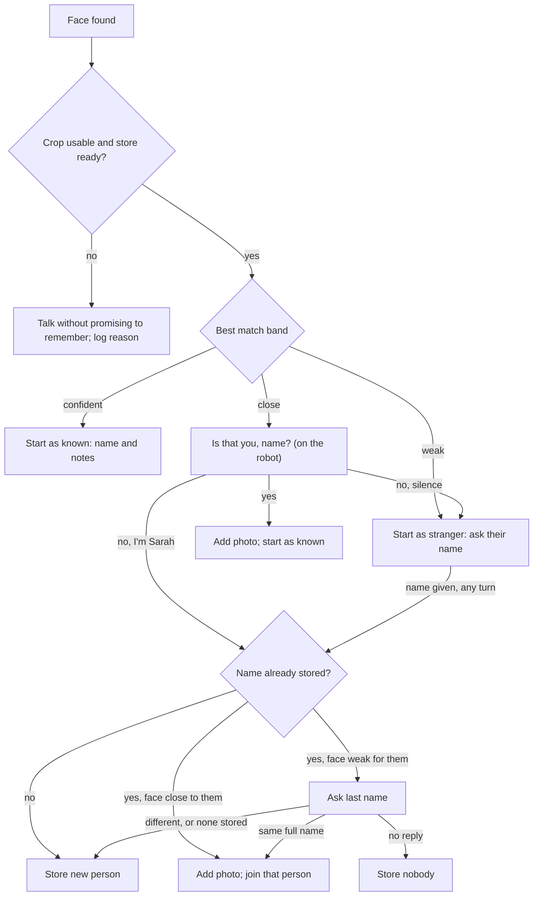
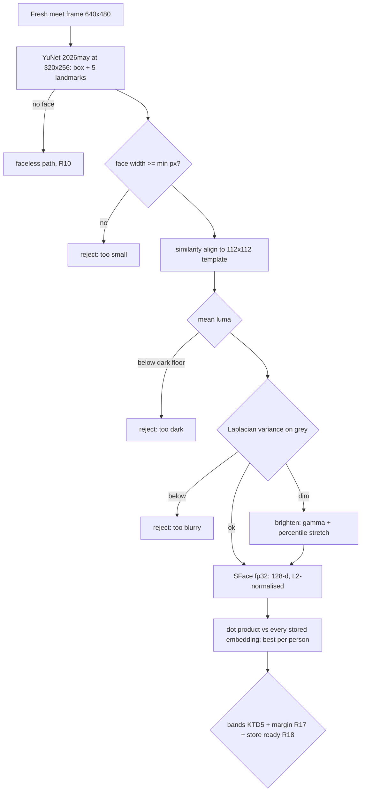
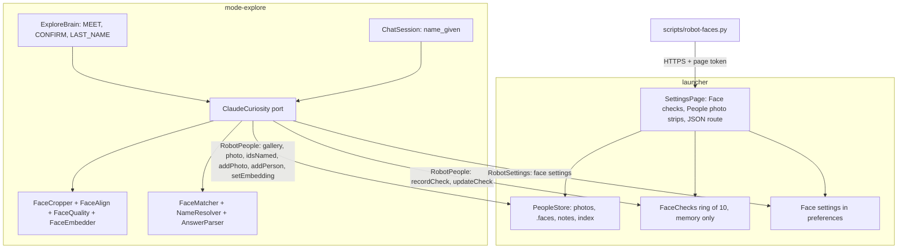
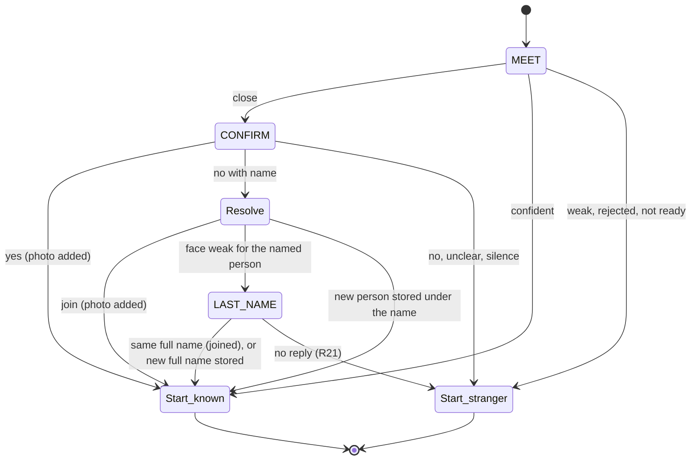

# Explore On-Device Face Recognition - Plan

## Goal Capsule

- **Objective:** The robot reliably greets the office regulars (about 20 people) by name when it meets them, faster than today, and the owner can see why it did or didn't recognise someone.
- **Means:** Face matching moves from Claude onto the robot as the OpenCV Zoo SFace embedding model (KTD1), with the YuNet face finder moved to its 2026may release and used to straighten faces (KTD2).
- **Product authority:** The owner (office robot). Recognising people while roaming is not active scope; it is the recorded next step.
- **Authority order:** Product Contract requirements win on behaviour; KTDs win on mechanism; units carry neither.
- **Stop conditions:** (1) SFace or YuNet 2026may will not load or gives outputs different from the Python reference in ONNX Runtime 1.30. Stop before U3 and report; do not swap in a non-commercial model. (2) The owner's bench (U9) finds no confident threshold that keeps every captured impostor, including each held-out person scored against everyone else's full photo set, out of the confident band while still greeting most genuine captures. Stop before shipping the bands, and report the score distributions.
- **Execution profile:** The implementing agent builds U1 to U9 and their host tests. The bench run (U9) and the QA session (U10) need the owner and the robot. The pull request stays marked pending until both are recorded in it.
- **Open blockers:** None.

---

## Product Contract

### Summary

Explore recognises people on the robot. Each face crop becomes an embedding and is compared with every stored photo of every person. He greets confident matches by name, asks "Is that you, Ben?" on close ones, and asks the name on weak ones. Confirmed answers teach him more photos of each person. Every face check is visible on the settings page and in a CLI.

### Problem Frame

Matching today sends the new face crop plus up to 10 stored face photos to Claude and asks which one matches (`mode-explore/src/com/miko3/mode/explore/ClaudeCuriosity.java`, `person()`). The office has about 20 regulars, so anyone outside the 10 most recently seen is treated as a stranger however good the photo is. Each match is a multi-image network request, so it is slow and costs tokens. Claude can also refuse or answer "unsure", and those count as a new person.

The owner can't tell whether it works. One person's face and name have been stored, but they have not been confirmed as recognised at a later stop (`docs/TODO.md`). The crop was dim, and nothing shows what the matcher decided or why. A miss, a bad photo and a refusal all look the same from the outside.

### Key Decisions

- **Detector update and on-device matching ship as one plan.** Governs R16. (session-settled: user-directed — chosen over on-device matching alone or the YuNet update alone: both serve the same meet-time path.)
- **Local matching replaces Claude for matching; recognising while roaming is deferred.** Governs R1, R3, R4. (session-settled: user-directed — chosen over a hybrid where Claude decides close calls from a local shortlist, and over doing roaming recognition in the same plan: the spoken confirmation already handles close calls, and roaming needs a trusted matcher first.)
- **Three bands, and a close match is confirmed aloud.** Governs R2, R5, R6, R17. (session-settled: user-directed — chosen over greeting by best guess, which gives wrong names, and over treating every uncertain face as new, which re-asks regulars.)
- **A last name is asked only when two people could be confused.** Governs R7, R20. (session-settled: user-directed — the owner's rule for the "two Bens" case.)
- **Several photos per person, learned from confirmed answers.** Governs R5, R6, R8. (session-settled: user-approved — up to 5 photos, oldest replaced, a "yes" or a stored name adds the face.)
- **Visibility is part of the feature, on the settings page and in a CLI.** Governs R13, R14, R15, R19. (session-settled: user-directed — chosen over judging only by what he says, logs only, or the page only.)
- **Photos stay on the robot beside their embeddings.** The page can show them, and a later model change can recompute embeddings from them. Governs R9, R13, R18. (session-settled: user-approved — confirmed in the scope synthesis.)
- **Bad crops are gated, and dim ones brightened.** Better models don't rescue a dark or blurry crop. Governs R11, R12. (session-settled: user-approved — confirmed in the scope synthesis.)
- **Duplicate people are possible and are fixed on the People page.** If a stored person has no last name, a last-name answer can't be compared with them, so he stores a new person. The owner removes the duplicate with the existing forget control. Governs R7.

### Requirements

**Matching**

- R1. Recognition runs on the robot and compares the face with every stored photo of every named person, with no limit to the most recent 10.
- R2. Each face check gives a best-matching person, a similarity score, and one of three decisions: confident (greet by name), close (ask "Is that you, <name>?"), or weak (treat as new and ask their name). The band thresholds are tunable without a rebuild.
- R17. When the two best-matching different people score within a small tunable margin of each other, a confident result is demoted to close and asks about the higher one.
- R3. The match decision needs no network connection.
- R4. No face or name is sent to Claude for matching or for the meeting's greeting and name-asking lines. Claude still writes those lines from text only, and the robot fills in the name, as today. The confirmation and last-name questions are fixed lines spoken on the robot. The conversation that follows is unchanged: it still receives the person's name, notes and one face crop at its start (`docs/plans/2026-09-25-1611-feat-explore-meeting-small-talk-plan.md`, KTD9).
- R18. While any named person's stored photo is still waiting for an embedding for the current model, a meeting stores nobody and adds no photo. A stored photo that cannot be embedded is marked on the People page for replacement instead of blocking everyone. He talks to the person as he does with no face found.

**Learning people**

- R5. Each person keeps up to 5 photos, and a new one replaces the oldest. A "yes" to "Is that you, <name>?" adds the current crop to that person.
- R6. A "no" to the confirmation is followed by asking their name. When the name matches a stored person and the face is at least close to that person, the crop joins that person's photos.
- R7. When a spoken name matches a stored person but the face is weak for that person, he asks their last name. The same full name adds the crop to that person. A different full name, or a stored person with no last name, creates a new person under the full name.
- R20. A name given later in the conversation goes through the same comparison as R6 and R7: it joins a stored person, prompts for a last name, or creates a new person.
- R21. No reply to "Is that you, <name>?" is treated as a no. No reply to the last-name question stores nobody.
- R8. "Forget me" and the People page's forget remove every photo and embedding of that person.
- R9. People already stored keep working: their existing photo becomes their first photo.

**Photo quality**

- R10. The face finder keeps its rule that no detected face means no match and no storage.
- R11. A crop that is too dark, too blurry or too small is neither matched nor stored. He talks to the person as he does today with no face found, and makes no promise to remember them.
- R12. A dim but usable crop is brightened before it is matched or stored.

**Visibility**

- R13. The robot's settings page shows the most recent face checks, about 10. Each shows the crop, the best-matching person's photo and name, the score, the decision, and what happened next (yes, no, name given, or no reply).
- R14. Rejected crops appear in the same list with the reason: too dark, too blurry or too small.
- R19. Face checks are held only in memory, the last 10, and are gone when the launcher restarts. Forgetting a person removes every check that matched or joined them.
- R15. A CLI command lists recent face checks and people with their photo counts, and reads and sets the band thresholds.

**Face finder**

- R16. The face finder moves to the YuNet 2026may release, which takes any input size. It runs at the smallest input size that still finds a face at meeting distance. Its facial landmarks are used to straighten the face before matching.

### Key Flows

- F1. Meeting someone
  - **Trigger:** Explore stops in front of a person and takes a fresh look (existing meet flow).
  - **Steps:** Find the face; apply the quality gate (R11, R12); match against everyone (R1, R2, R17, R18); confirm a close match before the conversation starts; hand off to the conversation (or to the degraded ladder when no conversation is possible); resolve any name given (R6, R7, R20, R21); record the check and its outcome (R13 to R15, R19).
  - **Outcome:** Greeted by name, confirmed, or asked their name, with his memory updated from the answer.
  - **Covers:** R1, R2, R5, R6, R7, R11, R12, R13, R17, R18, R20, R21

### Acceptance Examples

- AE1. **Covers R1.** Given Priya was last seen a week ago and 15 other people have been seen since, when Explore meets her front-on, he greets her by name.
- AE2. **Covers R2, R5.** Given Ben's match is close, when Explore meets him, he asks "Is that you, Ben?". Ben says yes, and the crop becomes one of Ben's photos, replacing the oldest if Ben already has 5.
- AE3. **Covers R6.** Given the close match was Ben, when the person says "No, I'm Sarah" and their face is close to stored Sarah, the crop joins Sarah's photos and he greets Sarah.
- AE4. **Covers R7.** Given "Ben Wilson" is stored, when a new person says "I'm Ben" and their face is weak for Ben Wilson, he asks their last name. "Smith" stores a new person, "Ben Smith". "Wilson" adds the crop to Ben Wilson.
- AE5. **Covers R11, R14.** Given the crop is too dark to use, he doesn't match or store it, and the settings page lists the check as rejected: too dark.
- AE6. **Covers R8, R19.** Given Sarah has 4 photos, when she confirms "forget me", all 4 photos and her name are gone, and neither the People list nor the face-check list shows her.
- AE7. **Covers R21.** Given the close match was Ben, when nobody answers "Is that you, Ben?", he asks their name as he would a stranger, adds no photo to Ben, and the check shows "no reply".
- AE8. **Covers R17.** Given "Ben Wilson" and "Ben Smith" both score confident and within the margin, he asks "Is that you, Ben?" about the higher one rather than greeting.
- AE9. **Covers R20.** Given the meeting started with a stranger, when the person says "I'm Sarah" on the third turn and their face is close to stored Sarah, the crop and this conversation's notes go to Sarah, and no new person is stored.

### Success Criteria

- The owner is greeted by name in at least 4 of 5 front-on meetings in normal office light.
- The time from stopping in front of someone to the first spoken line drops clearly compared with the Claude matcher, measured on the robot before and after.
- No one is greeted by another person's name during the QA session.
- For every miss during QA, the settings page shows why: a rejected crop, a weak score or a close-band question.

### Scope Boundaries

- Recognising people while roaming, before a stop. This is the recorded next step, once this matcher and its thresholds are trusted.
- Recognising people by voice.
- Claude judging close calls.
- Merging duplicate people. The existing forget control handles them.
- Profile or far-away faces. Matching targets the front-on meeting look.

#### Deferred to Follow-Up Work

- The roaming recently-met check (`ClaudeCuriosity.checkRecentlyMet`) keeps sending faces to Claude. It moves to the on-device matcher with roaming recognition.
- LAN authentication for the settings page (already in `docs/TODO.md`). This plan adds face crops to that page, which raises its priority.

### Dependencies / Assumptions

- SFace's weights are Apache-2.0 and run in the ONNX Runtime 1.30 the mode already bundles (`scripts/build-mode-explore.py`). Its training data is undocumented upstream. The vendor's `MobileFaceNet.tflite` in `tools/extracted-system/` is a reference only, since its licence is unclear.
- The processor budget follows the existing two-thread rule for models on the MT8168 (`docs/solutions/tooling-decisions/on-device-object-detection-yoloe-onnx-runtime-miko3.md`). The object detector is parked during a meeting, so the face models never overlap it.
- This supersedes the out-of-scope line "Face matching needs Claude" in `docs/plans/2026-09-24-1545-feat-explore-on-claude-plan.md`, and amends the meeting plan's KTD10 mismatch rule (KTD6 here).
- The people store has no cap on the number of people. Only the gallery sent to Claude is limited to 10 (`launcher/src/com/miko3/launcher/PeopleStore.java`).
- No people CLI exists today. `scripts/robot-settings.py` handles settings only.

### Sources / Research

- Current matcher: `mode-explore/src/com/miko3/mode/explore/ClaudeCuriosity.java` (`person()`, `forConversation`, `keep`, `remember`), `mode-explore/src/com/miko3/mode/explore/ClaudeReplies.java` (`match`).
- Meet flow: `ExploreBrain.enterMeet`, `meetStep`, `chatPossible`, `enterChat` and the degraded ladder (`greet`, `askName`, `nameStep`, `rememberStep`); `ChatSession.nameGiven`, `onHeard`, `CONFIRM_FORGET` and `affirmative()`.
- Face finder: `mode-explore/src/com/miko3/mode/explore/FaceCropper.java` (YuNet 2023mar, 640x640 padded input, input size read from the model), `YuNetDecoder.java` (landmarks discarded), `FaceCrop.java` (1.6x square, 224 px, JPEG q85).
- People store and page: `launcher/src/com/miko3/launcher/PeopleStore.java` (`OWNED_FILE` orphan sweep, `MAX_FACE_BYTES`), `PeopleService.java`, `SettingsPage.java` (`appendPeople`, `sendFace`), `shared/src/com/miko3/shared/RobotPeople.java` (transactions 1-7, `LAUNCHER_TOO_OLD`), `RobotPeopleClient.java`, `RobotSettings.java`.
- Debug crops already written: `last-face.jpg` and `last-face-src.jpg` behind `log.tag.MikoExploreFaceDebug`.
- YuNet 2026may (the 2023mar weights re-exported with symbolic height and width, MIT): https://github.com/opencv/opencv_zoo/tree/main/models/face_detection_yunet
- SFace (Apache-2.0, 128-d, published Cortex-A53 benchmark 124.8 ms fp32): https://github.com/opencv/opencv_zoo/tree/main/models/face_recognition_sface
- Alignment template and decode: OpenCV `modules/objdetect/src/face_recognize.cpp` (`alignCrop`) and `face_detect.cpp`.
- Vendor pipeline notes: `docs/hardware/camera-vision.md` (BlazeFace to MobileFaceNet to a distance classifier).

---

## Planning Contract

**Product Contract preservation:** changed. R4's wording is corrected: names already go to Claude in the conversation, so the rule now names what it always meant (no face or name for matching or for the meeting lines). The confirmation and last-name questions are named as fixed lines spoken on the robot (KTD6). New requirements R17 (near-tie demotion), R18 (store not ready, with unusable legacy photos marked rather than blocking), R19 (face-check log lifetime and forget), R20 (a name given later in the conversation) and R21 (no reply) close gaps the flow analysis found; R17 serves the existing "no one greeted by another's name" criterion. F1 is redrawn to show both conversation starts and the new branches. AE6 now also covers R19, and AE7 to AE9 are new. The questions the brainstorm deferred to planning are answered in KTD1 (model), KTD5 (thresholds), KTD2 (input size), KTD7 (Claude unreachable), KTD4 (first photo) and KTD8 (People page photos). Everything else is unchanged.

### Key Technical Decisions

- KTD1. **The embedding model is OpenCV Zoo SFace, `face_recognition_sface_2021dec.onnx`, fp32.** It is the only candidate whose weights carry a permissive licence (Apache-2.0). The insightface MobileFaceNet and EdgeFace weights are non-commercial, and GhostFaceNets has no licence path, so the brainstorm's "compare on real crops" becomes validating SFace's thresholds on real crops (U9). Input is an aligned 112x112 RGB crop as raw 0-255 floats in NCHW order, with no normalisation, because the model normalises internally. The output (128-d, checked at load) is L2-normalised and compared by dot product. The int8 export is excluded: it is slower on A53 and has a reported collapse bug. The model and its licence file sit in `mode-explore/assets/` beside YuNet; about 37 MB is the accepted APK cost. Cites R1, R3.
- KTD2. **YuNet 2026may runs on a scaled frame at a fixed input size, and its landmarks drive a five-point similarity alignment.** The dynamic-shape model reports -1 for height and width, so `FaceCropper` stops reading the size from the model and uses a named constant. The default is 320x256: the 640x480 camera frame scaled by half to 320x240 and padded with black rows at the bottom, so both sides are multiples of 32 and every stride's grid is whole, as OpenCV pads. U9's bench confirms it still finds faces at meeting distance, or picks the next size up (the first of 320x256, 480x384 or 640x480 that keeps every meeting-distance face in the capture set). The decoder reads `kps_{8,16,32}` into five points per face. Alignment is a least-squares similarity fit (Umeyama, uniform scale, reflection guard) onto the ArcFace 112x112 template, (38.2946, 51.6963), (73.5318, 51.5014), (56.0252, 71.7366), (41.5493, 92.3655), (70.7299, 92.2041), applied with bilinear sampling. It is plain Java so the host tests prove it. Cites R16.
- KTD3. **One face pipeline, the same at meeting time and enrolment:** detect, then the size check, alignment, the darkness check and the blur check on the aligned crop, the brighten when dim, then embedding. Size is the face box's width in frame pixels. Darkness is the aligned crop's mean luma: below the dark floor rejects, and between the floor and the dim level brightens. Blur is the variance of the Laplacian on the aligned grey crop, measured before brightening. The brighten is one fixed luma lookup table applied to all three channels: a gamma of log(110/255)/log(mean/255) clamped to 0.4 to 1.0, then a linear stretch of the 1st to 99th luma percentiles to 0 to 255. The same transform brightens the loose crop that is stored, and U9's numpy mirror uses the same constants. Rejections carry one reason (too dark, too blurry, too small) and fall through to the existing faceless path. The stored photo is the brightened loose 224 px crop, so a stored photo is never brightened twice. CLAHE is not used, because it amplifies low-light noise, which then inflates the blur score. The gate thresholds live with the band thresholds (KTD5). Cites R10, R11, R12.
- KTD4. **The launcher's people store owns photos and embeddings, and the mode computes every embedding.** Per person: photo slot 0 stays `<id>.jpg` (R9), slots 1 to 4 are `<id>-<n>.jpg`, and one `<id>.faces` file holds the model id plus each slot's added-at time and embedding. Writes use the store's temp, fsync, rename pattern, and `OWNED_FILE` widens to the new names so the orphan sweep keeps them. A new photo fills an empty slot or replaces the oldest; the first photo gets no protection, because R5 says oldest and a stale first photo is exactly what should go. Forget deletes the index entry, then notes, then `.faces`, then every photo (R8). The launcher never runs a model. Cites R5, R8, R9.
- KTD5. **Band and gate thresholds are launcher settings, read by the mode at each meeting, shown on the settings page and set with the CLI.** They sit beside the Claude settings in the launcher's preferences and reach the mode through a new appended `RobotSettings` transaction that follows the `LAUNCHER_TOO_OLD` rule. An edit applies from the next meeting with no rebuild or restart. Starting values: confident 0.50, close 0.363 (SFace's published 1:1 threshold), near-tie margin 0.05, minimum face width 48 px, dark floor luma 40, dim level luma 90, blur floor 30. U9 replaces them with values fitted to captured office crops. Bands are inclusive at their lower edge (score ≥ confident is confident). The launcher refuses a save unless 0 ≤ close ≤ confident ≤ 1, 0 ≤ margin ≤ 0.3, 0 ≤ dark floor < dim level ≤ 255, blur floor ≥ 0, and 16 ≤ minimum width ≤ 640. The page shows the values read-only; the save route accepts only loopback callers, which is how the CLI arrives over `adb forward`, so nobody on the office network can set confident to 0. Cites R2, R17.
- KTD6. **Everything that decides who someone is runs on the robot, before or beside the conversation, never inside a Claude turn.** A close match is confirmed in a new brain state, CONFIRM, which runs after MEET and before either conversation start. It speaks a local template, "Is that you, {name}?", through the on-device voice route `CONFIRM_FORGET` uses. When another stored person shares the candidate's first name, {name} is the full stored name, so the other Ben cannot truthfully say yes to the wrong one. It listens once, parses the reply with `AnswerParser` (KTD9), and only then enters the conversation as known (with that person's notes in the frozen prefix) or as a stranger. Any spoken name, whether from CONFIRM, the degraded NAME step or a `name_given` on any conversation turn, goes to one resolver on the port. The resolver returns join(id), ask-last-name or new, and runs the R6/R7 comparison against stored people whose name matches (KTD10). Ask-last-name speaks a local "And your last name?" in place of that turn's line: in the degraded ladder through a new LAST_NAME state, in `ChatSession` by dropping the queued Claude line. In a conversation, the person's name reply and last-name reply are then appended as user messages and the next turn is requested as usual; a `name_given` that equals the already-resolved name is a no-op. A newly stored person continues as known under the name just given, with empty notes, and is not asked again. This replaces the meeting plan's KTD10 mismatch rule, under which a differing name always made a new record. A join moves this conversation's notes buffer to the joined id. The joined person's older notes are not loaded mid-conversation, because the prefix is frozen. Cites R2, R4, R5, R6, R7, R20, R21.
- KTD7. **The match answer carries no lines. Lines are fetched only where they are spoken, and local templates cover a failure.** The conversation path needs no meeting lines, so `MATCH_ANSWERED` stamps the moment the local match finishes. The degraded ladder fetches the greeting and name-asking lines with the text-only `port.lines()` request, whose schema gains the named greeting line (today it carries only the stranger lines), with the name left as a placeholder the robot fills. If that request fails, a known person hears a local "Hi, {name}!" through the on-device voice, and a stranger gets the existing name clip. On the conversation path, a turn-1 failure for a known person plays the same local greeting before the canned sign-off. Cites R3, R4.
- KTD8. **Face checks are an in-memory ring of 10 in the launcher, written by the mode through appended `RobotPeople` transactions, and shown on the settings page beside a per-person photo strip.** The mode records each check with its crop (at most 40 KB, like a stored photo), the best-matching id, slot and that photo's added-at time, the score, the runner-up id and score with a near-tie marker when R17 demoted it, and the decision, and gets back a handle. Decisions are confident, close, weak, rejected with its reason, not ready, or no face found (recorded with no crop). The best-match image route serves the photo only while that slot's added-at time still matches, and otherwise shows that the photo has since been replaced. It updates that handle's outcome when the answer arrives: yes, no, name given, joined, new person, or no reply. A check left open when the meeting ends is closed as "ended without an answer". The page gains a Face checks section and, per person, a strip of their photos with a delete control for one photo; deleting the last photo is refused, because forget does that. Photos migration marked unusable (KTD11) carry a visible mark and are excluded from matching. A token-protected JSON route serves the checks and people for the CLI, with names and no images. Crops are served by id through the existing image-route pattern. Cites R13, R14, R15, R19.
- KTD9. **The confirmation reply grammar is a plain-Java table, not a whole-utterance match.** `AnswerParser` normalises the transcript and returns yes, no-with-name, no, or unclear. Yes: a leading affirmative (yes, yeah, yep, yup, that's me, it's me, correct, sure), or a name equal to the name asked. When the question used a full name, a bare first name is unclear, not yes. No-with-name: a leading or implied negation plus a name `NameExtractor` accepts once the negation word is stripped ("no, I'm Sarah"), or any name different from the candidate. No: a bare negation (no, nope, nah, not me, wrong). Anything else, including silence and a question back ("who's Ben?"), counts as no (R21). The last-name reply goes through `NameExtractor`: one word is the last name, and two words must start with the pending first name. The existing forget confirmation keeps its strict list. Cites R5, R6, R21.
- KTD10. **A name matches a stored person by full name when two words are given, otherwise by first word, case-insensitive, over every named person.** The launcher answers with ids only, through an appended `idsNamed` transaction, so names still leave the store only through `nameOf`. The resolver scores the face against each matching id's photos and takes the best. At or above close, it joins that id (R6). Below close, with at least one match, it asks the last name (R7). With no match, it stores a new person. After a last name, it joins an id whose full stored name equals the given full name, or else stores a new person under the full name. "Ben" does not match "Benjamin". Cites R6, R7, R20.
- KTD11. **The mode fetches the whole embedding gallery once per meeting, and migrates missing embeddings at mode start.** An appended transaction returns every named person's (id, slot, model id, embedding) with no names and no images. That is about 51 KB for 20 people with 5 photos each, far under the 1 MB Binder buffer. The launcher holds embeddings, so no generation counter is needed: each meeting reads fresh. At `startExplore` the brain holds its first roam, with the object detector not yet loaded, while a migration pass fetches each photo whose embedding is missing or tagged with another model id, one photo per call. Migration detects and aligns the stored crop and brightens it when dim, but skips the reject checks, since a stored photo was already accepted once; it writes the embedding back through `setEmbedding`, which carries the slot's added-at time and is refused when the id is gone or the slot has since been replaced. A stored crop in which YuNet finds no face is marked unusable instead: it gets no embedding, never acts as a match exemplar, no longer counts as waiting (R18), and the People page marks it for replacement. Meetings before migration finishes are "store not ready" (R18). The hold ends after 30 s; the rest of the pass runs only while the detector is parked at a stop, never alongside it. Cites R9, R18.
- KTD12. **Adding a photo is by id and refuses an unknown id.** A "yes" that races a forget from the page cannot resurrect the person. A new person is created with their first photo and its embedding in one appended transaction. The existing `add` stays for older callers, and the proxy for every new transaction throws `LAUNCHER_TOO_OLD` against an old launcher. The mode then falls back to the faceless path and logs a fixed reason. Launcher and mode-explore are installed together from one build id. Cites R5, R6, R7, R8.

### High-Level Technical Design

The face pipeline, run once per meeting (and per stored photo during migration):

Who owns what, across the two apps:

The meeting's new states, both conversation starts:

"Start" means `enterChat` when a conversation is possible, and otherwise the degraded ladder (`greet` or `askName`). A name given inside the conversation re-enters Resolve through `ChatSession` without leaving the conversation (KTD6).

### Assumptions

- Confident matches never add a photo; only a yes or a resolved name does (R5 as written). Drift in hair or glasses shows as a slide into the close band, which then teaches a new photo.
- The camera's exposure controller keeps running; the software brighten sits on top of it, and U10 records the rejected-crop rate.
- Nameless legacy records stay out of the gallery (the meeting plan's KTD10), so R9 and migration apply only to named people.
- `RobotPeople.recent()` keeps serving the roaming recently-met check, and returns each person's newest photo.
- The owner accepts SFace's undocumented training-data provenance for a personal office robot. The weights licence is clean.

### Open Questions

**Deferred to implementation**

- The exact gate values (minimum face width, dark floor, dim level, blur floor): U9 fits them from captures, and the plan's defaults are placeholders until then.
- Whether the brightening stretch needs a cap on noisy dark crops: settle it from U9's before-and-after images.
- The exact wording of the local templates, kept to one short sentence each.

### System-Wide Impact

- **Binder contracts:** `RobotPeople` gains transactions 8 onward and `RobotSettings` gains one. Both APKs are installed together; an older launcher surfaces as `LAUNCHER_TOO_OLD` and a faceless meeting, never a silent failure.
- **Privacy:** test fixtures are public sample faces with their licences, never office captures; bench captures live in a gitignored folder and are deleted once U9's values are recorded; only numbers go in the pull request. Crops of people who never gave a name now appear on the settings page until they roll off the 10-entry ring or the launcher restarts (R19). The page has no LAN authentication. Faces still never leave the robot for matching, and the conversation's single crop is unchanged.
- **Tests that pin today's shape:** `test_explore_claude_wiring.py` asserts `RobotPeopleClient.recent` in the match path, and `test_explore_yunet.py` pins the 2023mar checksum and a 640x640 input. Both change on purpose.
- **APK size:** mode-explore grows by about 37 MB for SFace.

### Risks & Dependencies

- **Latency under load.** Earlier work measured speech first-sound at 4.9 s while the detector was busy. The face models run while the detector is parked, and before the greeting, never alongside speech. U10 checks the stage stamps; the SFace estimate on this chip is 70 to 130 ms, extrapolated rather than measured.
- **Wrong-name risk from duplicates.** R7 creates duplicates on purpose, and a duplicate pair scores confident for the same face. R17's margin demotes the pair to close, which asks rather than guesses.
- **A false yes.** A person who answers yes to someone else's name teaches the robot the wrong face; spoken confirmation is the settled design. The full-name question (KTD6), the face-check list and the delete-one-photo control bound the damage.
- **Model load memory.** SFace is about 37 MB; U3 loads it from a file path rather than a Java byte array, so the load never doubles it on the heap.
- **A dim legacy photo.** The one stored person's crop is dim. Migration brightens it and skips the reject checks; if YuNet finds no face in it, it is marked unusable for the owner to replace, and that person meets as a stranger until then.
- **Camera HAL.** Nothing here reopens the camera or changes the FPS range; the meeting's existing look supplies the frame.

### Sequencing

U1 and U2 are independent plain-Java foundations. U3 needs both. U4 and U5 are the launcher side and can proceed in parallel with U3. U6 joins them in the mode, U7 builds the meeting behaviour on U6, and U8 reads what U5 serves. U9's bench needs only U1 to U3's Python mirror and can run as soon as crops exist. U10 closes on the robot.

---

## Implementation Units

| U-ID | Title | Key files | Depends on |
|---|---|---|---|
| U1 | YuNet 2026may with landmarks at a set input size | `FaceCropper.java`, `YuNetDecoder.java`, `face_yunet.onnx` | none |
| U2 | Alignment, quality gate and brightening | new `FaceAlign.java`, `FaceQuality.java` | none |
| U3 | SFace embedder and the matcher | new `FaceEmbedder.java`, `FaceMatcher.java`, `face_sface.onnx` | U1, U2 |
| U4 | People store with several photos and embeddings | `PeopleStore.java`, `PeopleService.java`, `RobotPeople.java`, `RobotPeopleClient.java` | none |
| U5 | Face settings, face checks and the page | `ClaudeSettings.java`, `RobotSettings.java`, new `FaceChecks.java`, `SettingsPage.java` | U4 |
| U6 | On-device matching in Explore | `ClaudeCuriosity.java`, `CuriosityPort.java` | U3, U4, U5 |
| U7 | Confirming, resolving names and learning | `ExploreBrain.java`, `ChatSession.java`, new `AnswerParser.java`, `NameResolver.java` | U6 |
| U8 | The faces CLI | new `scripts/robot-faces.py` | U5 |
| U9 | The Mac bench for thresholds and input size | new `scripts/face-bench.py` | U1, U2, U3 |
| U10 | Owner QA on the robot | `scripts/qa-conversation.py`, `docs/TODO.md` | U1 to U9 |

### U1. YuNet 2026may with landmarks at a set input size

- **Goal:** The face finder runs the 2026may model on a scaled frame and returns each face's box, score and five landmarks.
- **Requirements:** R10, R16; KTD2.
- **Dependencies:** none.
- **Files:** `mode-explore/assets/face_yunet.onnx` (replaced), `mode-explore/assets/face_yunet-LICENSE.txt`, `mode-explore/src/com/miko3/mode/explore/FaceCropper.java`, `mode-explore/src/com/miko3/mode/explore/YuNetDecoder.java`; tests `scripts/tests/test_explore_yunet.py` and its harness under `scripts/tests/fixtures/explore_yunet_harness/`.
- **Approach:**
  1. Replace the model file with `face_detection_yunet_2026may.onnx` under the existing asset name, and keep the MIT licence file current.
  2. Give `FaceCropper` a named input-size constant (KTD2) in place of the model-read shape. Scale the frame, pad it to the input size, and map boxes and landmarks back by the scale.
  3. Extend `YuNetDecoder.Face` with five points decoded from `kps_S` using the same cell-offset times stride rule as the box. Keep the score, NMS and `MIN_SCORE` unchanged.
  4. `crop()` keeps returning today's loose square crop for callers, and a new result also carries the landmarks in frame coordinates for U2.
- **Patterns to follow:** the existing decoder harness and `PinnedModelTest`/`RealModelTest` in `test_explore_yunet.py`.
- **Test scenarios:**
  - Synthetic `kps_16` outputs for one cell decode to five points at the expected frame coordinates after the scale-back.
  - A 320x256 decoder configuration produces anchor grids of 40x32, 20x16 and 10x8 for strides 8, 16 and 32, and a face in the padded bottom rows is never reported.
  - The pinned-model test checks the 2026may SHA-256 and the licence file.
  - With Python onnxruntime installed, the real model on a public sample face image (licence recorded beside the fixture) returns one face whose landmarks lie inside its box, at 320x256 and at 640x480.
  - No face in a blank frame still yields the faceless result (R10).
- **Verification:** `test_explore_yunet.py` passes, and the real-model test runs on a machine with onnxruntime.

### U2. Alignment, quality gate and brightening

- **Goal:** Plain-Java classes turn a frame, box and landmarks into either a rejection reason or an aligned, possibly brightened 112x112 crop and a stored-photo crop.
- **Requirements:** R11, R12, R16; KTD2, KTD3.
- **Dependencies:** none.
- **Files:** new `mode-explore/src/com/miko3/mode/explore/FaceAlign.java`, new `mode-explore/src/com/miko3/mode/explore/FaceQuality.java`; tests new `scripts/tests/test_face_align.py` with a harness under `scripts/tests/fixtures/face_align_harness/`. Image fixtures are synthetic or public sample faces with their licences, never office captures.
- **Approach:**
  1. `FaceAlign` fits the similarity transform to the template (KTD2) and warps an RGB pixel array to 112x112 with bilinear sampling. It has no `android.*` imports.
  2. `FaceQuality` computes face width, mean luma and Laplacian variance, applies the thresholds it is given (from KTD5's settings), and returns ok, dim or a single rejection reason, in the order small, dark, blurry.
  3. Brightening is KTD3's fixed lookup table, applied identically to the aligned crop and the stored loose crop.
- **Execution note:** Implement test-first against numpy reference values; the alignment math is the part most likely to be quietly wrong.
- **Patterns to follow:** `YuNetDecoder` and `FaceCrop` as plain-Java, harness-tested classes.
- **Test scenarios:**
  - Landmarks already on the template produce an identity transform, and the warped crop equals the input.
  - Landmarks rotated 15 degrees and scaled by 2 are recovered: the transform's rotation and scale match within 0.5 degrees and 1 percent, checked against a numpy Umeyama reference.
  - Mirrored landmarks do not produce a reflection (the guard holds).
  - A crop with mean luma below the dark floor is rejected as too dark; one between floor and dim level is marked dim and brightened, raising its mean luma into range.
  - A Gaussian-blurred fixture falls under the blur floor, and the sharp original clears it; blur is measured before brightening.
  - A face narrower than the minimum width is rejected as too small before any other check.
  - Brightening an already-bright crop changes nothing.
  - A migration-mode call brightens a dim crop but reports no rejection for a dark or blurry one (KTD11).
- **Verification:** `test_face_align.py` passes with every scenario reported.

### U3. SFace embedder and the matcher

- **Goal:** The mode can embed an aligned crop on the robot and decide a band from a gallery.
- **Requirements:** R1, R2, R3, R17, R18; KTD1, KTD5.
- **Dependencies:** U1, U2.
- **Files:** new `mode-explore/assets/face_sface.onnx`, new `mode-explore/assets/face_sface-LICENSE.txt`, new `mode-explore/src/com/miko3/mode/explore/FaceEmbedder.java`, new `mode-explore/src/com/miko3/mode/explore/FaceMatcher.java`; tests new `scripts/tests/test_face_matcher.py` with a harness under `scripts/tests/fixtures/face_matcher_harness/`.
- **Approach:**
  1. `FaceEmbedder` follows `FaceCropper`'s ONNX Runtime pattern: lazy load, 2 threads, `ALL_OPT`, reused direct buffers, freed on close. It copies the asset to the app's files directory once and creates the session from that path, not from a byte array. It feeds RGB 0-255 NCHW (KTD1), checks the output length at load, and L2-normalises.
  2. `FaceMatcher` is plain Java. Given a probe embedding, the gallery (id, slot, embedding), the thresholds and a readiness flag, it returns the best id and slot, the score, the second-best other id's score, and the band after R17's margin and R18's not-ready rule.
  3. A model id constant (`sface-2021dec`) tags every embedding the mode writes.
- **Patterns to follow:** `FaceCropper.load()` and `OnnxRecognizer` for the runtime; `YoloeDecoder` for a harness-tested plain-Java class.
- **Test scenarios:**
  - A probe equal to a stored embedding scores 1.0 and is confident.
  - A score exactly at the close threshold is close; one just below is weak (inclusive lower edges).
  - A person with 5 photos is scored by their best photo, not their average.
  - Two different ids at 0.62 and 0.60 with margin 0.05: confident is demoted to close and names the 0.62 id (Covers AE8).
  - Two photos of the same id at the top do not trigger the margin.
  - An empty gallery returns weak with no best id.
  - The not-ready flag returns not-ready whatever the scores.
  - With Python onnxruntime installed, the real SFace model on two public sample crops of the same person scores above 0.5, and on two different people below 0.3, and the model's SHA-256 and licence are pinned.
- **Verification:** `test_face_matcher.py` passes; the real-model test runs where onnxruntime is installed.

### U4. People store with several photos and embeddings

- **Goal:** The launcher stores up to 5 photos per person with their embeddings and serves them to the mode by id, without names.
- **Requirements:** R1, R5, R8, R9; KTD4, KTD10, KTD11, KTD12.
- **Dependencies:** none.
- **Files:** `launcher/src/com/miko3/launcher/PeopleStore.java`, `launcher/src/com/miko3/launcher/PeopleService.java`, `shared/src/com/miko3/shared/RobotPeople.java`, `shared/src/com/miko3/shared/RobotPeopleClient.java`; tests `scripts/tests/test_people_store.py` and `PeopleStoreHarness.java`.
- **Approach:**
  1. Extend `PeopleStore` with slots, the `.faces` file and oldest-slot replacement (KTD4). Widen `OWNED_FILE` and make forget remove every per-person file.
  2. Add store methods for the gallery, one photo by id and slot, `idsNamed`, add-photo-to-id (refusing an unknown id), add-person-with-photo-and-embedding, set-embedding, and delete-one-photo (refusing the last).
  3. Append the matching `RobotPeople` transactions from 8 upward, with `LAUNCHER_TOO_OLD` in each proxy, `CallerGate` in the service, and sizes bounded so no reply nears the Binder buffer.
  4. `recent()` returns each person's newest photo.
- **Patterns to follow:** existing transactions 1-7 and their compat rule; the store's temp, fsync, rename writes and synchronized methods.
- **Test scenarios:**
  - A legacy person with only `<id>.jpg` loads with one photo and no embedding, and is listed as missing an embedding (R9).
  - Adding a sixth photo replaces the slot with the oldest added-at time, and the `.faces` entry for that slot is rewritten.
  - Add-photo to an id that was just forgotten is refused and writes no file (KTD12).
  - Forget removes the index entry, notes, `.faces` and all photo files, and a reload finds none (R8).
  - `load()` keeps `<id>-3.jpg` and `<id>.faces` and still sweeps an unrelated file.
  - `idsNamed("ben")` returns both "Ben Wilson" and "Ben Smith"; `idsNamed("ben wilson")` returns one; "Benjamin" matches neither; nameless records never match.
  - The gallery skips nameless records and carries no names.
  - Deleting a person's only photo is refused.
  - Set-embedding for a slot whose added-at time no longer matches, or for a forgotten id, is refused and writes nothing.
  - Source-shape checks: every new proxy method throws `LAUNCHER_TOO_OLD` on a false transact, and every new service case calls `CallerGate`.
- **Verification:** `test_people_store.py` passes, including the existing scenarios.

### U5. Face settings, face checks and the page

- **Goal:** The owner sees recent face checks and each person's photos on the settings page, and the thresholds are editable there and readable by the mode.
- **Requirements:** R2, R13, R14, R15, R19; KTD5, KTD8.
- **Dependencies:** U4.
- **Files:** `launcher/src/com/miko3/launcher/ClaudeSettings.java`, `shared/src/com/miko3/shared/RobotSettings.java`, `shared/src/com/miko3/shared/RobotSettingsClient.java`, new `launcher/src/com/miko3/launcher/FaceChecks.java`, `launcher/src/com/miko3/launcher/PeopleService.java`, `launcher/src/com/miko3/launcher/SettingsPage.java`, `launcher/src/com/miko3/launcher/LauncherApp.java`, `shared/src/com/miko3/shared/LauncherProtocol.java`, `shared/src/com/miko3/shared/RobotPeople.java`; tests `scripts/tests/test_launcher_settings.py`, `scripts/tests/test_robot_settings_service.py`, `scripts/tests/test_people_store.py`.
- **Approach:**
  1. Store the face settings (KTD5) with validation, and expose them through an appended `RobotSettings` transaction. The save route accepts loopback callers only.
  2. `FaceChecks` is a synchronized ring of 10 entries with handles. It supports record, update-outcome, close-as-ended, and purge-by-person, which forget calls (R19). The ring lives only in memory.
  3. Add `recordCheck` and `updateCheck` to `RobotPeople`.
  4. The settings page gains a Face checks section (decision, near-tie runner-up, outcome), a read-only thresholds block and per-person photo strips with delete-one-photo and the unusable mark. Add the routes: a check-crop image route, a photo-by-slot image route that checks the recorded added-at time, and a token-protected JSON route for the CLI.
  5. Every string rendered is escaped, and status messages stay fixed text.
- **Patterns to follow:** `appendPeople`, `sendFace`, the persona form, and the `/settings/ears-probe` token-protected JSON route.
- **Test scenarios:**
  - An eleventh recorded check evicts the oldest, and its handle then updates nothing.
  - Forgetting Sarah removes every check whose best match or joined id was Sarah (Covers AE6).
  - A rejected check renders its reason ("too dark") and no best-match photo (Covers AE5).
  - The page renders a check's crop, best-match photo, name, score to two decimals, band and outcome, all escaped.
  - Saving close 0.6 with confident 0.5, or a dark floor above the dim level, is refused with a fixed status and leaves the stored values unchanged.
  - A threshold save from a non-loopback address is refused.
  - A check whose best-match slot was replaced afterwards shows the replaced marker, not the new photo.
  - Not-ready and no-face checks render their decision, and a no-face check shows no crop.
  - A near-tie check shows the runner-up's name and score.
  - The face settings transaction returns the saved values, and an old launcher answers `LAUNCHER_TOO_OLD`.
  - The JSON route refuses a missing or wrong page token, and its body carries no image bytes.
  - Deleting one photo of a person with 3 removes that slot and its embedding.
- **Verification:** the three test files pass.

### U6. On-device matching in Explore

- **Goal:** The mode's match comes from the robot, with migration, readiness, and a face-check record for every crop.
- **Requirements:** R1, R3, R4, R9, R10, R11, R12, R13, R14, R18; KTD3, KTD7, KTD11, KTD12.
- **Dependencies:** U3, U4, U5.
- **Files:** `mode-explore/src/com/miko3/mode/explore/ClaudeCuriosity.java`, `mode-explore/src/com/miko3/mode/explore/CuriosityPort.java`, `mode-explore/src/com/miko3/mode/explore/ModeApp.java`, `mode-explore/src/com/miko3/mode/explore/ExplorePrompts.java`, `mode-explore/src/com/miko3/mode/explore/ClaudeReplies.java`; tests `scripts/tests/test_explore_claude_wiring.py`, `scripts/tests/test_explore_brain.py`.
- **Approach:**
  1. `person()` runs KTD3's pipeline and fetches the gallery and settings (KTD5, KTD11). It records a check, then returns a `MatchAnswer` carrying the band, candidate id, score and check handle, with no lines (KTD7). The crop's embedding stays inside `ClaudeCuriosity` for the resolver.
  2. Remove the multi-image match request and its prompt and schema. Leave `checkRecentlyMet`'s request untouched.
  3. Run migration from `startExplore` on the pooled worker while the brain holds its first roam, continue it only at parked stops, and expose readiness (KTD11).
  4. The lines schema gains the named greeting line; the degraded ladder's lines come from `port.lines()`, with the local greeting fallback (KTD7).
  5. `forConversation` is unchanged for a known id.
  6. With `log.tag.MikoExploreFaceDebug` set, each meeting's source frame is also kept as a timestamped file in a rolling set of 50 in Explore's private directory, for U9.
- **Patterns to follow:** the `Slot` and generation pattern for async port work; the fixed-reason logging that never logs names or images.
- **Test scenarios:**
  - Wiring: `person()` no longer sends a Claude request with images, and does call the gallery, face settings and `recordCheck`; `checkRecentlyMet` still calls `recent`.
  - Brain harness: a confident answer with the conversation possible enters CHAT as known, with no lines request made.
  - Brain harness: a rejected crop takes the faceless path, and nothing is kept at the end (Covers AE5).
  - Brain harness: a not-ready answer takes the faceless path, and a name given afterwards is not stored (R18).
  - Brain harness: degraded ladder, known person, `lines()` failing: the local "Hi, {name}!" plays (KTD7).
  - `LAUNCHER_TOO_OLD` from the gallery call yields a faceless meeting and a fixed log reason.
  - Brain harness: the first roam waits for migration to finish or 30 s, whichever is first, and migration work is never scheduled while the detector is running.
  - Migration on a stored crop with no detectable face marks it unusable, and readiness becomes true once no photo is waiting.
- **Verification:** the wiring and brain tests pass; no source path in mode-explore sends a face to Claude outside the conversation opener and `checkRecentlyMet`.

### U7. Confirming, resolving names and learning

- **Goal:** Close matches are confirmed aloud, every spoken name goes through the comparison, confirmed faces become photos, and each check's outcome is recorded.
- **Requirements:** R2, R5, R6, R7, R20, R21; KTD6, KTD9, KTD10, KTD12; F1; AE2, AE3, AE4, AE7, AE9.
- **Dependencies:** U6.
- **Files:** `mode-explore/src/com/miko3/mode/explore/ExploreBrain.java`, `mode-explore/src/com/miko3/mode/explore/ChatSession.java`, `mode-explore/src/com/miko3/mode/explore/CuriosityPort.java`, `mode-explore/src/com/miko3/mode/explore/ClaudeCuriosity.java`, new `mode-explore/src/com/miko3/mode/explore/AnswerParser.java`, new `mode-explore/src/com/miko3/mode/explore/NameResolver.java`; tests `scripts/tests/test_explore_brain.py` with `ExploreBrainHarness.java`, new `scripts/tests/test_answer_parser.py`, `scripts/tests/test_name_extractor.py`.
- **Approach:**
  1. Add the CONFIRM and LAST_NAME brain states (KTD6) with the existing listen calls and the on-device voice route.
  2. Add the port methods `resolveName`, `resolveLastName`, `addPhoto` and `checkOutcome`, as async start and poll pairs. `NameResolver` holds KTD10's rule in plain Java; `ClaudeCuriosity` supplies the embeddings and ids.
  3. `ChatSession.nameGiven` calls the resolver in place of the mismatch rule. Ask-last-name replaces the turn's line and listens once. A join moves the notes buffer to the joined id.
  4. Every path closes its check handle with an outcome, and meeting end closes any open one as ended without an answer.
- **Execution note:** Add harness scenarios for the existing mismatch rule's replacement first, so the behaviour change is visible in the diff.
- **Patterns to follow:** `CONFIRM_FORGET` and `confirmingForget` in `ChatSession`; the brain's async start and poll states; `NameExtractor`.
- **Test scenarios:**
  - Parser table: "yes", "yeah that's me", "it's me", "Ben" (asked "Ben") are yes; "Ben" when asked "Ben Wilson" is unclear; "no I'm Sarah" and "I'm Sarah" are no-with-name "Sarah"; "nope" is no; "who's Ben?", "" and "maybe" are no.
  - Covers AE2. Close match on Ben, reply "yes": a photo is added to Ben, the conversation starts known with Ben's notes, and the check outcome is yes.
  - Covers AE3. Close match on Ben, reply "No, I'm Sarah", face close to Sarah: the photo joins Sarah, the conversation starts known as Sarah, and the outcome is joined.
  - Covers AE4. Stranger says "I'm Ben", face weak for Ben Wilson: "And your last name?" plays; "Smith" stores Ben Smith; in a second run "Wilson" adds the photo to Ben Wilson.
  - Covers AE7. Close match on Ben, no utterance within the listen: the stranger opener runs, Ben gets no photo, and the outcome is no reply.
  - Covers AE9. Conversation as stranger, `name_given` "Sarah" on turn 3, face close to Sarah: no new record, the notes buffer is written to Sarah's id, and the photo is added.
  - Last-name question unanswered: nobody is stored, and the conversation continues unnamed (R21).
  - Covers AE8. Near tie between Ben Wilson and Ben Smith: the question is "Is that you, Ben Wilson?".
  - Close match, reply "No, I'm Priya", no Priya stored: Priya is stored and the conversation continues known as Priya without asking her name again.
  - In a conversation, after the last-name exchange the next turn carries both replies, and a following `name_given` equal to the resolved name stores nothing more.
  - Stored "Ben" with no last name, stranger says "Ben", face weak, last name "Smith": a new "Ben Smith" is stored (R7's duplicate case).
  - `addPhoto` refused (id forgotten meanwhile): the conversation continues and nothing is re-created.
  - Degraded ladder: the same CONFIRM and LAST_NAME branches run without a conversation.
  - A meeting that ends mid-CONFIRM closes its check as ended without an answer.
- **Verification:** `test_explore_brain.py`, `test_answer_parser.py` and `test_name_extractor.py` pass, including every existing meeting and conversation scenario.

### U8. The faces CLI

- **Goal:** One command shows recent face checks and people with photo counts, reads and sets thresholds, and saves check crops for the bench.
- **Requirements:** R15; KTD5, KTD8.
- **Dependencies:** U5.
- **Files:** new `scripts/robot-faces.py`; tests new `scripts/tests/test_robot_faces.py`.
- **Approach:** Subcommands `checks` (with `--save DIR`), `people` and `thresholds` (read, or set any of confident, close, margin and the gate values). `--save` defaults to the gitignored `tools/face-bench/captures/`. It follows `scripts/robot-settings.py`: adb forward to the launcher, page-token scrape, the JSON route and the settings form, and it removes the forward on every exit. It prints fixed-format tables and never prints the token.
- **Patterns to follow:** `scripts/robot-settings.py` and its test.
- **Test scenarios:**
  - `checks` renders a fake JSON body as a table in newest-first order, including a rejected row with its reason.
  - `checks --save` writes one JPEG per check, named by time and outcome.
  - `thresholds --close 0.6 --confident 0.5` is refused locally before any POST.
  - A refused save on the robot is reported as failed with the page's fixed status.
  - The adb forward is removed after success, failure and an interrupt.
- **Verification:** `test_robot_faces.py` passes.

### U9. The Mac bench for thresholds and input size

- **Goal:** From captured robot frames, the owner gets score distributions, suggested thresholds and gate values, and the smallest YuNet input size that keeps meeting-distance faces.
- **Requirements:** R2, R11, R16; KTD2, KTD3, KTD5; stop condition 2.
- **Dependencies:** U1, U2, U3.
- **Files:** new `scripts/face-bench.py`; tests new `scripts/tests/test_face_bench.py`; `docs/hardware/camera-vision.md`; `.gitignore` (adds `tools/face-bench/`).
- **Approach:**
  1. The bench runs its own gitignored venv under `tools/face-bench/`, as `scripts/export-explore-detector.py` does. A `--pull` step fetches the rolling source frames U6 keeps, over root adb, into gitignored `tools/face-bench/captures/`; the owner sorts them into a folder per person. It mirrors KTD2 and KTD3 in numpy with onnxruntime, using the same constants.
  2. It reports genuine and impostor score ranges and the highest impostor score. It also holds out each person in turn and scores them against everyone else's full photo sets, reporting how often a stranger would land in close or confident. The suggested confident, close and margin values keep every impostor, held-out ones included, out of confident. It reports gate percentiles from the sharp and bright sets, and detection counts per candidate input size.
  3. It writes a numbers-only summary the owner pastes into the pull request, and prints the `robot-faces.py thresholds` command that applies the values. The captures are deleted once the values are recorded.
- **Execution note:** The agent lands the script and its test; the run needs the owner's captures and is listed as pending in the pull request if not done.
- **Patterns to follow:** `scripts/export-explore-detector.py` (venv and `--check`).
- **Test scenarios:**
  - With synthetic embeddings (two people, known scores), the suggested confident threshold sits above the highest impostor score and the close threshold at or below the lowest genuine score.
  - Overlapping genuine and impostor ranges produce a stop-condition-2 warning rather than a suggestion.
  - The numpy alignment agrees with the Java harness's output for the same fixture landmarks within 1e-3.
  - The numpy mean luma, Laplacian variance and brighten lookup table agree with `FaceQuality`'s output on the same synthetic crops, exactly for the table and within 0.5 percent for the variance.
  - A held-out person whose best score against the rest reaches the suggested confident value raises the stop-condition-2 warning.
  - A folder with fewer than two people is refused with a clear message.
- **Verification:** `test_face_bench.py` passes; the owner's bench summary and chosen values are recorded in the pull request and `docs/hardware/camera-vision.md`.

### U10. Owner QA on the robot

- **Goal:** The owner measures before and after, runs the acceptance examples on the robot, and records the results.
- **Requirements:** Success Criteria; AE1 to AE9.
- **Dependencies:** U1 to U9.
- **Files:** `scripts/qa-conversation.py`, `scripts/tests/test_qa_conversation.py`, `docs/TODO.md`.
- **Approach:**
  1. Before installing, record the current build's stop-to-first-sound times from the existing stage stamps over five meetings. Then install both APKs from one build id and repeat.
  2. Extend the QA script's greet-by-name check into band-aware checks: five front-on meetings with the owner, a close confirmation, "No, I'm <name>", the two-Bens case with a helper, a dark-corner rejection, a silent close question, and forget-me. After each check, read the face-check list through the CLI.
  3. Record follow-ups in `docs/TODO.md`: roaming recognition, LAN authentication, and any threshold or gate value the QA contradicted. Mark the "greet-by-name never confirmed" item done or still open.
- **Execution note:** This unit needs the owner and the robot; the agent lands the script changes and their test, and lists the run as pending in the pull request if the owner has not run it.
- **Patterns to follow:** the existing `qa-conversation.py` checks, its build-id gate and its debug-property cleanup; the launcher reinstall gotcha (`adb install -r`, then force-stop and `am start`).
- **Test scenarios:**
  - The script refuses to run when the launcher and mode report different build ids.
  - A face-check check reads a fake CLI table and passes only when the expected band and outcome appear.
  - The before-and-after timing summary computes the median and worst case from recorded stamps.
- **Verification:** The owner's run prints the pass list with timings, or the failures are recorded in `docs/TODO.md`.

---

## Verification Contract

Every host test is a standalone Python file under `scripts/tests/`, run with `python3 <file>` or all together with `python3 -m unittest discover scripts/tests`. The JVM harnesses need a JDK on the path and skip without one; the real-model tests need Python onnxruntime and skip without it. Skips do not count: before the pull request opens, the whole suite is run once on a machine with both, and the pull request records that no face test was skipped.

| Command | Proves | Units |
|---|---|---|
| `python3 scripts/tests/test_explore_yunet.py` | 2026may pin, landmark decode, scaled input, real-model landmarks | U1 |
| `python3 scripts/tests/test_face_align.py` | similarity fit against numpy, gate order and reasons, brighten | U2 |
| `python3 scripts/tests/test_face_matcher.py` | bands, inclusive edges, margin, not-ready, real SFace scores | U3 |
| `python3 scripts/tests/test_people_store.py` | slots, oldest replacement, forget, sweep, `idsNamed`, refusals, new transactions | U4, U5 |
| `python3 scripts/tests/test_launcher_settings.py` and `python3 scripts/tests/test_robot_settings_service.py` | face-check ring, purge on forget, page sections escaped, threshold validation, JSON route | U5 |
| `python3 scripts/tests/test_explore_claude_wiring.py` | no image match request; gallery, settings and check calls bound | U6 |
| `python3 scripts/tests/test_explore_brain.py`, `python3 scripts/tests/test_answer_parser.py`, `python3 scripts/tests/test_name_extractor.py` | every meeting branch in F1, AE2 to AE9, existing scenarios | U6, U7 |
| `python3 scripts/tests/test_robot_faces.py` | CLI tables, save, local validation, forward cleanup | U8 |
| `python3 scripts/tests/test_face_bench.py` | threshold suggestion, overlap warning, alignment parity | U9 |
| `python3 scripts/tests/test_qa_conversation.py` | build-id gate, face-check checks, timing summary | U10 |
| `python3 scripts/face-bench.py` on the Mac (owner) | thresholds, gate values, input size; stop condition 2 | U9 |
| `python3 scripts/qa-conversation.py` on the robot (owner) | Success Criteria, AE1 to AE9 | U10 |

Quality gates: the new plain-Java classes (`FaceAlign`, `FaceQuality`, `FaceMatcher`, `AnswerParser`, `NameResolver`, `FaceChecks`) have no `android.*` imports and are compiled by their harnesses; no log line carries a name, transcript or image; launcher and mode-explore are built from one tree and report one build id.

---

## Definition of Done

**Global**

- Every host test in the Verification Contract passes with no face test skipped, including the existing Explore, people-store and settings scenarios.
- No office face image is committed; fixtures are synthetic or licensed public samples.
- No face is sent to Claude for matching; the only face requests left are the conversation opener and `checkRecentlyMet`.
- Both APKs build from one tree, report the same build id, and install together.
- The bench (U9) and the owner QA (U10) have been run and their results recorded in the pull request, `docs/hardware/camera-vision.md` and `docs/TODO.md`. If not, the pull request is marked pending and names both runs and the defaults they could change.
- Abandoned attempts (a CLAHE path, unused model-probe code, dead Claude match prompts and schema) are removed from the diff.
- `docs/TODO.md` carries roaming recognition, settings-page LAN authentication, and any value the QA contradicted.

**Per unit**

- U1: the 2026may model is pinned, landmarks decode, and faces are found at the set input size.
- U2: alignment matches the numpy reference; each rejection reason fires on its fixture.
- U3: band, margin and readiness scenarios pass; the SFace model is pinned with its licence.
- U4: legacy records load as one photo; forget leaves no file; new transactions refuse unknown ids.
- U5: the page shows checks and photo strips escaped; forget purges checks; bad thresholds are refused.
- U6: matching is on-device; migration fills missing embeddings; every crop records a check.
- U7: every F1 branch has a passing harness scenario on both conversation starts.
- U8: the CLI lists, saves and sets, and cleans up its forward.
- U9: the bench suggests values from synthetic data, and warns on overlap.
- U10: the QA script's checks run against fakes in its test, and the owner's run is recorded or pending.
