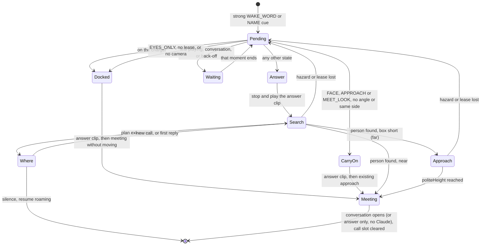
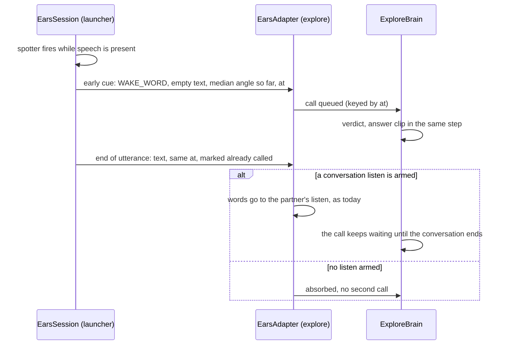
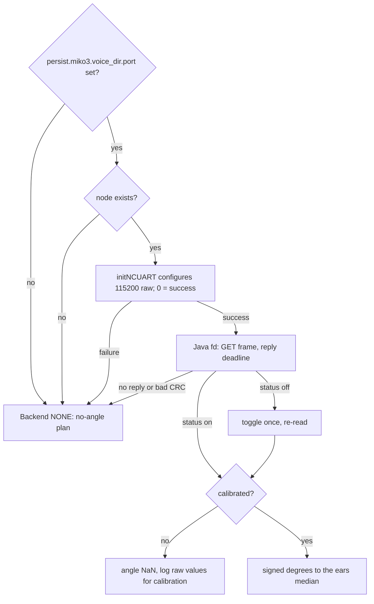

# Explore: Hey Miko Always Answers - Plan

## Goal Capsule

- **Objective:** Anyone in the office who says "Hey Miko" gets his attention every time: he answers out loud at once, turns to face them, comes over if they are far away, and starts a conversation.
- **Means:** The wake word becomes a call that every Explore state honours (KTD1, KTD2), and the NC direction chip becomes the way he finds the speaker once its port is confirmed (KTD10, KTD13), with a camera turn-and-look as the fallback (KTD6).
- **Product authority:** The owner, in the robot session of 2026-09-28. The Product Contract wins on behaviour; the KTDs win on mechanism.
- **Open blockers:** None for implementation. Whether the direction chip can be confirmed on this robot is settled on the robot by U1's script. Until it is, the code ships with the chip off, and the robot uses the fallback.
- **Stop conditions:**
  1. If the read-only identification (KTD13) cannot confirm the chip, nothing writes to `/dev/ttyS1`. The run records the evidence and asks the owner. It never probes by writing.
  2. If research or tests show that a settled Key Decision cannot work, stop and report it; don't work around it.
- **Execution profile:** Host-testable work first (U2 to U6), all proven on the JVM harnesses. On-robot identification, calibration and QA (U1, U7) need the robot. The robot is not attached now, so those runs are recorded as pending in `docs/robot-return.md`.
- **Who finishes:** `ce-work` implements and verifies U1 to U7 on the host. The owner runs the on-robot steps and judges the Success Criteria.

---

## Product Contract

### Summary

Whatever he is doing, "Hey Miko" makes him stop and say something short within a second, turn toward the voice, and drive over if the speaker is far away. The direction chip tells him where to turn. When it cannot, he turns in steps and checks the camera for a face. If he finds nobody, he asks "Where'd you go?".

### Problem Frame

On 2026-09-28 the owner could not get his attention. He heard the wake word, but most of his states ignore or park it. Meeting-plan KTD3 and KTD8 hold a cue during escapes, name questions and speech, drop it during a cue search, and expire a held one after 10 s. The leave-alone rules then kept him away from someone he had just met. On this robot the voice direction is always unknown, because the Conexant chip is absent and the NC chip was only tried on `/dev/ttyMT2`, which does not exist. With no direction his search looks straight ahead, then behind, then a quarter turn, so to the speaker he seemed to spin and drive away. The owner's words: "No matter what he's doing, if he hears 'Hey Miko,' he needs to turn and face that person."

### Key Decisions

- **The direction chip is the primary way to find the speaker; spin-and-look is only the fallback.** The plan is expected to spend real effort making the chip work, not settle for the fallback early. Governs R7, R8. (session-settled: user-directed — chosen over building spin-and-look first and adding the chip later: facing the speaker directly is the behaviour the owner wants.)
- **Four moments finish first; everything else yields at once.** Governs R2. (session-settled: user-directed — chosen over a literal "no matter what": each exception is a safety move, a few seconds long, or another person's conversation.)
- **The wake word overrides every leave-alone rule.** Calling him is the one time being left alone does not apply. Governs R3.
- **The first answer is an on-robot clip, not Claude.** A Claude round trip takes seconds, and the answer has to come within a second. Claude takes over once he is facing the speaker. Governs R4.
- **With no direction, he turns in steps and looks, rather than asking "where are you?" first or refusing to ship without direction.** Governs R9. (session-settled: user-directed — chosen over ask-then-look and direction-only: it is the fastest path that works without the chip.)
- **False wake words are accepted for now.** The owner will deal with them if they become a problem. (session-settled: user-directed — chosen over rate-limiting or going quiet after false alarms: not a problem yet.)
- **On the charger he talks but does not move.** Governs R11. (session-settled: user-directed — chosen over staying silent on the dock: a docked robot should still hold a conversation.)

### Requirements

**Always heard**

- R1. A wake word ("Hey Miko", or the robot's name as a strong cue) is acted on in every Explore state. It is never dropped, and never expires while it waits.
- R2. Only four moments delay it, and each ends in the answer (R4) as soon as it finishes: a hazard back-off in progress (from a drop, a bump or a startle), a line he is already speaking, a conversation with someone else, and being on the charger (R11 applies there).
- R3. A wake word overrides the recently-met and unnamed-side leave-alone rules. Those rules keep applying to everything else, such as weak cues and people he merely sees.

**Answering**

- R4. Within about a second of the wake word he stops moving and speaks a short answer from a small set of on-robot lines, such as "Oh hi?", "What?" or "Yes?".
- R5. He turns to face the speaker while or just after answering, finding them per R7 or R9.
- R6. If the speaker is far away (roughly more than 1.5 m), he drives toward them and stops about a metre away, facing them. Then the conversation starts the way a meeting does today (greeting, name, small talk).

**Finding the speaker**

- R7. When the direction chip gives an angle, he turns to that angle, and the camera confirms a face.
- R8. The NC direction chip on `/dev/ttyS1` is identified and opened safely on this robot, and its direction of arrival reaches Explore as an angle. It is never opened by writing to a port that has not been confirmed as the chip.
- R9. With no angle, he turns in steps of about 45°, checking the camera for a face at each stop, for at most one full circle.
- R10. If he finds nobody, he says "Where'd you go?" and listens briefly. A new wake word or a reply starts the search again from R5. Silence sends him back to roaming.

**On the charger**

- R11. On the charger the wake word opens a conversation where he sits, with no turning or driving. He may turn his eyes toward the voice.

### Key Flows

- F1. Called from across the room while roaming
  - **Trigger:** The wake word lands while he is roaming, searching, leaning in or escaping (after any back-off per R2).
  - **Steps:** He stops and answers (R4); turns to the chip's angle (R7) or turns and looks (R9); a face is found; he drives to about a metre if far (R6); the conversation opens.
  - **Covered by:** R1, R2, R4, R5, R6, R7, R9
- F2. Nobody there
  - **Trigger:** A turn (R7) or a full spin (R9) finds no face.
  - **Steps:** "Where'd you go?"; a short listen; a new wake word or reply restarts at R5; silence resumes roaming.
  - **Covered by:** R10

### Acceptance Examples

- AE1. **Covers R1, R3.** Given he met Ben two minutes ago and would normally leave Ben alone, when Ben says "Hey Miko", he answers and turns to Ben.
- AE2. **Covers R2.** Given he is backing away from a table edge, when someone says "Hey Miko", he finishes the back-off, then answers and turns. He does not turn during the back-off.
- AE3. **Covers R2.** Given he is talking with Priya, when Sam says "Hey Miko", he stays with Priya. When that conversation ends, he answers Sam and turns toward Sam.
- AE4. **Covers R7, R9.** Given the chip gives no angle, when Ben says "Hey Miko" from behind him, he answers, turns in steps, finds Ben's face within one circle and stops facing Ben.
- AE5. **Covers R10.** Given he spins a full circle and finds no face, he says "Where'd you go?". If Ben says "Hey Miko" again, he searches again.
- AE6. **Covers R11.** Given he is docked on the charger, when Ben says "Hey Miko", he answers and holds the conversation without leaving the dock.

### Success Criteria

Owner-judged on the robot:

- **Never ignored:** 10 wake words said while he is roaming, escaping, searching, or just after meeting the speaker each get an answer. The four R2 moments only delay it.
- **Answers within a second:** the stop and the short answer come within about 1 s of the wake word.
- **Facing you quickly:** facing the speaker within about 3 s when the chip gives an angle, and within about 12 s when he has to turn and look.
- **Comes to you:** from 3 m or more away, he ends up about a metre from the speaker, facing them, and starts the conversation.

### Scope Boundaries

- The conversation listening bug is out of scope. There, the 4 s conversation listens drop longer answers and the words after "Hey Miko" are lost. It will show up in testing, but it is a separate fix.
- False wake-word handling is deferred (see Key Decisions).
- A warmed-up Claude session for faster replies is out of scope.
- A newcomer taking over an ongoing conversation is out of scope; AE3's wait is the behaviour.

### Dependencies / Assumptions

- **Speech during his own line may not be heard at all.** Echo cancellation turns the microphone down while he speaks (a verified voice-mode finding), so a wake word said mid-sentence may never reach him. R2's mid-sentence case only covers a wake word the ears did catch.
- **The robot is a JoyAR unit.** Its motor board is on `/dev/ttyS2`, the vendor's JoyAR port, and `/dev/ttyMT1` and `/dev/ttyMT2` are absent. On JoyAR units the vendor opens the NC chip on `/dev/ttyS1` (`tools/serviceexam_jadx/sources/com/example/conexantapi/DSPSettings.java:177`). This makes `/dev/ttyS1` the likely chip port, but it is not confirmed.
- **The chip's type is decided at connect time.** The vendor picks NC or Conexant from the motor board's reply to a loopback message sent when the robot connects: `<LOOPBACK_TEST_BYTE_GD>` means NC (`tools/serviceexam_jadx/sources/com/common_source/emotix/interaction/interaction/SocialInteraction_SpeechChat.java:4328-4349`). That exchange sits in the vendor's bootloader thread, so whether sending it is harmless has to be established before relying on it.
- **The vendor used the chip to turn toward voices.** Its DOA thread turned the robot toward the angle in small steps (`SocialInteraction_SpeechChat.java:390-437`). NC's `getCurrentDOAStatus` returns an int angle, or -1.

### Outstanding Questions

**Resolved in planning**

- Confirming that `/dev/ttyS1` is the NC chip: a read-only evidence ladder with an explicit confirmation rule (KTD13). The loopback exchange is ruled out: it talks to the motor board on `/dev/ttyS2` and leads into its bootloader path, and it reports the board generation, not the chip's port.
- The angle: every reading is a request and reply (KTD11). The ears keep sampling it at 10 Hz during speech and latching the median. Zero, sign and scale come from calibration (KTD12), and the brain corrects for its own turning since the sample (KTD7).
- Wake words in a conversation: today a wake word there becomes the partner's reply or is dropped. Under KTD4 it waits for the conversation to end unless it was the partner's own reply.
- "Far" and the approach: a person box shorter than `callNearHeight` triggers an approach through the existing FACE and APPROACH states (KTD8).

### Sources / Research

- `docs/plans/2026-09-25-1611-feat-explore-meeting-small-talk-plan.md`: R7, R9, AE10, KTD3, KTD5, KTD8 and stop condition 1 are the cue rules this plan replaces for the wake word.
- `mode-explore/src/com/miko3/mode/explore/ExploreBrain.java`: `cueVerdict` (the per-state take, hold and drop table), the search's "ignored" branch, `holdCue` expiry, and the look plan with no side (ahead, behind, a quarter turn).
- `mode-explore/src/com/miko3/mode/explore/ExploreTuning.java`: `cueHoldMs` 10 s, `metLeaveAloneMs` 600 s, `unnamedLeaveAloneMs` 120 s, `cueTurnStepDeg` 45.
- `shared/src/com/miko3/shared/VoiceDirection.java`: the Conexant/NC/NONE backends, the NC path fixed to `/dev/ttyMT2`, and the missing-node guard.
- `docs/solutions/runtime-errors/vendor-dsp-direction-open-segfaults-launcher-miko3.md`: vendor "success" codes cannot be trusted on a probe path, and `/dev/ttyS1` was deliberately not probed.
- `CONCEPTS.md`: Cue, Lean-in and Conversation.
- `docs/solutions/integration-issues/soundpool-plays-silently-on-miko3-use-mediaplayer.md`: clips must use MediaPlayer.
- `docs/hardware/boot-hal-reference.md` (the OEM `init.mt8168.rc` block): `ttyS1` and `ttyS2` are opened to 0666 next to a `gpio_dsp/mid_dsp` node. This is circumstantial evidence that `ttyS1` is the chip.

**Product Contract preservation:** Product Contract unchanged, except that the Outstanding Questions deferred to planning are now answered in place and cite the KTDs that settle them.

---

## Planning Contract

### Key Technical Decisions

- KTD1. **A call gets its own pending slot, separate from the held-cue slot, and keeps it until the conversation opens.** A call is a strong `WAKE_WORD` or `NAME` cue. It never expires or degrades (R1), so `cueHoldMs` and the lean-in downgrade no longer apply to it; weak cues keep today's rules. Repeated calls merge into one, and the newest angle wins. A hazard, a lost drive lease or EYES_ONLY during the call's search or approach hands the call back to the slot instead of clearing it. Today, `foundFace` and `leaveStopForHazard` clear `searchCue` once a person is found. The slot also clears in two cases:
  - When no conversation can open (no Claude), the answer clip is the whole response, and the slot clears after it.
  - A call handed back by a lease loss is retaken in EYES_ONLY through the `meetWithoutLooking` shape, without a second answer clip.
- KTD2. **The call verdict is an ordered check, and on the charger the back-off wait is skipped.** Cites R2, R11. On the charger the latch also reads as motion refused, so a docked robot keeps cycling through STARTLE and BACK_OFF. A back-off wait there would starve the call. The order:
  1. A line playing: wait for `sayFinished`. A queued line that has not started is dropped for the call.
  2. A conversation (ASK_NAME, LISTEN, NAME, REMEMBER, NAME_CLIP, CONFIRM, LAST_NAME, MEET and the CHAT states): wait until it ends (KTD4). This applies on the charger too.
  3. On the charger: answer in place (KTD5).
  4. STARTLE or BACK_OFF: wait for this back-off to end, not for any later one.
  5. EYES_ONLY, no drive lease, or no camera: answer in place, then run the meeting without moving (the `meetWithoutLooking` shape), as today.
  6. FACE, APPROACH or MEET_LOOK, when there is no angle or the angle is on that person's side: answer and carry on with that person, the likeliest caller.
  7. Anything else, escapes included: answer and search now.
- KTD3. **The answer is local and immediate.** Cites R4. On a take, the same brain step stops the motors, opens the clip window (`port.clipWindow`) and plays the new `answer` group ("Oh hi?", "What?", "Yes?") from a MediaPlayer prepared in advance. Reaction clips today are prepared on demand and pay that delay each time. The answer never waits for Claude, and a call is still answered when Claude is unavailable, when the lease is lost and in EYES_ONLY. Only the conversation that follows may be reduced.
- KTD4. **The launcher delivers a wake word as soon as the spotter fires, and each call is keyed by its utterance.** Cites R4, R2.
  - Today, a wake word spoken over the voice gate is delivered only when the utterance ends, 0.8 to 1 s after the speaker stops talking (`EarsSession`). The early cue carries empty text, the median angle so far and `at = speechStartMs`.
  - The end-of-utterance delivery for the same `at` is marked as already called, so the brain does not make a second call from it.
  - In a conversation, a call is never dropped, whether or not its words went to the partner's armed listen as they do today. It waits and is answered when the conversation ends (AE3). With no angle, which is the normal case while the chip is off, Sam's call and Priya's own "Hey Miko" cannot be told apart. If it was Priya's, the search after the conversation finds her in front of him.
  - The one exception is an angle within `newcomerAngleDeg` of the partner. That wake word is the partner's and makes no call, as today.
  - `EarsAdapter` keeps the already-called mark on a partial delivery and never joins an already-called partial into a later cue. Otherwise the clip window cuts the caller short, and their next words would arrive as a second call with a new `at`.
- KTD5. **The ears stay open on the charger, and a call there runs a meeting that does not move.** Cites R11. This replaces the meeting plan's KTD6 dock rule for the ears: both the launcher's capture rule in `EarsSession` and the brain's `syncEars` change. The shape follows `meetWithoutLooking`. Direction sampling may stay off on the charger, as the vendor's was.
- KTD6. **Search plans.** Cites R5, R7, R9.
  - With an angle: turn to the corrected bearing (KTD7) and look, then look at the two 45° neighbours, and take the person box nearest the bearing.
  - With no angle: eight 45° looks over one circle, starting straight ahead.
  - Each look waits `lookSettleMs`, then gets a short budget (`callLookMs`, placeholder 700 ms) instead of `leanInMs`.
  - The camera stays open for the whole search. When a call arrives with the camera in its reopen gap, he starts turning at once and looks when the camera is ready.
  - "Found" means a YOLOE person box at least `callPersonMinHeight` tall (placeholder), with no aspect-ratio gate. Today's `facingFace` gate rejects standing and distant people.
  - A new call during the search retargets when it has an angle, and is merged into the running search otherwise.
- KTD7. **The brain corrects the angle for its own turning since the sample.** Cites R7. It keeps a short heading history (the gyro when usable, otherwise the commanded turn) and subtracts the heading change since the cue's `at`. Otherwise a turn in progress while someone speaks puts the bearing 30 to 60° off.
- KTD8. **A far speaker is approached through the existing FACE and APPROACH states, and every leave-alone rule is bypassed.** Cites R3, R6.
  - A person box shorter than `callNearHeight` (placeholder standing in for about 1.5 m) starts `beginPersonStop` with that box as the target, and FACE and APPROACH run until `politeHeight`.
  - Arrival goes to `enterMeet`, not to the curiosity line (`speakPick`).
  - The call path never passes through `seePerson`, `onLook`'s `ignorePeople`, the recently-met check or `leftAlone`.
  - A near box goes straight to `enterMeet`.
  - A second call during the call's own approach is merged into it when it has no angle or its angle is on the target's side. Otherwise it retargets, as in the search (KTD6). During the call's own conversation, a second call is handled by KTD4, as in any conversation.
- KTD9. **Nobody found.** Cites R10.
  - He plays the `where` clip ("Where'd you go?") and listens for `callListenMs` (placeholder 4 s).
  - A new call restarts the search at R5 every time.
  - A weak voice reply restarts it once per call, so noise cannot loop him.
  - Silence resumes roaming.
- KTD10. **The chip is used only on a port the owner has confirmed.** Cites R8. The port comes from the property `persist.miko3.voice_dir.port`, which U1's script writes only after confirmation. If the property is unset or its node is missing, the backend is NONE. The hard-coded `/dev/ttyMT2` NC path goes. The Conexant attempt stays as it is.
- KTD11. **The protocol runs in Java with deadlines; the vendor library only configures the port.** Cites R8.
  - Request frames are 14 bytes: `XXUB`, then module, op and param bytes, then three zeros and a CRC32, little-endian, over the first 10 bytes (`java.util.zip.CRC32`).
  - Replies are validated as the vendor library does it: an `XXUB` prefix and at least 15 bytes. Byte 14 is the status, and 0 means reporting is off. When the status is non-zero, the reply runs to 38 bytes and the raw value is byte 0x21 (0 to 255). Where a reply's CRC sits is unverified. The first raw replies are logged in full so U1 can establish it, and until then a reply CRC is neither checked nor counted as a miss.
  - Reads never block. Before each GET, any bytes already buffered are discarded. After the write, the sampler polls `available()` in short sleeps until the reply length is buffered or the deadline passes. `initNCUART` leaves the port blocking (VMIN=1, VTIME=0), and a blocking Java read cannot be timed out or woken.
  - Plain Java cannot set the port speed, and `SensorModule` is fixed at 460800 for the motor board. So the vendor's `initNCUART` configures the confirmed node once, at 115200 raw. It returns 0 on success; 1 means failure, which our old `>= 0` check read as success.
  - All reads and writes then go through our own file descriptor, on a dedicated thread, with a deadline on every reply. The vendor's native read calls are never made: their reads block forever, and a failed open corrupts the heap.
  - DOA reporting is toggled on only when a reply's status byte says it is off, and at most once per open, because each toggle flips it.
  - If the robot shows that the second open or the vendor configure does not work, `ce-work` falls back to toybox `stty` on the node and records which one worked.
- KTD12. **Calibration comes from properties, and there is no angle until it is set.** Cites R7, R8. The zero, sign and degrees per step of the raw 0 to 255 value come from `persist.miko3.voice_dir.zero`, `.sign` and `.scale`, measured with the `qa-ears-probe.py` session (front, left, right, behind). While uncalibrated, the angle is NaN and the brain uses the no-angle plan.
- KTD13. **Identification is read-only, and a fixed rule decides confirmation.** Cites R8.
  - U1's script gathers the evidence: which process holds `ttyS1`, the `/proc/tty/driver` counters, `dmesg`, the device-tree alias and `gpio_dsp` nodes, the port settings, any vendor `nc_dsp` log, and a passive five-second read looking for frames.
  - The port counts as confirmed only if one of these holds: a passive read shows an `XXUB` frame with a valid CRC, a vendor log shows NC traffic on `ttyS1`, or the owner confirms from the evidence shown.
  - Nothing is written before confirmation, and op 03 (set or toggle) is never sent until then.
  - The first two rules are expected to find nothing on this robot. The protocol is request and reply only, and the vendor app that talks to the chip has been disabled here all along. So the owner's confirmation is the expected route.
  - After the owner confirms and the property is set, the launcher's probe runs once. The script unsets the property unless the probe shows the backend is NC with an `XXUB` reply. This also shows whether the launcher can read `persist.miko3.*` properties at all.

### High-Level Technical Design

**The call's life in the brain (KTD1, KTD2, KTD6, KTD8, KTD9):**

**Delivering the wake word (KTD4):**

**Bringing up the chip (KTD10 to KTD13):**

### Assumptions

These are bets made without the scoping confirmation, since the run was hands-off.

- A call during FACE, APPROACH or MEET_LOOK with no angle, or with an angle on that person's side, belongs to that person: he answers and carries on (KTD2 step 6).
- In a conversation with no angle, the partner's own "Hey Miko" also waits as a call. After the conversation he answers and searches, and finds the partner in front of him (KTD4).
- A reply after "Where'd you go?" restarts the search only once per call (KTD9). A new wake word always restarts it.
- With an angle, he looks at the two 45° neighbours before giving up (KTD6). R7 only says the camera confirms.
- Turning his eyes toward the voice on the charger is left out; R11 says "may".
- These thresholds are placeholders until the owner's QA: `callLookMs`, `callPersonMinHeight`, `callNearHeight` and `callListenMs`.
- After a call interrupts an escape, the escape planner's memory is not restored. Afterwards he roams, and the hazard classifier still guards every move.

### Risks

| Risk | Mitigation |
|---|---|
| The chip cannot be confirmed read-only | Stop condition 1. The fallback plan works without it, and the owner decides the next step. |
| The eight-look search takes more than about 12 s (estimated 10 to 17 s) | `callLookMs` and the settle time are tunable. U7 measures the real times. Changing the step size is a product question for the owner. |
| The person-box thresholds miss seated or distant people, or catch posters | Placeholders are measured in U7. With an angle, the box nearest the bearing wins. |
| Ears open on the charger pick up charger hum as speech | False wake words are accepted for now (Key Decision). U7 notes any seen on the dock. |
| The vendor configure call misbehaves on `ttyS1` | It runs only on a confirmed, existing node, and only its return value 0 counts as success. The fallback is `stty` (KTD11). |
| Escapes interrupted by a call leave him near a hazard | The call search turns in place. The approach uses the existing hazard-checked APPROACH legs. |

### Sequencing

U1 and U2 (the chip) run independently of U3 to U6 (the call). The brain work runs in the order U4, U3, U5, U6: clips first, then the launcher's early delivery, then the call slot, then the search and approach. U7 comes last and needs the robot.

---

## Implementation Units

### U1. Identify and calibrate the direction chip on the robot

**Goal:** A script that gathers the read-only evidence about `/dev/ttyS1`, applies the confirmation rule, and, once the port is confirmed, writes the port and calibration properties.

**Requirements:** R8; KTD10, KTD12, KTD13.

**Dependencies:** None. The calibration step needs U2 on the robot.

**Files:**
- Create: `scripts/qa-direction-chip.py`
- Create: `scripts/tests/test_qa_direction_chip.py`
- Modify: `scripts/qa-ears-probe.py`, to print the raw chip value next to the angle for calibration
- Modify: `scripts/tests/test_qa_ears_probe.py`

**Approach:**
1. The evidence steps run through `adb shell` and are read-only. They follow KTD13's list. The passive read opens the node read-only and non-blocking, and parses any `XXUB` frames against their CRC.
2. It prints a verdict (`CONFIRMED` with the reason, or `UNCONFIRMED`) and the evidence it rests on. `--owner-confirms` records the owner's confirmation explicitly.
3. On `CONFIRMED` it sets `persist.miko3.voice_dir.port`, then triggers the launcher's probe once. It unsets the property unless the probe reports the NC backend with an `XXUB` reply (KTD13). With `--calibrate` it walks the owner through front, left, right and behind with the launcher's probe route, fits zero, sign and scale, and sets the three calibration properties.
4. It never writes to the node itself.

**Patterns to follow:** `scripts/qa-ears-probe.py` (adb helpers, per-step prompts, offline parsing split from device I/O) and its test.

**Test scenarios:**
- A captured passive read holding one frame with a valid CRC gives `CONFIRMED (frame)`.
- A frame whose CRC is wrong is ignored, and the verdict stays `UNCONFIRMED`.
- An `nc_dsp` log line naming `ttyS1` gives `CONFIRMED (vendor log)`.
- Device-tree and driver evidence alone gives `UNCONFIRMED` unless `--owner-confirms` is passed.
- `UNCONFIRMED` never issues a `setprop`, which the test checks through its recorded adb calls.
- No command in any run writes to `/dev/ttyS1`: the test rejects `echo >`, `dd of=` and `cat >` aimed at the node.
- After confirmation, a probe that reports backend NONE or no `XXUB` reply leads the script to unset the property.
- Calibration: readings of 10 (front), 74 (right), 138 (behind) and 202 (left) fit zero 10, sign +1 and scale 360/256. Swapped sides give sign −1.
- A calibration with fewer than three distinct readings refuses to write the properties.

**Verification:** The script's offline tests pass. On the robot, the owner's run is recorded in `docs/robot-return.md`.

### U2. The NC chip in Java behind the confirmed-port property

**Goal:** `VoiceDirection` reads the chip on the confirmed port through a Java protocol with deadlines and returns signed, calibrated degrees or NaN.

**Requirements:** R7, R8; KTD10, KTD11, KTD12.

**Dependencies:** None.

**Files:**
- Create: `shared/src/com/miko3/shared/NcFrames.java` (plain Java: frame building, CRC, reply parsing, calibration mapping)
- Modify: `shared/src/com/miko3/shared/VoiceDirection.java`
- Modify: `launcher/src/com/miko3/launcher/ListenEngine.java` (reads the properties and passes them to `VoiceDirection`)
- Create: `scripts/tests/test_nc_frames.py`, a JVM harness in the style of `scripts/tests/jvm_harness.py`
- Modify: `scripts/tests/test_listen_service.py`: replace `test_voice_direction_tries_nc_only_when_its_uart_exists` with property-and-node gating

**Approach:**
1. `NcFrames` owns the byte format and the mapping from raw value to degrees. It uses no Android or file I/O, so the host tests run it directly.
2. `VoiceDirection.tryOpen` keeps the Conexant attempt. The NC path runs only when the port property names an existing node. It calls `initNCUART` once and treats only 0 as success, then opens its own streams on the node.
3. `angle()` discards any buffered bytes, writes the GET frame, and polls for the reply without blocking until the deadline (KTD11). A missed deadline or a malformed reply gives NaN. Three misses in a row close the backend for the life of the process and log it once. The first raw replies are logged in full.
4. Logs carry only counts, raw values and status codes, never audio or text.

**Execution note:** Implement `NcFrames` test-first against the frames the research decoded: DOA query `58585542 03 01 03 000000 a620d0e7`.

**Patterns to follow:** `VoiceDirection`'s existing guard and single-open shape, and the PR #28 learning in `docs/solutions/runtime-errors/`.

**Test scenarios:**
- The built DOA query equals the decoded reference bytes, CRC included.
- A reply with status byte 14 non-zero and byte 0x21 = 138 parses to raw 138.
- A reply with status byte 14 = 0 reports "off", and the toggle frame is produced only once per open.
- A truncated reply, or one without the `XXUB` prefix, parses to NaN without an exception.
- A fake node that never answers returns NaN within the deadline, and the sampler thread is free for the next call.
- Stale bytes from a late reply are discarded before the next GET and never parsed as its reply.
- Calibration: raw 10 with zero 10 gives 0°. Raw 74 with scale 360/256 and sign −1 gives −90°. Values wrap to ±180°.
- Uncalibrated gives NaN.
- The property is unset, or names a missing node: the backend is NONE and no native NC call is reached. This is a harness assertion on a fake native layer.
- `initNCUART` returning 1 gives NONE, where the old code accepted it.
- Three deadline misses close the backend, and later `angle()` calls return NaN at once.

**Verification:** The harness tests pass. The launcher builds with the unchanged vendor library.

### U3. The launcher delivers the wake word early and listens on the charger

**Goal:** A wake word reaches Explore as soon as it is spotted, the end-of-utterance delivery is marked as already called, and the ears keep capturing on the charger.

**Requirements:** R1, R4, R11; KTD4, KTD5.

**Dependencies:** None.

**Files:**
- Modify: `launcher/src/com/miko3/launcher/EarsSession.java`
- Modify: `launcher/src/com/miko3/launcher/CueClassifier.java` (the kind for the marked final delivery)
- Modify: `mode-explore/src/com/miko3/mode/explore/EarsAdapter.java`: pass the already-called flag through, keep it on partials, and keep empty-text wake cues out of the reply path
- Modify: `mode-explore/src/com/miko3/mode/explore/Ears.java` (a flag for a cue already called)
- Test: `scripts/tests/test_listen_service.py`, `scripts/tests/test_cue_classifier.py`

**Approach:**
1. In `EarsSession`, a spotter hit with the gate open sends the early cue at once and sets a flag on the utterance. `endUtterance` sends its usual delivery with the flag set. The existing bare wake cue with the gate closed stays as it is.
2. The capture rule no longer closes on the charger latch. Direction sampling may still skip while docked.
3. `EarsAdapter` passes the flag through and keeps it on a partial. It never joins an already-called partial into a later cue (KTD4).
4. The Binder shape is extended by appending a field, never by reordering. Both APKs are built from one tree, following the meeting plan's rule.

**Patterns to follow:** The bare wake cue path and the deaf window in `EarsSession`. The appended-transaction rule from the meeting plan's U4.

**Test scenarios:**
- A spotter hit mid-speech produces one early cue within the same chunk, with empty text, the median so far and `at = speechStartMs`.
- The end of that utterance produces a delivery with the same `at`, marked as already called.
- A spotter hit during the deaf window produces nothing.
- With the charger latch set, the ears keep capturing and a wake word is delivered. Before this change it was not.
- A conversation listen already armed still receives the utterance's words, and the early cue still reaches the queue.
- An early cue, then a clip-window cut that makes the final delivery partial, then a weak utterance produce no second wake-word cue.
- An early cue with empty text never goes to an armed reply.
- Two spotter hits in one utterance produce one early cue.

**Verification:** Both test files pass, including the existing ears scenarios, updated only where the charger rule changed.

### U4. The answer and "Where'd you go?" clips, prepared in advance

**Goal:** New `answer` and `where` clip groups in the robot's voice, with the answer clip ready to play without a prepare delay.

**Requirements:** R4, R10; KTD3, KTD9.

**Dependencies:** None.

**Files:**
- Modify: `scripts/gen-explore-voice.py` (new groups `answer`: "Oh hi?", "What?", "Yes?"; `where`: "Where'd you go?")
- Create: `mode-explore/assets/react-answer-1.webm` to `react-answer-3.webm` and `mode-explore/assets/react-where-1.webm`, generated
- Modify: `mode-explore/src/com/miko3/mode/explore/ClipPlayer.java` (keep one `answer` player prepared, and prepare the next one after it plays)
- Test: `scripts/tests/test_gen_explore_voice.py`

**Approach:** Add the groups to the phrase table and regenerate with the existing Piper and ffmpeg pipeline. `ClipPlayer` keeps a prepared player for the `answer` group, the way it already keeps startles and songs, and prepares the next one on the clip thread after each play. Other groups stay prepared on demand.

**Execution note:** This is mostly assets and packaging. Check that the files exist and are under the length cap, then check on the robot that the clip plays.

**Patterns to follow:** The `acknowledge` group, and the prepared startle players in `ClipPlayer`.

**Test scenarios:**
- The phrase table has `answer` with three lines and `where` with one.
- Every generated clip exists, is WebM/Opus and is under 2.3 s.
- The asset index finds `react-answer-*` and `react-where-*`.

**Verification:** The generator test passes. The APK build stages the new assets.

### U5. The call in the brain: slot, verdict and answer

**Goal:** Every strong wake word or name cue becomes a call that the brain answers per R2 and never drops, including on the charger and in EYES_ONLY.

**Requirements:** R1, R2, R3, R4, R11; KTD1, KTD2, KTD3, KTD4, KTD5; AE1, AE2, AE3, AE6.

**Dependencies:** U3 (the already-called flag), U4 (the `answer` group).

**Files:**
- Modify: `mode-explore/src/com/miko3/mode/explore/ExploreBrain.java` (the call slot, `callVerdict`, answer, the charger branch in `syncEars`, hand-back on hazard or lease loss)
- Modify: `mode-explore/src/com/miko3/mode/explore/ExploreTuning.java`
- Modify: `scripts/tests/fixtures/explore_brain_harness/src/com/miko3/mode/explore/ExploreBrainHarness.java`
- Modify: `scripts/tests/test_explore_brain.py` (the `SCENARIOS` list)
- Modify: `CONCEPTS.md` (add a "Call" entry)

**Approach:**
1. `offerCue` routes a strong `WAKE_WORD` or `NAME` cue to the call slot before `cueVerdict`. Other cues keep today's path.
2. `callVerdict` implements KTD2's order. A take stops the motors and plays the answer clip in the same step (KTD3), then hands over to U6's search. A charger take runs the `meetWithoutLooking` shape.
3. A cue already called with a known `at` is absorbed. A call in a conversation waits and is never dropped (KTD4).
4. `expireHeldCue` skips the call slot. Existing tests that pinned the old wake-word hold and drop rules are rewritten to the call rules: `cue_held_strong_older_than_10_s_becomes_a_lean_in` for a wake word, `cue_charger_latch_closes_the_ears...`, and `chat_newcomer_wake_word...` with no angle.
5. Logs carry counts and sides only (the meeting plan's R15).

**Execution note:** Write the AE scenarios in the harness first. They are the contract.

**Patterns to follow:** `cueVerdict`, `holdCue`, `takeHeldCue`, `meetWithoutLooking` and the `cue_*` harness scenarios.

**Test scenarios:**
- Covers AE1. Ben was met 2 minutes ago and is inside `metLeaveAloneMs`. A wake word while roaming is answered, and the search starts.
- Covers AE2. A wake word during BACK_OFF waits: no turn and no clip until the back-off ends. Then the answer clip plays and the search starts.
- A docked robot cycling through STARTLE and BACK_OFF still answers a wake word in place, because the charger is checked first.
- Covers AE3. A wake word with no angle in CHAT_LISTEN waits, even though its words went to the partner's listen. When the conversation ends, the answer clip plays and the search starts.
- In a conversation, a wake word whose angle is within `newcomerAngleDeg` of the partner makes no call.
- Docked in a CHAT state, a call waits until the chat ends, then gets the answer clip with zero motor commands.
- In EYES_ONLY, a call plays the answer clip once and opens a meeting with zero motor commands.
- With Claude unavailable, the answer clip plays once and the slot clears, with no repeat on later steps.
- A lease loss during the call's search hands the call back, and it is retaken in EYES_ONLY with no second answer clip.
- Covers AE6. On the charger, a wake word gives the answer clip and a meeting with zero motor commands.
- A wake word during a playing line waits for `sayFinished`. During a queued line that has not started, it drops the line and answers.
- A call held for 60 s behind a long conversation is still answered afterwards, never downgraded to a lean-in.
- A wake word during an escape (RETRACE or WAY_OUT) is answered at once.
- A wake word in APPROACH with no angle plays the answer clip and carries on the same approach.
- An end-of-utterance delivery marked as already called for the same `at` makes no second call.
- Two calls before the answer merge into one, and the newer angle wins.
- A weak voice cue in the same states keeps today's verdicts, so the regression list is unchanged.
- The answer clip starts in the same brain step as the take, measured on the mock clock.

**Verification:** Every new and updated scenario passes, and the harness's expected-scenario count matches.

### U6. Finding and reaching the speaker, and "Where'd you go?"

**Goal:** After the answer he faces the speaker, by angle or by an eight-look circle, approaches if they are far, opens the conversation, and handles nobody found.

**Requirements:** R5, R6, R7, R9, R10; KTD6, KTD7, KTD8, KTD9; AE4, AE5; F1, F2.

**Dependencies:** U5.

**Files:**
- Modify: `mode-explore/src/com/miko3/mode/explore/ExploreBrain.java` (the call's look plans, the person test, heading history, the approach hand-off, the `where` listen)
- Modify: `mode-explore/src/com/miko3/mode/explore/ExploreTuning.java` (`callLookMs`, `callPersonMinHeight`, `callNearHeight`, `callListenMs`)
- Modify: `scripts/tests/fixtures/explore_brain_harness/src/com/miko3/mode/explore/ExploreBrainHarness.java`
- Modify: `scripts/tests/test_explore_brain.py`

**Approach:**
1. The call search reuses the stepped turn machinery (`startCueTurnStep`, `searchRel`) with the new plans from KTD6. The existing no-side `{0, 180, 90}` plan stays for weak cues only.
2. A heading history (KTD7) lives beside `Heading` and is read when the search starts.
3. A found person goes either to `beginPersonStop` plus FACE and APPROACH with the call flag set, which skips the leave-alone checks, or straight to `enterMeet`. Arrival with the call flag goes to `enterMeet`.
4. A hazard or lease loss during the search or approach hands the call back to the slot (KTD1). The PR #26 guard against a late face match reaching the next meeting still applies.
5. The camera stays open through the search. A reopen gap overlaps the first turn.

**Patterns to follow:** `enterCueSearch`, `lookPlan`, `cueLook`, `foundFace`, `approachPerson`, `arrive` and `quietResume`.

**Test scenarios:**
- Covers AE4. With no angle and a person box appearing at the fifth stop (180°), he stops facing it. Fewer than 8 looks are used.
- With no angle and no person anywhere, exactly 8 looks at 45° steps make one full circle, then the `where` clip plays.
- Covers AE5. After the `where` clip, a new wake word restarts the search. A second reply after one restart does not restart it, and silence for `callListenMs` resumes roaming.
- An angle of +90° with no turn since the sample gives a first turn of +90°.
- An angle of +90° after 40° of right turning since `at` gives a first turn of +50°.
- With an angle and no box at the bearing, the two 45° neighbours are looked at, then the `where` clip plays.
- Two person boxes in the look: the one nearest the bearing is chosen.
- A box shorter than `callNearHeight` leads to FACE and APPROACH, then `enterMeet` at `politeHeight`. The leave-alone checks are not consulted, even with the person met 2 minutes ago.
- A near box goes straight to `enterMeet` with no approach legs.
- A tall, narrow standing-person box (ratio 0.3) counts as found. Today's `facingFace` would reject it.
- A hazard during the approach returns the call to the slot, and the call is answered again once the hazard clears.
- A new call with an angle mid-search retargets. One with no angle is merged, with no second answer clip.
- During the call's approach, a second call with an angle on the far side retargets. One with no angle is merged into the approach.
- A call arriving 1 s after a camera close starts turning at once, and the first look waits for `reopenGapMs`.
- The search time for a person directly behind is reported by the harness, which bounds the look plan against the success budget on the mock clock.

**Verification:** Every new scenario passes, and the existing cue and meeting scenarios still pass or are updated only where KTD6 changed the plan.

### U7. On-robot QA and the follow-ups

**Goal:** The owner can run the chip bring-up and the call walkthrough on the robot, timing each Success Criterion. Anything still open is written down.

**Requirements:** Success Criteria; R8; AE1 to AE6.

**Dependencies:** U1 to U6.

**Files:**
- Modify: `scripts/qa-conversation.py` (new `--only` checks for AE1 to AE6 and the ten-call run, and call timings from the /state stamps)
- Modify: `scripts/tests/test_qa_conversation.py`
- Modify: `mode-explore/src/com/miko3/mode/explore/ExploreState.java` (call stamps in `Gauges`: wake word, answer, facing, arrival; U5 and U6 set them)
- Modify: `docs/robot-return.md` (a new section: chip identification, calibration, the call walkthrough)
- Modify: `docs/TODO.md` (eyes toward the voice on the dock, the conversation listening bug, placeholder thresholds to measure)

**Approach:** `qa-conversation.py` already checks the build ids, clears left-over `log.tag.MikoExplore*` hooks and reads stage stamps from /state. The new call checks walk the owner through AE1 to AE6 and the ten-call "never ignored" run. They compute the delays from the new call stamps: wake word to answer, to facing, and to arrival.

**Execution note:** The script's offline test comes first. Its robot run is owner-driven.

**Patterns to follow:** The existing checks, stamp reading and `--latency` in `scripts/qa-conversation.py`.

**Test scenarios:**
- Captured /state stamps with answer 0.6 s, facing 2.4 s and arrival 7 s after the wake word reports all three and passes the 1 s and 3 s budgets.
- An answer 1.4 s after the wake word is reported as a failure of "Answers within a second".
- The new call checks are listed by `--only` and run in AE order.

**Verification:** The offline test passes. `docs/robot-return.md` lists the pending robot runs with their commands.

---

## Verification Contract

Every host test is a standalone Python file under `scripts/tests/`, run with `python3 <file>`. The JVM harnesses need a JDK on the path and skip without one.

| Command | Proves | Units |
|---|---|---|
| `python3 scripts/tests/test_qa_direction_chip.py` and `python3 scripts/tests/test_qa_ears_probe.py` | The confirmation rule, no writes to the node, the calibration fit | U1 |
| `python3 scripts/tests/test_nc_frames.py` | Frames, CRC, reply parsing, calibration, deadlines, property and node gating | U2 |
| `python3 scripts/tests/test_listen_service.py` and `python3 scripts/tests/test_cue_classifier.py` | Early wake delivery, the already-called flag, ears on the charger, and the updated direction guard | U2, U3 |
| `python3 scripts/tests/test_gen_explore_voice.py` | The new clip groups exist and meet the format | U4 |
| `python3 scripts/tests/test_explore_brain.py` | Every call, search, approach and "where" scenario, plus the existing regression list | U5, U6 |
| `python3 scripts/tests/test_qa_conversation.py` | The call checks and the call timing budgets | U7 |
| `python3 scripts/qa-direction-chip.py` then `--calibrate` on the robot (owner) | R8 and KTD12 on real hardware | U1, U2 |
| `python3 scripts/qa-conversation.py --only <call checks>` on the robot (owner) | AE1 to AE6 and the Success Criteria | U7 |

Quality gates:
- The brain stays plain Java.
- `NcFrames` joins the plain-Java checks.
- No transcript, spoken line or audio appears in any log assertion.
- Both APKs build from one tree and report one build id.

---

## Definition of Done

**Global**

- Every host test in the Verification Contract passes, including the existing Explore and ears scenarios.
- Nothing in the diff writes to `/dev/ttyS1` before confirmation, and the vendor's native NC read calls are gone from the code path.
- The robot runs (U1 identification and calibration, U7 walkthrough) are either recorded with results or listed as pending in `docs/robot-return.md`, with the pull request saying so.
- Abandoned attempts are removed from the diff: unused wake-word hold code, a dropped configure fallback, dead tuning fields.
- `docs/TODO.md` carries the deferred items: eyes toward the voice on the dock, the conversation listening bug, and the placeholder thresholds.

**Per unit**

- U1: The offline tests pass, and the script refuses to write properties while unconfirmed.
- U2: The frame and gating tests pass, and the launcher builds.
- U3: The ears tests pass with early delivery and charger capture.
- U4: The clips are generated and staged.
- U5: The AE1, AE2, AE3 and AE6 scenarios and the call rules pass.
- U6: The AE4 and AE5 scenarios and the search, approach and hand-back scenarios pass.
- U7: The call checks' offline tests pass, and the robot-return section is written.
